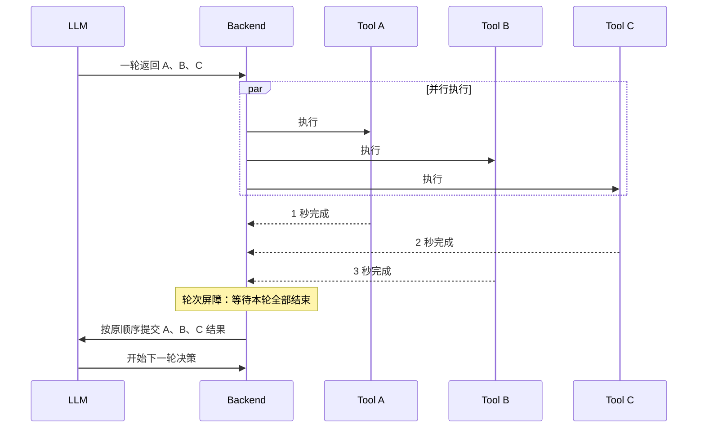
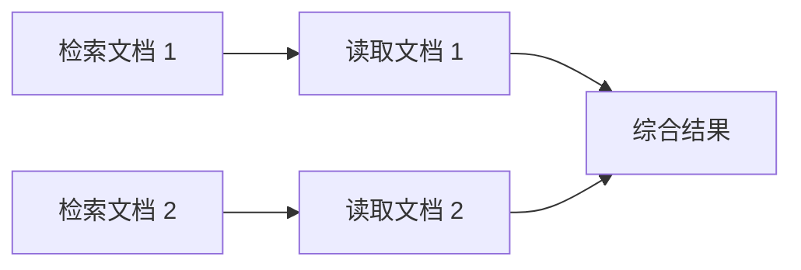
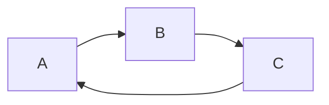
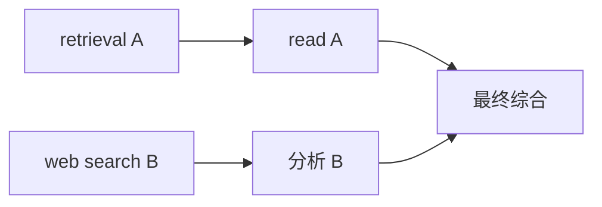
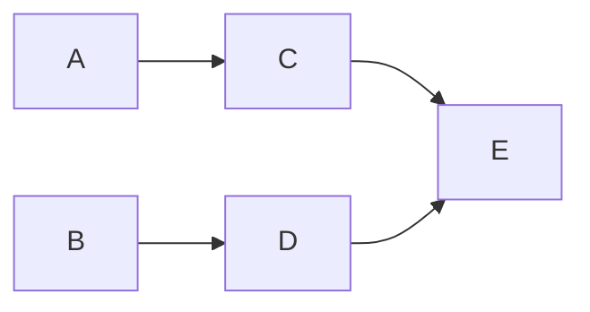
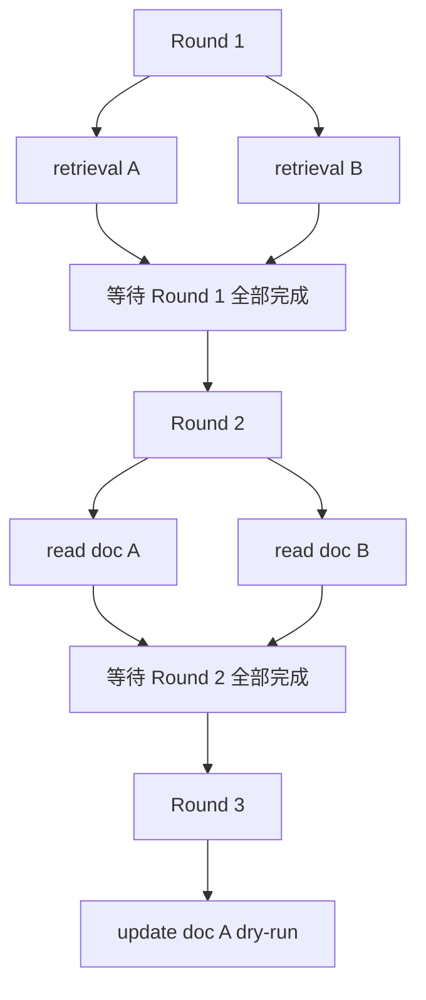
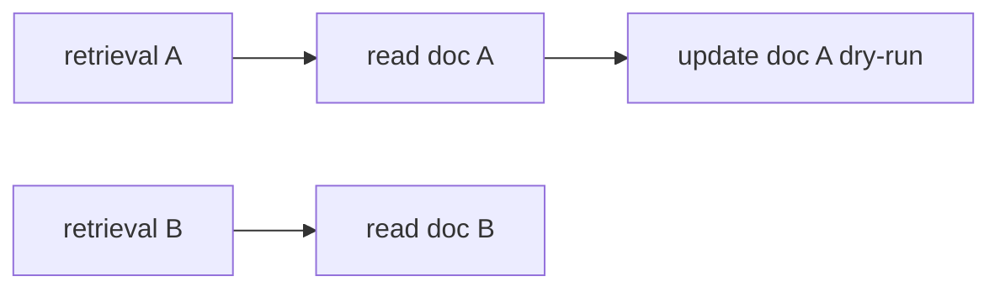
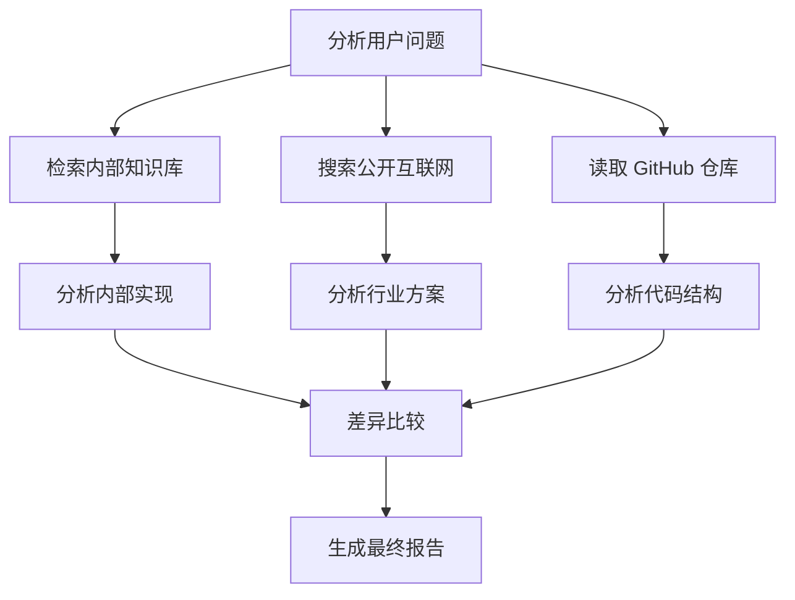
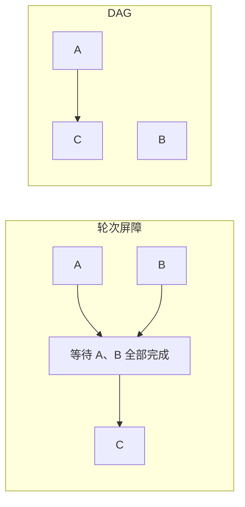

# 1、codex实现方案：plan

## Agent Tool Calling 轮次屏障并行执行

## Summary

为 `question_decomposition` 和 `knowledge_document_management` 两条链路增加同轮并行 ToolCall。

采用“轮次屏障”，不实现 DAG：

```text
LLM 一轮返回多个独立 ToolCall
→ 后端并行执行本轮安全工具
→ 等待本轮全部完成
→ 按原 ToolCall 顺序追加结果
→ 下一轮 LLM 基于全部结果继续决策
```

存在依赖的工具必须跨轮调用。真实文档写入仍由 confirm API 顺序执行。

## Implementation Changes

### 并行调度规则

- 模型改为允许 `parallel_tool_calls=True`。
- `_select_tool_with_bound_tools()` 返回全部原生 ToolCall，不再只取 `tool_calls[0]`；保留原生 `call_id`。
- 每轮开始时冻结可用状态，只有前置条件在本轮开始前已经满足的调用才能执行。
- 使用 `asyncio.gather(..., return_exceptions=True)` 并行执行；结果按模型原始 ToolCall 顺序写入 trace/ToolMessage，不按实际完成顺序重排。
- 同轮一个工具失败不取消其他独立工具；每个调用分别产生 completed/failed 结果，下一轮 LLM 可以重试失败项。
- 参数非法、调用数超限或批次混合了串行工具时，本轮全部不执行并返回对应错误结果，不执行部分前缀。

### 工具安全分类

允许同轮并行：

- `knowledge_retrieval`
- `web_search`
- `knowledge_document_read`，但 `doc_id` 必须在前一轮候选中

保持串行：

- 所有 MCP 工具，默认视为副作用未知
- `knowledge_document_create`
- `knowledge_document_update`
- `knowledge_document_delete`
- confirm 中的真实文件、sidecar、ES、Milvus 写入

当一轮包含多个调用且其中存在串行工具时，整轮拒绝并要求模型按依赖关系分轮重试。单个串行 ToolCall 继续正常执行。

文档依赖保持：

```text
retrieval
→ 下一轮 read
→ 下一轮 update/delete dry-run
→ 人工确认
→ 顺序真实写入
```

多个已知候选的 read 可以并行；多个文档写动作仍按成功 ToolCall 顺序生成 steps。

### 两条执行链路

- `question_decomposition`
  - 工具选择结果改为批次。
  - JSON fallback 继续只返回一个工具，作为 provider 不支持原生并行调用时的串行兼容路径。
  - 同轮成功调用全部进入 `tool_calls`，最终子问题答案综合所有成功输出。
  - 现有单值 `selected_tool/tool_input/tool_output` 保留为最后一个成功调用，完整事实以 `tool_calls` 为准。
  - 显式 URL 的 `mcp__fetch` 继续强制单独一轮，避免与并行批次混合。

- `knowledge_document_management`
  - AIMessage 后按原顺序追加本轮全部 ToolMessage，再进入下一轮。
  - `candidates`、`read_doc_ids` 只能由上一轮已完成结果满足依赖。
  - 多个 mutation dry-run 同轮返回时整轮拒绝，不引入并发冲突预占。
  - 同一 doc_id 的重复 update、update+delete、重复 delete 规则保持不变。

### 配置与可观测性

- 新增：

```env
AGENT_MAX_PARALLEL_TOOL_CALLS=4
```

- `AGENT_MAX_TOOL_CALLS` 默认值由 4 提高到 12，继续表示整个任务的总调用预算；失败、非法调用和重试都计入。
- 单轮批次不能超过并行上限，也不能超过剩余总预算。
- 不新增 HTTP endpoint 或 SSE event 名称。
- 继续使用 `round` 表示并行批次：相同 `round` 的多个 trace/SSE tool-call 事件属于同一轮。
- LangSmith 中每个并行 ToolCall 使用独立子 run；同轮 run 时间应重叠。
- 更新 `.env` 示例/验收说明，解释总预算与单轮并发上限的区别。

## Failure and Ordering Rules

- 并行结果按原 ToolCall 顺序持久化，保证 TaskPlan、SSE 和 Markdown 顺序稳定。
- 单个只读调用失败：保留同轮其他成功结果，下一轮由 LLM 决定重试或继续。
- 批次中存在未知工具、非法 ToolCall、串行工具或超限：整轮不执行。
- MCP 不参与并行，避免未知副作用、stdio client 并发安全和外部限流问题。
- TaskPlan 取消、权限拒绝、文档动作冲突及 confirm 回滚语义保持现状。
- 本阶段不实现任务抢占、跨请求共享调度、自动重试退避或 DAG。

## Test Plan

- 用 `asyncio.Event`/活动计数器证明两个只读工具真实并发执行，不依赖脆弱的耗时断言。
- 验证同轮结果按 ToolCall 原顺序写入，即使完成顺序相反。
- 验证一个并行调用失败时，其他调用仍成功，并且全部结果进入下一轮上下文。
- 验证 retrieval 与依赖它的 read 同轮出现时整轮拒绝；read 在下一轮收到候选后成功。
- 验证多个已知候选 read 可以并行，update 必须再等下一轮。
- 验证混合只读工具与 create/update/delete、MCP 时整轮拒绝。
- 验证超过单轮 4 个或总预算 12 个时不执行部分批次。
- 验证 JSON fallback 保持单工具串行。
- 验证文档 steps 顺序、冲突检测、人工确认、ACL、ES/Milvus 同步与逆序回滚不变。
- 验证相同 round 的 SSE/TaskPlan traces 能表示同一并行批次。
- 运行相关 `py_compile`、Tool loop、文档管理、TaskPlan、Prompt Guard 回归和 `git diff --check`。

## Assumptions

- 本阶段采用轮次屏障，DAG 调度器后置。
- 只有明确列入内置只读白名单的工具可以并行；未知工具默认串行。
- 并行只优化资料获取和文档读取，不并行真实写操作。
- `AGENT_MAX_PARALLEL_TOOL_CALLS=4`，`AGENT_MAX_TOOL_CALLS=12` 为默认值。

# 2、新增配置：

`AGENT_MAX_PARALLEL_TOOL_CALLS` 表示：**Agent 在同一轮中最多允许执行多少个并行 ToolCall**。

当前默认配置：

```
AGENT_MAX_PARALLEL_TOOL_CALLS=4
```

具体含义：

- 单轮最多并行执行 4 个明确允许并行的只读工具。
- 当前包括：
  - `knowledge_retrieval`
  - `web_search`
  - `knowledge_document_read`（目标必须是前一轮已确认的候选文档）
- 文档 create/update/delete dry-run、MCP 工具和确认后的真实写入不参与并行。
- 如果模型一轮返回超过 4 个 ToolCall，整轮全部拒绝，不会只执行前 4 个。

它与 `AGENT_MAX_TOOL_CALLS` 的区别：

```
AGENT_MAX_TOOL_CALLS=12
AGENT_MAX_PARALLEL_TOOL_CALLS=4
```

- `AGENT_MAX_TOOL_CALLS=12`：整个任务从开始到结束，最多尝试 12 次工具调用。
- `AGENT_MAX_PARALLEL_TOOL_CALLS=4`：其中任意一轮最多并行 4 次。

例如：

```
第 1 轮：并行调用 3 个检索工具
第 2 轮：并行读取 4 篇候选文档
第 3 轮：串行调用 1 个 update dry-run

总调用量：3 + 4 + 1 = 8，没有超过 12
单轮最大量：4，没有超过 4
```

配置定义在 [config.py](D:/AI_Agent_Project/AI_Python_Project/python-agent-study/src/fast_app/core/config.py)，实际批次校验和并行调度在 [agent_task_executor.py](D:/AI_Agent_Project/AI_Python_Project/python-agent-study/src/fast_app/services/agent_task_executor.py)。

# 3、方案分析：------------------------------------------------

# “轮次屏障” 和 DAG 方案的区别：

## 先说结论

这份 Plan 采用的是一种比较保守、容易控制的并行机制：

> 同一轮中，彼此独立的只读 ToolCall 可以并行；这一轮所有调用结束后，才允许 LLM 进入下一轮决策。

这里的“轮次屏障”是一个**同步边界**。

而 DAG 是一种更通用的任务调度模型：

> 把每个任务表示成节点，把任务之间的依赖表示成有方向的边；某个节点的依赖完成后，它就可以立即执行，不一定要等待同一批次的其他任务。

你的 Plan 明确选择“轮次屏障，不实现 DAG”，主要是在用一部分并行收益，换取更低的实现复杂度和更稳定的状态管理。

------

## 什么是“轮次”

在你当前的 Agent Tool Calling 中，一轮大致表示：

```text
LLM 做一次决策
→ 返回一个或多个 ToolCall
→ 后端执行这些 ToolCall
→ 把 ToolMessage 返回给 LLM
```

例如第一轮 LLM 返回：

```text
ToolCall 1：knowledge_retrieval("项目架构")
ToolCall 2：web_search("最新 Agent 框架")
```

后端并行执行两个工具，完成后把两个结果一起发回 LLM。

然后 LLM 才开始第二轮：

```text
根据第一轮全部工具结果，决定是否继续调用工具
```

因此，这里说的 `round`，是：

> 一次 LLM 决策以及这次决策产生的一批工具调用。

------

## 什么是“屏障”

“屏障”可以理解为：

> 所有参与者必须先到达这个位置，任何一个参与者没有完成，整个流程都不能越过屏障进入下一阶段。

例如有三个并行任务：

```text
工具 A：耗时 1 秒
工具 B：耗时 3 秒
工具 C：耗时 2 秒
```

虽然 A 在第 1 秒已经完成，但 Agent 不能立刻进入下一轮。

它必须等待：

```text
A 完成
B 完成
C 完成
```

到第 3 秒，三个工具都完成后，才能跨过屏障，开始下一轮 LLM 决策。



所以“轮次屏障”完整含义是：

> 同一轮 ToolCall 可以并行执行，但下一轮必须等待当前轮全部调用完成。

------

## 这份 Plan 中轮次屏障的准确执行规则

Plan 中写的是：

```text
LLM 一轮返回多个独立 ToolCall
→ 后端并行执行本轮安全工具
→ 等待本轮全部完成
→ 按原 ToolCall 顺序追加结果
→ 下一轮 LLM 基于全部结果继续决策
```

可以拆成五个步骤。

### 第一步：LLM 返回一个批次

例如：

```python
[
    {
        "id": "call_1",
        "name": "knowledge_retrieval",
        "args": {"query": "权限模块"}
    },
    {
        "id": "call_2",
        "name": "web_search",
        "args": {"query": "Agent 权限最佳实践"}
    }
]
```

这两个 ToolCall 属于同一个 `round`。

------

### 第二步：冻结本轮开始时的状态

Plan 中最重要的一句话是：

> 每轮开始时冻结可用状态，只有前置条件在本轮开始前已经满足的调用才能执行。

假设第 1 轮开始前的状态是：

```python
candidates = {}
read_doc_ids = set()
```

LLM 在同一轮返回：

```text
1. knowledge_retrieval：找到候选文档
2. knowledge_document_read：读取候选文档
```

虽然从人类角度看，可以先检索，再读取，但在“轮次屏障”模型中，这两个调用属于同一批次。

在这一轮开始时：

```python
candidates == {}
```

所以 `knowledge_document_read` 的前置条件尚未满足。

后端不会认为：

```text
先等 retrieval 执行完成，再让 read 使用结果
```

因为这样就已经在同一轮内部引入任务依赖调度了，开始接近 DAG。

所以这一轮会被拒绝。

------

### 第三步：并行执行独立调用

只有在轮次开始前已经满足所有依赖的调用，才可以一起执行。

例如前一轮已经产生两个候选文档：

```python
candidates = {
    "doc_1": {...},
    "doc_2": {...},
}
```

下一轮 LLM 返回：

```text
read(doc_1)
read(doc_2)
```

这两个读取在本轮开始前都已经满足：

```text
doc_1 在 candidates 中
doc_2 在 candidates 中
```

所以可以并行：

```python
await asyncio.gather(
    read_document("doc_1"),
    read_document("doc_2"),
    return_exceptions=True,
)
```

------

### 第四步：等待本轮所有调用完成

即使 `read(doc_1)` 已经完成，也不会立即让 LLM继续决策。

必须等：

```text
read(doc_1) 完成
read(doc_2) 完成
```

本轮才算结束。

这就是屏障。

------

### 第五步：统一进入下一轮

后端把本轮所有结果追加为 `ToolMessage`，然后再次调用模型：

```text
第 1 个 ToolMessage
第 2 个 ToolMessage
……
下一轮 LLM 决策
```

下一轮开始时，上一轮产生的新状态才正式可用。

------

## 为什么结果要按原 ToolCall 顺序写入

并行执行时，实际完成顺序可能是：

```text
call_2
call_3
call_1
```

但模型最初返回的顺序是：

```text
call_1
call_2
call_3
```

Plan 要求持久化时仍然使用：

```text
call_1
call_2
call_3
```

不能按照完成顺序记录。

例如：

```python
results = await asyncio.gather(
    run_tool(call_1),
    run_tool(call_2),
    run_tool(call_3),
    return_exceptions=True,
)
```

`asyncio.gather()` 返回结果时，本身就会保持传入参数的顺序：

```python
[
    call_1_result,
    call_2_result,
    call_3_result,
]
```

即使 `call_3` 最先完成，结果仍然位于第三个位置。

这样可以保证：

- TaskPlan 顺序稳定；
- SSE 顺序稳定；
- 测试结果稳定；
- LangSmith trace 更容易对应；
- 同一次请求不会因为网络快慢而改变最终 JSON 顺序。

------

## 轮次屏障中的“状态冻结”怎么理解

可以把每轮状态表示成：

```text
S0 → Round 1 → S1 → Round 2 → S2
```

其中：

- `S0`：第 1 轮开始前的状态；
- `S1`：第 1 轮全部结束后的状态；
- `S2`：第 2 轮全部结束后的状态。

第 1 轮中的所有调用只能读取 `S0`。

不能出现：

```text
Tool A 修改了状态
Tool B 在同一轮立即读取 Tool A 刚修改的状态
```

也就是说，同轮工具之间不能形成：

```text
A → B
```

只能是：

```text
    ┌→ A ─┐
S0 ┤      ├→ S1
    └→ B ─┘
```

A 和 B 都基于同一个旧状态 `S0` 执行。

------

## 文档管理链路中的实际例子

你的 Plan 定义了：

```text
retrieval
→ 下一轮 read
→ 下一轮 update/delete dry-run
→ 人工确认
→ 顺序真实写入
```

完整过程可能是：

### 第 1 轮：检索候选文档

```text
knowledge_retrieval("权限模块")
```

执行完成后：

```python
candidates = {
    "doc_123": {...},
    "doc_456": {...},
}
```

跨过第 1 轮屏障。

------

### 第 2 轮：并行读取多个候选

```text
knowledge_document_read(doc_123)
knowledge_document_read(doc_456)
```

两个 `doc_id` 在这一轮开始前已经存在于 `candidates` 中，所以可以并行。

执行完成后：

```python
read_doc_ids = {
    "doc_123",
    "doc_456",
}
```

跨过第 2 轮屏障。

------

### 第 3 轮：生成修改 dry-run

模型确定修改 `doc_123`：

```text
knowledge_document_update(doc_123, replacements=[...])
```

因为 `doc_123` 在这一轮开始前已经位于 `read_doc_ids`，所以允许执行。

但它是串行工具，本轮只能有这一个调用。

------

### 后续：人工确认

dry-run 生成：

- 修改后正文；
- unified diff；
- 权限结果；
- 风险级别；
- action request。

用户确认后，confirm API 顺序写入：

- 文件；
- sidecar；
- Elasticsearch；
- Milvus。

------

## 为什么 retrieval 和 read 不能放在同一轮

假设 LLM 返回：

```text
call_1：knowledge_retrieval("部署文档")
call_2：knowledge_document_read("doc_123")
```

问题在于：这一轮开始时，`doc_123` 还不一定是合法候选。

只有 `call_1` 执行结束后，后端才能知道：

```python
candidates["doc_123"]
```

是否存在。

如果允许 `call_2` 等待 `call_1`，就意味着后端需要知道：

```text
call_2 依赖 call_1
```

并在同一个批次内安排先后顺序。

这就是 DAG 调度要解决的问题。

当前方案不做这种分析，所以要求模型分轮：

```text
第 1 轮：retrieval
第 2 轮：read
```

------

# DAG 是什么

## DAG 的完整名称

DAG 是：

```text
Directed Acyclic Graph
```

中文通常翻译为：

> 有向无环图。

拆开来看：

- **Graph，图**：由节点和边组成；
- **Directed，有向**：边存在方向；
- **Acyclic，无环**：不能沿着边绕一圈回到原节点。

在任务调度中：

- 节点表示任务；
- 有向边表示依赖关系。

例如：

```text
A → B
```

表示：

> B 依赖 A，A 完成后 B 才能开始。

------

## 一个简单 DAG

假设需要完成以下任务：

```text
A：检索文档 1
B：检索文档 2
C：读取文档 1
D：读取文档 2
E：综合两份文档
```

依赖关系是：

```text
A → C
B → D
C → E
D → E
```

可以表示为：



这个图没有环。

不存在：

```text
A → C → E → A
```

所以它是 DAG。

------

## 为什么任务依赖图不能有环

假设有：

```text
A 依赖 B
B 依赖 C
C 又依赖 A
```

表示为：



那么：

- A 等 B；
- B 等 C；
- C 等 A。

三个任务永远都无法开始。

这就是循环依赖。

因此任务调度通常要求依赖图是无环的。

------

## DAG 调度器怎么工作

DAG 调度器会寻找：

> 当前所有依赖都已完成的节点。

这些节点通常称为：

- ready nodes；
- runnable nodes；
- 就绪任务。

例如：



初始时没有依赖的节点是：

```text
A
B
```

所以 A 和 B 可以并行。

假设 A 先完成，那么 C 的全部依赖已经满足。

DAG 调度器可以立即启动 C，即使 B 还没有完成。

执行时间可能是：

```text
0s：A、B 开始
1s：A 完成，C 立即开始
2s：C 完成
4s：B 完成，D 开始
5s：D 完成，E 开始
```

这就是 DAG 相比轮次屏障更灵活的地方。

------

# 轮次屏障和 DAG 的核心区别

## 区别一：依赖是隐式还是显式

轮次屏障没有明确描述工具之间的边。

它只规定：

```text
同一轮互相独立
跨轮才能存在依赖
```

依赖关系通过轮次隐式表达：

```text
Round 1：retrieval
Round 2：read
Round 3：update
```

DAG 则会显式记录：

```text
retrieval → read → update
```

例如：

```python
dependencies = {
    "read_doc": ["retrieve_doc"],
    "update_doc": ["read_doc"],
}
```

------

## 区别二：调度单位不同

轮次屏障的调度单位是：

> 一整轮 ToolCall 批次。

DAG 的调度单位是：

> 单个任务节点。

轮次屏障判断的是：

```text
本轮全部完成了吗？
```

DAG 判断的是：

```text
这个节点的直接依赖完成了吗？
```

------

## 区别三：是否等待同轮其他任务

假设：

```text
A：1 秒
B：10 秒
C：依赖 A，耗时 1 秒
```

### 轮次屏障

第 1 轮：

```text
A 和 B 并行
```

必须等 B 的 10 秒结束，才能开始下一轮的 C。

总时间：

```text
10 秒 + 1 秒 = 11 秒
```

### DAG

A 在 1 秒时完成，C 立即开始。

时间线：

```text
0 秒：A、B 开始
1 秒：A 完成，C 开始
2 秒：C 完成
10 秒：B 完成
```

如果后续结果不需要等待 B，C 的分支在第 2 秒已经完成。

这叫做流水线并行或依赖驱动并行。

------

## 区别四：并行度不同

轮次屏障只能并行：

> 同一轮开始前就已经确认互相独立的任务。

DAG 还能并行：

> 当部分任务完成后，新解锁的下游任务。

因此 DAG 通常能获得更高的资源利用率。

但这只有在任务图足够复杂、工具耗时差异明显时，才会带来显著收益。

------

## 区别五：实现复杂度不同

轮次屏障比较容易实现。

后端只需要：

```python
results = await asyncio.gather(
    *coroutines,
    return_exceptions=True,
)
```

然后统一处理结果。

DAG 调度器需要维护更多状态：

```text
每个节点的状态
每个节点依赖谁
哪些节点已经完成
哪些节点失败
哪些节点被阻塞
哪些节点已经可以运行
每个节点产生了什么新状态
```

可能需要类似：

```python
class NodeStatus:
    PENDING = "pending"
    RUNNING = "running"
    COMPLETED = "completed"
    FAILED = "failed"
    BLOCKED = "blocked"
```

还需要维护入度或依赖集合：

```python
remaining_dependencies = {
    "read_doc": {"retrieve_doc"},
    "update_doc": {"read_doc"},
}
```

每当一个节点完成，都要检查哪些下游节点被解锁。

------

## 区别六：对动态 Agent 的适配不同

你当前的 Agent 并不是一开始就知道完整任务图。

它是：

```text
LLM 决策一轮
→ 看工具结果
→ 再决策下一轮
```

例如只有 retrieval 完成后，模型才知道：

- 找到了哪些 `doc_id`；
- 应该读取哪一份文档；
- 是否需要继续搜索；
- 是否应该修改还是删除。

所以任务图是动态生成的。

轮次屏障很适合这种 Agent Loop：

```text
思考 → 工具 → 观察 → 再思考
```

DAG 更适合完整计划提前已知的场景，例如：

```text
A 完成后执行 C
B 完成后执行 D
C 和 D 完成后执行 E
```

如果要给动态 Agent 实现 DAG，就必须做“动态 DAG”：

- 执行过程中增加节点；
- 执行过程中增加依赖边；
- 工具结果可能改变后续图结构；
- LLM 可能取消、替换或重试节点。

复杂度会明显提高。

------

## 区别七：状态一致性难度不同

轮次屏障中的状态变化很清楚：

```text
旧状态 S0
→ 本轮并行读取
→ 等待全部结束
→ 一次性形成新状态 S1
```

同轮任务通常不能读取其他同轮任务刚产生的状态。

DAG 中则可能出现：

```text
A 完成后立即修改共享状态
C 随即读取这个状态
B 仍在运行
D 也可能同时修改状态
```

这会引入：

- 并发写冲突；
- 状态锁；
- 事务；
- 幂等性；
- 预占；
- 失败补偿；
- 重试一致性。

尤其你的文档链路有：

```text
candidates
read_doc_ids
document_actions
plan.steps
文件
sidecar
Elasticsearch
Milvus
```

如果这些状态支持复杂的 DAG 并发修改，实现难度会很高。

------

## 区别八：失败处理不同

### 轮次屏障

同一轮的独立只读调用：

```text
A 成功
B 失败
C 成功
```

等待全部完成后，统一得到：

```text
A completed
B failed
C completed
```

然后下一轮 LLM 根据全部结果决定：

- 重试 B；
- 忽略 B；
- 换一个工具；
- 直接回答。

逻辑比较清晰。

### DAG

如果节点 B 失败，需要判断：

```text
哪些节点依赖 B？
这些节点是 blocked 还是 skipped？
B 可以重试几次？
B 重试时已完成的其他分支是否保留？
B 的下游是否要重新执行？
```

例如：



如果 B 失败：

- A 和 C 可以继续；
- D 被阻塞；
- E 因为依赖 C 和 D，也被阻塞。

需要更加精细的状态传播。

------

## 两种方案的对比表

| 对比项              | 轮次屏障           | DAG                  |
| ------------------- | ------------------ | -------------------- |
| 调度单位            | 一轮 ToolCall 批次 | 单个任务节点         |
| 依赖表达            | 通过跨轮隐式表达   | 通过有向边显式表达   |
| 同轮依赖            | 不允许             | 允许，只要建立依赖边 |
| 下一任务启动条件    | 当前轮全部完成     | 自己的依赖完成       |
| 并发能力            | 中等               | 更高                 |
| 实现复杂度          | 较低               | 较高                 |
| 状态管理            | 相对简单           | 复杂                 |
| 失败传播            | 按轮汇总           | 按节点和下游传播     |
| 可观测性            | `round` 即可表达   | 需要节点、边、状态图 |
| 适合动态 Agent Loop | 很适合             | 需要动态 DAG 机制    |
| 适合固定工作流      | 可以               | 非常适合             |
| 对文档写操作的风险  | 容易控制           | 需锁、事务和冲突管理 |

------

# 两个方案在你的项目中的具体差异

假设 LLM 想完成：

```text
1. 检索两个文档
2. 读取两个文档
3. 修改其中一个文档
```

## 使用轮次屏障



特点：

- 每一层内部可以并行；
- 层与层之间严格分开；
- 类似分层执行。

------

## 使用 DAG



假设 retrieval A 很快，retrieval B 很慢：

```text
retrieval A 完成
→ read A 立即开始
→ read A 完成
→ update A 可以准备执行

retrieval B 此时可能还没完成
```

DAG 不要求每一层全部结束后再向下推进。

------

# 为什么 Codex 的 Plan 选择轮次屏障

这份 Plan 的选择是合理的，主要有以下几个原因。

## 当前模型接口天然按轮工作

原生 Tool Calling 的典型协议本身就是：

```text
AIMessage(tool_calls)
→ 多个 ToolMessage
→ 下一次 AIMessage
```

轮次屏障与这一协议天然匹配。

后端只需把同一 `AIMessage` 中的 ToolCall 当作一个批次。

------

## 依赖工具需要模型重新决策

例如 retrieval 后得到：

```python
[
    {"doc_id": "doc_1", "title": "旧文档"},
    {"doc_id": "doc_2", "title": "新文档"},
]
```

此时应该读哪个文档，并不一定能在 retrieval 前确定。

通常需要模型看到结果后再决定：

```text
读取 doc_2
```

所以跨轮本来就是合理行为，而不是单纯的性能浪费。

------

## 文档操作有副作用

这些工具被保持串行：

```text
knowledge_document_create
knowledge_document_update
knowledge_document_delete
MCP
confirm 写入
```

主要原因是它们可能影响：

- 同一个文档；
- 同一个目录；
- `document_actions`；
- Elasticsearch；
- Milvus；
- 外部 MCP 服务。

DAG 并行副作用节点，需要额外实现：

- 资源锁；
- `doc_id` 冲突预占；
- 文件路径冲突检测；
- 事务；
- 回滚依赖；
- 幂等重试。

当前阶段收益不一定覆盖成本。

------

## 轮次屏障更容易审计

你现在的 trace 可以简单表示：

```json
[
  {
    "round": 1,
    "tool_name": "knowledge_retrieval"
  },
  {
    "round": 1,
    "tool_name": "web_search"
  },
  {
    "round": 2,
    "tool_name": "knowledge_document_read"
  }
]
```

相同 `round` 的调用属于同一个并行批次。

人工查看时很容易理解：

```text
第 1 轮并行获取资料
第 2 轮读取文档
第 3 轮提出修改
```

DAG 则需要显示：

- node_id；
- dependency_ids；
- started_at；
- completed_at；
- blocked_by；
- descendants；
- retry_of。

观察和调试成本更高。

------

# Plan 中“整轮拒绝”是什么意思

Plan 写道：

> 参数非法、调用数超限或批次混合了串行工具时，本轮全部不执行，不执行部分前缀。

例如一轮返回：

```text
1. knowledge_retrieval
2. web_search
3. knowledge_document_update
```

前两个是可并行只读工具，第三个是串行写动作。

系统不会执行前两个，再拒绝第三个，而是：

```text
三个调用全部不执行
```

然后给模型返回错误，要求重新分轮：

```text
本轮包含串行工具，请先执行只读工具，
下一轮再单独执行 update。
```

这样设计是为了避免部分执行导致状态模糊。

否则可能发生：

```text
retrieval 已经执行
web_search 已经执行
update 被拒绝
```

模型重试时需要判断前两个是否还应该重做，调用预算和 trace 也会变复杂。

“整轮原子验证”可以理解为：

> 执行前先验证整个批次是否合法；只有整批合法才开始运行。

注意，它不是事务原子性，因为只读工具运行过程中仍可能部分成功、部分失败。它只是：

> 调度层面的全批预检查。

------

# 轮次屏障不等于所有工具都串行

容易产生一个误解：

```text
有屏障 = 不并行
```

实际上不是。

轮次屏障允许：

```text
Round 1:
    Tool A ┐
    Tool B ├ 并行
    Tool C ┘
```

只是要求：

```text
Round 2 必须等 Round 1 全部结束
```

所以它是：

> 轮内并行，轮间同步。

不是：

> 所有工具逐个串行。

------

# 轮次屏障也不等于固定阶段流水线

当前系统的轮数并不是预先写死：

```text
Round 1 必须 retrieval
Round 2 必须 read
Round 3 必须 update
```

而是 LLM 每轮动态决定。

例如：

```text
Round 1：knowledge_retrieval + web_search
Round 2：再次 web_search
Round 3：none，直接回答
```

或者：

```text
Round 1：retrieval
Round 2：read 两份文档
Round 3：再次 retrieval
Round 4：read 新候选
Round 5：update
```

所以它仍然是动态 Agent Loop，只是在每轮内部增加安全并行。

------

# `asyncio.gather()` 在轮次屏障中的作用

Plan 提到：

```python
asyncio.gather(..., return_exceptions=True)
```

大致会写成：

```python
results = await asyncio.gather(
    *[
        execute_tool(call)
        for call in tool_calls
    ],
    return_exceptions=True,
)
```

它包含两个关键特征。

## 并行等待

多个协程被一起调度：

```text
Tool A 发起网络请求
Tool B 发起网络请求
Tool C 发起网络请求
```

当 A 等待网络时，事件循环可以继续推进 B 和 C。

这特别适合：

- Elasticsearch 查询；
- 网页搜索；
- HTTP API；
- 文档读取；
- MCP 网络调用。

不过当前 Plan 出于安全考虑，不并行 MCP。

------

## `return_exceptions=True`

默认情况下，一个协程抛出异常时，`gather()` 会把异常向外抛出。

设置：

```python
return_exceptions=True
```

后，异常会作为结果返回：

```python
[
    ToolResult(...),
    ValueError("参数错误"),
    ToolResult(...),
]
```

后端可以分别转换成：

```text
call_1 completed
call_2 failed
call_3 completed
```

这正好满足 Plan 中：

> 同轮一个工具失败不取消其他独立工具。

------

# 当前阶段应该选择哪个方案

对于你当前的系统，这份 Plan 选择轮次屏障更加合适。

原因不是 DAG 不好，而是当前目标只是：

> 在现有 Agent Tool Loop 上，让同一轮多个安全只读 ToolCall 真正并行。

轮次屏障能够解决最直接的性能问题：

```text
原来：
knowledge_retrieval 2 秒
web_search 3 秒
总计约 5 秒

并行后：
两者同时执行
总计约 3 秒
```

同时不改变这些核心语义：

- LLM 仍然逐轮决策；
- retrieval 后才能 read；
- read 后才能 update；
- 写操作保持串行；
- confirm 顺序执行；
- 回滚逻辑不变；
- trace 仍然通过 `round` 表达。

如果现在直接实现 DAG，可能还要同时设计：

```text
任务节点模型
依赖边模型
ready queue
动态节点增加
失败传播
取消传播
重试策略
共享状态锁
资源冲突
DAG 持久化
DAG 可视化
```

这会让“增加并行 ToolCall”演变成“重写 Agent 调度器”。

------

# 什么时候值得升级为 DAG

以后出现以下需求时，DAG 才更值得考虑：

1. 一次规划会生成大量明确任务，依赖关系可以提前确定；
2. 不同分支工具耗时差异很大，轮次屏障等待时间明显；
3. 任务不完全依赖 LLM 逐轮重新决策；
4. 需要多个独立分支持续向下执行；
5. 需要失败只阻塞特定下游，而不是整轮等待；
6. 需要暂停、恢复、重试某个节点；
7. 需要可视化完整执行图；
8. 需要把任务分发到不同 worker 或机器。

例如：



这种明确的多分支长流程更适合 DAG。

------

## 你可以这样记忆两个概念

### 轮次屏障

```text
同一层可以一起跑，
但必须等这一层全部完成，
才能进入下一层。
```

### DAG

```text
每个任务只等待自己真正依赖的任务，
依赖一完成，就可以立即往下跑。
```

对应图示：



在轮次屏障中，即使 C 只依赖 A，也可能需要等待 B。

在 DAG 中，A 完成后 C 就可以立即执行，不必等待 B。

------

## 对这份 Plan 的最终判断

这份 Plan 的技术方向是合理的，属于：

> 安全白名单并行 + 轮次级同步 + 写操作串行。

它不是最高并发方案，但对你当前阶段更重要的是：

- 不破坏原有 Tool Loop；
- 不改变文档确认与回滚语义；
- 状态依赖容易验证；
- trace 容易理解；
- 测试范围可控；
- 出问题时容易定位到具体 `round`。

因此，“本阶段采用轮次屏障，DAG 调度器后置”可以理解为：

> 先实现容易验证的轮内并行；等未来任务关系复杂、屏障等待成为真实瓶颈时，再把调度模型升级成显式依赖图。

# 3、方案分析：------------------------------------------------


# 4、在真正执行并行tool之前，会经过哪些校验步骤？

~~~cpp
//agent_task_executor.py

//_execute_sub_question函数 在执行asyncio.gather(...)启动多个tool并行之前，会经过多次校验判断
~~~


## `asyncio.gather(...)` 前的步骤

当前工程有两处并行执行：问题拆解任务的 `run_selection(...)`，以及文档管理任务的 `run_call(...)`。两条链路的共同原则是：

> 先让 LLM 提议一批调用；后端整体校验通过后，才允许这一批进入 `asyncio.gather(...)`。

### 1. 问题拆解任务：`_execute_sub_question(...)`

执行顺序是：

```
LLM 选择工具
→ 规范化本轮选择
→ 过滤 none / 非法结构
→ 检查是否为空
→ 计算本批调用数量与预算
→ _parallel_batch_error 整批校验
→ 通过后才 gather
```

对应细节：

1. 调用 `_select_tool_for_sub_question(...)`

   - LLM 可返回一个或多个 ToolCall。
   - 原生 Tool Calling 已通过 `parallel_tool_calls=True` 允许同轮多选。

2. 统一为 `selections: list[dict]`

   ```
   selections = selected if isinstance(selected, list) else [selected]
   ```

   兼容原生多调用和 JSON fallback 单调用。

3. 过滤异常项与 `none`

   ```
   selections = [item for item in selections if isinstance(item, dict)]
   selections = [
       item for item in selections
       if str(item.get("selected_tool") or "none") != "none"
   ]
   ```

   - 非字典：丢弃。
   - `selected_tool="none"`：表示模型认为不需要工具，不是实际调用。
   - 过滤后为空：直接结束工具循环，不会进入 `gather`。

4. 记录本批大小并消耗调用预算

   ```
   batch_size = len(selections)
   call_count += batch_size
   ```

   **每一个 ToolCall 都算一次总调用次数**；即使**该批随后被拒绝，也会消耗预算**，避免**模型无限重试非法批次**。

5. `_parallel_batch_error(...)` 整批校验

   校验失败时，本批所有调用都不执行，改为记录失败 trace，然后进入下一轮让模型调整。

   它依次检查：

   - 本批数量是否超过剩余总调用预算；
   - 工具名是否都在 `available_tools` 注册白名单中；
   - 多调用时，数量是否超过 `agent_max_parallel_tool_calls`；
   - 多调用时，是否全部属于 `PARALLEL_SAFE_TASK_TOOL_NAMES`。

只有通过这些检查，才会创建多个 `run_selection(...)` 协程并交给 `gather`。

------

### 2. 文档管理任务：`_execute_document_tool_loop(...)`

文档任务在上述批次校验之外，多一层依赖校验：

```
LLM 返回 ToolCall
→ 拒绝 malformed[畸形，格式错误的] ToolCall
→ 转为 calls
→ _parallel_batch_error
→ _document_batch_dependency_error
→ 通过后才 gather
```

额外步骤如下。

1. 先检查 `invalid_tool_calls`

   如果同轮有一个 ToolCall 参数无法解析，则本轮全部拒绝。因为无法可靠判断这批调用是否独立、安全。

2. 转换为 `calls`

   ```
   calls = [call if isinstance(call, dict) else {} for call in raw_calls]
   ```

3. 调用 `_parallel_batch_error(...)`

   对文档任务使用 `PARALLEL_SAFE_DOCUMENT_TOOL_NAMES`。

   它允许同轮并行只读工具，例如检索、网页搜索、读取文档；不允许 create/update/delete dry-run 与其他工具混在同一批。

4. 调用 `_document_batch_dependency_error(...)`

   它使用本轮开始前的 `candidates` 和 `read_doc_ids` 检查依赖：

   - `knowledge_document_read(doc_id)`：`doc_id` 必须在前一轮检索候选中；
   - `knowledge_document_update(doc_id)`：必须先被检索到，且前一轮已读取完整原文；
   - `knowledge_document_delete(doc_id)`：必须先被检索到。

   所以这些同轮组合会被拒绝：

   ```
   retrieval + read
   read + update
   retrieval + update
   ```

最终只有“彼此独立、已注册、只读、未超限、无跨轮依赖”的工具调用，才会进入：

```
await asyncio.gather(...)
```