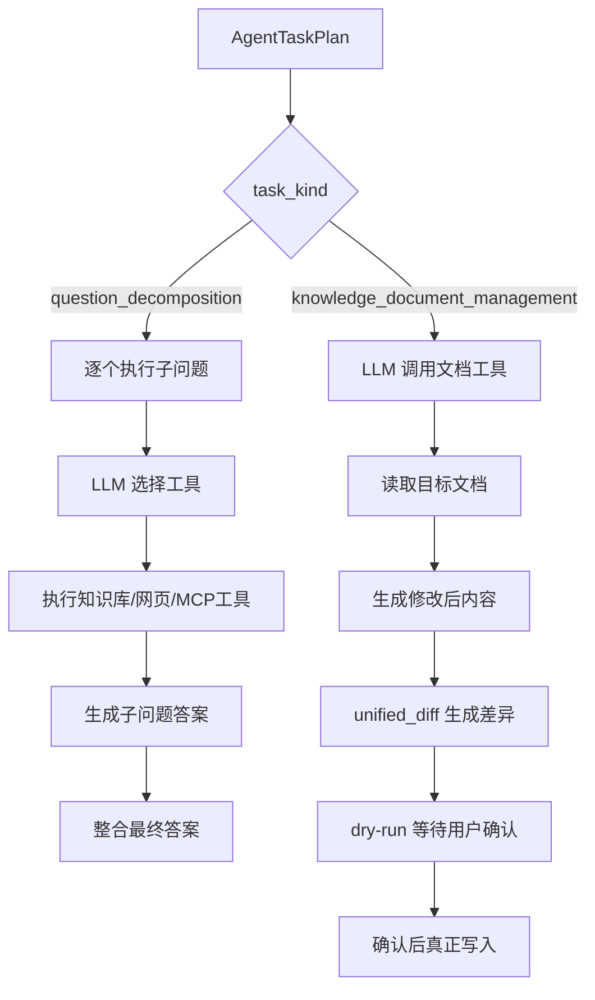
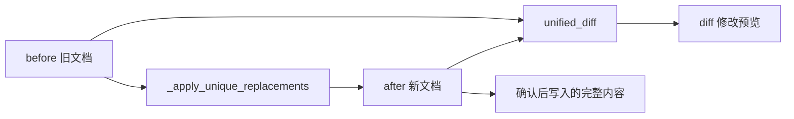
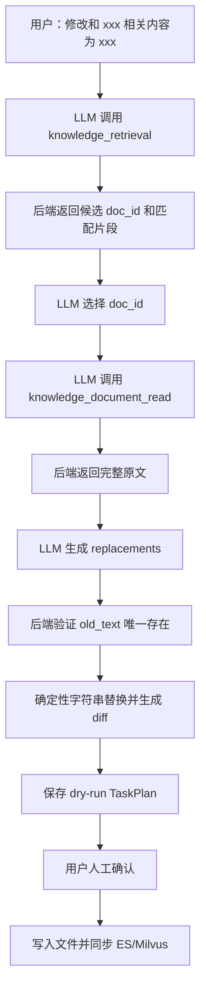
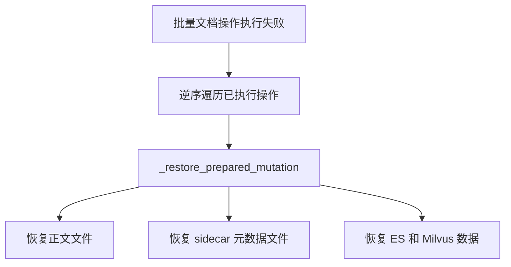
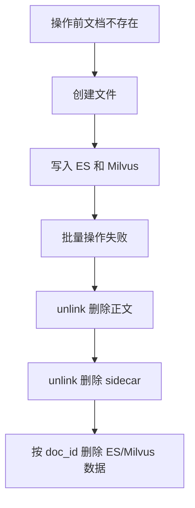

# 第一次plan：LLM 驱动的知识库文档管理任务

## Summary

扩展现有 `AgentTaskPlanner → AgentTaskPlan → Tool 调用 → 人工确认 → AgentTaskExecutor` 主线。

用户无需提供完整正文、修改位置或明确路径。LLM 可以调用已授权的知识库检索、Web Search、MCP 工具收集资料或发现目标文档，再生成结构化 create/update/delete 计划。最终写操作仍由后端按权限、候选范围和 `doc_id` 严格校验。

## Implementation Changes

- TaskPlan 增加 `knowledge_document_management` 类型，支持一条 query 规划一个或多个文档动作。
- Planner 只识别操作意图和检索目标，不直接授权或写入。
- 文档任务复用现有 Tool loop：
  - 只暴露当前已配置且已授权的知识库检索、Web Search、MCP 工具。
  - 受 `AGENT_MAX_TOOL_CALLS` 限制。
  - 文档管理 Tool 只在目标和正文解析完成后以 dry-run 调用。
- LLM 只能从工具返回的候选 `doc_id/source_path` 中选择 update/delete 目标；编造的路径或 doc_id 由本地校验拒绝。
- 多候选允许由 LLM 选择一个或多个，TaskPlan 必须展示选择理由、匹配证据、目标路径和影响范围，统一等待人工确认。

## 内容生成与修改

- create：
  - 用户可以只描述主题、目的和期望内容，不要求提供正文或目标路径。
  - LLM 根据需求调用知识库、Web Search、MCP 等已授权工具收集资料。
  - LLM 基于工具结果生成完整候选正文，并提出文件名；后端把路径限制在当前用户可管理的默认部门目录内。
  - TaskPlan 保存实际使用的工具、来源摘要、候选正文、目标路径、默认 ACL 和 dry-run 结果。

- update：
  - 用户可以只说“修改和 xxx 相关的内容，修改为 xxx”，不要求提供完整正文、目标路径或原文。
  - LLM 先通过知识库检索发现相关文档，再由服务端按候选路径读取完整源文件。
  - LLM 输出结构化精确替换列表 `old_text → new_text`，而不是自由重写整篇文档。
  - 后端要求 `old_text` 在原文中唯一存在，再使用确定性字符串替换生成完整候选正文；缺失或重复时拒绝该动作。
  - 使用 `difflib.unified_diff` 生成最终差异，供 TaskPlan、React 和 Markdown 确认页检查。
  - 如果修改需求需要新事实，可继续调用已授权检索、Web Search 或 MCP 工具补充资料。

- delete：
  - 用户可以通过自然语言描述要删除的内容或主题，不要求明确路径。
  - LLM 通过知识库检索获得候选文档，只能从候选 doc_id 中选择一个或多个删除目标。
  - TaskPlan 展示每篇文档的路径、标题、doc_id、匹配片段、选择理由、chunk 数和权限范围。
  - 没有检索候选时不生成删除步骤；LLM 不得自行构造路径。

## 权限、同步与回滚

- PostgreSQL继续作为用户、部门、角色和工具权限事实源，不新增文档表。
- create 默认使用当前用户具备创建权限的部门，优先主部门；ACL 持久化到现有 sidecar。
- update/delete 从 ES、Milvus 读取并冻结原文档权限；更新后的 chunks 原样继承，禁止 LLM 修改权限字段。
- update/create 使用现有文档级 `replace_docs_rag_stores()`；delete 只按选定 doc_id 删除 ES/Milvus chunks。
- 所有动作执行前完成候选范围、路径、权限、内容、embedding 和重复目标预检查。
- 批量计划任一动作失败时整批补偿回滚源文件、sidecar、ES 和 Milvus；回滚失败则返回明确的受影响 doc_id 和一致性修复状态。
- 保持 `POST /agent/task-plans/{id}/confirm` 为唯一执行入口；legacy `/rag/chat/stream` 不变。

## Public Interfaces

- 不新增 HTTP endpoint。
- `AgentTaskKind` 增加 `knowledge_document_management`。
- TaskPlan steps 增加检索依据、候选文档、精确替换、正文 diff、ACL 预览和执行结果。
- `/rag/chat/stream/events` 输出计划创建、Tool 调用、候选解析和等待确认事件。
- confirm SSE 输出每个文档步骤的完成/失败状态，`done` 不携带未防护正文。

## Test Plan

- 无网络测试：
  - LLM 结构化结果不能选择检索候选之外的 doc_id。
  - update 精确替换只修改唯一匹配内容，重复或不存在的 old_text 被拒绝。
  - create/update/delete dry-run 不产生真实写入。
  - ACL、其他 metadata 和无关文档保持不变。
  - 模拟批量第二项失败，验证第一项完整回滚。

- 真实环境验收：
  - 使用真实 PostgreSQL 用户、真实 LLM、ES、Milvus。
  - 用不带正文和路径的 query 创建文档，验证 LLM 调用工具收集资料并生成计划。
  - 用“修改和 xxx 相关内容”为 query，验证自动发现文档、生成精确差异并保持 ACL。
  - 用自然语言主题触发删除，验证 LLM 只能选择实际检索候选。
  - 确认前所有存储不变；确认后仅目标 doc_id 发生变化。
  - 对无关文档记录内容 hash、chunk 数和 ACL，操作前后必须完全一致。
  - 运行相关 `py_compile`、TaskPlan/Prompt Guard 回归、真实 HTTP/SSE 验收和 `git diff --check`。

## Assumptions

- 模糊目标允许 LLM 选择多个候选，但人工确认页面必须展示完整目标清单。
- 普通用户没有任何可管理部门时拒绝 create；管理员无部门范围时回退为仅本人可见。
- ES、Milvus 和文件系统没有真正的分布式事务，本次使用预检查和补偿回滚保证正常失败场景的一致性。


# 第二次plan：

## 原生 LLM 文档 Tool Calling 改造

## Summary

删除 `document_actions JSON → 工具名映射 → executor 手工调用` 旧模式，并将 `knowledge_report_to_document` 并入 `knowledge_document_management`。

统一链路为：

```text
LLM.bind_tools
→ 每轮产生一个 ToolCall
→ 工具执行
→ ToolMessage 返回结果
→ LLM 基于结果决定下一次调用
→ 文档 dry-run TaskPlan
→ 人工确认
→ Service 顺序执行真实写入
```

不实现 Tool 并行执行。存在依赖关系的工具必须跨轮次调用。

## Implementation Changes

- Planner 只识别 `knowledge_document_management` 或 `question_decomposition`，不再生成 `document_actions`、正文、路径或工具名。
- 删除 `knowledge_report_to_document` 固定链路；报告保存请求统一进入文档 Agent。
- 绑定真实只读工具：
  - 权限过滤后的 `knowledge_retrieval`。
  - `knowledge_document_read(doc_id)`，只能读取本轮检索候选。
  - 已配置的 `web_search` 和 MCP 工具。
- 绑定文档 dry-run Tool：
  - `knowledge_document_create`：文件名、候选正文、原因。
  - `knowledge_document_update`：候选 `doc_id`、精确替换列表、原因。
  - `knowledge_document_delete`：候选 `doc_id`、原因。
- 文档 Tool 只进行参数校验、候选及权限预检、diff 和 preview 生成；不修改文件、sidecar、ES 或 Milvus。
- 使用 `Pydantic args_schema` 和 `extra="forbid"` 保证参数结构，不向 LLM 暴露 ACL、`dry_run` 或真实执行开关。

### Tool 调用顺序

- 使用 `bind_tools(..., parallel_tool_calls=False)` 请求模型每轮只返回一个 ToolCall。
- 后端仍会检查 `AIMessage.tool_calls` 数量，不能只相信模型参数：
  - 恰好一个：执行并返回对应 ToolMessage。
  - 多于一个：本轮全部不执行；为每个 ToolCall 返回错误 ToolMessage，要求模型按依赖顺序逐个重试。
  - 没有 ToolCall：结束循环。
- 每次调用结果必须进入下一轮模型上下文，不能只记录到日志。
- 总调用次数受 `AGENT_MAX_TOOL_CALLS` 限制，校验失败和重试也计入上限。
- 结束前必须至少成功调用一个文档 dry-run Tool。

典型依赖链为：

```text
knowledge_retrieval
→ ToolMessage 返回候选 doc_id
→ knowledge_document_read
→ ToolMessage 返回完整原文
→ knowledge_document_update
→ ToolMessage 返回 dry-run preview
```

Web 资料场景为：

```text
web_search
→ ToolMessage 返回搜索结果
→ MCP fetch
→ ToolMessage 返回网页正文
→ knowledge_document_create
```

### 文档动作冲突

- 同一 TaskPlan 中不同文档的动作按 ToolCall 成功顺序保存和执行，不并行。
- 同一文档的多处修改必须合并到一次 update ToolCall 的 replacements 列表中。
- 同一文档出现多次 update、update 与 delete 并存或重复 delete 时，后端拒绝整个计划。
- create 后又 update 同一新文档时，要求模型合并成一次 create；不建立尚未确认文档之间的写入依赖。
- 资料读取依赖可以跨轮次完成，但最终文档写动作必须彼此独立。
- confirm 时先完成整批预检查和 embedding，再按 TaskPlan step 顺序执行；任一步失败触发逆序补偿回滚。

### TaskPlan 与确认

- 每个成功的文档 dry-run ToolCall 生成一个 `WAITING_CONFIRMATION` step。
- step 冻结原生 `tool_call_id`、action request、preview、diff、候选证据、权限裁决和 before hash。
- confirm API 重新鉴权后，才调用现有 `execute_confirmed_actions()`。
- LLM 永远不能直接调用真实写入 Service。

## Public Interfaces

- `AgentTaskKind` 删除 `knowledge_report_to_document`，保留：
  - `knowledge_document_management`
  - `question_decomposition`
- 不新增 HTTP endpoint。
- `POST /agent/task-plans/{id}/confirm` 保持唯一真实写入入口。
- TaskPlan 和 SSE 使用模型原生 `tool_call_id`。
- 复用现有 `agent_task_tool_call_started/completed/failed` 事件。
- legacy `/rag/chat/stream` 不变。

## Test Plan

- 验证每轮单 ToolCall 的 `AIMessage → Tool → ToolMessage` 完整链路。
- 模型返回多个 ToolCall 时全部不执行，并收到对应错误 ToolMessage。
- 验证 B 依赖 A 时，B 只能在收到 A 的 ToolMessage 后由下一轮产生。
- 验证缺字段、错误类型、多余字段及候选外 doc_id 不进入 Service。
- create：Web Search/MCP 收集资料后调用 create dry-run。
- update：检索→读取→精确 update；重复或不存在的 old_text 被拒绝。
- delete：自然语言检索后只能选择候选 doc_id。
- 验证同一文档的重复 update、update+delete、重复 delete 被拒绝。
- 验证多个独立文档动作按 step 顺序执行，不并行。
- 确认前文件、ES、Milvus 不变；确认后只有目标文档变化，ACL 和无关文档不变。
- 模拟批量中间步骤失败，验证逆序补偿回滚。
- 验证 LangSmith 展示跨轮次 ToolCall 和 ToolMessage，而不是 Planner 内容映射。
- 运行相关 `py_compile`、回归测试、真实 LLM/数据库验收和 `git diff --check`。

## Assumptions

- 当前阶段不实现 Tool 并行、依赖 DAG 或任务调度器。
- 有依赖的工具通过“单 ToolCall、多轮 ToolMessage”自然表达。
- 多文档写操作必须相互独立；存在写入依赖时应合并动作或拒绝计划。
- 不兼容旧参数映射、固定报告写入或 JSON 工具选择兜底。

# dry-run模块讲解：

## Dry-run 在哪里

dry-run 分为两层。

第一层是 Executor 对 LLM ToolCall 的处理：

[AgentTaskExecutor._prepare_document_dry_run() (line 1460)](D:/AI_Agent_Project/AI_Python_Project/python-agent-study/src/fast_app/services/agent_task_executor.py:1460)

第二层是文档 Service 生成预览：

[KnowledgeDocumentManagementService.plan_action() (line 90)](D:/AI_Agent_Project/AI_Python_Project/python-agent-study/src/fast_app/services/knowledge_document_management_service.py:90)

调用关系：

```
LLM 调用 knowledge_document_create/update/delete
→ Executor 中对应的 Tool handler
→ _prepare_document_dry_run()
→ KnowledgeDocumentManagementService.plan_action()
→ _build_preview()
→ 返回 preview
→ 保存 waiting_confirmation TaskPlan
```

## Executor 层做了什么

### create

create handler 会先把 LLM 提出的文件名限制到当前用户的默认目录：

```
target_path = _create_target_path(
    filename,
    user,
    plan.task_plan_id,
)
```

然后构造：

```
KnowledgeDocumentActionRequest(
    operation=CREATE,
    target_path=target_path,
    content=content,
    reason=reason,
    dry_run=True,
)
```

LLM 不能控制：

- 最终部门目录
- ACL
- `dry_run`
- 是否直接执行

### update

update 在进入 Service dry-run 前已经做了实质性的变更计算，位置在 [agent_task_executor.py (line 1357)](D:/AI_Agent_Project/AI_Python_Project/python-agent-study/src/fast_app/services/agent_task_executor.py:1357)。

它会：

1. 验证 `doc_id` 来自本轮检索候选。
2. 要求先调用 `knowledge_document_read`。
3. 读取真实源文件。
4. 检查每个 `old_text` 在原文中只出现一次。
5. 在内存中生成修改后的完整正文。
6. 使用 `difflib.unified_diff` 生成 diff。

核心代码：

```
before = service.read_document_content(candidate["source_path"])
after = _apply_unique_replacements(before, replacements)

diff = "\n".join(
    unified_diff(
        before.splitlines(),
        after.splitlines(),
        ...
    )
)
```

此时 `after` 只是内存中的候选正文，没有覆盖源文件。

### delete

delete 会验证：

- `doc_id` 必须来自本轮权限过滤后的候选。
- 候选中必须有真实 `source_path`。
- 目标文档必须存在。

但不会调用 `unlink()`。

## Service 层做了什么

`plan_action()` 首先检查总开关：

```
if not settings.agent_document_tools_enabled:
    raise AppServiceError(...)
```

然后执行三类预检。

### 1. 路径安全检查

位置：

[_resolve_safe_target_path() (line 336)](D:/AI_Agent_Project/AI_Python_Project/python-agent-study/src/fast_app/services/knowledge_document_management_service.py:336)

实际检查：

- 路径不能为空。
- 禁止 `..` 路径穿越。
- resolve 后必须仍在 `KNOWLEDGE_BASE_DIR` 内。
- 只允许 `.md`、`.txt` 等配置白名单后缀。
- 禁止修改 `.permission-rules.json`。
- 禁止修改 `*.meta.json`。

这不是形式检查，而是真正基于文件系统路径解析结果进行判断。

### 2. 操作前置条件检查

位置：

[_validate_operation_requirements() (line 413)](D:/AI_Agent_Project/AI_Python_Project/python-agent-study/src/fast_app/services/knowledge_document_management_service.py:413)

检查内容：

- create：目标不能已存在，正文不能为空。
- update：目标必须存在，新正文不能为空。
- delete：目标必须存在，不能携带正文。
- content 不能超过配置的最大长度。

### 3. 生成结构化 preview

位置：

[_build_preview() (line 448)](D:/AI_Agent_Project/AI_Python_Project/python-agent-study/src/fast_app/services/knowledge_document_management_service.py:448)

它会真实读取当前文档，但不写入。

生成的 preview 包含：

```
normalized_path
exists_before
risk_level
affected_doc_id
affected_chunk_count
before_hash
after_hash
permission_metadata
warnings
requires_confirmation
```

## Dry-run 中有意义的操作

### 权限计算

create 会根据当前用户生成默认 ACL：

```
有主部门
→ visibility=department
→ allowed_departments=[primary_department_code]

无主部门
→ visibility=restricted
→ allowed_users=[user_id]
```

update/delete 在 ES、Milvus client 都存在时，会读取两个存储中的原权限信息，并检查两边是否一致：

[_load_stored_permission_metadata() (line 585)](D:/AI_Agent_Project/AI_Python_Project/python-agent-study/src/fast_app/services/knowledge_document_management_service.py:585)

因此 dry-run 已经能够提前发现：

- ES 中没有目标文档。
- Milvus 中没有目标文档。
- 两边 ACL 不一致。
- LLM 选择了用户无权管理的部门文档。

### 估算 chunk 影响范围

Service 会复用真实 ingestion 的 `MarkdownChunkBuilder`，在内存中构建候选 chunks：

[_build_preview_chunks() (line 539)](D:/AI_Agent_Project/AI_Python_Project/python-agent-study/src/fast_app/services/knowledge_document_management_service.py:539)

因此 `affected_chunk_count` 不是 LLM 猜测，而是按当前真实 chunk 配置计算出来的。

但这里不会生成 embedding，也不会写 ES/Milvus。

### 计算并发保护 hash

Service 会计算：

```
before_hash = 当前源文件 SHA256
after_hash  = 候选正文 SHA256
```

位置：

[_sha256_text() (line 679)](D:/AI_Agent_Project/AI_Python_Project/python-agent-study/src/fast_app/services/knowledge_document_management_service.py:679)

确认执行时会重新计算 `before_hash`。如果用户确认前文件已被其他操作修改，确认请求会被拒绝，避免旧 TaskPlan 覆盖新内容。

### 真正执行权限网关

dry-run preview 返回后，Executor 会调用真实权限 Service：

```
decision = await tool_permission_service.authorize(
    user=user,
    context=context,
)
```

并写入真实审计记录：

```
await tool_audit_service.record_decision(...)
```

位置在 [agent_task_executor.py (line 1509)](D:/AI_Agent_Project/AI_Python_Project/python-agent-study/src/fast_app/services/agent_task_executor.py:1509)。

如果权限裁决是 `DENY`，dry-run 不会进入等待确认。

### 保存 TaskPlan

成功的 dry-run 会生成一个真实的 TaskPlan step：

```
AgentToolStep(
    status=WAITING_CONFIRMATION,
    output={
        "tool_call_id": ...,
        "action_request": ...,
        "preview": ...,
        "permission_decision": ...,
        "candidate": ...,
        "replacements": ...,
        "diff": ...,
    },
)
```

位置在 [agent_task_executor.py (line 1705)](D:/AI_Agent_Project/AI_Python_Project/python-agent-study/src/fast_app/services/agent_task_executor.py:1705)。

TaskPlan JSON 和 Markdown 会真实写入 `runtime/agent-task-plans`。因此 dry-run 不是“完全无副作用”，它会产生：

- LLM 调用和费用。
- 知识库/Web/MCP 查询。
- 文件读取。
- ES/Milvus 权限读取。
- 审计记录。
- TaskPlan JSON/Markdown。
- LangSmith trace。

## Dry-run 明确不会做什么

它不会：

```
创建、覆盖或删除知识库源文件
创建或删除 ACL sidecar
生成 embedding
写入或删除 ES chunks
写入或删除 Milvus chunks
```

`plan_action()` 在 `request.dry_run=True` 时直接返回：

```
KnowledgeDocumentActionResult(
    dry_run=True,
    executed=False,
    preview=preview,
)
```

不会进入真实写入函数。

# unified_diff函数讲解：

## 这份代码整体在做什么

`agent_task_executor.py` 是 Agent 任务计划的执行器，主要支持两类任务：

1. **复杂问题拆解**
   - 把原始问题拆成多个子问题；
   - 让 LLM 为每个子问题选择知识库检索、网页搜索或 MCP 工具；
   - 保存每一轮工具调用轨迹；
   - 最后把多个子问题答案整合成最终答案。
2. **知识库文档管理**
   - 创建文档；
   - 修改文档；
   - 删除文档；
   - 先生成 dry-run 计划；
   - 展示修改内容和权限判断；
   - 等待用户确认；
   - 确认后才真正执行写入。

可以把整体结构理解成：



你重点询问的 `unified_diff`，出现在“修改知识库文档”的 dry-run 阶段。

------

## `unified_diff` 是什么

代码中这样导入：

```python
from difflib import unified_diff
```

`unified_diff` 是 Python 标准库 `difflib` 提供的函数。

它的作用是：

> 比较两组文本行，生成 Unified Diff 格式的差异结果。

Unified Diff 就是 Git、Linux `diff`、代码审查页面经常使用的这种格式：

```diff
--- old.md
+++ new.md
@@ -1,3 +1,3 @@
 第一行
-旧内容
+新内容
 第三行
```

其中：

- 以空格开头：没有发生变化；
- 以 `-` 开头：旧版本中存在，但新版本删除了；
- 以 `+` 开头：新版本中新增的内容；
- `---`：旧文件；
- `+++`：新文件；
- `@@ ... @@`：变化发生在哪些行。

需要特别注意：

> `unified_diff` 只生成差异说明，不会修改文件，也不会修改传入的字符串。

真正生成新内容的是代码中的 `_apply_unique_replacements()`。

------

## `unified_diff` 的完整函数签名

它的完整参数大致如下：

```python
unified_diff(
    a,
    b,
    fromfile="",
    tofile="",
    fromfiledate="",
    tofiledate="",
    n=3,
    lineterm="\n",
)
```

逐项来看。

------

## 参数一：`a`

```python
a
```

表示：

> 修改前的文本行序列。

一般传入：

```python
list[str]
```

例如：

```python
before_lines = [
    "第一行",
    "旧内容",
    "第三行",
]
```

在你的代码中是：

```python
before.splitlines()
```

假设：

```python
before = """第一行
旧内容
第三行"""
```

执行：

```python
before.splitlines()
```

得到：

```python
[
    "第一行",
    "旧内容",
    "第三行",
]
```

### 为什么不能直接传入 `before`

下面这种写法不合适：

```python
unified_diff(before, after)
```

因为字符串本身也是一个可迭代对象。

Python 可能把它理解成：

```python
[
    "第",
    "一",
    "行",
    "\n",
    "旧",
    "内",
    "容",
]
```

这样比较的就可能是字符，而不是文本行。

因此，文本 diff 通常要先执行：

```python
before.splitlines()
```

------

## 参数二：`b`

```python
b
```

表示：

> 修改后的文本行序列。

你的代码中传入：

```python
after.splitlines()
```

例如：

```python
after = """第一行
新内容
第三行"""
```

执行：

```python
after.splitlines()
```

得到：

```python
[
    "第一行",
    "新内容",
    "第三行",
]
```

因此，前两个参数的关系是：

```python
unified_diff(
    修改前的行,
    修改后的行,
)
```

也就是：

```python
unified_diff(
    before.splitlines(),
    after.splitlines(),
)
```

------

## 参数三：`fromfile`

```python
fromfile=""
```

表示：

> diff 结果中，旧版本文件显示的名称。

例如：

```python
fromfile="before.md"
```

输出中就会出现：

```diff
--- before.md
```

在你的代码中：

```python
fromfile=candidate["source_path"]
```

`candidate["source_path"]` 是目标知识库文档的路径，例如：

```python
"development/rag-backend-deployment.md"
```

那么输出为：

```diff
--- development/rag-backend-deployment.md
```

注意，`fromfile` 只是一个显示标签。

它不会读取这个路径，也不会判断文件是否存在。

下面的代码完全合法：

```python
unified_diff(
    old_lines,
    new_lines,
    fromfile="一个并不存在的文件.md",
)
```

因为真正参与比较的内容只有 `a` 和 `b`。

------

## 参数四：`tofile`

```python
tofile=""
```

表示：

> diff 结果中，新版本文件显示的名称。

例如：

```python
tofile="after.md"
```

输出中会出现：

```diff
+++ after.md
```

传统写法通常是：

```python
unified_diff(
    old_lines,
    new_lines,
    fromfile="before.md",
    tofile="after.md",
)
```

输出：

```diff
--- before.md
+++ after.md
```

但是你的代码中写的是：

```python
fromfile=candidate["source_path"],
tofile=candidate["source_path"],
```

旧版本和新版本使用的是同一个路径。

这是因为它表达的不是两个不同文件，而是：

> 同一个知识库文件修改前和修改后的两个版本。

例如：

```diff
--- development/rag-backend-deployment.md
+++ development/rag-backend-deployment.md
```

虽然路径相同，但：

- `---` 仍然代表修改前；
- `+++` 仍然代表修改后。

如果主要用于人工审查，也可以写得更明确：

```python
fromfile=f"{candidate['source_path']} (before)",
tofile=f"{candidate['source_path']} (after)",
```

输出会变成：

```diff
--- development/rag-backend-deployment.md (before)
+++ development/rag-backend-deployment.md (after)
```

不过，当前写法更加接近 Git diff 对同一个文件的表达方式。

------

## 参数五：`fromfiledate`

```python
fromfiledate=""
```

表示：

> 旧版本文件的时间说明。

例如：

```python
fromfiledate="2026-07-12 10:00:00"
```

可能生成：

```diff
--- before.md	2026-07-12 10:00:00
```

它同样只是显示信息，不会参与比较。

你的代码没有传递这个参数，所以使用默认值：

```python
fromfiledate=""
```

因此 diff 头部没有旧文件时间。

------

## 参数六：`tofiledate`

```python
tofiledate=""
```

表示：

> 新版本文件的时间说明。

例如：

```python
tofiledate="2026-07-12 10:30:00"
```

输出可能是：

```diff
+++ after.md	2026-07-12 10:30:00
```

你的代码也没有传递它，因此不显示时间。

这两个时间参数一般用于：

- 比较实际文件版本；
- 显示文件修改时间；
- 生成更接近命令行 `diff` 的结果。

在你的系统中，TaskPlan 本身已经保存了创建时间和更新时间，所以 diff 中不重复添加时间也是合理的。

------

## 参数七：`n`

```python
n=3
```

表示：

> 在发生变化的行前后，各显示多少行没有变化的上下文。

默认值是：

```python
n=3
```

例如原文有很多行，只有第 50 行发生了修改。

使用：

```python
n=3
```

diff 会大致显示：

- 第 47 行；
- 第 48 行；
- 第 49 行；
- 第 50 行修改；
- 第 51 行；
- 第 52 行；
- 第 53 行。

这样人工审查时，可以知道修改发生在什么上下文中。

### `n=0`

```python
unified_diff(
    old_lines,
    new_lines,
    n=0,
)
```

只显示变化行，不显示周围未变化内容。

输出更短，但是不容易理解修改发生的位置。

### `n=5`

```python
n=5
```

变化前后各保留 5 行上下文。

输出更长，但更适合审查复杂修改。

你的代码没有传入 `n`，因此使用默认值：

```python
n=3
```

对于文档修改预览来说，这个默认值通常足够。

------

## 参数八：`lineterm`

```python
lineterm="\n"
```

表示：

> `unified_diff` 生成控制行时，使用什么行结束符。

所谓控制行主要包括：

```diff
--- old.md
+++ new.md
@@ -1,3 +1,3 @@
```

默认值是：

```python
lineterm="\n"
```

也就是每一个控制行末尾自带一个换行符。

而你的代码传入：

```python
lineterm=""
```

表示：

> `unified_diff` 返回的每一项末尾不要自动添加换行符。

这是和外层的：

```python
"\n".join(...)
```

配套使用的。

------

## 为什么这里必须使用 `lineterm=""`

你的完整代码是：

```python
diff = "\n".join(
    unified_diff(
        before.splitlines(),
        after.splitlines(),
        fromfile=candidate["source_path"],
        tofile=candidate["source_path"],
        lineterm="",
    )
)
```

这里已经由：

```python
"\n".join(...)
```

负责在每一行之间添加换行符。

因此，最好让 `unified_diff` 返回的每一行本身不带换行：

```python
lineterm=""
```

否则可能同时存在：

1. `unified_diff` 自己附加的 `\n`；
2. `join()` 再附加的 `\n`。

容易出现不一致或额外空行。

可以把当前逻辑理解成：

```python
diff_lines = unified_diff(
    ...,
    lineterm="",
)

diff = "\n".join(diff_lines)
```

`diff_lines` 类似：

```python
[
    "--- old.md",
    "+++ new.md",
    "@@ -1,3 +1,3 @@",
    " 第一行",
    "-旧内容",
    "+新内容",
    " 第三行",
]
```

然后：

```python
"\n".join(diff_lines)
```

生成一个完整字符串：

```text
--- old.md
+++ new.md
@@ -1,3 +1,3 @@
 第一行
-旧内容
+新内容
 第三行
```

------

## `unified_diff` 的返回值是什么

这是一个非常重要的知识点。

`unified_diff()` 返回的不是普通字符串，也不是直接返回 `list`，而是一个：

> 生成器形式的可迭代对象。

例如：

```python
result = unified_diff(
    before.splitlines(),
    after.splitlines(),
)
```

直接打印：

```python
print(result)
```

看到的可能是：

```text
<generator object unified_diff at 0x...>
```

它不会直接显示 diff 内容。

需要消费这个生成器，例如：

```python
for line in result:
    print(line)
```

或者转换成列表：

```python
diff_lines = list(result)
```

或者像你的代码一样，直接拼接：

```python
diff = "\n".join(result)
```

### 为什么返回生成器

因为 diff 结果可能很大。

如果比较两个大型文件，生成器可以一行一行地产生结果，不必一次性把全部差异先存入内存。

不过，你的代码最终还是执行了：

```python
"\n".join(...)
```

所以最终完整 diff 仍然会被组合成一个字符串。

这是合理的，因为后续需要：

- 保存到 TaskPlan；
- 写入 JSON；
- 渲染到 Markdown；
- 展示给用户确认。

------

## 你的代码中 `unified_diff` 的完整执行过程

原代码为：

```python
async def update_document(
    doc_id: str,
    replacements: list[KnowledgeDocumentReplacement],
    reason: str,
    selection_reason: str,
) -> str:
    candidate = _require_document_candidate(doc_id, candidates)

    if doc_id not in read_doc_ids:
        raise AppServiceError(
            "update 前必须先调用 knowledge_document_read"
        )

    before = self._document_management_service.read_document_content(
        candidate["source_path"]
    )

    after = _apply_unique_replacements(before, replacements)

    diff = "\n".join(
        unified_diff(
            before.splitlines(),
            after.splitlines(),
            fromfile=candidate["source_path"],
            tofile=candidate["source_path"],
            lineterm="",
        )
    )

    return await self._prepare_document_dry_run(
        ...
        content=after,
        diff=diff,
    )
```

下面逐步解释。

### 第一步：验证文档候选

```python
candidate = _require_document_candidate(doc_id, candidates)
```

确认 LLM 提供的 `doc_id` 来自本轮经过权限过滤后的检索结果。

这可以防止 LLM 随意构造一个 `doc_id` 修改未经授权的文档。

------

### 第二步：要求先读取完整原文

```python
if doc_id not in read_doc_ids:
    raise AppServiceError(
        "update 前必须先调用 knowledge_document_read"
    )
```

系统要求修改文档之前必须先调用读取工具。

这是为了保证 LLM：

- 看过完整文档；
- 知道准确原文；
- 能够提供精确的 `old_text`；
- 避免只根据检索到的局部 chunk 直接修改全文。

------

### 第三步：读取修改前内容

```python
before = self._document_management_service.read_document_content(
    candidate["source_path"]
)
```

`before` 是完整的旧文档字符串。

例如：

```python
before = """# 部署说明

环境：测试环境
端口：8000
"""
```

------

### 第四步：生成修改后内容

```python
after = _apply_unique_replacements(before, replacements)
```

`replacements` 中的元素大致表达：

```python
{
    "old_text": "环境：测试环境",
    "new_text": "环境：生产环境",
}
```

`_apply_unique_replacements()` 会检查：

```python
count = updated.count(replacement.old_text)
```

要求 `old_text` 在当前文档中只能出现一次：

```python
if count != 1:
    raise AppServiceError(...)
```

原因是：

- 出现 0 次：说明 LLM 提供的原文不准确；
- 出现多次：无法确定应该修改哪一处；
- 出现 1 次：可以安全执行精确替换。

然后：

```python
updated = updated.replace(
    replacement.old_text,
    replacement.new_text,
    1,
)
```

最终得到 `after`。

------

### 第五步：把完整字符串拆成行

```python
before.splitlines()
after.splitlines()
```

例如：

```python
before.splitlines()
```

结果：

```python
[
    "# 部署说明",
    "",
    "环境：测试环境",
    "端口：8000",
]
```

这样 `unified_diff` 才能逐行比较。

------

### 第六步：生成差异行

```python
unified_diff(
    before.splitlines(),
    after.splitlines(),
    fromfile=candidate["source_path"],
    tofile=candidate["source_path"],
    lineterm="",
)
```

返回一个差异行生成器。

------

### 第七步：拼成完整字符串

```python
diff = "\n".join(...)
```

生成最终用于保存和展示的字符串。

------

### 第八步：将 `after` 和 `diff` 一起放进 dry-run

```python
return await self._prepare_document_dry_run(
    ...
    content=after,
    diff=diff,
)
```

这里同时保存两种信息：

- `content=after`：确认后真正要写入文件的完整新内容；
- `diff=diff`：给用户审查的修改摘要。

这两者的用途不同。

| 数据    | 作用                   |
| ------- | ---------------------- |
| `after` | 真正执行写入时使用     |
| `diff`  | 用户确认前查看修改范围 |

------

## 一个完整可运行示例

```python
from difflib import unified_diff


before = """# 部署说明
环境：测试环境
端口：8000
启动命令：uvicorn fast_app.main:app
"""

after = """# 部署说明
环境：生产环境
端口：8080
启动命令：uvicorn fast_app.main:app --workers 4
"""


diff = "\n".join(
    unified_diff(
        before.splitlines(),
        after.splitlines(),
        fromfile="development/rag-backend-deployment.md",
        tofile="development/rag-backend-deployment.md",
        lineterm="",
    )
)

print(diff)
```

输出：

```diff
--- development/rag-backend-deployment.md
+++ development/rag-backend-deployment.md
@@ -1,4 +1,4 @@
 # 部署说明
-环境：测试环境
-端口：8000
-启动命令：uvicorn fast_app.main:app
+环境：生产环境
+端口：8080
+启动命令：uvicorn fast_app.main:app --workers 4
```

------

## 如何阅读 `@@ -1,4 +1,4 @@`

这一行称为 hunk header，也就是“差异块头部”：

```diff
@@ -1,4 +1,4 @@
```

左边：

```text
-1,4
```

表示旧版本：

- 从第 1 行开始；
- 这个差异块一共覆盖 4 行。

右边：

```text
+1,4
```

表示新版本：

- 从第 1 行开始；
- 这个差异块一共覆盖 4 行。

一般格式为：

```text
@@ -旧起始行,旧行数 +新起始行,新行数 @@
```

例如：

```diff
@@ -10,5 +10,7 @@
```

表示：

- 旧版本从第 10 行开始，涉及 5 行；
- 新版本从第 10 行开始，涉及 7 行。

这通常说明新版本增加了两行。

------

## 行首符号分别表示什么

### 空格开头

```diff
 # 部署说明
```

表示这行在旧版本和新版本中都存在，没有发生变化。

注意，最前面实际上有一个空格：

```text
" # 部署说明"
```

这个空格是 diff 格式的一部分。

------

### `-` 开头

```diff
-端口：8000
```

表示：

> 这行存在于旧版本中，但不存在于新版本中。

也就是被删除或替换掉的内容。

------

### `+` 开头

```diff
+端口：8080
```

表示：

> 这行不存在于旧版本中，但存在于新版本中。

也就是新增或替换后的内容。

------

### 修改为什么显示为一删一增

文本 diff 通常没有专门的“修改”符号。

例如：

```text
端口：8000
```

修改为：

```text
端口：8080
```

会被表达成：

```diff
-端口：8000
+端口：8080
```

含义是：

1. 删除旧行；
2. 添加新行。

------

## `unified_diff` 不会告诉你“哪个字符改变了”

例如：

```text
端口：8000
```

变成：

```text
端口：8080
```

`unified_diff` 默认展示的是整行变化：

```diff
-端口：8000
+端口：8080
```

它不会进一步标出只有中间的一个字符发生变化。

这是因为 Unified Diff 的基本单位是“行”。

如果要显示字符级别差异，可以使用：

```python
difflib.ndiff()
```

或者：

```python
difflib.HtmlDiff()
```

但对于：

- Git 风格审查；
- Markdown `diff` 代码块；
- 文档 dry-run；
- 后续生成 patch；

`unified_diff` 更合适。

------

## 代码生成的 diff 最后去了哪里

在 `_prepare_document_dry_run()` 中，diff 被放进 JSON：

```python
{
    ...
    "replacements": replacements,
    "diff": diff,
}
```

之后 `_document_step_from_tool_result()` 又把它保存进步骤输出：

```python
output={
    ...
    "diff": output.get("diff", ""),
}
```

最后 `_render_task_plan_markdown()` 读取它：

```python
diff = step.output.get("diff")

if isinstance(diff, str) and diff.strip():
    lines.extend(
        [
            "",
            "```diff",
            diff,
            "```",
        ]
    )
```

于是 TaskPlan 的 Markdown 文件会包含：

~~~markdown
```diff
--- development/example.md
+++ development/example.md
@@ -1,3 +1,3 @@
-旧内容
+新内容
```
~~~

Markdown 编辑器通常会把：

- `-` 行显示为删除样式；
- `+` 行显示为新增样式。

因此特别适合用户在确认修改前审查。

------

## 这套设计中 `unified_diff` 的实际定位

在这份代码中，`unified_diff` 不是文档修改机制。

真正的职责划分是：



所以要分清三个概念：

### `before`

修改前的完整文档。

### `after`

应用 replacements 后的完整新文档。

### `diff`

根据 `before` 和 `after` 计算出来的展示文本。

关系为：

```text
before + replacements -> after

before + after -> diff
```

`diff` 只是从两个版本中计算出来的结果。

------

## 当前写法中几个重要细节

### `splitlines()` 没有使用 `keepends=True`

当前使用：

```python
before.splitlines()
```

而不是：

```python
before.splitlines(keepends=True)
```

因此每一行末尾通常不包含 `\n`。

例如：

```python
"第一行\n第二行\n".splitlines()
```

得到：

```python
["第一行", "第二行"]
```

这与：

```python
lineterm=""
```

以及：

```python
"\n".join(...)
```

组合得比较干净。

------

### 内容没有变化时，diff 是空字符串

如果两个输入完全相同：

```python
before == after
```

那么：

```python
unified_diff(...)
```

不会产生任何差异行。

最后：

```python
"\n".join(...)
```

结果就是：

```python
""
```

不过你的代码前面已经检查：

```python
if updated == content:
    raise AppServiceError("文档修改计划没有产生内容变化")
```

所以正常情况下，运行到 `unified_diff` 时应该已经存在内容变化。

------

### 同一个路径不会影响比较

代码中：

```python
fromfile=candidate["source_path"],
tofile=candidate["source_path"],
```

不会造成 diff 比较失败。

因为 `fromfile` 和 `tofile` 只是输出标签。

真正被比较的是：

```python
before.splitlines()
after.splitlines()
```

------

## `unified_diff` 参数总结

| 参数           | 含义                        | 当前代码传值               |
| -------------- | --------------------------- | -------------------------- |
| `a`            | 修改前的文本行              | `before.splitlines()`      |
| `b`            | 修改后的文本行              | `after.splitlines()`       |
| `fromfile`     | 旧版本文件显示名称          | `candidate["source_path"]` |
| `tofile`       | 新版本文件显示名称          | `candidate["source_path"]` |
| `fromfiledate` | 旧版本时间说明              | 未传，默认为空             |
| `tofiledate`   | 新版本时间说明              | 未传，默认为空             |
| `n`            | 变化前后显示多少行上下文    | 未传，默认 `3`             |
| `lineterm`     | diff 控制行末尾使用的结束符 | `""`                       |

当前代码可以简化理解为：

```python
old_lines = before.splitlines()
new_lines = after.splitlines()

diff_lines = unified_diff(
    old_lines,
    new_lines,
    fromfile="旧版本标签",
    tofile="新版本标签",
    lineterm="",
)

diff_text = "\n".join(diff_lines)
```

最终得到的是一个适合放进 Markdown `diff` 代码块、供用户确认的修改预览。

# Update文档更新行为讲解：

当前实现采用“LLM 理解模糊意图并提出精确替换，后端执行确定性校验”的方式。后端本身不会通过关键词算法自动猜测文档中的修改位置。

````

````

## 1. LLM 理解用户的模糊修改意图

文档 Agent 的行为规则位于：

[agent_task_executor.py (line 131)](D:/AI_Agent_Project/AI_Python_Project/python-agent-study/src/fast_app/services/agent_task_executor.py:131)

系统 Prompt 明确要求 update 必须按照下面的顺序执行：

```
knowledge_retrieval
→ knowledge_document_read
→ knowledge_document_update
```

例如用户输入：

```
修改部署文档中和 Redis 地址相关的内容，将地址改为 redis:6379
```

LLM 首先理解：

- 修改对象可能是部署文档
- 查找主题是 Redis 配置
- 新内容应该包含 `redis:6379`

这里的“意图理解”由 LLM 完成，不是本地关键词规则完成。

## 2. 通过知识库检索定位候选文档

文档任务绑定的检索工具在：

[agent_task_executor.py (line 1341)](D:/AI_Agent_Project/AI_Python_Project/python-agent-study/src/fast_app/services/agent_task_executor.py:1341)

LLM 会生成类似调用：

```
{
  "name": "knowledge_retrieval",
  "args": {
    "query": "Redis 地址 部署配置",
    "mode": "hybrid",
    "top_k": 5
  }
}
```

检索经过当前用户的 `filters` 权限过滤，结果被整理为：

```
{
  "candidates": [
    {
      "doc_id": "...",
      "source_path": ".../rag-backend-deployment.md",
      "title": "...",
      "matched_chunks": ["包含 Redis 配置的命中片段"]
    }
  ]
}
```

候选文档会被保存到服务端本轮状态：

```
candidates.update({item["doc_id"]: item for item in found})
```

因此，LLM 后续不能随便编造路径，只能选择本轮检索返回的 `doc_id`。

## 3. 读取候选文档完整原文

读取逻辑位于：

[agent_task_executor.py (line 1369)](D:/AI_Agent_Project/AI_Python_Project/python-agent-study/src/fast_app/services/agent_task_executor.py:1369)

LLM 选择候选后调用：

```
{
  "name": "knowledge_document_read",
  "args": {
    "doc_id": "检索返回的真实 doc_id"
  }
}
```

后端先执行：

```
candidate = _require_document_candidate(doc_id, candidates)
```

如果 `doc_id` 不在本轮候选中，立即拒绝。

验证成功后，后端读取完整源文件，并通过 `ToolMessage` 返回给 LLM：

```
{
  "doc_id": "...",
  "source_path": "...",
  "content": "文档完整正文"
}
```

同时将该文档记录进：

```
read_doc_ids.add(doc_id)
```

这用于强制保证 update 前确实读取过完整原文。

## 4. LLM 从完整原文中选择要替换的内容

update 的结构化参数定义在：

[document_management_tools.py (line 41)](D:/AI_Agent_Project/AI_Python_Project/python-agent-study/src/fast_app/agents/document_management_tools.py:41)

LLM 必须输出：

```
{
  "doc_id": "真实候选 doc_id",
  "replacements": [
    {
      "old_text": "原文中完整且唯一的文本",
      "new_text": "修改后的文本"
    }
  ],
  "reason": "根据用户要求修改 Redis 地址",
  "selection_reason": "该文档的检索片段包含 Redis 部署配置"
}
```

参数不是只靠 Prompt 约束，而是由 Pydantic Schema 校验：

```
class KnowledgeDocumentReplacement(BaseModel):
    model_config = ConfigDict(extra="forbid")

    old_text: str
    new_text: str
```

因此缺少字段、字段类型错误或出现多余字段都会被拒绝。

但要注意职责边界：

- “哪段内容符合用户说的 xxx”由 LLM 根据完整原文判断。
- “这段内容是否真的能安全替换”由后端验证。

## 5. 后端执行唯一精确替换

update 工具的实际 dry-run 逻辑位于：

[agent_task_executor.py (line 1400)](D:/AI_Agent_Project/AI_Python_Project/python-agent-study/src/fast_app/services/agent_task_executor.py:1400)

它会再次读取当前源文件，而不是直接相信此前返回给 LLM 的正文：

```
before = self._document_management_service.read_document_content(
    candidate["source_path"]
)
```

然后调用：

[agent_task_executor.py (line 1829)](D:/AI_Agent_Project/AI_Python_Project/python-agent-study/src/fast_app/services/agent_task_executor.py:1829)

核心逻辑是：

```
count = updated.count(replacement.old_text)

if count != 1:
    raise AppServiceError(...)

updated = updated.replace(
    replacement.old_text,
    replacement.new_text,
    1,
)
```

这意味着：

- `old_text` 不存在：拒绝。
- `old_text` 出现多次：拒绝。
- `old_text` 唯一出现：只替换一次。
- 所有替换完成后正文没有变化：拒绝。

所以它不是模糊替换、正则替换或全文自由重写，而是精确字符串替换。

## 6. 生成完整候选正文和 diff

替换完成后，后端得到：

```
before = 原始完整正文
after = 应用 replacements 后的完整正文
```

然后通过 `difflib.unified_diff` 生成差异：

[agent_task_executor.py (line 1414)](D:/AI_Agent_Project/AI_Python_Project/python-agent-study/src/fast_app/services/agent_task_executor.py:1414)

例如：

```
- REDIS_URL=localhost:6379
+ REDIS_URL=redis:6379
```

TaskPlan 中会同时冻结：

- 目标 `doc_id`
- `source_path`
- `old_text/new_text`
- 完整候选正文
- diff
- 选择理由
- 权限信息
- `before_hash`
- dry-run 预览

相关组装位置：

[agent_task_executor.py (line 1502)](D:/AI_Agent_Project/AI_Python_Project/python-agent-study/src/fast_app/services/agent_task_executor.py:1502)

此时不会修改源文件、ES 或 Milvus。

## 7. 人工确认后才执行真实修改

用户确认后，Executor 从 TaskPlan 读取冻结的候选正文，并重新鉴权：

[agent_task_executor.py (line 1624)](D:/AI_Agent_Project/AI_Python_Project/python-agent-study/src/fast_app/services/agent_task_executor.py:1624)

随后将 `before_hash` 和修改请求交给：

[knowledge_document_management_service.py (line 168)](D:/AI_Agent_Project/AI_Python_Project/python-agent-study/src/fast_app/services/knowledge_document_management_service.py:168)

Service 会再次检查源文件版本。如果人工确认期间文件发生变化，当前 hash 与 `before_hash` 不一致，便会拒绝旧计划。

验证通过后才会：

- 写入修改后的完整源文件
- 保留原有 ACL/sidecar
- 只替换该 `doc_id` 在 ES、Milvus 中的 chunks
- 失败时执行补偿回滚

因此，当前实现可以概括为：

```
LLM 负责语义判断：
“用户想改什么、原文中哪段对应这个意思、应该改成什么”

后端负责确定性执行：
“doc_id 是否可选、原文是否读过、old_text 是否唯一、权限是否允许、
文件是否变化、最终只修改哪个文档”
```

## 8、dry run结束后，进入真实文档替换操作：

[agent_task_executor.py (line 1829)](D:/AI_Agent_Project/AI_Python_Project/python-agent-study/src/fast_app/services/agent_task_executor.py:1829)

核心逻辑是：

```
count = updated.count(replacement.old_text)

if count != 1:
    raise AppServiceError(...)

updated = updated.replace(
    replacement.old_text,
    replacement.new_text,
    1,
)
```

这意味着：

- `old_text` 不存在：拒绝。
- `old_text` 出现多次：拒绝。
- `old_text` 唯一出现：只替换一次。
- 所有替换完成后正文没有变化：拒绝。

所以它不是模糊替换、正则替换或全文自由重写，而是精确字符串替换。

`replacement.old_text` 和 `replacement.new_text` 都不是完整文档，通常是一小段需要修改的精确文本。


**假设本地完整原文是：**

```
# 部署说明

应用服务监听 8000 端口。

Redis 服务地址为 localhost:6379。

启动前请确认数据库连接正常。
```

用户要求：

```
把 Redis 地址修改为 redis:6379
```

LLM 应输出：

```
{
  "old_text": "Redis 服务地址为 localhost:6379。",
  "new_text": "Redis 服务地址为 redis:6379。"
}
```

三者关系是：

```
before
= 后端从本地源文件读取的完整原文

replacement.old_text
= LLM 从完整原文中复制出来的、需要被替换的局部原文

replacement.new_text
= LLM 根据用户意图生成的局部新文本

after
= 后端把 before 中的 old_text 替换为 new_text 后得到的完整新文档
```

代码实际执行的是：

```python
before = read_document_content(...)

after = _apply_unique_replacements(
    before,
    replacements,
)
```

然后在 `_apply_unique_replacements()` 中：

```python
updated = before

for replacement in replacements:
    count = updated.count(replacement.old_text)

    if count != 1:
        raise AppServiceError(...)

    updated = updated.replace(
        replacement.old_text,
        replacement.new_text,
        1,
    )

after = updated
```

因此：

- `replacement.old_text`：LLM 提取的局部原文，不是后端自动传入的完整源文件。
- `replacement.new_text`：LLM 生成的局部修改内容，不是完整的新文档。
- `before`：本地源文件的完整原文。
- `after`：后端执行所有局部替换后生成的完整新文档。

这样设计的好处是，LLM 没有直接重写整篇文档。后端只修改明确列出的局部内容，其余正文保持原样。

如果需要修改多个位置，LLM 应一次提交多个 replacement：

```python
{
  "replacements": [
    {
      "old_text": "Redis 服务地址为 localhost:6379。",
      "new_text": "Redis 服务地址为 redis:6379。"
    },
    {
      "old_text": "应用服务监听 8000 端口。",
      "new_text": "应用服务监听 8080 端口。"
    }
  ]
}
```

后端按照列表顺序逐项替换，最后得到完整的 `after` 文档。

# 文档操作相关逻辑讲解：

## 触发入口

用户通过以下任一主接口提交 query：

- `POST /rag/chat`
- `POST /rag/chat/stream/events`

入口在 [rag_chat_routes.py (line 33)](D:/AI_Agent_Project/AI_Python_Project/python-agent-study/src/fast_app/api/rag_chat_routes.py:33) 和 [rag_chat_routes.py (line 196)](D:/AI_Agent_Project/AI_Python_Project/python-agent-study/src/fast_app/api/rag_chat_routes.py:196)。

前提是：

```
RAG_PIPELINE_PROVIDER=rag_agent
AGENT_DOCUMENT_TOOLS_ENABLED=true
OPENAI_API_KEY=...
AGENT_MAX_TOOL_CALLS=4
```

`get_rag_pipeline()` 只有在 `RAG_PIPELINE_PROVIDER=rag_agent` 时才会注入 `AgentTaskPlanner` 和 `AgentTaskExecutor`，位置在 [rag_dependencies.py (line 328)](D:/AI_Agent_Project/AI_Python_Project/python-agent-study/src/fast_app/dependencies/rag_dependencies.py:328)。

## 哪些 query 会触发

例如：

```
请创建一篇关于 Prompt Guard 的知识库文档。

请根据网络资料整理一篇 LangGraph Tool Calling 说明并保存为文档。

修改和部署流程相关的文档，把旧的启动命令替换成新的命令。

删除内容已经过期的 RAG 部署文档。

请生成一份混合检索报告，并保存到 development/rag-report.md。
```

正常情况下，不是代码用关键词直接决定 create/update/delete，而是 Planner LLM 先判断：

```
{
  "task_kind": "knowledge_document_management",
  "objective": "...",
  "confidence": 0.95
}
```

Planner 的结构化模型和提示词在 [agent_task_planner.py (line 46)](D:/AI_Agent_Project/AI_Python_Project/python-agent-study/src/fast_app/services/agent_task_planner.py:46) 和 [agent_task_planner.py (line 64)](D:/AI_Agent_Project/AI_Python_Project/python-agent-study/src/fast_app/services/agent_task_planner.py:64)。

注意：Planner 此时只识别“这是文档任务”，不会生成 create/update/delete 参数。

## 完整执行流程

```
用户 query
→ RAG Agent Graph
→ Planner 判断 task_kind
→ 创建空的文档 TaskPlan
→ 路由到 execute_task_plan
→ LLM.bind_tools
→ LLM 自主调用资料或文档 Tool
→ ToolMessage 返回结果
→ 生成 dry-run steps
→ waiting_confirmation
→ 用户确认
→ 真实修改文件、ES、Milvus
```

### 1. Graph 调用 Planner

`decide_next_action` 节点调用：

```
task_plan = await task_planner.plan(query=state["query"], ...)
```

位置在 [rag_agent_nodes.py (line 194)](D:/AI_Agent_Project/AI_Python_Project/python-agent-study/src/fast_app/graph/rag_agent_nodes.py:194)。

Planner 返回非空 TaskPlan 后，Graph 将路由设置为：

```
route = "execute_task_plan"
```

对应 [rag_agent_nodes.py (line 239)](D:/AI_Agent_Project/AI_Python_Project/python-agent-study/src/fast_app/graph/rag_agent_nodes.py:239)。

### 2. Planner 识别文档任务

主入口是 [AgentTaskPlanner.plan() (line 135)](D:/AI_Agent_Project/AI_Python_Project/python-agent-study/src/fast_app/services/agent_task_planner.py:135)。

正常流程：

1. 使用 `with_structured_output(AgentTaskPlannerPayload)`。
2. 判断 `confidence >= 0.65`。
3. 检查 `task_kind`。
4. 文档任务调用 `_build_document_management_plan()`。

空文档计划在 [agent_task_planner.py (line 438)](D:/AI_Agent_Project/AI_Python_Project/python-agent-study/src/fast_app/services/agent_task_planner.py:438) 创建：

```
AgentTaskPlan(
    task_kind="knowledge_document_management",
    original_query=query,
    steps=[],
)
```

这里 `steps=[]` 很关键：Planner 没有把文本内容映射成文档 Tool，后面的 steps 必须来自 LLM 原生 ToolCall。

### 3. LLM 不可用时的规则兜底

规则入口在 [agent_task_planner.py (line 343)](D:/AI_Agent_Project/AI_Python_Project/python-agent-study/src/fast_app/services/agent_task_planner.py:343)。

目前会识别：

- 删除：`删除`、`移除`、`下线`
- 修改：`修改`、`更新`、`改写`、`替换`
- 创建：包含 `创建`、`新增`、`新建`，同时出现文档、知识库或 `.md/.txt` 路径
- 报告保存：同时出现报告、保存/写入/创建和目标文件路径

具体规则在 [agent_task_planner.py (line 509)](D:/AI_Agent_Project/AI_Python_Project/python-agent-study/src/fast_app/services/agent_task_planner.py:509)。

这个兜底只负责启动文档任务。真正执行文档 Tool 时仍然要求配置 LLM。

### 4. Graph 启动文档 Executor

`execute_task_plan` 节点位于 [rag_agent_nodes.py (line 515)](D:/AI_Agent_Project/AI_Python_Project/python-agent-study/src/fast_app/graph/rag_agent_nodes.py:515)。

它调用：

```
executed_plan = await task_executor.execute(...)
```

位置在 [rag_agent_nodes.py (line 584)](D:/AI_Agent_Project/AI_Python_Project/python-agent-study/src/fast_app/graph/rag_agent_nodes.py:584)。

Executor 确认：

```
plan.task_kind == "knowledge_document_management"
```

然后进入原生文档 Tool loop，位置在 [agent_task_executor.py (line 985)](D:/AI_Agent_Project/AI_Python_Project/python-agent-study/src/fast_app/services/agent_task_executor.py:985)。

### 5. 给 LLM 绑定哪些工具

工具构造发生在 [agent_task_executor.py (line 1292)](D:/AI_Agent_Project/AI_Python_Project/python-agent-study/src/fast_app/services/agent_task_executor.py:1292)。

固定绑定：

- `knowledge_retrieval`
- `knowledge_document_read`
- `knowledge_document_create`
- `knowledge_document_update`
- `knowledge_document_delete`

按配置和用户权限绑定：

- `web_search`
- MCP tools

文档 Tool 的 Pydantic 参数模型在 [document_management_tools.py (line 15)](D:/AI_Agent_Project/AI_Python_Project/python-agent-study/src/fast_app/agents/document_management_tools.py:15)。

例如 update 必须输出：

```
{
  "doc_id": "真实检索候选中的 doc_id",
  "replacements": [
    {
      "old_text": "原文中唯一存在的内容",
      "new_text": "修改后的内容"
    }
  ],
  "reason": "修改原因",
  "selection_reason": "选择该文档的原因"
}
```

这些模型全部使用：

```
ConfigDict(extra="forbid")
```

因此多余字段、缺失字段和错误类型都会被拒绝，而不是只依赖 Prompt。

### 6. 原生 ToolCall 循环

循环位于 [agent_task_executor.py (line 1011)](D:/AI_Agent_Project/AI_Python_Project/python-agent-study/src/fast_app/services/agent_task_executor.py:1011)。

模型通过：

```
ChatOpenAI(...).bind_tools(
    tools,
    parallel_tool_calls=False,
)
```

完成绑定。

每轮流程是：

```
AIMessage.tool_calls
→ 检查只能有一个 ToolCall
→ BaseTool.ainvoke(完整 ToolCall)
→ 产生相同 tool_call_id 的 ToolMessage
→ ToolMessage 加回 messages
→ LLM 进入下一轮
```

如果模型一轮返回多个 ToolCall：

- 本轮所有 Tool 都不会执行。
- 后端为每个调用生成错误 ToolMessage。
- 要求模型下一轮按依赖顺序逐个调用。

## create、update、delete 的具体差异

### create

常见链路：

```
knowledge_retrieval / web_search / MCP
→ ToolMessage 返回资料
→ knowledge_document_create
→ dry-run preview
```

create Tool 参数：

```
filename
content
reason
```

LLM 只能提出文件名。最终目录由后端根据当前用户主部门决定，不能由 LLM 任意指定。

### update

固定依赖链：

```
knowledge_retrieval
→ 返回候选 doc_id
→ knowledge_document_read(doc_id)
→ 返回完整原文
→ knowledge_document_update(doc_id, replacements)
```

Executor 会检查：

- `doc_id` 必须来自本轮权限过滤后的检索结果。
- update 前必须读取过完整原文。
- 每个 `old_text` 必须在原文中唯一存在。
- 同一文档不能重复 update 或同时 update/delete。
- ACL 不允许由 LLM 提供或修改。

### delete

固定依赖链：

```
knowledge_retrieval
→ 返回候选 doc_id
→ knowledge_document_delete(doc_id)
```

没有候选 doc_id 时，LLM 无法构造有效删除请求。

## dry-run 与真实写入边界

文档 Tool 最终调用 `_prepare_document_dry_run()`，位置在 [agent_task_executor.py (line 1460)](D:/AI_Agent_Project/AI_Python_Project/python-agent-study/src/fast_app/services/agent_task_executor.py:1460)。

它负责：

- 调用权限网关。
- 生成 preview。
- 计算 diff。
- 冻结 `before_hash`。
- 保存候选证据和原生 `tool_call_id`。
- 将 step 设置为 `waiting_confirmation`。

底层 dry-run 入口是 [KnowledgeDocumentManagementService.plan_action() (line 90)](D:/AI_Agent_Project/AI_Python_Project/python-agent-study/src/fast_app/services/knowledge_document_management_service.py:90)。

到这里为止不会修改：

- 源文件
- sidecar ACL
- Elasticsearch
- Milvus

## 人工确认后的真实执行

确认接口：

```
POST /agent/task-plans/{task_plan_id}/confirm
```

路由位置在 [agent_task_plan_routes.py (line 117)](D:/AI_Agent_Project/AI_Python_Project/python-agent-study/src/fast_app/api/agent_task_plan_routes.py:117)。

调用链：

```
confirm endpoint
→ AgentTaskExecutor.confirm()
→ _confirm_document_management_plan()
→ 重新鉴权
→ execute_confirmed_actions()
→ 文件、ES、Milvus 同步
```

相关代码：

- [AgentTaskExecutor.confirm() (line 1532)](D:/AI_Agent_Project/AI_Python_Project/python-agent-study/src/fast_app/services/agent_task_executor.py:1532)
- [_confirm_document_management_plan() (line 1575)](D:/AI_Agent_Project/AI_Python_Project/python-agent-study/src/fast_app/services/agent_task_executor.py:1575)
- [execute_confirmed_actions() (line 163)](D:/AI_Agent_Project/AI_Python_Project/python-agent-study/src/fast_app/services/knowledge_document_management_service.py:163)
- [_apply_prepared_mutation() (line 269)](D:/AI_Agent_Project/AI_Python_Project/python-agent-study/src/fast_app/services/knowledge_document_management_service.py:269)

## SSE 中如何观察

`POST /rag/chat/stream/events` 会输出：

```
agent_task_plan_created
agent_task_tool_call_started
agent_task_tool_call_completed
agent_task_tool_call_failed
agent_task_waiting_confirmation
```

文档 ToolCall 事件生成位置在 [rag_agent_pipeline_service.py (line 949)](D:/AI_Agent_Project/AI_Python_Project/python-agent-study/src/fast_app/services/rag_agent_pipeline_service.py:949)。

LangSmith 中对应链路应表现为：

```
document.tool_loop.round_1.model
→ knowledge_retrieval
→ document.tool_loop.round_2.model
→ knowledge_document_read
→ document.tool_loop.round_3.model
→ knowledge_document_update
```

这才是当前实现中用户 query 触发文档任务并形成原生 LLM Tool Calling 的完整链路。

# 执行文档任务的相关逻辑：

## 实际写入逻辑不在 LLM Tool 中

当前设计是有意分层的：

```
LLM 文档 Tool
→ 只生成 dry-run 和待确认 TaskPlan
→ 用户调用 confirm API
→ Executor 重新鉴权
→ KnowledgeDocumentManagementService 真实操作文件、ES、Milvus
```

真实写入能力不是 LangChain Tool，因此 LLM 无法绕过人工确认直接调用。

## 真实执行入口

前端或测试脚本调用：

```
POST /agent/task-plans/{task_plan_id}/confirm
Content-Type: application/json

{
  "confirmed": true
}
```

接口位于 [agent_task_plan_routes.py (line 117)](D:/AI_Agent_Project/AI_Python_Project/python-agent-study/src/fast_app/api/agent_task_plan_routes.py:117)。

它调用：

```
plan = await task_executor.confirm(
    task_plan_id=task_plan_id,
    user=user,
)
```

位置在 [agent_task_plan_routes.py (line 150)](D:/AI_Agent_Project/AI_Python_Project/python-agent-study/src/fast_app/api/agent_task_plan_routes.py:150)。

## Executor 如何把 dry-run 转成真实请求

统一确认入口是 [AgentTaskExecutor.confirm() (line 1532)](D:/AI_Agent_Project/AI_Python_Project/python-agent-study/src/fast_app/services/agent_task_executor.py:1532)。

文档任务进入：

```
return await self._confirm_document_management_plan(
    plan=plan,
    user=user,
)
```

具体实现在 [agent_task_executor.py (line 1575)](D:/AI_Agent_Project/AI_Python_Project/python-agent-study/src/fast_app/services/agent_task_executor.py:1575)。

这里会对每个 TaskPlan step 进行以下处理：

1. 检查 step 必须是 `waiting_confirmation`。
2. 读取 dry-run 冻结的 `action_request` 和 `preview`。
3. 把 `dry_run` 改成 `False`。
4. 使用当前用户和当前权限重新鉴权。
5. 取出 dry-run 时保存的 `before_hash`。
6. 将全部动作交给真实执行 Service。

关键代码语义是：

```
request = KnowledgeDocumentActionRequest.model_validate(
    {**action_payload, "dry_run": False}
)

actions.append(
    (request, preview_payload.get("before_hash"))
)

results = await document_management_service.execute_confirmed_actions(
    actions=actions,
    user=user,
)
```

所以真实执行并不是重新询问 LLM，而是使用人工确认时已经冻结的结构化事实。

## 真实操作 Service

核心入口是：

[KnowledgeDocumentManagementService.execute_confirmed_actions() (line 163)](D:/AI_Agent_Project/AI_Python_Project/python-agent-study/src/fast_app/services/knowledge_document_management_service.py:163)

这个方法才是真正的文档事务编排层。

### 执行前预计算

它先对全部动作完成：

- 路径安全检查。
- create/update/delete 前置条件检查。
- 重新生成 preview。
- 比较 `before_hash`，防止确认前文档已被其他请求修改。
- 拒绝重复 `doc_id`。
- 保存旧文件正文。
- 保存旧 sidecar ACL。
- 构造旧 chunks 和新 chunks。
- 预先计算旧向量和新向量。

这些数据保存在 `PreparedDocumentMutation` 中。

这样可以在真实写入开始前尽量发现错误，也为失败回滚保留完整数据。

## create 的真实操作

实际文件操作集中在：

[_apply_prepared_mutation() (line 269)](D:/AI_Agent_Project/AI_Python_Project/python-agent-study/src/fast_app/services/knowledge_document_management_service.py:269)

create/update 公共部分：

```
path.parent.mkdir(parents=True, exist_ok=True)
path.write_text(item.request.content or "", encoding="utf-8")
```

create 还会写入默认 ACL sidecar：

```
sidecar.write_text(
    json.dumps(
        item.preview.permission_metadata,
        ensure_ascii=False,
        indent=2,
    ),
    encoding="utf-8",
)
```

然后调用：

```
await replace_docs_rag_stores(
    elasticsearch_client=self.elasticsearch_client,
    milvus_client=self.milvus_client,
    settings=self.settings,
    chunks=item.new_chunks,
    vectors=item.new_vectors,
)
```

因此 create 最终执行：

```
创建源文件
→ 创建 ACL sidecar
→ 写入 Elasticsearch chunks
→ 写入 Milvus chunks 和 vectors
```

## update 的真实操作

update 同样进入 `_apply_prepared_mutation()`。

它执行：

```
path.write_text(item.request.content or "", encoding="utf-8")
```

随后使用同一个 `doc_id` 调用：

```
replace_docs_rag_stores(...)
```

因此 update 是：

```
覆盖目标源文件
→ 不改写原 sidecar ACL
→ 只替换目标 doc_id 对应的 ES/Milvus chunks
```

update 的新 chunks 使用 dry-run 阶段冻结的原权限 metadata 构造，因此 LLM 不能修改：

- `visibility`
- `allowed_departments`
- `allowed_users`
- `permission_source`

## delete 的真实操作

delete 分支位于 [knowledge_document_management_service.py (line 272)](D:/AI_Agent_Project/AI_Python_Project/python-agent-study/src/fast_app/services/knowledge_document_management_service.py:272)。

执行：

```
path.unlink()

if sidecar.exists():
    sidecar.unlink()

await self._delete_doc_from_stores(
    str(item.preview.affected_doc_id)
)
```

存储删除逻辑在 [_delete_doc_from_stores() (line 324)](D:/AI_Agent_Project/AI_Python_Project/python-agent-study/src/fast_app/services/knowledge_document_management_service.py:324)：

```
await delete_es_docs_by_doc_ids(
    doc_ids=[doc_id],
)

delete_milvus_docs_by_doc_ids(
    doc_ids=[doc_id],
)
```

因此 delete 只删除确认计划中的目标 `doc_id`：

```
删除目标源文件
→ 删除目标 sidecar
→ 删除目标 doc_id 的 ES chunks
→ 删除目标 doc_id 的 Milvus chunks
```

不会重建整个索引，也不会影响其他文档。

## 失败时如何回滚

批量执行过程中任意一项失败，会逆序调用：

[_restore_prepared_mutation() (line 297)](D:/AI_Agent_Project/AI_Python_Project/python-agent-study/src/fast_app/services/knowledge_document_management_service.py:297)

它会恢复：

- 原源文件或删除新建文件。
- 原 sidecar 或删除新建 sidecar。
- 原 ES chunks。
- 原 Milvus chunks 和 vectors。

完整边界可以概括为：

```
document_management_tools.py
    只定义 LLM 能提出什么

AgentTaskExecutor._prepare_document_dry_run()
    只生成预览、权限裁决和待确认 step

POST /agent/task-plans/{id}/confirm
    接收人工确认

AgentTaskExecutor._confirm_document_management_plan()
    重新鉴权并恢复真实请求

KnowledgeDocumentManagementService.execute_confirmed_actions()
    批量预检查、真实执行和补偿回滚

KnowledgeDocumentManagementService._apply_prepared_mutation()
    最终修改文件、sidecar、Elasticsearch、Milvus
```

真实写入要生效还必须满足：

```
AGENT_DOCUMENT_TOOLS_ENABLED=true
AGENT_DOCUMENT_TOOLS_DRY_RUN_ONLY=false
```

如果 `AGENT_DOCUMENT_TOOLS_DRY_RUN_ONLY=true`，即使调用 confirm 接口，Service 也会拒绝真实执行。

# 文档操作失败回滚操作：

## 这个函数的整体作用

```python
async def _restore_prepared_mutation(
    self,
    item: PreparedDocumentMutation,
) -> None:
```

这个函数用于：

> 当一批文档修改执行到一半失败时，根据 dry-run 阶段提前保存的旧数据，把单个文档恢复到修改前的状态。

它会恢复两类数据：

1. 文件系统中的正文文件和 `.meta.json` 元数据文件；
2. Elasticsearch、Milvus 中的检索数据。

整个函数本质上是一个“补偿回滚函数”。



注释中提到“逆序回滚”，例如原来的执行顺序是：

```text
操作 A → 操作 B → 操作 C
```

当操作 C 失败后，回滚通常按照：

```text
回滚 B → 回滚 A
```

这样可以尽量按照与原执行顺序相反的顺序撤销影响。

------

## 输入是什么

```python
item: PreparedDocumentMutation
```

`item` 表示一项已经准备好的文档变更。

根据这段函数的使用方式，它至少包含以下信息：

```python
item.target.absolute_path
item.before_content
item.before_sidecar
item.old_chunks
item.old_vectors
item.preview.affected_doc_id
```

可以大致理解为：

```python
PreparedDocumentMutation(
    target=目标文件,
    before_content=操作前的正文,
    before_sidecar=操作前的元数据文件内容,
    old_chunks=操作前的知识库分块,
    old_vectors=操作前的向量,
    preview=操作预览,
)
```

这些旧数据是在真正执行修改前保存下来的，因此执行失败时可以用来恢复。

------

## 1、函数执行流程

整个函数可以分成三部分：

```text
1. 恢复正文文件
2. 恢复 sidecar 元数据文件
3. 恢复 Elasticsearch 和 Milvus
```

下面逐行解释。

------

## 获取正文文件路径

```python
path = item.target.absolute_path
```

这里取得目标文档在文件系统中的绝对路径。

例如：

```python
path = Path(
    "D:/knowledge-base/development/rag-backend-deployment.md"
)
```

此时 `path` 是一个 `pathlib.Path` 对象，而不是普通字符串。

因此后面可以直接调用：

```python
path.exists()
path.unlink()
path.write_text()
path.parent.mkdir()
```

------

## 构造 sidecar 元数据文件路径

```python
sidecar = Path(f"{path}.meta.json")
```

假设正文路径是：

```text
D:/knowledge-base/development/rag-backend-deployment.md
```

那么 sidecar 路径就是：

```text
D:/knowledge-base/development/rag-backend-deployment.md.meta.json
```

sidecar 文件用于保存正文文件之外的附加元数据，例如：

```json
{
  "visibility": "department",
  "allowed_departments": ["development"],
  "allowed_users": [],
  "permission_source": "sidecar_metadata"
}
```

正文和 sidecar 是两个独立文件，因此回滚时必须分别恢复。

## `Path.unlink()` 的基本作用

```python
path.unlink()
```

`unlink()` 是 `pathlib.Path` 提供的文件删除方法。

它的作用是：

> 删除当前 `Path` 对象所指向的文件或符号链接。

例如：

```python
from pathlib import Path

path = Path("example.txt")
path.unlink()
```

执行后：

```text
example.txt
```

会从文件系统中被删除。

它类似于：

```python
import os

os.remove("example.txt")
```

或者：

```python
os.unlink("example.txt")
```

在使用 `pathlib` 时，更推荐使用：

```python
path.unlink()
```

因为它直接和 `Path` 对象配合，代码更统一。

------

## 为什么叫 `unlink`，而不是 `delete`

从文件系统概念来看，一个文件名实际上是指向文件数据的“链接”。

调用：

```python
path.unlink()
```

表示删除这个目录项与文件数据之间的链接。

对于普通使用场景，可以直接把它理解为：

```text
unlink = 删除文件
```

不需要在当前阶段深入研究底层 inode 或硬链接机制。

------

## `unlink()` 能删除什么

`Path.unlink()` 可以删除：

- 普通文件；
- 符号链接。

例如：

```python
Path("document.md").unlink()
Path("shortcut").unlink()
```

它不能直接删除普通目录。

如果目标是目录：

```python
Path("some_directory").unlink()
```

通常会抛出异常：

```text
IsADirectoryError
```

删除空目录应该使用：

```python
path.rmdir()
```

删除包含内容的目录通常使用：

```python
import shutil

shutil.rmtree(path)
```

在当前代码中，`path` 和 `sidecar` 都是文件路径，所以使用 `unlink()` 是正确的。

------

## 文件不存在时会怎样

如果直接执行：

```python
path.unlink()
```

但文件不存在，默认会抛出：

```text
FileNotFoundError
```

因此代码先检查：

```python
if path.exists():
    path.unlink()
```

完整逻辑是：

```python
if path.exists():
    path.unlink()
```

意思是：

> 文件存在才删除；文件不存在则不做任何操作。

还可以写成：

```python
path.unlink(missing_ok=True)
```

`missing_ok=True` 表示：

> 文件不存在时也不要报错。

所以下面两种写法目的基本相同：

```python
if path.exists():
    path.unlink()
```

和：

```python
path.unlink(missing_ok=True)
```

在支持该参数的 Python 版本中，第二种更简洁。

不过当前写法的可读性也很好，明确表达了“先检查，再删除”。

------

## `exists()` 之后还可能报错吗

理论上仍有可能。

例如：

```python
if path.exists():
    path.unlink()
```

在 `exists()` 返回 `True` 后，到 `unlink()` 执行前，另一个进程恰好删除了文件。

这时仍可能出现：

```text
FileNotFoundError
```

这叫作检查与使用之间的竞态条件。

在普通单进程文档管理系统中通常不严重。如果要更加稳健，可以直接写：

```python
path.unlink(missing_ok=True)
```

不过还可能因以下原因失败：

- 文件没有删除权限；
- 文件正被某些程序锁定，尤其是在 Windows 上；
- 路径指向目录；
- 文件系统发生错误。

例如可能抛出：

```text
PermissionError
IsADirectoryError
OSError
```

------

## `unlink()` 是同步方法

虽然外层函数是：

```python
async def _restore_prepared_mutation(...)
```

但：

```python
path.unlink()
```

本身不是异步操作，也不需要：

```python
await path.unlink()
```

下面这样是错误的：

```python
await path.unlink()
```

因为 `unlink()` 直接执行完成，并返回：

```python
None
```

当前函数之所以定义为 `async`，是因为后半部分调用了异步函数：

```python
await replace_docs_rag_stores(...)
```

以及：

```python
await self._delete_doc_from_stores(...)
```

一个 `async def` 函数内部可以同时包含：

- 普通同步操作；
- `await` 异步操作。

------

## 2、正文文件的恢复逻辑

## 情况一：操作前不存在正文文件

```python
if item.before_content is None:
    if path.exists():
        path.unlink()
```

这里的：

```python
item.before_content is None
```

表示：

> 在执行当前变更之前，这个文档原本不存在。

这通常对应 `create` 操作。

例如：

```text
操作前：文件不存在
执行 create 后：文件被创建
批量任务失败：需要回滚
```

回滚方式就是把刚刚创建的文件删除：

```python
path.unlink()
```

流程如下：


所以这里使用 `unlink()` 并不是随意删除文件，而是在恢复之前的状态。

------

## 情况二：操作前存在正文文件

```python
else:
    path.parent.mkdir(parents=True, exist_ok=True)
    path.write_text(item.before_content, encoding="utf-8")
```

这表示：

```python
item.before_content is not None
```

也就是操作前已经有正文内容。

这种情况通常对应：

- `update`；
- `delete`。

回滚时应该把旧内容重新写回去。

------

## 为什么先创建父目录

```python
path.parent.mkdir(parents=True, exist_ok=True)
```

`path.parent` 表示目标文件所在目录。

例如：

```python
path = Path(
    "D:/knowledge-base/development/backend.md"
)
```

那么：

```python
path.parent
```

就是：

```text
D:/knowledge-base/development
```

`mkdir()` 参数含义如下：

```python
parents=True
```

表示缺失的多级父目录一起创建。

例如：

```text
knowledge-base/
knowledge-base/development/
```

都不存在，也可以一次创建。

```python
exist_ok=True
```

表示目录已经存在时不要报错。

这对于回滚 `delete` 很重要，因为原文件删除时，某些逻辑也可能清理了目录。恢复文件前确保父目录存在，可以避免：

```text
FileNotFoundError
```

------

## 恢复原正文

```python
path.write_text(
    item.before_content,
    encoding="utf-8",
)
```

这会把操作前保存的正文重新写回目标文件。

如果文件当前存在：

> 原内容会被覆盖。

如果文件当前不存在：

> 会创建新文件并写入内容。

例如：

```python
item.before_content = "# 原始文档\n旧内容"
```

回滚后，目标文件重新包含：

```markdown
# 原始文档
旧内容
```

------

## 3、sidecar 文件的恢复逻辑

## 操作前没有 sidecar

```python
if item.before_sidecar is None:
    if sidecar.exists():
        sidecar.unlink()
```

这里与正文逻辑相同。

`before_sidecar is None` 表示：

> 操作前没有 `.meta.json` 文件。

如果执行过程中生成了 sidecar，那么回滚时必须删除：

```python
sidecar.unlink()
```

例如创建文档时可能同时创建：

```text
project.md
project.md.meta.json
```

回滚创建操作时，两者都应删除：

```python
path.unlink()
sidecar.unlink()
```

否则正文虽然删除了，却留下一个孤立的元数据文件。

------

## 操作前有 sidecar

```python
else:
    sidecar.write_text(
        item.before_sidecar,
        encoding="utf-8",
    )
```

这表示原本存在 sidecar，因此回滚时把旧内容重新写回去。

这里没有再次调用：

```python
sidecar.parent.mkdir(...)
```

因为 `sidecar` 和正文 `path` 位于同一个目录。

前面的正文恢复逻辑中：

```python
path.parent.mkdir(parents=True, exist_ok=True)
```

通常已经保证目录存在。

不过需要注意一个边界情况：

```python
item.before_content is None
item.before_sidecar is not None
```

如果这种状态在业务模型中可能出现，而且目录也已经不存在，直接写 sidecar 可能失败。

通常正文不存在但 sidecar 存在属于异常或脏数据，因此当前设计可能默认这种组合不会出现。

------

## 4、恢复检索存储

## 没有 Elasticsearch 客户端时直接结束

```python
if self.elasticsearch_client is None:
    return
```

这表示当前环境没有启用 Elasticsearch。

例如：

- 单元测试；
- 本地简化运行；
- 未配置检索存储。

前面的本地文件恢复已经完成，此时不需要继续恢复 Elasticsearch 和 Milvus。

`return` 没有返回具体值，所以函数最终返回：

```python
None
```

这也和函数签名一致：

```python
async def ... -> None:
```

------

## 原来存在旧 chunks

```python
if item.old_chunks:
```

Python 中非空列表会被判断为 `True`。

因此这表示：

> 操作前，这个文档在检索系统中已经存在分块数据。

通常对应：

- update；
- delete。

代码执行：

```python
await replace_docs_rag_stores(
    elasticsearch_client=self.elasticsearch_client,
    milvus_client=self.milvus_client,
    settings=self.settings,
    chunks=item.old_chunks,
    vectors=item.old_vectors,
)
```

它会用旧的：

```python
item.old_chunks
item.old_vectors
```

重新覆盖检索存储。

例如更新文档时：

```text
旧文件 → 旧 chunks → 旧 vectors
新文件 → 新 chunks → 新 vectors
```

如果后续任务失败，需要恢复成：

```text
旧文件 → 旧 chunks → 旧 vectors
```

因此本地文件和检索存储必须一起回滚，否则会产生不一致：

```text
文件内容是旧版本
Elasticsearch 中却是新版本
Milvus 中也是新版本
```

------

## 原来不存在旧 chunks

```python
else:
    await self._delete_doc_from_stores(
        str(item.preview.affected_doc_id)
    )
```

`old_chunks` 为空，表示操作前检索系统中没有这个文档。

这通常对应 `create`。

执行 create 后，系统可能已经向：

- Elasticsearch；
- Milvus；

写入了新文档数据。

但回滚 create 不能恢复旧 chunks，因为原来根本没有旧数据。

所以只能删除刚写入的数据：

```python
await self._delete_doc_from_stores(doc_id)
```

流程如下：



------

## `if item.old_chunks` 与 `is None` 的区别

这里写的是：

```python
if item.old_chunks:
```

它判断的是列表是否非空。

以下情况都会进入 `else`：

```python
item.old_chunks is None
item.old_chunks == []
```

如果类型明确是：

```python
list[RetrievedDoc]
```

那么通常只会出现：

```python
[]
```

和非空列表。

这段代码用“是否存在旧 chunks”区分：

- 原文档已存在；
- 原文档不存在。

这依赖一个业务假设：

> 已存在的正常文档一定会有旧 chunks。

如果某个已存在文档尚未成功建立索引，`old_chunks=[]`，它可能被误判为 create 场景。

是否存在这个风险，要结合 `PreparedDocumentMutation` 的构建逻辑判断。

------

## 函数完整逻辑翻译

可以把原函数翻译成下面这段自然语言：

```text
取得目标正文路径和 sidecar 路径。

如果操作前正文不存在：
    删除当前正文，因为它是本次操作新创建的。
否则：
    确保父目录存在；
    把操作前的正文重新写回文件。

如果操作前 sidecar 不存在：
    删除当前 sidecar，因为它是本次操作新创建的。
否则：
    把操作前的 sidecar 内容重新写回文件。

如果没有启用 Elasticsearch：
    文件恢复完成，直接结束。

如果操作前存在旧 chunks：
    用旧 chunks 和旧 vectors 恢复 Elasticsearch、Milvus。
否则：
    表示原来不存在该文档；
    删除本次创建后写入检索系统的数据。
```

------

## 5、输入、当前做了什么、输出、为什么这样设计

### 输入是什么

```python
item: PreparedDocumentMutation
```

包含：

- 目标路径；
- 修改前正文；
- 修改前 sidecar；
- 修改前 chunks；
- 修改前 vectors；
- 受影响的 `doc_id`。

### 当前做了什么

1. 根据快照恢复正文文件；
2. 根据快照恢复 sidecar；
3. 根据旧 chunks 和 vectors 恢复检索系统；
4. create 场景下删除新产生的文件和索引。

### 输出是什么

```python
None
```

函数的作用通过副作用体现：

- 删除或重写文件；
- 恢复或删除检索数据。

### 为什么这样设计

因为知识库中的一份文档并不只存在于一个地方，而是同时存在于：

```text
正文文件
sidecar 元数据
Elasticsearch
Milvus
```

回滚时必须把所有存储恢复到同一个旧版本，否则系统会出现数据不一致。

------

## 6、`unlink()` 在这个函数中的两个具体作用

函数一共调用了两次 `unlink()`。

### 删除回滚前新创建的正文

```python
if item.before_content is None:
    if path.exists():
        path.unlink()
```

含义：

> 操作前没有正文，现在却有正文，说明它是这次操作创建的；回滚时删除。

### 删除回滚前新创建的 sidecar

```python
if item.before_sidecar is None:
    if sidecar.exists():
        sidecar.unlink()
```

含义：

> 操作前没有 sidecar，现在却有 sidecar，说明它是这次操作创建的；回滚时删除。

因此，在这里：

```python
unlink()
```

不是用于一般业务删除，而是用于：

> 撤销 create 操作产生的新文件，使文件系统回到操作前的“不存在”状态。

# sidecar 文件回滚操作：目前工程中没有使用这个

`sidecar` 是与知识库正文文件放在一起的权限元数据文件。

假设正文文件是：

```
docs/knowledge-base/development/rag-backend-deployment.md
```

它对应的 sidecar 文件就是：

```
docs/knowledge-base/development/rag-backend-deployment.md.meta.json
```

代码通过下面的方式得到路径：

```
sidecar = Path(f"{path}.meta.json")
```

位置：[knowledge_document_management_service.py (line 288)](D:/AI_Agent_Project/AI_Python_Project/python-agent-study/src/fast_app/services/knowledge_document_management_service.py:288)

## sidecar 保存什么

当前 sidecar 只允许保存权限相关字段，例如：

```
{
  "visibility": "department",
  "allowed_departments": [
    "development"
  ],
  "allowed_users": [],
  "permission_source": "creator_scope"
}
```

字段含义：

- `visibility`：文档可见范围，例如公开、部门或受限。
- `allowed_departments`：允许访问的部门。
- `allowed_users`：允许访问的具体用户。
- `permission_source`：权限规则来源。

读取和字段白名单位于：

[metadata_models.py (line 275)](D:/AI_Agent_Project/AI_Python_Project/python-agent-study/src/fast_app/ingestion/metadata_models.py:275)

即使 sidecar 中存在其他字段，也不会传入文档 chunk metadata。

## 为什么不把权限写在正文中

正文文件只负责知识内容：

```
# RAG 后端部署说明

Redis 地址为 redis:6379。
```

sidecar 单独负责权限：

```
{
  "visibility": "department",
  "allowed_departments": ["development"]
}
```

这样可以避免：

- 权限配置污染文档正文。
- 修改正文时意外修改 ACL。
- LLM 通过修改正文扩大访问权限。
- Markdown 和 txt 需要实现不同的权限头部格式。

`sidecar` 这个名字也来源于此：它像“边车”一样放在主文件旁边，描述主文件的附加属性。

## sidecar 如何参与权限计算

构建文档 metadata 时，系统先根据文档所在目录推断默认权限，然后用 sidecar 覆盖默认值：

```
目录权限规则
→ 读取 document.md.meta.json
→ sidecar 覆盖目录默认权限
→ 权限标准化
→ 写入 ES/Milvus chunk metadata
```

相关代码：

[metadata_models.py (line 78)](D:/AI_Agent_Project/AI_Python_Project/python-agent-study/src/fast_app/ingestion/metadata_models.py:78)

```
base_policy = infer_permission_metadata_from_path(...)

sidecar_policy = load_sidecar_permission_metadata(source_path)

if sidecar_policy:
    base_policy.update(sidecar_policy)
```

因此，sidecar 的权限优先级高于目录推断的默认权限。

## 文档操作如何处理 sidecar

### Create

新增文档时，同时创建正文文件和权限 sidecar：

```
new-document.md
new-document.md.meta.json
```

sidecar 使用当前用户的权限范围生成：

[knowledge_document_management_service.py (line 299)](D:/AI_Agent_Project/AI_Python_Project/python-agent-study/src/fast_app/services/knowledge_document_management_service.py:299)

### Update

修改正文时，不修改 sidecar：

```
正文：更新
sidecar：保持原样
```

这是为了保证修改正文不能改变文档权限。

### Delete

删除文档时，同时删除正文和对应 sidecar：

```
path.unlink()

if sidecar.exists():
    sidecar.unlink()
```

否则会留下失去主文件的孤立权限文件。

### Rollback

执行前，Service 会保存原 sidecar 的完整文本：

```
before_sidecar = sidecar.read_text(...)
```

如果操作失败，`_restore_prepared_mutation()` 会按照执行前状态恢复：

```
if item.before_sidecar is None:
    # 原来没有 sidecar，删除操作过程中产生的 sidecar
    if sidecar.exists():
        sidecar.unlink()
else:
    # 原来存在，恢复原始内容
    sidecar.write_text(item.before_sidecar)
```

位置：[knowledge_document_management_service.py (line 318)](D:/AI_Agent_Project/AI_Python_Project/python-agent-study/src/fast_app/services/knowledge_document_management_service.py:318)

所以回滚 sidecar 的目的就是保证：

```
正文内容回到执行前状态
+
文档权限也回到执行前状态
+
ES/Milvus 中的内容和 ACL 同步恢复
```

简单总结：

> 正文文件保存知识内容，sidecar 文件保存该正文对应的 ACL 权限；创建和删除文档时需要同时处理两者，修改正文时必须保持 sidecar 不变，回滚时也必须一起恢复。

# 【重点】AgentTaskPlan 现在分为 question_decomposition；knowledge_document_management任务：

```
AgentTaskPlan
├── question_decomposition
│   └── 规划内容保存在 sub_questions
│
└── knowledge_document_management
    └── 待确认的文档动作保存在 steps
```

具体区别如下：

| `task_kind`                     | 核心字段        | 保存的内容                                                   |
| ------------------------------- | --------------- | ------------------------------------------------------------ |
| `question_decomposition`        | `sub_questions` | 拆解后的子问题、执行顺序、依赖关系、信息来源建议和期望证据   |
| `knowledge_document_management` | `steps`         | 文档 create/update/delete 的 dry-run 结果、目标、diff、ACL、风险和确认状态 |

还有一个重要细节：

- `question_decomposition` 的 `sub_questions` 是 Planner 生成的规划事实；用户确认后才逐个执行。
- `knowledge_document_management` 的 `steps` 不是 Planner 直接生成的，而是文档 Agent 成功调用 `knowledge_document_create/update/delete` dry-run Tool 后生成的。

两类任务执行结果都主要写入：

```
final_output
```

例如：

- 问题拆解：`sub_question_results`、`used_tools`、`final_answer`
- 文档管理：`tool_calls`、`used_tools`、`document_action_count`、`affected_doc_ids`

所以更完整的总结是：

> `question_decomposition` 使用 `sub_questions` 保存问题规划；`knowledge_document_management` 使用 `steps` 保存需要人工确认的文档动作；两者的运行结果和工具轨迹统一保存在 `final_output`。

# 脚本测试：

## 当前环境的关键前提

目前确认到：

```
BOCHA_API_KEY 未配置
AGENT_TASK_MCP_ENABLED=true
MCP 只配置了 fetch 工具
```

所以当前可以测试：

- 知识库检索
- 已知 URL 的网络抓取

暂时不能测试“LLM 自主搜索互联网关键词”。要测试真正的 `web_search`，需要先配置：

```
BOCHA_API_KEY=你的Key
```

然后重启 FastAPI。

## 场景一：使用数据库中已有资料创建文档

使用 `tool_manager`，Query：

```
请新增一篇知识库文档，文件名建议使用 rag-deployment-checklist.md。

请根据内部知识库中的 RAG 后端部署规范，整理一份本地部署验收清单，重点包含 FastAPI、PostgreSQL、Milvus、Elasticsearch、权限过滤和健康检查。
```

预期：

- `task_kind=knowledge_document_management`
- 使用 `knowledge_retrieval`
- 命中 `development/rag-backend-deployment.md`
- 生成 `development/rag-deployment-checklist.md`
- 确认前不写入
- 确认后同步源文件、ES、Milvus

在 TaskPlan 的以下位置检查工具轨迹：

```
steps[].output.tool_calls
```

应看到：

```
tool_name=knowledge_retrieval
status=completed
```

## 场景二：数据库没有资料，通过 Web Search 创建文档

先配置 `BOCHA_API_KEY` 并重启服务，然后使用：

```
请新增一篇知识库文档，文件名建议使用 langgraph-web-search-acceptance.md。

内部知识库中没有 LangGraph durable execution、interrupt 和持久化恢复机制的资料。请从公开互联网搜索相关资料，优先使用官方文档，整理这些能力的作用、使用场景和相互关系。

文档中需要保留资料来源名称和网页 URL。
```

这条 query 刻意选择当前部署文档里不存在的主题。

预期：

- LLM选择 `web_search`
- `steps[].output.tool_calls` 中出现：

```
tool_name=web_search
status=completed
```

- 工具输出包含公开网页结果
- 生成正文包含来源名称和URL
- TaskPlan最终停在 `waiting_confirmation`

如果这里选择了 `knowledge_retrieval`，随后因为无资料直接失败，而没有继续尝试 `web_search`，说明当前 Tool loop 的失败后换工具逻辑仍有缺口，不是测试 query 的问题。

## 场景三：使用当前已配置的 MCP fetch

当前没有 Web Search Key 时，可以先验证“从网络读取已知网页”。

把一个可公开访问的文档 URL 填入下面 query：

```
请新增一篇知识库文档，文件名建议使用 external-page-fetch-acceptance.md。

请读取这个公开网页并整理其核心内容：

<在这里粘贴公开网页URL>

内部知识库没有这份资料，请根据网页正文生成文档，并保留原始 URL。
```

由于 query 包含明确URL，当前逻辑应优先选择：

```
mcp__fetch
```

TaskPlan中检查：

```
steps[].output.tool_calls[].tool_name
steps[].output.tool_calls[].status
steps[].output.tool_calls[].tool_output
```

## 清理测试文档

完成验证后分别使用：

```
请删除知识库中与“RAG本地部署验收清单”直接相关的测试文档。
请删除知识库中与“LangGraph Web Search验收”直接相关的测试文档。
请删除知识库中与“外部网页抓取验收”直接相关的测试文档。
```

只确认本轮创建的测试文档，保留原始 `rag-backend-deployment.md`。