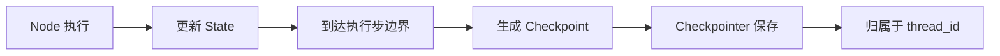
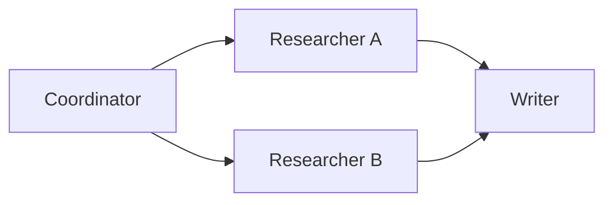
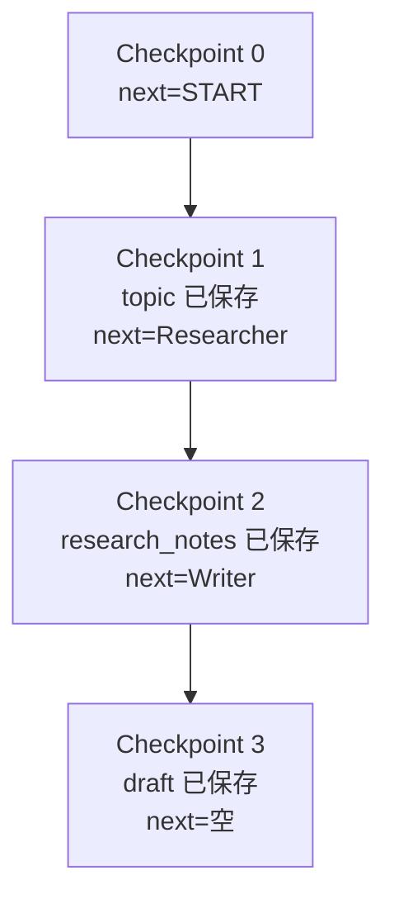
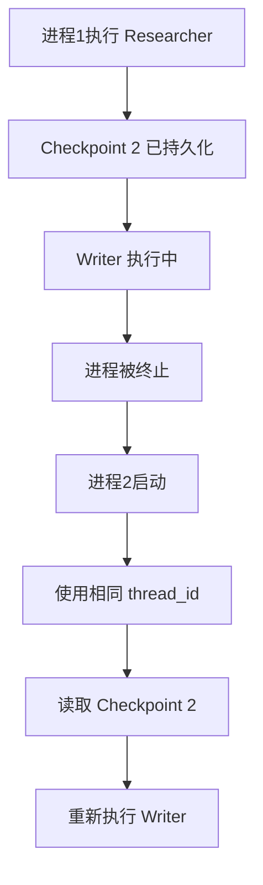
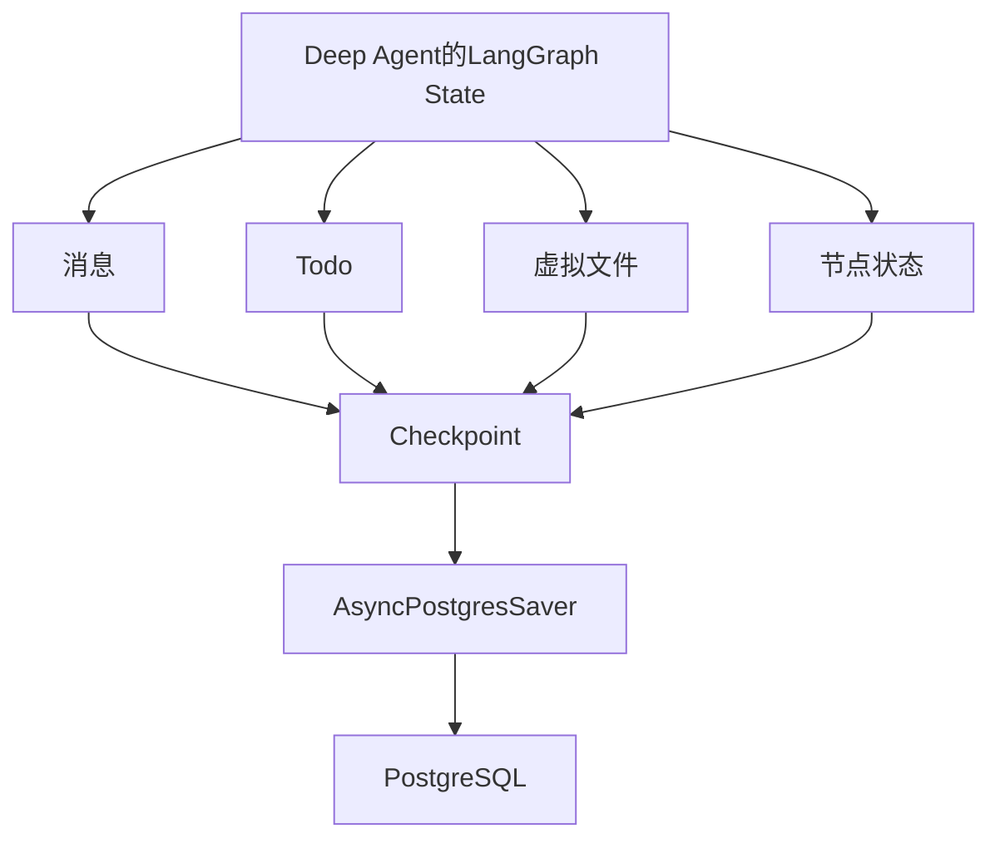

# Langgraph的Checkpoint机制讲解：

## 一、这一轮需要掌握的知识点

先暂时不考虑 PostgreSQL、Deep Agent 和加密。理解 LangGraph Checkpointer，只需要建立下面六个概念：

1. `State`：图当前拥有的数据。
2. `Node`：读取 State、执行工作、返回 State 更新的函数。
3. `Super-step`：LangGraph 的一次执行步。
4. `Checkpoint`：某个执行步结束时保存的 State 快照。
5. `Checkpointer`：负责保存和读取 Checkpoint 的组件。
6. `thread_id`：一组 Checkpoint 所属的执行线程标识。

它们的关系是：



LangGraph 在使用 Checkpointer 编译图后，会在执行步骤边界保存图状态，由此支持多轮记忆、人工中断、状态查看、故障恢复和历史回放。([Docs by LangChain](https://docs.langchain.com/oss/python/langgraph/checkpointers))

------

## 二、先理解 LangGraph 的 State

假设你有一个简化的文档生成工作流：


State 可以定义为：

```python
from typing_extensions import NotRequired, TypedDict


class DocumentState(TypedDict):
    topic: str
    research_notes: NotRequired[str]
    draft: NotRequired[str]
```

首次执行时，State 可能只有：

```python
{
    "topic": "RAG权限系统"
}
```

Researcher 返回：

```python
{
    "research_notes": "检索到的资料"
}
```

更新后，完整 State 变成：

```python
{
    "topic": "RAG权限系统",
    "research_notes": "检索到的资料"
}
```

Writer 再返回：

```python
{
    "draft": "最终草稿"
}
```

于是 State 变成：

```python
{
    "topic": "RAG权限系统",
    "research_notes": "检索到的资料",
    "draft": "最终草稿"
}
```

LangGraph 中的 State 是节点共享的数据结构；节点读取当前 State，并返回对 State 的局部更新，边则决定接下来执行哪个节点。([Docs by LangChain](https://docs.langchain.com/oss/python/langgraph/graph-api?utm_source=chatgpt.com))

------

## 三、Checkpoint 是什么

Checkpoint 可以理解为：

> 在图执行到某个稳定边界时，保存下来的一张 State 快照。

以上面的工作流为例，执行过程中可能形成这些快照：

```text
Checkpoint 0
State：{}
下一步：START

Checkpoint 1
State：{"topic": "RAG权限系统"}
下一步：Researcher

Checkpoint 2
State：{
    "topic": "RAG权限系统",
    "research_notes": "检索到的资料"
}
下一步：Writer

Checkpoint 3
State：{
    "topic": "RAG权限系统",
    "research_notes": "检索到的资料",
    "draft": "最终草稿"
}
下一步：无，图已结束
```

因此，Checkpoint 不只是保存“数据”，还要保存：

- 当前 State；
- 下一步应该执行哪些节点；
- 当前执行步；
- 哪个节点产生了哪些更新；
- 上一个 Checkpoint 是哪个；
- 是否存在错误或中断。

LangGraph 使用 `StateSnapshot` 表示一个 Checkpoint；其中包含 `values`、`next`、`config`、`metadata`、`parent_config` 和 `tasks` 等字段。([Docs by LangChain](https://docs.langchain.com/oss/python/langgraph/checkpointers))

------

## 四、Checkpointer 是什么

Checkpoint 和 Checkpointer 不是同一个概念：

```text
Checkpoint
= 一份状态快照

Checkpointer
= 保存、查询、删除这些状态快照的组件
```

可以类比为：

```text
State        = 白板上的当前内容
Checkpoint   = 给白板拍的一张照片
Checkpointer = 负责拍照和管理相册的人
thread_id    = 相册编号
checkpoint_id = 某张照片的编号
```

代码中：

```python
from langgraph.checkpoint.memory import InMemorySaver

checkpointer = InMemorySaver()
```

这里的 `InMemorySaver` 就是一种 Checkpointer。

然后把它交给图：

```python
graph = builder.compile(
    checkpointer=checkpointer,
)
```

从此以后，图执行时由 LangGraph Runtime 自动调用 Checkpointer 保存状态。普通业务代码通常不需要自己调用：

```python
checkpointer.put(...)
checkpointer.get_tuple(...)
```

这些属于 Checkpointer 的底层接口，LangGraph 会自动使用它们。官方 Checkpointer 接口包括保存 Checkpoint、保存节点中间写入、读取 Checkpoint、列出历史记录和删除线程等操作；异步图会调用相应的异步方法。([Docs by LangChain](https://docs.langchain.com/oss/python/langgraph/checkpointers))

------

## 五、`thread_id` 是什么

假设 Checkpointer 是一个相册系统，那么：

```text
thread_id = 相册编号
```

例如：

```python
config = {
    "configurable": {
        "thread_id": "document:task-001"
    }
}
```

后续所有 Checkpoint 都会保存到：

```text
document:task-001
```

这个线程下面。

如果另一个任务使用：

```python
config = {
    "configurable": {
        "thread_id": "document:task-002"
    }
}
```

它会拥有另一组完全独立的 Checkpoint：

```text
document:task-001
    ├── checkpoint A
    ├── checkpoint B
    └── checkpoint C

document:task-002
    ├── checkpoint D
    └── checkpoint E
```

Checkpointer 使用 `thread_id` 作为保存和读取 Checkpoint 的主要标识；没有 `thread_id`，它就不知道当前状态属于哪个任务，也无法找到应该恢复的状态。([Docs by LangChain](https://docs.langchain.com/oss/python/langgraph/checkpointers))

### `thread_id` 和 `checkpoint_id` 的区别

| 标识            | 作用                         |
| --------------- | ---------------------------- |
| `thread_id`     | 标识整个任务或会话           |
| `checkpoint_id` | 标识该任务中的某一次状态快照 |

例如：

```text
thread_id = document:task-001

checkpoint_id = cp-001
checkpoint_id = cp-002
checkpoint_id = cp-003
```

通常恢复最新状态时，只传 `thread_id`：

```python
config = {
    "configurable": {
        "thread_id": "document:task-001"
    }
}
```

如果要读取或回放某个历史状态，则同时传：

```python
config = {
    "configurable": {
        "thread_id": "document:task-001",
        "checkpoint_id": "某个历史checkpoint的ID",
    }
}
```

------

## 六、什么是 Super-step

这是理解“断点粒度”的关键。

LangGraph不是执行一行代码就保存一次，而是在 `super-step` 边界保存完整 Checkpoint。

对于顺序图：


大体可以理解为：

```text
Super-step 0：接收输入
Super-step 1：执行 Researcher
Super-step 2：执行 Writer
Super-step 3：执行 Reviewer
```

每个步骤结束后可以产生一个完整 Checkpoint。对于并行节点，同一轮中被调度的多个节点属于同一个 super-step；LangGraph还会分别持久化节点输出，使并行节点中的一个失败时，其他已经成功的节点不一定需要重跑。([Docs by LangChain](https://docs.langchain.com/oss/python/langgraph/checkpointers))

例如：



Researcher A 和 Researcher B 可能属于同一个 super-step：

```text
同一个 Super-step：
    Researcher A
    Researcher B
```

假设：

```text
Researcher A：成功
Researcher B：失败
```

LangGraph可以保存 A 已完成的 pending write。恢复该步骤时，不必重新运行 A，只重新执行未完成的 B。([Docs by LangChain](https://docs.langchain.com/oss/python/langgraph/checkpointers))

------

## 七、一个完整可运行的 Checkpointer 示例

可以临时创建：

```text
fast_app/checkpointer_demo.py
```

代码如下：

```python
from typing_extensions import NotRequired, TypedDict

from langgraph.checkpoint.memory import InMemorySaver
from langgraph.graph import END, START, StateGraph


class DocumentState(TypedDict):
    topic: str
    research_notes: NotRequired[str]
    draft: NotRequired[str]


def researcher(state: DocumentState) -> dict:
    print("执行 Researcher")

    return {
        "research_notes": f"已经收集关于《{state['topic']}》的资料"
    }


def writer(state: DocumentState) -> dict:
    print("执行 Writer")

    return {
        "draft": (
            f"主题：{state['topic']}\n"
            f"参考资料：{state['research_notes']}\n"
            "这是生成的文档草稿。"
        )
    }


# 1. 构建图
builder = StateGraph(DocumentState)

builder.add_node("researcher", researcher)
builder.add_node("writer", writer)

builder.add_edge(START, "researcher")
builder.add_edge("researcher", "writer")
builder.add_edge("writer", END)


# 2. 创建内存 Checkpointer
checkpointer = InMemorySaver()


# 3. 编译图时注入 Checkpointer
graph = builder.compile(
    checkpointer=checkpointer,
)


# 4. 为当前任务设置稳定的 thread_id
config = {
    "configurable": {
        "thread_id": "document:task-001"
    }
}


# 5. 首次执行
result = graph.invoke(
    {
        "topic": "RAG权限系统",
    },
    config=config,
)

print("\n最终结果：")
print(result)


# 6. 查询该线程的最新 Checkpoint
latest_state = graph.get_state(config)

print("\n最新 State：")
print(latest_state.values)

print("\n下一步节点：")
print(latest_state.next)

print("\n最新 checkpoint_id：")
print(
    latest_state.config["configurable"]["checkpoint_id"]
)


# 7. 查询该线程的完整 Checkpoint 历史
history = list(graph.get_state_history(config))

print("\nCheckpoint 历史：")

for snapshot in history:
    print("-" * 60)
    print("step:", snapshot.metadata["step"])
    print("values:", snapshot.values)
    print("next:", snapshot.next)
    print(
        "checkpoint_id:",
        snapshot.config["configurable"]["checkpoint_id"],
    )


# 8. 找到 Writer 执行之前的 Checkpoint
before_writer = next(
    snapshot
    for snapshot in history
    if snapshot.next == ("writer",)
)

print("\n从 Writer 之前的 Checkpoint 重新执行：")

replay_result = graph.invoke(
    None,
    config=before_writer.config,
)

print(replay_result)
```

运行：

```bash
python -m fast_app.checkpointer_demo
```

------

## 八、这个示例的执行过程

首次执行：

```text
执行 Researcher
执行 Writer
```

此时会形成一组 Checkpoint：



对于这种 `START → Researcher → Writer → END` 的顺序图，会在输入及各节点步骤边界形成完整状态快照；最终 Checkpoint 的 `next` 是空元组，表示图已经执行完毕。([Docs by LangChain](https://docs.langchain.com/oss/python/langgraph/checkpointers))

代码随后找到：

```python
before_writer = next(
    snapshot
    for snapshot in history
    if snapshot.next == ("writer",)
)
```

这个 Checkpoint 中：

```python
values = {
    "topic": "RAG权限系统",
    "research_notes": "已经收集关于《RAG权限系统》的资料",
}

next = ("writer",)
```

然后执行：

```python
graph.invoke(
    None,
    config=before_writer.config,
)
```

输出中会再次出现：

```text
执行 Writer
```

但不会再次出现：

```text
执行 Researcher
```

因为 Researcher 的结果已经存在于所选 Checkpoint 中；从历史 Checkpoint 回放时，Checkpoint 之前的节点不会重新执行，而之后的节点会重新执行。([Docs by LangChain](https://docs.langchain.com/oss/python/langgraph/use-time-travel))

------

## 九、`StateSnapshot` 中最重要的字段

调用：

```python
snapshot = graph.get_state(config)
```

得到的不是普通字典，而是 `StateSnapshot`。

### `values`

当前 Checkpoint 保存的完整 State：

```python
snapshot.values
```

例如：

```python
{
    "topic": "RAG权限系统",
    "research_notes": "已收集资料",
    "draft": "文档草稿",
}
```

### `next`

接下来要执行的节点：

```python
snapshot.next
```

例如：

```python
("writer",)
```

表示下一步执行 Writer。

如果是：

```python
()
```

表示图已结束，没有待执行节点。

### `config`

包含当前 Checkpoint 的标识：

```python
snapshot.config
```

类似：

```python
{
    "configurable": {
        "thread_id": "document:task-001",
        "checkpoint_ns": "",
        "checkpoint_id": "xxxx",
    }
}
```

### `metadata`

表示该 Checkpoint 来自哪一步，以及哪个节点写入了什么：

```python
snapshot.metadata
```

常见内容包括：

```python
{
    "source": "loop",
    "step": 1,
    "writes": {
        "researcher": {
            "research_notes": "已收集资料"
        }
    },
}
```

### `parent_config`

指向上一个 Checkpoint。

因此多个 Checkpoint 可以形成一条历史链：

```text
Checkpoint 3
    ↓ parent
Checkpoint 2
    ↓ parent
Checkpoint 1
    ↓ parent
Checkpoint 0
```

### `tasks`

记录该步骤要执行的任务，以及错误和中断信息。

如果节点失败，相关错误可能出现在这里。对于子图，还可能包含子图状态。([Docs by LangChain](https://docs.langchain.com/oss/python/langgraph/checkpointers))

------

## 十、`get_state()` 和 `get_state_history()` 的区别

### 查询最新状态

```python
latest = graph.get_state(config)
```

它根据 `thread_id` 返回最新 Checkpoint。

适合判断：

```text
任务当前执行到了哪里
是否还有下一节点
当前 State 是什么
是否存在错误或中断
```

### 查询全部历史

```python
history = list(
    graph.get_state_history(config)
)
```

它返回该线程中的全部 Checkpoint，而且默认顺序是：

```text
最新
↓
更早
↓
最早
```

也就是倒序排列。([Docs by LangChain](https://docs.langchain.com/oss/python/langgraph/checkpointers))

------

## 十一、四种容易混淆的调用方式

这是理解 Checkpointer 最重要的一部分。

### 情况一：新 `thread_id` 加初始输入

```python
graph.invoke(
    {"topic": "新任务"},
    {
        "configurable": {
            "thread_id": "document:task-002"
        }
    },
)
```

含义：

```text
创建一个新的执行线程
从初始输入开始运行
```

------

### 情况二：相同 `thread_id` 加新输入

```python
graph.invoke(
    {"topic": "追加的新输入"},
    config,
)
```

含义：

```text
读取该线程当前状态
把新输入作为新一轮 State 更新
继续执行图
```

这通常用于多轮对话。相同线程中的状态如何累积，还取决于 State 字段的 reducer，例如消息列表一般通过消息 reducer 累积，而普通字符串通常会被新值覆盖。Checkpointer提供的是线程级状态持久化，具体状态合并仍由 State schema 和 reducer 决定。([Docs by LangChain](https://docs.langchain.com/oss/python/langgraph/persistence))

------

### 情况三：相同 `thread_id` 加 `None`

```python
graph.invoke(
    None,
    config,
)
```

含义是：

```text
不要添加新的初始输入
读取当前线程已有状态
执行 Checkpoint 中尚未完成的下一节点
```

前提是最新 Checkpoint 中还有：

```python
snapshot.next != ()
```

例如：

```python
snapshot.next == ("writer",)
```

如果最新 Checkpoint 已经完成：

```python
snapshot.next == ()
```

那么从最终 Checkpoint继续通常没有新的节点可执行。

------

### 情况四：指定历史 `checkpoint_id` 加 `None`

```python
graph.invoke(
    None,
    old_snapshot.config,
)
```

含义是：

```text
从指定的历史 Checkpoint 开始回放
```

例如：

```text
Researcher 已完成
Writer 待执行
```

那么 Researcher 不再执行，Writer 重新执行。

官方把这种能力称为 replay；它不是读取缓存结果，而是真的重新执行 Checkpoint 之后的节点，所以后续 LLM、API 和工具调用可能产生不同结果。([Docs by LangChain](https://docs.langchain.com/oss/python/langgraph/use-time-travel))

------

## 十二、Checkpointer 不会保存“代码执行到哪一行”

这是必须纠正的一个常见误解。

假设 Writer 节点：

```python
def writer(state):
    notes = state["research_notes"]

    draft = call_llm(notes)

    result = format_document(draft)

    return {
        "draft": result,
    }
```

进程在这里崩溃：

```python
draft = call_llm(notes)
```

Checkpointer不会保存：

```text
writer.py 第37行
局部变量 notes
Python调用栈
函数执行了一半
```

它保存的是最近的图执行边界，例如：

```text
Researcher 已完成
Writer 待执行
```

恢复时，Writer 会从函数开头重新运行：

```python
def writer(state):
    # 从这里重新开始
```

而不是从：

```python
draft = call_llm(notes)
```

执行到一半的位置继续。

所以更准确的理解是：

> Checkpointer恢复的是“图状态和调度位置”，不是Python函数的执行栈。

LangGraph完整 Checkpoint 的恢复边界是 super-step 边界；节点内发生中断或失败时，未完成节点通常需要从节点开头重新执行。动态 `interrupt()` 恢复时，官方也明确说明节点会从头重新运行，因此中断之前的副作用必须考虑幂等性。([Docs by LangChain](https://docs.langchain.com/oss/python/langgraph/checkpointers))

------

## 十三、故障恢复是怎么发生的

假设当前有：

```text
Checkpoint 1：
输入已保存
下一步 Researcher

Checkpoint 2：
Researcher 结果已保存
下一步 Writer
```

Writer 执行到一半时，进程被终止：

```text
Writer 尚未返回结果
Writer 的完整 Checkpoint 尚未形成
```

重新启动后，只要：

1. 使用的是能跨进程持久化的 Checkpointer；
2. 重新构建了相同或兼容的图；
3. 使用相同 `thread_id`；
4. 最新 Checkpoint 没有损坏；

就可以读取：

```text
Checkpoint 2
```

其中已经包含：

```text
Researcher 结果
下一步 Writer
```

然后重新执行 Writer。



Checkpointer提供的故障容错能力，本质上就是从最后一个成功的持久化步骤恢复；如果并行 super-step 中已有其他节点成功，其 pending writes 也可以保留下来。([Docs by LangChain](https://docs.langchain.com/oss/python/langgraph/checkpointers))

------

## 十四、为什么 `InMemorySaver` 不能用于真正的进程重启恢复

当前示例使用：

```python
checkpointer = InMemorySaver()
```

它把 Checkpoint 保存在当前 Python 进程内存中。

因此：

```text
同一个进程内：
可以查询、回放和测试恢复

Python进程退出：
所有 Checkpoint 消失
```

官方将 `InMemorySaver` 定位为测试和调试用途；生产环境建议使用 PostgreSQL 等持久化实现。([LangChain Reference Docs](https://reference.langchain.com/python/langgraph.checkpoint/memory/InMemorySaver?utm_source=chatgpt.com))

对比：

| Checkpointer         | 保存位置    | 进程退出后是否存在 |
| -------------------- | ----------- | ------------------ |
| `InMemorySaver`      | Python 内存 | 不存在             |
| `SqliteSaver`        | SQLite 文件 | 存在               |
| `PostgresSaver`      | PostgreSQL  | 存在               |
| `AsyncPostgresSaver` | PostgreSQL  | 存在               |

它们对 LangGraph 提供相同类型的 Checkpointer 接口，主要区别是底层存储位置、同步异步方式和生产能力。([Docs by LangChain](https://docs.langchain.com/oss/python/langgraph/checkpointers))

------

## 十五、Checkpointer 和 Store 不是一回事

先只记住下面的区别：

```text
Checkpointer
保存 LangGraph State
按照 thread_id 组织
用于恢复当前工作流

Store
保存应用自己定义的数据
可以跨 thread 读取
用于长期记忆或业务元数据
```

例如：

```text
Checkpointer：
    messages
    todos
    draft
    当前节点
    下一节点

Store：
    用户偏好
    ACL fingerprint
    文档 SHA
    服务端恢复元数据
```

LangGraph官方将 Checkpointer定位为线程级、短期状态持久化，将 Store定位为图状态之外、由应用定义的跨线程数据存储。([Docs by LangChain](https://docs.langchain.com/oss/python/langgraph/persistence))

这也是 Codex 方案同时使用：

```text
AsyncPostgresSaver
AsyncPostgresStore
```

的原因，但 Store 可以等 Checkpointer 完全掌握后再学习。

------

## 十六、与你的 Deep Agent 方案对应起来

现在可以先理解计划中的这一段：

```text
StateBackend 虚拟文件
+ Coordinator/SubAgent 消息和 Todo
+ LangGraph 节点执行状态
→ AsyncPostgresSaver
```

它表达的是：



`AsyncPostgresSaver` 并不是只保存“当前执行到了哪个节点”，而是保存整个图的可持久化 State 以及执行调度信息。

计划中的：

```python
thread_id = f"document:{task_plan_id}"
```

意思是：

```text
一个 TaskPlan
=
一个稳定的 LangGraph Thread
=
一组连续的 Checkpoint
```

计划中的首次调用：

```python
await graph.ainvoke(
    initial_state,
    config,
)
```

意思是：

```text
用初始 State 创建并执行该线程
```

计划中的恢复调用：

```python
await graph.ainvoke(
    None,
    config,
)
```

意思是：

```text
不加入新的初始输入
通过相同 thread_id 读取已有 State
执行最新 Checkpoint 中尚未完成的节点
```

------

## 十七、Codex 方案还需要明确 `durability` 模式

当前 LangGraph提供三种持久化时机：

| 模式    | 保存时机             | 崩溃恢复能力                       |
| ------- | -------------------- | ---------------------------------- |
| `exit`  | 图退出时保存         | 不能可靠恢复执行中间状态           |
| `async` | 下一步执行时异步保存 | 性能较好，但存在很小的崩溃丢失窗口 |
| `sync`  | 下一步开始前同步保存 | 持久性最强，但开销更高             |

如果你的目标是：

```text
Writer 已完成后，必须保证 Writer Checkpoint 落库，
然后才能进入 Reviewer
```

那么最强的方式是：

```python
await graph.ainvoke(
    initial_state,
    config=config,
    durability="sync",
)
```

官方说明，`sync` 会在下一步开始前同步写入 Checkpoint；`async` 会边执行下一步边保存，存在进程恰好崩溃时尚未写入的窗口；`exit` 只在图退出时持久化，不适合中途进程崩溃恢复。([Docs by LangChain](https://docs.langchain.com/oss/python/langgraph/checkpointers))

因此，Codex 的计划虽然写了：

```text
LangGraph 会在图执行步骤边界保存状态
```

但实现时还应明确：

```text
Deep Document Agent 使用哪一种 durability 模式
```

这是断点恢复可靠性的重要配置。

------

## 十八、最终建立正确的心智模型

你现在可以这样理解整个 Checkpointer：

```text
State
= 图当前的数据

Node
= 读取并更新 State 的工作单元

Super-step
= 一轮节点执行

Checkpoint
= 某个执行步边界保存的 StateSnapshot

Checkpointer
= 保存、读取、列出和删除 Checkpoint 的组件

thread_id
= 一整个任务的稳定标识

checkpoint_id
= 该任务中某一次状态快照的标识

恢复
= 加载某个 Checkpoint，
  根据其中的 next 重新调度尚未完成的节点
```

最关键的一句话是：

> **Checkpointer不是保存Python代码执行到哪一行，而是在LangGraph执行步骤边界保存完整State和下一步调度信息；恢复时，已经保存完成的节点可以跳过，未完成的节点从头重新执行。**

# 【Plan】Deep Agent 虚拟工作区持久化与断点恢复计划（持久化模式修订版）

## 方案摘要

继续使用 Deep Agents 的 `StateBackend`，接入加密 PostgreSQL Checkpointer：

```text
StateBackend 虚拟文件
+ Coordinator/SubAgent 消息
+ Todo
+ LangGraph 节点状态
→ Encrypted AsyncPostgresSaver
```

恢复继续通过现有接口手动触发：

```text
POST /agent/task-plans/{task_plan_id}/retry
```

本方案明确选择：

```text
异步 Checkpointer：AsyncPostgresSaver
异步图调用：await graph.ainvoke(...)
LangGraph durability：sync
```

这里的 `AsyncPostgresSaver` 和 `durability="sync"` 不冲突：

- `AsyncPostgresSaver` 表示使用异步数据库 API，不阻塞 FastAPI 事件循环。
- `durability="sync"` 表示每个 LangGraph Step 完成后，必须等待异步 Checkpoint 写入成功，才能执行下一步。

## 1. PostgreSQL Checkpoint 基础设施

新增 `document_checkpoint_store.py`，统一封装：

- `AsyncPostgresSaver`：保存加密的 LangGraph State 和 `StateBackend.files`。
- `AsyncPostgresStore`：保存服务端可信恢复元数据，不保存正文。
- `thread_id = "document:{task_plan_id}"`。
- Saver/Store 官方 `setup()`。
- 创建、读取、更新、删除和过期清理。
- Store 记录版本校验。

应用 lifespan 创建一个共享实例并放入 `app.state`；依赖层注入 `DeepDocumentAgent` 和 `DocumentTaskExecutor`。

增加依赖：

```text
langgraph-checkpoint-postgres==3.1.0
psycopg[binary,pool]==3.3.4
pycryptodome==3.23.0
```

官方 Saver/Store 自行维护内部表，不为这些表新增项目 Alembic Migration。

## 2. LangGraph 持久化模式选择

### 选择 `durability="sync"`

首次执行和恢复执行都必须显式传入：

```python
result = await graph.ainvoke(
    initial_state,
    config=langchain_config,
    durability="sync",
)
```

恢复时：

```python
result = await graph.ainvoke(
    None,
    config=langchain_config,
    durability="sync",
)
```

三种模式区别：

| 模式    | 行为                                                | 是否适合本任务 |
| ------- | --------------------------------------------------- | -------------- |
| `sync`  | 当前 Step 的 Checkpoint 写入成功后，才开始下一 Step | 采用           |
| `async` | 下一 Step 可以与上一步 Checkpoint 写入并行          | 不采用         |
| `exit`  | 只在整张图退出时保存                                | 禁止           |

选择 `sync` 的原因：

- 文档任务包含长正文、高成本 LLM 和多个 SubAgent。
- 本次修复目标就是减少进程突然退出时丢失已完成工作的风险。
- `async` 模式下，节点已经完成但数据库写入仍在后台进行时，进程退出仍可能丢失最近一步。
- `exit` 模式无法处理中途崩溃，与本次目标直接冲突。
- `sync` 增加每个 Step 一次数据库写入等待，但比重新运行 Retriever、Writer、Reviewer 和 LLM 的成本更低。

LangGraph 官方定义 `sync` 会在下一步开始前完成 Checkpoint 写入，`async` 是默认后台写入，`exit` 只在图结束时写入。[LangGraph Persistence](https://docs.langchain.com/oss/python/langgraph/persistence)、[Thinking in LangGraph](https://docs.langchain.com/oss/python/langgraph/thinking-in-langgraph)

实现约束：

- 不新增可切换的环境配置，生产代码固定使用 `sync`。
- 不允许调用方通过 `RunnableConfig` 覆盖 durability。
- 测试替身也必须验证 `durability="sync"` 被显式传入。
- Store 的可信事实更新继续使用 `await store.aput(...)` 并等待完成。

## 3. 密钥格式和反序列化安全

新增配置：

```text
LANGGRAPH_AES_KEY_BASE64
AGENT_DOCUMENT_CHECKPOINT_RETENTION_DAYS=7
```

启动时严格执行：

```python
raw_key = base64.b64decode(
    settings.langgraph_aes_key_base64.get_secret_value(),
    validate=True,
)

if len(raw_key) != 32:
    raise ValueError("LANGGRAPH_AES_KEY_BASE64 解码后必须恰好为32字节")
```

创建 Serializer：

```python
EncryptedSerializer.from_pycryptodome_aes(
    serde=JsonPlusSerializer(
        pickle_fallback=False,
        allowed_msgpack_modules=None,
    ),
    key=raw_key,
)
```

规则：

- 不使用容易混淆字符数和字节数的 `LANGGRAPH_AES_KEY`。
- Base64 文本长度不作为判断依据，只检查解码后的二进制长度。
- Base64 格式错误、Padding 错误或解码后不是32字节时启动失败。
- 文档 Agent 启用时缺少密钥，禁止退回内存或明文模式。
- Key 不进入日志、TaskPlan、API、LangSmith或异常正文。
- 更换 Key 前必须完成或清理旧 Checkpoint；本阶段不实现多 Key 轮换。

PowerShell 生成方式：

```powershell
.\.venv\Scripts\python.exe -c "import base64,secrets; print(base64.b64encode(secrets.token_bytes(32)).decode('ascii'))"
```

## 4. 同 TaskPlan 进程内并发保护

增加进程级注册表：

```python
task_plan_id -> asyncio.Lock
```

由于 FastAPI 会为不同请求构造不同 Executor，锁注册表不能保存在单个 Executor 实例中。

锁规则：

- `resume/retry`、`confirm` 和同一 TaskPlan 的 agentic execute 使用同一把锁。
- `cancel` 不等待该锁，保证运行中的任务可以及时收到取消信号。
- 必须先取得锁，再重新加载 TaskPlan 和判断状态。
- 锁范围覆盖：
  - TaskPlan 重新加载。
  - 用户和状态检查。
  - Checkpoint 恢复。
  - Deep Agent 执行。
  - TaskPlan 最终保存。
  - Checkpoint 更新或释放。
- 第二个并发请求发现锁被占用时立即返回：
  - HTTP `409`
  - `AGENT_TASK_PLAN_BUSY`
- 第二个请求不排队，避免第一个失败后又自动执行一次外部模型调用。
- 文档链路原 `_ACTIVE_DOCUMENT_TASK_PLAN_IDS` 由锁注册表替代。
- Research 链路并发保护本轮不改。

锁注册表保存引用计数；任务结束、没有持有者时删除 Lock，防止长期内存增长。

## 5. Deep Agent 首次执行与恢复

生产 agentic 链路不允许 `checkpointer=None`。

首次执行：

```text
获取 TaskPlan Lock
→ 保存 TaskPlan running
→ 创建 PostgreSQL runtime record
→ create_deep_agent(checkpointer=AsyncPostgresSaver)
→ graph.ainvoke(initial_state, durability="sync")
```

恢复：

```text
获取 TaskPlan Lock
→ 重新加载 TaskPlan
→ 重新鉴权
→ 加载 runtime record
→ 校验版本、ACL 和源文档 SHA
→ graph.ainvoke(None, durability="sync")
```

`RunnableConfig`：

- 保留现有 callbacks、tags、metadata。
- 服务端写入 `configurable.thread_id`。
- 不允许 HTTP、模型或调用方覆盖 thread ID。
- 同一 TaskPlan 始终使用相同 thread ID。

恢复粒度：

- 已同步写入 PostgreSQL 的 Step 不重新执行。
- 已提交的虚拟文件、消息和 Todo 恢复。
- 中断发生在当前 LLM/Tool 调用内部时，只重新执行尚未形成 Checkpoint 的调用。
- 声明式 SubAgent 使用父图继承的 per-invocation Checkpointer。
- Deep Agent 已完成但外层 TaskPlan 尚未保存时，retry 读取最终图状态并重新执行规则校验，不重新生成正文。

## 6. 服务端可信恢复记录和版本字段

必须持久化当前仅存在于闭包中的：

```text
candidates
read_snapshots
used_tools
```

Store 记录：

```json
{
  "schema_version": 1,
  "record_version": 1,
  "task_plan_id": "task_plan_xxx",
  "thread_id": "document:task_plan_xxx",
  "acl_fingerprint": "...",
  "candidates": {},
  "read_snapshots": {},
  "used_tools": [],
  "resume_count": 0,
  "status": "active",
  "expires_at": "..."
}
```

字段职责：

- `schema_version`：Store JSON 结构版本。
- `record_version`：同一记录的更新版本，为未来乐观锁准备。

更新流程：

```text
读取记录
→ 校验 expected_record_version
→ 应用更新
→ record_version + 1
→ await Store 写入完成
```

当前并发保证：

- 外层 TaskPlan Lock 防止两个执行流程并发。
- 当前 Deep Agent run 内使用共享 `asyncio.Lock`，串行化并行工具的 Store 更新。
- 版本不匹配返回：
  `DOCUMENT_AGENT_CHECKPOINT_CONFLICT`。

Store 不保存 `read_snapshots.content`，只保存：

```text
doc_id
source_path
sha256
```

完整正文只存在：

- 加密的 LangGraph Checkpoint。
- 等待确认阶段的现有 TaskPlan JSON。

恢复时重新读取真实文件，SHA 相同才重建 `DocumentReadSnapshot.content`。

## 7. ACL、源文件和兼容恢复

ACL fingerprint 包含：

```text
user_id
role
permissions
department_codes
can_read_all
source_path filter
section_path filter
```

恢复规则：

- fingerprint 相同：恢复。
- fingerprint 变化：删除旧 Checkpoint，使用当前权限从头执行，记录 `acl_changed`。
- 当前用户无权限：直接拒绝。

源文档：

- SHA 相同：恢复读取快照。
- SHA 不同或文件不存在：废弃旧 Checkpoint，从当前文档重新开始，记录 `source_changed`。
- 不允许旧草稿继续基于已变化原文执行 dry-run。

异常兼容：

- 新任务声明有 Checkpoint，但 PostgreSQL 中缺失、损坏或无法解密：
  `DOCUMENT_AGENT_CHECKPOINT_UNAVAILABLE`。
- 不允许静默从头运行。
- 历史 TaskPlan 没有 Checkpoint 元数据：保留原完整重跑行为，记录 `legacy_checkpoint_missing`。

## 8. TaskPlan 状态和清理

`final_output` 增加：

```text
deep_agent_checkpoint:
  status: active | resumable | released | invalidated | cleanup_pending
  durability: sync
  resume_count
  resumed_from_checkpoint
  record_version
  retained_until?
  invalidation_reason?
```

不返回：

- 加密内容。
- candidates/read_snapshots。
- Store Namespace。
- 数据库表名。

异常：

- 普通模型、工具、超时或请求中断：TaskPlan 为 `failed`，Checkpoint 为 `resumable`。
- 强制终止进程：TaskPlan 可能保持 `running`，最近同步完成的 Step 仍可恢复。
- 权限、安全和 Checkpoint 持久化失败属于任务级失败。
- `durability="sync"` 下 Checkpoint 写入失败时不得继续启动下一节点。

清理顺序：

```text
生成 approved_changes
→ 原子保存 waiting_confirmation TaskPlan
→ 确认完整正文已保存
→ 删除 LangGraph thread
→ 删除 Store runtime record
→ checkpoint.status=released
```

保留策略：

- `waiting_confirmation/completed/cancelled`：立即释放。
- `running/failed`：保留7天。
- 应用启动时清理过期 runtime record。
- 先成功执行 `adelete_thread()`，再删除 Store record。
- 清理失败保留记录并标记 `cleanup_pending`。

等待确认阶段继续使用：

```text
TaskPlan JSON
steps[].output.action_request.content
```

本轮不改变 confirm API 和 React 数据契约。

## 9. 测试与验收

### Durability

- Spy Checkpointer 延迟 `aput()`。
- 断言 `durability="sync"` 下，Checkpoint 未完成时下一节点不会启动。
- 断言首次执行与 retry 都显式传入 `sync`。
- 断言代码中没有为 Deep Agent 使用 `async` 或 `exit`。
- 节点返回后强制终止进程，重启后能恢复该节点结果。
- Checkpoint 写入失败时任务失败，后续 LLM/Tool 不执行。

### 并发保护

- 两个并发 `/retry` 只有一个进入执行。
- 另一个立即返回 `409 AGENT_TASK_PLAN_BUSY`。
- retry 与 confirm 并发时同样只有一个进入。
- cancel 在任务持锁期间仍可生效。
- 任务结束后 Lock 注册项被删除。

### Key 与加密

- 合法32字节 Base64 Key 可启动。
- 非法 Base64、错误 Padding、解码后非32字节均被拒绝。
- PostgreSQL 中搜索不到唯一正文明文。
- 错误 Key 无法恢复并返回稳定错误。
- 日志、API、TaskPlan 不包含 Key。

### Store 版本

- 初始 `record_version=1`。
- 每次更新严格加一。
- 并行工具更新无字段丢失。
- expected version 不一致时返回冲突错误。
- 不支持的 `schema_version` 拒绝恢复。

### 中断恢复

分别在以下阶段中断：

- Researcher 已检索。
- 原文已读取。
- Writer 已生成草稿。
- Reviewer 已完成。
- Deep Agent 已完成但 TaskPlan 尚未保存。

重建 Saver、Store、Executor 和 Deep Agent 后调用 `/retry`，验证：

- thread ID 稳定。
- 虚拟文件和 Todo 存在。
- 已同步完成的工具和 LLM 不重复调用。
- 服务端可信事实恢复正确。
- 最终进入 `waiting_confirmation`。
- confirm 能完成真实文件和 ES/Milvus 写入。

### 清理和回归

- failed/running 7天内可恢复。
- 过期记录在启动时清理。
- waiting_confirmation/cancelled 立即释放。
- direct Tool Loop、Research 多 Agent、OpenAPI、SSE、Schema description、LangSmith、编译和 `git diff --check` 回归通过。

## 已确定默认决策

- 使用现有 PostgreSQL。
- 使用 `AsyncPostgresSaver` 和异步 `ainvoke()`。
- LangGraph durability 固定为 `sync`。
- 不允许改为默认 `async` 或 `exit`。
- 继续使用 `StateBackend`。
- 使用官方 Saver/Store，不设计自有 Checkpoint 表。
- 使用 `LANGGRAPH_AES_KEY_BASE64`，解码后必须恰好32字节。
- Checkpoint 必须加密，不允许降级。
- `/retry` 保持人工触发。
- 同任务使用进程级 `task_plan_id -> asyncio.Lock`，冲突立即返回409。
- Store 使用 `schema_version` 和递增的 `record_version`。
- 当前不实现跨进程租约；多 Worker 前再增加 PostgreSQL CAS 或任务租约。
- 等待确认后的 TaskPlan JSON 契约保持不变。