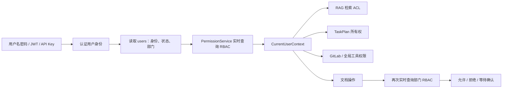
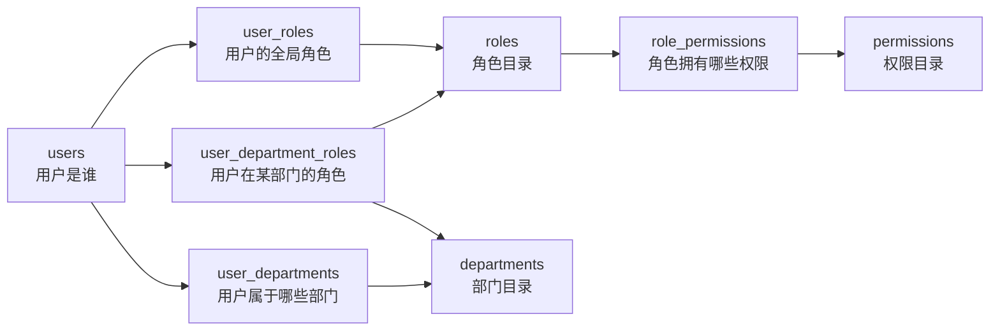

# 问题十四：旧权限模块代码残留

# 问题描述：

permissions_json 不是“没有意义”，而是“遗留的直接权限存储仍被使用，但与 RBAC 重叠”。因此不能直接删除，否则会改变权限行为。

直接删除会破坏：

- `"*"`：GitLab 管理接口、RAG 全库读取。
- `"knowledge:read:all"`：RAG 跨部门检索、GitLab 全部变更可见。
- `"agent:tool:web_search"`：Web Search 工具注入。
- `"agent:tool:mcp"`：MCP 工具注入。

相关消费点包括：

- [knowledge_permission_policy.py (line 19)](/D:/AI_Agent_Project/AI_Python_Project/python-agent-study/src/fast_app/services/knowledge/knowledge_permission_policy.py:19)
- [gitlab_routes.py (line 223)](/D:/AI_Agent_Project/AI_Python_Project/python-agent-study/src/fast_app/api/gitlab_routes.py:223)
- [document_task_executor.py (line 1428)](/D:/AI_Agent_Project/AI_Python_Project/python-agent-study/src/fast_app/services/agent_tasks/document_task_executor.py:1428)
- [deep_document_agent.py (line 2004)](/D:/AI_Agent_Project/AI_Python_Project/python-agent-study/src/fast_app/services/agent_tasks/deep_document_agent.py:2004)

更合理的结论是：

> 可以最终移除 `users.permissions_json`，但必须先把它仍承担的权限迁移到现有 RBAC。

现有 RBAC 已经包含：

```
agent:tool:web_search
agent:tool:mcp
agent:tool:calculator
knowledge:document:*
```

种子位于 [20260704_0005_create_agent_tool_permission_tables.py (line 19)](/D:/AI_Agent_Project/AI_Python_Project/python-agent-study/alembic/versions/20260704_0005_create_agent_tool_permission_tables.py:19)。

但目前还缺少规范化权限：

```
knowledge:read:all
GitLab 管理权限
GitLab 变更全量读取权限
```

建议的最短迁移顺序：

1. 在 `permissions` 表补充 `knowledge:read:all` 和明确的 GitLab 权限，例如 `gitlab:source:manage`。
2. 把现有用户 `permissions_json` 数据迁移成 `user_roles` / `role_permissions`。
3. 将 RAG、GitLab、Web Search、MCP 判断统一改为 `PermissionService`。
4. 验证管理员、跨部门读取、工具注入和普通部门用户。
5. 删除 `--permission` 参数、JWT permissions claim、模型映射和 `permissions_json` 列。

`CurrentUserContext.permissions` 可以保留，但应改成认证阶段计算出的全局 RBAC 权限快照；高风险文档操作仍需执行前实时查询 RBAC。这样既不保留 JSON 双写，也不用让每个普通读取判断重复查库。

# 修复后的改造：

结论先说：**登录认证方式变化不大，但登录之后“能做什么”的授权机制变化很大。**

以前是“旧粗粒度权限 + 新精细 RBAC”两套来源并存；现在数据库用户的权限统一以 RBAC 表为唯一事实来源。

## 一、整体链路变化



核心变化是：

```
旧版：
users.role + users.permissions_json
        与
roles / role_permissions / user_department_roles
两套权限来源并存

新版：
user_roles / user_department_roles
        ↓
roles
        ↓
role_permissions
        ↓
permissions
唯一权限来源
```

------

## 二、登录和 JWT 链路

### 旧版本

用户登录成功后：

1. 从 `users` 表读取 `role`。
2. 从 `users.permissions_json` 读取权限数组。
3. 把 `role`、`permissions` 都写入 JWT。
4. 后续请求直接相信 JWT 中的权限。

旧 JWT 大致相当于：

```json
{
  "sub": "user_xxx",
  "role": "admin",
  "permissions": [
    "knowledge:read:all",
    "agent:tool:web_search"
  ]
}
```

问题是权限会变成过期快照。

例如管理员撤销某用户的权限后，只要旧 JWT 没过期，用户仍可能继续使用旧权限。

### 新版本

现在 JWT 只保存身份信息：

```json
{
  "sub": "user_xxx",
  "jti": "token_xxx",
  "iss": "...",
  "aud": "...",
  "iat": 123,
  "exp": 456
}
```

`role` 和 `permissions` 已经从 JWT 删除，代码在 [jwt_service.py (line 24)](/D:/AI_Agent_Project/AI_Python_Project/python-agent-study/src/fast_app/services/auth/jwt_service.py:24)。

每次使用 JWT 请求时：

1. 校验 JWT 签名、有效期、签发方。
2. 根据 `sub` 重新查询用户。
3. 检查用户是否存在、是否被禁用。
4. 调用 `PermissionService` 实时展开 RBAC。
5. 构造本次请求的 `CurrentUserContext`。

对应入口在 [auth_service.py (line 153)](/D:/AI_Agent_Project/AI_Python_Project/python-agent-study/src/fast_app/services/auth/auth_service.py:153)。

因此现在：

- 删除用户：旧 JWT 立即无法继续使用。
- 禁用用户：旧 JWT 立即被拒绝。
- 撤销角色：同一枚 JWT 下一次请求就失去权限。
- 新增角色：同一枚 JWT 下一次请求就获得权限。
- 不需要等待 JWT 过期或重新登录。

刚才创建测试账号时，特意采用了“先登录拿到 JWT，再绑定角色，然后使用同一 JWT 认证”的顺序，已经验证权限能够实时生效。

------

## 三、`CurrentUserContext` 的变化

### 旧版结构

```json
CurrentUserContext(
    user_id="...",
    role="admin",
    permissions=["*", "knowledge:read:all"],
)
```

它的问题是：

- `role` 只能表达一个粗粒度角色。
- `permissions` 来自 `permissions_json`。
- 允许使用 `"*"` 代表全部权限。
- 无法准确表达“某人在开发部是编辑者、在美术部是只读者”。
- 容易和精细 RBAC 查询结果冲突。

### 新版结构

```json
CurrentUserContext(
    user_id="...",
    global_role_codes=["gitlab_manager"],
    global_permission_codes=[
        "gitlab:source:manage",
        "gitlab:change:read_all",
    ],
    department_codes=["development"],
)
```

现在分成：

- `global_role_codes`：用户的全局角色。
- `global_permission_codes`：全局角色实时展开的权限。
- `department_codes`：用户所属或可访问部门。
- 部门角色和部门权限不直接塞入上下文，而是在文档操作时重新查询。

对应模型在 [user_context.py (line 8)](/D:/AI_Agent_Project/AI_Python_Project/python-agent-study/src/fast_app/domain/user_context.py:8)。

而且增加了：

```
model_config = ConfigDict(extra="forbid")
```

因此旧代码再传：

```
role="admin"
permissions=["*"]
```

会直接触发模型校验错误，不会被悄悄忽略。

------

## 四、RBAC 权限如何展开

当前有两种作用域。

### 1. 全局角色

关系链：

```
users
  → user_roles
  → roles
  → role_permissions
  → permissions
```

例如：

```
rbac_operator
  → knowledge_global_reader
  → knowledge:read:all
```

或者：

```
rbac_operator
  → gitlab_manager
  → gitlab:source:manage
  → gitlab:change:read_all
```

### 2. 部门角色

关系链：

```
users
  → user_department_roles
  → department_code
  → roles
  → role_permissions
  → permissions
```

例如：

```
某用户 + development
  → department_editor
  → knowledge:document:read
  → knowledge:document:update
```

`PermissionService` 同时查询这两组关系并生成 `EffectivePermissionSet`，代码在 [permission_service.py (line 17)](/D:/AI_Agent_Project/AI_Python_Project/python-agent-study/src/fast_app/services/auth/permission_service.py:17)。

这意味着同一个用户可以同时拥有：

```
development → department_document_manager
art         → department_reader
全局         → agent_tool_operator
```

旧 `users.role` 无法表达这种组合。

------

## 五、RAG 检索链路

RAG 检索仍然由 `KnowledgePermissionPolicy` 生成服务端 ACL，但权限来源变了。

### 旧版

```json
can_read_all = (
    user.role == "admin"
    or "*" in user.permissions
    or "knowledge:read:all" in user.permissions
)
```

### 新版

```json
can_read_all = (
    user.has_global_role("system_admin")
    or user.has_global_permission("knowledge:read:all")
)
```

代码在 [knowledge_permission_policy.py (line 13)](/D:/AI_Agent_Project/AI_Python_Project/python-agent-study/src/fast_app/services/knowledge/knowledge_permission_policy.py:13)。

普通员工生成的检索范围类似：

```json
RetrievalPermissionScope(
    can_read_all=False,
    user_id="user_xxx",
    department_codes=["development"],
    allow_public=True,
)
```

全局知识库读者和管理员则是：

```json
RetrievalPermissionScope(
    can_read_all=True,
    user_id="user_xxx",
    department_codes=[],
    allow_public=True,
)
```

所以前端传入：

```
{
  "can_read_all": true,
  "department_codes": ["art"]
}
```

也不能自行扩大权限，因为最终范围由后端 `CurrentUserContext` 生成。

------

## 六、文档创建、更新、删除链路

这条链路原本就已经使用精细 RBAC。本次主要变化是：**删除旧管理员兼容判断，只认数据库 RBAC。**

文档操作时不会只相信登录阶段的上下文，而是调用：

```
PermissionService.get_effective_permissions(user.user_id)
```

重新查询：

- 用户在哪个部门有什么角色。
- 目标文档属于哪个部门。
- 该角色是否拥有当前操作权限。
- 确认执行时是否还拥有 `approve` 权限。

代码入口在 [agent_tool_permission_service.py (line 42)](/D:/AI_Agent_Project/AI_Python_Project/python-agent-study/src/fast_app/services/agent_tasks/agent_tool_permission_service.py:42)。

例如开发部编辑者更新开发部文档：

```
目标部门：development
操作：update
部门角色：department_editor
权限：knowledge:document:update
结果：confirmation_required
```

编辑者确认执行时：

```
还需要：knowledge:document:approve
编辑者没有 approve
结果：deny
```

部门文档管理员确认执行：

```
department_document_manager
拥有 update/delete/create/approve
结果：execute_allowed
```

管理员仍然可以跨部门操作，但不会绕过高风险确认流程：

```
system_admin
  → 权限通过
  → 高风险操作仍返回 confirmation_required
```

因此“管理员全权限”和“操作需要人工确认”是两个不同维度。

------

## 七、知识导入链路

知识导入接口会根据导入任务的目标部门实时查询部门权限。

旧版本存在两个管理员来源：

```
user.role == "admin"
```

或者：

```
effective.has_global_role("system_admin")
```

现在只保留：

```
effective.has_global_role("system_admin")
```

普通用户则必须在目标部门拥有对应的：

- `knowledge:document:create`
- `knowledge:document:update`
- `knowledge:document:delete`

代码在 [knowledge_import_routes.py (line 538)](/D:/AI_Agent_Project/AI_Python_Project/python-agent-study/src/fast_app/api/knowledge_import_routes.py:538)。

------

## 八、TaskPlan 和 Deep Document Agent 链路

变化主要有三处。

### TaskPlan 所有权

以前：

```
plan.user_id == user.user_id
or user.role == "admin"
```

现在：

```
plan.user_id == user.user_id
or user.has_global_role("system_admin")
```

因此管理员身份必须来自 `user_roles → system_admin`。

### Agent 内部 RAG 检索

TaskPlan 执行过程中重新生成检索 ACL：

```
system_admin
or knowledge:read:all
```

不再识别 `permissions_json` 和 `"*"`。

### 可选工具展示

Calculator、Web Search、MCP 等工具是否提供给 Agent，现在检查：

```
system_admin
or user.has_global_permission(permission)
```

但“把工具展示给模型”并不代表最终执行必然通过；执行阶段仍需经过工具权限网关。

------

## 九、GitLab 权限链路

GitLab 权限从模糊的“管理员或 `*`”拆成了明确权限。

### 管理 GitLab 文档源

需要：

```
system_admin
或
gitlab:source:manage
```

### 跨部门查看所有 GitLab 变更

需要：

```
system_admin
或
gitlab:change:read_all
```

否则只能读取：

- public 变更；
- 自己创建的变更；
- 自己部门范围内的变更。

代码在 [gitlab_routes.py (line 223)](/D:/AI_Agent_Project/AI_Python_Project/python-agent-study/src/fast_app/api/gitlab_routes.py:223)。

这使得“GitLab 管理员”不必同时成为整个系统的超级管理员。

------

## 十、前端和接口返回变化

`GET /auth/me` 的返回结构发生了不兼容变化。

旧版：

```
{
  "role": "admin",
  "permissions": ["*"]
}
```

新版：

```
{
  "global_role_codes": ["system_admin"],
  "global_permission_codes": [
    "knowledge:read:all",
    "gitlab:source:manage"
  ],
  "department_codes": []
}
```

对应 Schema 在 [auth_schema.py (line 43)](/D:/AI_Agent_Project/AI_Python_Project/python-agent-study/src/fast_app/schemas/auth_schema.py:43)。

因此 React 前端如果还读取：

```
currentUser.role
currentUser.permissions
```

需要改成：

```
currentUser.global_role_codes
currentUser.global_permission_codes
```

------

## 十一、区别到底大不大？

可以分三层理解：

| 层面               | 变化大小 | 说明                                                         |
| ------------------ | -------- | ------------------------------------------------------------ |
| 用户登录体验       | 小       | 仍然是用户名密码登录、JWT、Refresh Token、API Key            |
| API 数据结构       | 中等     | `/auth/me` 的角色和权限字段发生变化                          |
| 后端权限架构       | 很大     | 从两套权限来源变成统一 RBAC，JWT 不再携带权限                |
| 文档精细权限算法   | 不大     | 原本已经实时查询 RBAC，本次主要删除旧管理员兼容分支          |
| 权限实时性与安全性 | 很大     | 撤销角色无需等待 JWT 失效，各链路不再因权限来源不同而产生冲突 |

最准确的概括是：

> 认证协议基本没变，授权架构完成了统一。


# 改造后的权限链路：

你会混乱很正常，因为这里把“角色定义、权限定义、角色授权、用户授权、部门归属”拆成了多张表。先不要记表名，只记住两条权限路径。

## 一张图看懂



真正的权限查询只有两条路：

```
全局权限：
users → user_roles → roles → role_permissions → permissions

部门权限：
users → user_department_roles → roles → role_permissions → permissions
                   ↓
             department_code
```

## 把表名翻译成人话

| 真实表名                | 建议在脑中理解成     |
| ----------------------- | -------------------- |
| `users`                 | 用户账号             |
| `permissions`           | 系统支持的动作目录   |
| `roles`                 | 角色目录             |
| `role_permissions`      | 每个角色能做什么     |
| `user_roles`            | 用户的全局角色       |
| `user_department_roles` | 用户在某个部门的角色 |
| `departments`           | 部门目录             |
| `user_departments`      | 用户属于哪些部门     |

其中最关键的区别是：

```
roles                  = 角色是什么
role_permissions       = 这个角色能做什么
user_roles             = 谁在全系统拥有这个角色
user_department_roles  = 谁在哪个部门拥有这个角色
```

## 第一层：基础目录表

### `permissions`

保存系统支持哪些操作：

```
knowledge:document:read
knowledge:document:update
knowledge:document:create
knowledge:document:delete
knowledge:document:approve
knowledge:read:all
agent:tool:web_search
gitlab:source:manage
```

它只表示“系统中存在这些权限”，不表示谁拥有。

### `roles`

保存系统有哪些角色：

```
system_admin
gitlab_manager
agent_tool_operator
department_reader
department_editor
department_document_manager
```

它也不表示谁拥有，更不直接决定权限。

## 第二层：角色拥有什么权限

`role_permissions` 把角色和权限连接起来。

例如：

```
department_reader
    → knowledge:document:read
department_editor
    → knowledge:document:read
    → knowledge:document:update
department_document_manager
    → knowledge:document:read
    → knowledge:document:update
    → knowledge:document:create
    → knowledge:document:delete
    → knowledge:document:approve
```

所以：

```
roles 是权限套餐名称
role_permissions 是套餐内容
```

## 第三层：把角色分配给用户

这里才会分成两条路线。

### 全局角色：`user_roles`

例如：

```
张三 → system_admin
李四 → gitlab_manager
王五 → agent_tool_operator
```

这些角色不受部门限制。

查询方式：

```
用户
→ user_roles 找到全局角色
→ roles 找到角色
→ role_permissions 找到权限
→ permissions 得到最终权限
```

### 部门角色：`user_department_roles`

例如：

```
张三 + development → department_editor
张三 + art         → department_reader
```

表示：

- 张三在开发部可以编辑。
- 张三在美术部只能读取。

查询方式：

```
用户 + 目标部门
→ user_department_roles 找到部门角色
→ roles 找到角色
→ role_permissions 找到权限
→ permissions 得到最终权限
```

## 用 `rbac_editor` 举例

假设数据库中有：

### `users`

```
user_id = user_editor
username = rbac_editor
```

### `user_departments`

```
user_editor → development
```

说明这个用户属于开发部，RAG 可以检索开发部内容。

### `user_department_roles`

```
user_editor + development → department_editor
```

说明这个用户在开发部是编辑者。

### `role_permissions`

```
department_editor → knowledge:document:read
department_editor → knowledge:document:update
```

因此最终结果是：

```
可以读取开发部文档
可以发起更新开发部文档
不能创建
不能删除
不能审批确认
不能操作美术部文档
```

## `user_departments` 为什么还需要？

这是最容易混淆的地方。

### `user_departments`

回答：

> 这个用户属于哪些部门？可以检索哪些部门的知识？

用于 RAG 检索范围：

```
rbac_editor → development
```

### `user_department_roles`

回答：

> 这个用户在该部门能执行什么操作？

用于文档创建、更新、删除：

```
rbac_editor + development → department_editor
```

所以两者不是重复数据：

```
user_departments
决定“可以看哪个部门”

user_department_roles
决定“在该部门可以做什么”
```

## 判断权限时只问两个问题

### 问题一：这是全局操作吗？

例如：

- 全库读取；
- GitLab 文档源管理；
- Web Search；
- MCP 工具；
- 系统管理员操作。

走：

```
user_roles
→ roles
→ role_permissions
→ permissions
```

### 问题二：这是某个部门的文档操作吗？

例如：

- 更新开发部文档；
- 删除美术部文档；
- 创建产品策划部文档。

走：

```
user_department_roles
→ roles
→ role_permissions
→ permissions
```

并且必须带上目标部门：

```
user_id + department_code + operation
```

## 最简记忆法

只记下面五句话：

```
permissions：系统能做什么
roles：把权限打成套餐
role_permissions：套餐包含什么
user_roles：用户拥有哪个全局套餐
user_department_roles：用户在哪个部门拥有哪个套餐
```

再补一句：

```
user_departments：用户属于哪些部门，不等于用户在部门里有什么操作权限
```

如果从业务问题倒推：

```
“张三能否更新开发部文档？”

1. 在 user_department_roles 查：
   张三 + development → department_editor

2. 在 role_permissions 查：
   department_editor → knowledge:document:update

3. 查到 → 允许发起更新
   查不到 → 拒绝
```

整个 RBAC 本质上就是这两次查询。

# 全局权限链路：

全局权限链路存在，是因为有些操作本身不属于任何部门。

例如：

```
使用 Web Search
调用 MCP
管理 GitLab 数据源
查看全部部门知识
管理系统用户
```

这些操作无法合理回答“属于开发部还是美术部”。

## 两种权限解决不同问题

| 权限链路 | 回答的问题                   |
| -------- | ---------------------------- |
| 全局权限 | 用户能否使用某个平台级能力？ |
| 部门权限 | 用户能否操作某个部门的文档？ |

### 全局链路

```
users
→ user_roles
→ roles
→ role_permissions
→ permissions
```

### 部门链路

```
users
→ user_department_roles
→ roles
→ role_permissions
→ permissions
```

差别只是部门链路多了：

```
department_code
```

## 具体例子

`rbac_operator` 当前拥有：

```
全局角色：
- knowledge_global_reader
- agent_tool_operator
- gitlab_manager

部门角色：
- art → department_reader
```

它的权限含义是：

```
全局：
- 可以调用 Calculator
- 可以调用 Web Search
- 可以调用 MCP
- 可以管理 GitLab 数据源
- 可以跨部门读取知识

美术部：
- 只能读取文档
- 不能创建、更新、删除美术部文档
```

注意：拥有全局工具权限，不代表拥有所有部门的文档写权限。

```
agent:tool:web_search
≠
knowledge:document:update
```

## 如果没有全局权限链路会怎样？

假设要让一个运维员工管理 GitLab，但他不应该修改任何部门文档。

没有全局权限时，只有两种不合理方案。

### 方案一：给他部门管理员角色

```
运维员工 + development → department_document_manager
运维员工 + art → department_document_manager
运维员工 + product_planning → department_document_manager
```

结果是为了管理 GitLab，却错误获得了所有部门的文档创建、更新、删除权限。

这是明显的越权。

### 方案二：每个部门重复授权 GitLab 权限

```
development → gitlab:source:manage
art → gitlab:source:manage
product_planning → gitlab:source:manage
```

问题是：

- GitLab 数据源管理本身不属于部门。
- 新增部门后必须重新授权。
- 同一个权限产生大量重复关系。
- 无法表达“管理整个平台，但不管理部门文档”。

因此需要独立的全局链路。

## 为什么不直接全部交给 `system_admin`？

因为那会违反最小权限原则。

例如 GitLab 管理员只需要：

```
gitlab:source:manage
gitlab:change:read_all
```

但 `system_admin` 还拥有：

```
knowledge:document:create
knowledge:document:update
knowledge:document:delete
knowledge:document:approve
agent:tool:web_search
agent:tool:mcp
knowledge:read:all
```

如果所有平台操作都只能由 `system_admin` 完成，就会迫使很多员工获得不必要的超级权限。

所以才拆出：

```
knowledge_global_reader
agent_tool_operator
gitlab_manager
system_admin
```

它们都是全局角色，但权限大小不同。

## 当前工程中哪些权限应该是全局的？

### 全局权限

```
knowledge:read:all
agent:tool:calculator
agent:tool:web_search
agent:tool:mcp
gitlab:source:manage
gitlab:change:read_all
```

### 部门权限

```
knowledge:document:read
knowledge:document:update
knowledge:document:create
knowledge:document:delete
knowledge:document:approve
```

不过 `knowledge:document:*` 也会分配给 `system_admin`，因为管理员需要跨部门管理能力。

## 最简单的判断方法

判断一个权限是否应该放到全局链路，只问一句：

> 执行这个操作时，是否必须提供目标部门？

如果必须提供：

```
更新 development 文档
删除 art 文档
创建 product_planning 文档
```

就是部门权限。

如果不需要提供：

```
调用 Web Search
管理 GitLab 数据源
读取全库
执行平台管理
```

就是全局权限。

因此，全局权限链路不是“另一套重复权限系统”，而是 RBAC 中的另一种作用域：

```
全局作用域：整个系统
部门作用域：指定部门
```

对。当前实现中，“创建本部门文档”和“使用 Web Search”是两个独立权限，必须同时满足。

```
部门文档创建权限
AND
全局 Web Search 权限
```


~~~cpp
//如果一个用户需要在本部门创建文档，如果没有在全局权限分配web_search权限，这个员工在让Agent创建文档时，Agent就无法使用web tool对吗？
~~~

## 权限判断矩阵

| 本部门 `document:create` | 全局 `web_search` | 结果                                      |
| ------------------------ | ----------------- | ----------------------------------------- |
| 否                       | 否                | 不能创建，也不能联网                      |
| 否                       | 是                | 可以联网，但不能创建文档                  |
| 是                       | 否                | 可以创建，但 Agent 看不到 Web Search 工具 |
| 是                       | 是                | 可以联网收集资料，并创建本部门文档        |

当前代码只有满足以下条件时，才会把 Web Search 工具提供给 Agent：

```
user.has_global_role("system_admin")
or user.has_global_permission("agent:tool:web_search")
```

普通文档 Agent 判断位于 [document_task_executor.py (line 1148)](/D:/AI_Agent_Project/AI_Python_Project/python-agent-study/src/fast_app/services/agent_tasks/document_task_executor.py:1148)，Deep Document Agent 判断位于 [deep_document_agent.py (line 1762)](/D:/AI_Agent_Project/AI_Python_Project/python-agent-study/src/fast_app/services/agent_tasks/deep_document_agent.py:1762)。

## 没有 Web Search 权限时会怎样？

Agent 的工具列表类似：

```
knowledge_retrieval
knowledge_document_create
```

但没有：

```
web_search
```

此时 Agent仍然可以：

- 检索用户有权访问的内部知识库；
- 使用用户明确提供的内容；
- 根据已有证据生成文档草稿；
- 发起本部门文档创建 TaskPlan。

但不能搜索公开互联网。

如果创建任务必须依赖外部资料，而内部知识库又没有足够证据，那么任务应当失败或报告证据不足，不能绕过权限联网，也不应让 Writer 凭常识编造内容。

## `allow_web_fallback=true` 也不能授予权限

前端勾选“允许联网检索”只表示：

> 如果有需要，可以尝试使用外部资料。

实际条件仍然是：

```
前端允许联网
AND
Supervisor 的 web_policy 允许
AND
用户拥有 agent:tool:web_search
AND
服务端配置了 Web Search
```

因此前端参数不是授权事实，不能绕过 RBAC。

## Fetch MCP 是另一项权限

如果 Agent需要访问用户指定的 URL，通常可能使用 Fetch MCP。它不受 `web_search` 控制，而是需要：

```
agent:tool:mcp
```

所以可能出现：

```
没有 web_search
有 agent:tool:mcp
```

这种用户不能搜索互联网，但可以通过白名单 MCP 工具读取一个明确 URL。

## 当前角色配置存在权限过宽问题

目前要让员工创建本部门文档，需要分配：

```
department_document_manager
```

但该角色同时拥有：

```
read
update
create
delete
approve
```

如果员工只需要“创建文档”，这个角色明显过宽。

同样，目前全局角色：

```
agent_tool_operator
```

同时拥有：

```
calculator
web_search
mcp
```

如果员工只需要 Web Search，也会多获得 MCP 权限。

更符合最小权限原则的角色设计应该增加两个窄角色：

```
department_content_creator
→ knowledge:document:read
→ knowledge:document:create
web_researcher
→ agent:tool:web_search
```

然后员工可以组合：

```
本部门：
development → department_content_creator

全局：
web_researcher
```

最终效果就是：

```
可以联网研究
可以在开发部创建文档
不能删除文档
不能审批文档
不能修改其他部门文档
不能使用 MCP
```

所以你的理解正确：**文档操作权限决定 Agent 最终能对文档做什么，全局工具权限决定 Agent 在准备文档内容时能使用哪些辅助工具。**