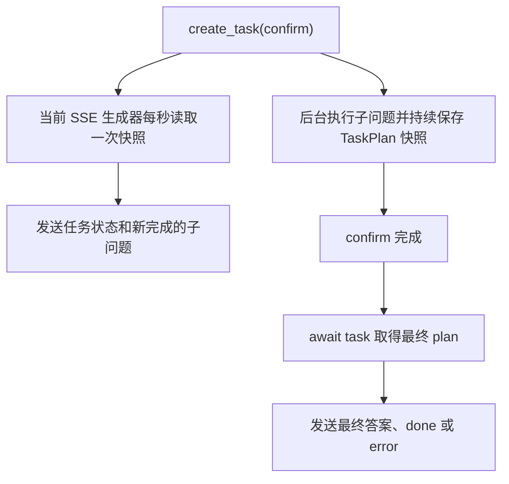
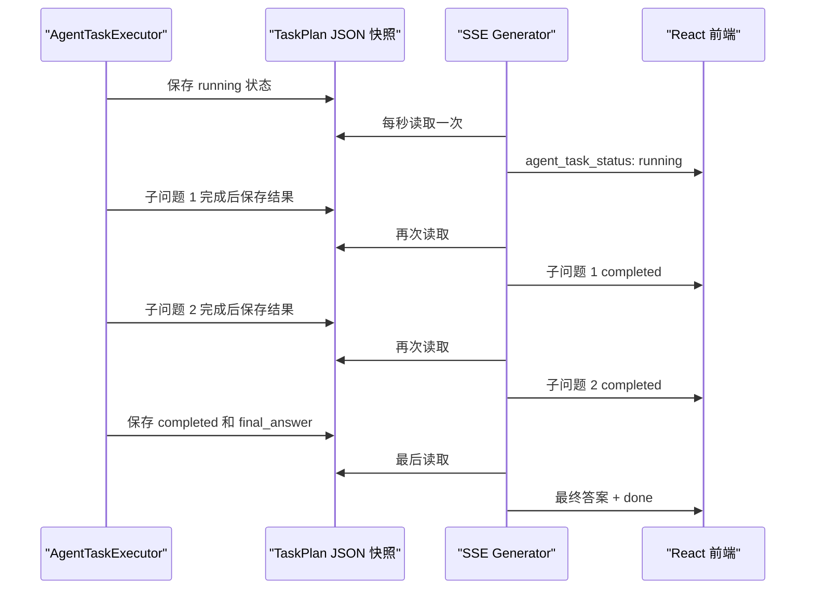

# _confirm_task_plan_sse_generator 函数讲解：


## `create_task` 之后：一边执行，一边推送进度

`task = asyncio.create_task(...)` 的核心意思是：

> 让 `task_executor.confirm(...)` 在后台开始执行，但当前 SSE 函数不等待它完成。

如果直接写：

```python
plan = await task_executor.confirm(...)
```

代码会一直等全部子问题执行完，前端只能最后收到结果，拿不到中间进度。

现在的结构相当于两条并发链路：



### 1. 后台任务开始执行

```python
task = asyncio.create_task(
    task_executor.confirm(...)
)
```

`task` 不是最终的 `plan`，而是一个“正在运行中的任务句柄”。

执行器在后台执行确认后的 TaskPlan：例如回答多个子问题、调用工具、生成最终综合答案。每完成一个子问题，它会把最新结果写入 runtime JSON 快照。

---

### 2. 在任务未完成时，每秒轮询一次快照

```python
while not task.done():
```

`task.done()` 表示后台任务是否已经结束。未结束就持续进入循环：

```python
plan = task_plan_store.load(task_plan_id)
for event in _task_plan_progress_events(plan, seen_sub_questions):
    yield event
```

这里不是读取后台任务的返回值，而是读取它执行途中不断保存的 `TaskPlan` 快照。

`_task_plan_progress_events(...)` 会生成两类事件：

- `agent_task_status`：当前总状态，例如 `running`
- `agent_task_sub_question_completed`：某个刚完成的子问题

`yield event` 会立即把 SSE 事件发给前端，而不是先收集完再返回。

```python
await asyncio.sleep(1)
```

这会暂停当前生成器 1 秒，让事件循环有机会继续运行后台的 `confirm` 任务；1 秒后再检查一次快照。

---

### 3. `seen_sub_questions` 防止前端收到重复完成事件

每次轮询读到的快照都包含“截至目前所有已完成子问题”。

假设第一个子问题已经完成：

- 第 1 次轮询：快照有子问题 A → 发送 A
- 第 2 次轮询：快照仍有子问题 A → 不应再次发送
- 第 3 次轮询：快照有 A、B → 只发送 B

因此：

```python
seen_sub_questions: set[str] = set()
```

保存已经发送过的 `sub_question_id`。`_task_plan_progress_events` 发现 id 已存在时就跳过它。

---

### 4. 为什么轮询快照的异常被忽略

```python
except Exception:
    pass
```

这一层只包住“读取快照并发送中间进度”。

例如后台任务刚启动、快照文件还没写好时，`load()` 可能暂时失败。这里不让一次短暂读取失败直接断开 SSE；等一秒后再试。

它不会吞掉 `task_executor.confirm()` 的最终执行异常：那个异常会在后面的 `await task` 重新抛出，并被外层 `except` 转成 SSE 的 `error` 事件。

---

### 5. 后台任务结束后，拿到最终结果

```python
plan = await task
```

循环退出只表示任务已结束；这行才真正取得 `confirm()` 的返回值。

- 执行成功：得到最终 `plan`
- 执行失败：这里重新抛出异常，跳到最外层 `except`

随后再调用一次：

```python
for event in _task_plan_progress_events(plan, seen_sub_questions):
    yield event
```

这是补发最后一轮快照中可能尚未发出的子问题。例如任务在两次轮询之间连续完成了最后几个子问题，循环来不及发送；这里确保它们不会遗漏。

---

### 6. 最终答案为何又被“流式”发送

```python
final_answer = plan.final_output.get("final_answer")
```

此时最终答案已经由执行器完整生成并保存好了，并不是真正边生成边从 LLM 接收 token。

```python
text_to_async_tokens(final_answer)
```

只是把完整字符串拆成异步 token，再交给 `guarded_answer_delta_events(...)` 做 Prompt Guard 检查后，以 `answer_delta` 等 SSE 事件逐段发给前端。

所以这里的“流式”是：

- 子问题进度：来自 runtime 快照的真实执行中进度
- 最终答案：任务完成后，为统一前端 SSE 协议而拆分后发送

最后依次发送：

```text
agent_task_final_synthesis_completed
done
```

如果确认任务失败，则外层捕获异常并发送：

```text
error
```


# _task_plan_progress_events 函数讲解：任务快照转换为前端可观测的SSE事件

## `_task_plan_progress_events` 的职责

它接收一份刚从 JSON 文件读到的 `TaskPlan` 快照，产出一组 SSE 字符串：

```
plan: 当前快照
seen_sub_questions: 已经推送给前端的子问题 id

↓ 转换后

list[str]: 可直接 yield 给前端的 SSE 事件
```

这里的“可观察到”是指：快照中已经写入、前端可以安全展示的信息，例如任务状态、已完成子问题的答案、工具调用和错误。

## 第一步：无条件生成任务总状态事件

```
events = [
    _format_sse_event(
        "agent_task_status",
        {"task_plan_id": plan.task_plan_id, "status": plan.status.value},
    )
]
```

不管任务是否刚开始、正在执行、已完成或失败，函数都会先生成：

```
event: agent_task_status
data: {"task_plan_id":"plan_001","status":"running"}
```

因此前端每次轮询周期都能刷新任务总状态。

`_format_sse_event(...)` 负责将 Python 字典变成 SSE 协议要求的文本：

```
_format_sse_event("agent_task_status", {"status": "running"})
```

结果类似：

```
event: agent_task_status
data: {"status":"running"}
```

末尾的空行表示一条 SSE 事件结束。

## 第二步：从快照中取出已完成子问题

```
results = plan.final_output.get("sub_question_results", [])
if not isinstance(results, list):
    return events
```

执行器会在每个子问题完成时，把结果写到：

```
plan.final_output["sub_question_results"]
```

例如快照可能是：

```
{
    "status": "running",
    "final_output": {
        "sub_question_results": [
            {
                "sub_question_id": "q1",
                "question": "什么是混合检索？",
                "status": "completed",
                "selected_tool": "rag_search",
                "answer": "……"
            }
        ]
    }
}
```

如果这个字段不存在或不是列表，说明当前还没有可处理的子问题结果。函数保留前面生成的状态事件后直接返回。

## 第三步：逐个检查结果是否是“新增”

```
for result in results:
    if not isinstance(result, dict):
        continue
```

快照属于运行时数据，函数先确认每一项确实是字典；异常数据直接跳过，避免一次坏数据断开 SSE。

接着取得子问题唯一标识：

```
sub_question_id = str(result.get("sub_question_id") or "")
```

然后判断：

```
if not sub_question_id or sub_question_id in seen_sub_questions:
    continue
```

这里“新增”的定义不是“刚刚写进文件”，而是：

> 这个 `sub_question_id` 还没有通过当前 SSE 连接发送给前端。

例如：

```
seen_sub_questions = {"q1"}
```

而本次快照中有 `q1`、`q2`：

- `q1`：之前已经推送，跳过。
- `q2`：第一次见到，属于新增结果，发送。
- 没有 `sub_question_id`：无法可靠去重，跳过。

确认是新增后，立刻记录：

```
seen_sub_questions.add(sub_question_id)
```

这样下一次轮询即使快照仍然包含 `q2`，也不会重复发送。

## 第四步：把新增结果转换为子问题完成事件

```
events.append(
    _format_sse_event(
        "agent_task_sub_question_completed",
        {
            "task_plan_id": plan.task_plan_id,
            "sub_question_id": sub_question_id,
            "question": result.get("question"),
            "status": result.get("status"),
            "selected_tool": result.get("selected_tool"),
            "answer": result.get("answer"),
            "error": result.get("error"),
            "tool_calls": result.get("tool_calls", []),
        },
    )
)
```

它不会重新计算答案或执行工具，只是把快照中已有的执行结果包装成前端事件。

前端收到后可以直接显示：

```
子问题：什么是混合检索？
状态：completed
工具：rag_search
答案：……
错误：null
工具调用记录：……
```

## 两次if保护判断：

~~~python
    if not isinstance(results, list):
        return events
    
    for result in results:
        if not isinstance(result, dict):
            continue
        sub_question_id = str(result.get("sub_question_id") or "")
~~~

## 两个 `if` 都是在保护快照数据

快照来自 runtime JSON 文件，虽然正常情况下结构固定，但代码不能假设它永远正确。两个判断的粒度不同。

```
if not isinstance(results, list):
    return events
```

它检查整个 `sub_question_results` 是否为列表。

因为下面马上要执行：

```
for result in results:
```

正常数据应是：

```
results = [
    {"sub_question_id": "q1", ...},
    {"sub_question_id": "q2", ...},
]
```

如果它意外变成 `None`、字符串或字典，就不适合当“多个子问题结果”遍历。此时函数只返回已经生成好的任务状态事件 `events`，不发送任何子问题完成事件。

```
if not isinstance(result, dict):
    continue
```

它检查列表中的每一项是否是字典。

因为后面需要调用：

```
result.get("sub_question_id")
```

只有字典才有 `.get(...)`。例如下面的数据异常：

```
results = [
    {"sub_question_id": "q1", ...},
    "错误数据",
    None,
]
```

遇到 `"错误数据"` 或 `None` 时，`continue` 表示跳过这一项，继续检查后面的结果；不会因为一条坏数据导致整个 SSE 连接报错中断。

最后这行：

```
sub_question_id = str(result.get("sub_question_id") or "")
```

作用是安全地得到一个字符串 id：

- 字段为 `"q1"` → `"q1"`
- 字段不存在或值为 `None` → `""`
- 字段是数字 `1` → `"1"`

后面会用空字符串判断和 `seen_sub_questions` 去重，因此没有可靠 id 的结果不会被发送。

## 一次实际转换示例

假设本轮读到的快照有 `q1` 和 `q2`，但 `q1` 已推送过：

```
seen_sub_questions = {"q1"}
```

函数会返回两条事件：

```
1. agent_task_status
   表示：任务仍处于 running

2. agent_task_sub_question_completed
   表示：q2 是本连接第一次发现的已完成子问题
```

不会重复返回 `q1`。

所以它的本质是：

```
快照中的当前状态
    → 每次都通知前端

快照中的已完成子问题
    → 只把本 SSE 连接尚未发送过的部分通知前端
```

# 任务快照机制讲解：

## 什么是“任务快照”

这里的任务快照，就是把某个 `TaskPlan` 在某一时刻的最新状态保存到磁盘上的 JSON 文件。

可以把它理解成“任务执行过程中的存档”：

```
任务刚确认：waiting_confirmation
开始执行：running
完成子问题 1：running + 子问题 1 的结果
完成子问题 2：running + 子问题 1、2 的结果
全部完成：completed + 最终答案
```

每一次保存，都会覆盖同一个 `task_plan_id` 对应的 JSON 文件。因此文件里始终是“这个任务目前最新的样子”。

## 谁写快照，谁读快照



- `AgentTaskExecutor` 是写入者：真正执行任务，并在关键节点保存最新 `plan`。
- `_confirm_task_plan_sse_generator` 是读取者：不参与执行，只负责定时读取并推送给前端。

## 为什么需要它

`task_executor.confirm()` 本来只能在结束时返回一个最终 `plan`：

```
plan = await task_executor.confirm(...)
```

如果只有这种方式，HTTP 请求只能等全部子问题完成，前端看不到中间过程。

快照让执行器和 SSE 接口不必直接互相传递事件：

1. 执行器完成一个子问题，写一次快照。
2. SSE 生成器每秒读一次快照。
3. 如果发现新的子问题结果，就发 SSE 给前端。

这是一种“通过持久化状态间接传递进度”的方案，而不是给执行器额外加事件总线。

## 快照里保存什么

对于 `question_decomposition` 类型任务，执行开始时会先保存：

```
plan.status = RUNNING
plan.final_output = {
    "sub_question_results": [],
    "used_tools": [],
}
```

每完成一个子问题，会把结果追加进：

```
plan.final_output["sub_question_results"]
```

并保存快照。结果中会包含：

```
sub_question_id
question
status
selected_tool
answer
error
tool_calls
```

全部子问题完成后，执行器再写入：

```
status = completed
final_output["final_answer"] = 最终综合答案
```

如果执行失败，则保存：

```
status = failed
error = 异常信息
```

## 它不是消息队列

快照不是“事件列表”，而是一份当前状态。

例如连续轮询两次，都会读到“子问题 1 已完成”。所以 `_task_plan_progress_events` 必须使用：

```
seen_sub_questions
```

记录已发送给前端的 `sub_question_id`，避免同一条完成事件被重复推送。

简而言之：快照负责保存“当前事实”，SSE 生成器负责比较“这次比上次多了什么”，再把新增部分通知前端。