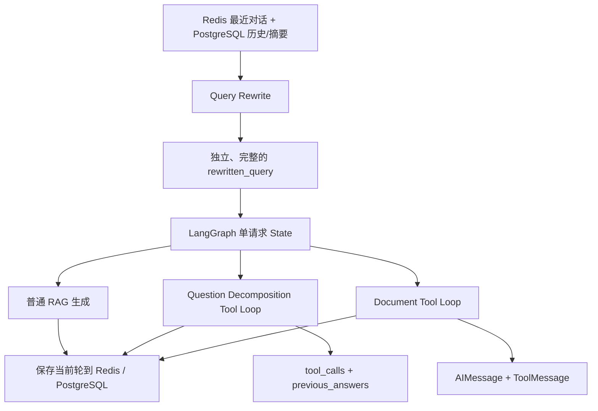

## 结论

你的理解里混合了三个不同概念：

1. **复用同一个 LLM 实例**
2. **单次任务内的 Agent Tool Loop**
3. **跨 HTTP 请求的多轮会话 Memory**

这三者没有必然关系。

当前工程的设计总体合理：不同 LLM 节点只接收完成当前职责所需的上下文，避免把全部历史无差别塞给所有模型。但当前的多轮对话能力确实还不完整，尤其是 Planner 明确传入了 `history=[]`，存在上下文丢失风险。

## 你的 Node.js 示例其实没有跨请求 Memory

示例中的 `modelWithTools` 虽然只创建一次：

```
const modelWithTools = model.bindTools(tools);
```

但每次调用 `runAgentWithTools()`，都会重新创建：

```
const messages = [
    new SystemMessage(...),
    new HumanMessage(query)
];
```

所以：

```
await runAgentWithTools("创建文件");
await runAgentWithTools("修改刚才的文件");
```

第二次调用并不知道第一次发生了什么。

这个例子实现的是：

```
单次 runAgentWithTools 调用
    ├─ LLM
    ├─ Tool
    ├─ ToolMessage
    ├─ LLM
    └─ 最终回答
```

它实现了**单任务 Tool Loop**，没有实现**跨任务 Memory**。

要支持跨请求记忆，仍然需要把之前的消息从 Redis、数据库或 LangGraph Checkpointer 中读取出来，再放回 `messages`。

## LLM 实例本身不保存对话记忆

OpenAI-compatible 模型调用本质上是无状态请求：

```
当前请求输入 messages
        ↓
远程 LLM 推理
        ↓
返回 AIMessage
```

下面两种写法的语义基本相同：

```
model = ChatOpenAI(...)
await model.ainvoke(messages1)
await model.ainvoke(messages2)
await ChatOpenAI(...).ainvoke(messages1)
await ChatOpenAI(...).ainvoke(messages2)
```

只要 `messages2` 相同，模型看到的上下文就相同。复用 Python/Node 对象不会让模型自动记住上一次回答。

因此，当前工程部分位置创建新的 `ChatOpenAI` 对象，主要影响的是：

- 本地对象构造。
- Tool schema 绑定。
- structured output 配置。
- temperature 等模型参数。
- LangSmith run 配置。

它不会决定模型有没有记忆。

## 当前工程的四层状态

````

````

### 1. 跨请求会话状态

Redis 保存最近消息：

```
conversation:{conversation_id}:messages
```

并通过 `LTRIM` 限制长度、通过 `EXPIRE` 设置过期时间，见 [conversation_memory.py (line 60)](D:/AI_Agent_Project/AI_Python_Project/python-agent-study/src/fast_app/services/conversation_memory.py:60)。

所以严格来说：

- Redis 是带 TTL 的**短期会话窗口**。
- PostgreSQL 才是完整对话的持久化存储，见 [conversation_persistence.py (line 10)](D:/AI_Agent_Project/AI_Python_Project/python-agent-study/src/fast_app/services/conversation_persistence.py:10)。
- PostgreSQL 中的历史摘要用于补充 Redis 窗口外的信息。

### 2. Query Rewrite 传播多轮语义

Rewrite 读取：

```
{
    "memory_context": memory_context.formatted_text,
    "query": query,
}
```

见 [query_rewrite.py (line 100)](D:/AI_Agent_Project/AI_Python_Project/python-agent-study/src/fast_app/services/query_rewrite.py:100)。

例如：

```
上一轮：介绍 rag-backend-deployment.md
当前轮：把它修改一下
```

Rewrite 应该生成类似：

```
修改 rag-backend-deployment.md 文档
```

然后该结果被写入：

```
state["query"] = rewrite_result.rewritten_query
```

见 [rag_agent_pipeline_service.py (line 311)](D:/AI_Agent_Project/AI_Python_Project/python-agent-study/src/fast_app/services/rag_agent_pipeline_service.py:311)。

所以后续 Planner、检索和回答生成虽然没有直接拿到完整历史，但拿到了经过历史消歧后的 query。

这是一种：

```
完整历史
  ↓
压缩成独立 query
  ↓
后续节点只处理独立 query
```

的上下文传播方式。

### 3. Question Decomposition 的 Tool Loop

问题拆解链路虽然每轮重新构造 `ChatOpenAI` Tool Runnable，但它并没有丢失当前任务状态。

每轮都会重新传入：

```
{
    "original_query": plan.original_query,
    "objective": plan.objective,
    "current_sub_question": ...,
    "current_tool_calls": ...,
    "previous_answers": ...,
}
```

见 [agent_task_executor.py (line 2138)](D:/AI_Agent_Project/AI_Python_Project/python-agent-study/src/fast_app/services/agent_task_executor.py:2138)。

因此它是：

```
第 1 轮：plan + 子问题
→ ToolCall A
→ 保存为 tool_calls

第 2 轮：plan + 子问题 + ToolCall A 的结果
→ ToolCall B

第 3 轮：plan + 子问题 + A/B 结果
→ 不再调用工具
→ 综合答案
```

它在语义上仍然是 Agent Loop，只是使用结构化 `tool_calls` 重新构造上下文，而不是长期维护同一个 `messages` 列表。

### 4. Document Tool Loop

文档 Agent 和你的 Node.js 示例几乎一样。

它先创建：

```
messages = [
    SystemMessage(...),
    HumanMessage(plan.original_query),
]
```

每轮调用：

```
response = await model.ainvoke(messages)
messages.append(response)
```

工具执行完成后追加：

```
messages.append(tool_message)
```

见 [agent_task_executor.py (line 1142)](D:/AI_Agent_Project/AI_Python_Project/python-agent-study/src/fast_app/services/agent_task_executor.py:1142)。

所以文档任务已经是标准链路：

```
LLM
→ AIMessage.tool_calls
→ Tool
→ ToolMessage
→ LLM
→ 下一次 ToolCall
```

## 为什么不能让所有 LLM 节点都使用 Agent Loop + Memory

因为 Agent Loop 只适合模型需要反复决定“下一步是否调用工具”的场景。

下面这些节点不需要循环：

- Prompt Guard：只需要分类一次。
- Query Rewrite：只需要生成一个独立 query。
- Conversation Summary：只需要生成一次摘要。
- 最终 RAG Answer：检索上下文已经准备完成，只需要回答一次。
- Task Planner：只需要生成结构化任务类型和子问题。
- 输出安全分类器：只需要检查当前输出。

如果都包装为 Agent Loop，会导致：

- 无意义的额外模型调用。
- Token 成本增加。
- 延迟增加。
- Prompt Guard 被普通聊天历史污染。
- 不同任务的工具权限边界变模糊。
- LangSmith trace 更复杂。
- 历史中的错误事实可能污染当前安全判断。

正确原则应该是：

```
不是所有 LLM 都共享所有 Memory
而是每个 LLM 只读取完成当前职责所需的状态
```

## 当前真正存在的不足

当前 Planner 虽然支持 `history` 参数，但主链路实际传的是：

```
task_plan = await task_planner.plan(
    query=state["query"],
    history=[],
    ...
)
```

见 [rag_agent_nodes.py (line 231)](D:/AI_Agent_Project/AI_Python_Project/python-agent-study/src/fast_app/graph/rag_agent_nodes.py:231)。

也就是说，Planner 只依赖 rewrite 后的 query，没有直接看到：

- 最近几轮原始对话。
- 历史 TaskPlan。
- 上一次 ToolCall 结果。
- 上一次等待确认的文档目标。
- 用户之前表达的偏好和约束。

如果 Rewrite 成功消除了指代，这通常够用；如果 Rewrite 遗漏信息，后面所有节点都无法恢复。

例如：

```
第一轮：帮我找到部署文档
第二轮：把其中健康检查那部分改得更详细，格式保持和刚才一样
```

Rewrite 可能识别文档和修改主题，但容易丢失“格式保持和刚才一样”这种对话约束。

所以准确结论是：

> 当前不是没有 Agent Loop，而是已经有单任务 Tool Loop；跨请求 Memory 则主要通过 Query Rewrite 间接传播。这个设计适合 RAG 检索，但对于复杂的多轮任务规划，目前上下文传播仍然偏弱。

## 更合适的后续改进方向

不建议把整个工程改成一个无限 Agent Loop。更合理的是选择性增强：

- Planner 接收“摘要 + 最近几轮消息”，不再传 `history=[]`。
- 最终答案生成可以选择性接收最近对话约束，用于保持表达连续性。
- 文档 Agent 继续使用当前任务内的 `AIMessage + ToolMessage`。
- Prompt Guard、权限判断、结构化校验不接收普通聊天历史。
- 跨请求恢复未完成 Tool Loop 时，使用 TaskPlan/检查点，而不是仅靠自然语言 Memory 猜测。
- React 的确认、取消、重试仍通过 `task_plan_id` 和专用 API 完成，不依赖用户说“确认刚才的操作”。

因此，你熟悉的方案没有错；当前工程采用的是更加分层的实现。真正值得补齐的是**Planner 和任务执行阶段对多轮约束的选择性传递**，而不是复用同一个 LLM 对象，也不是让所有 LLM 调用都进入 Agent Loop。