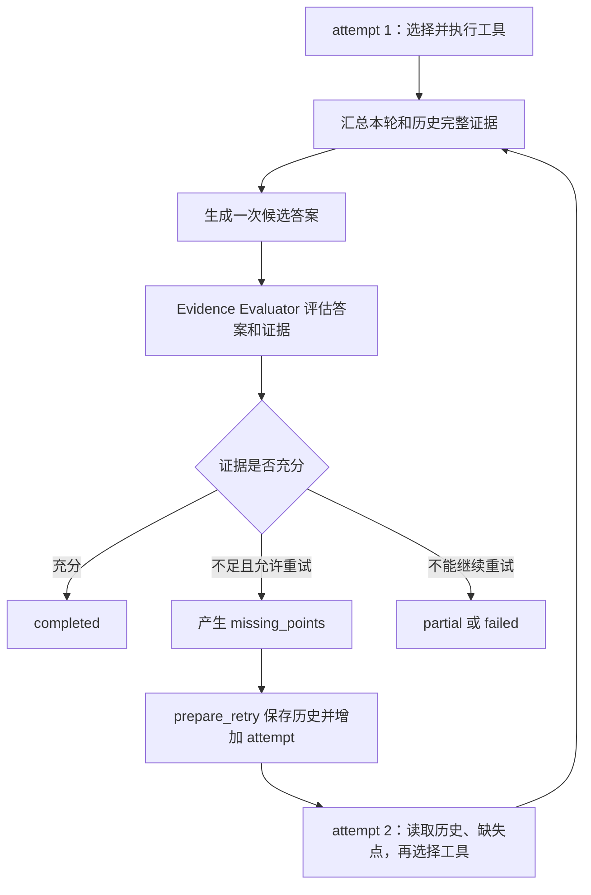

# 历史上下文所使用的字段职责：

## 先看完整链路

这四点都发生在一个 `ResearchWorkerAgent` 的纠正循环中：

````

````

这里需要区分两个概念：

- `tool round`：同一个 attempt 内可以进行多轮工具选择。
- `attempt`：完成工具调用、生成候选答案、Evaluator 评估后，如果证据不足，才进入下一个 attempt。

------

## 一、“每个 attempt 最多生成一次候选答案”体现在哪里

入口是 [`ResearchToolLoop.run_attempt()` (line 121)](/D:/AI_Agent_Project/AI_Python_Project/python-agent-study/src/fast_app/services/research/research_tool_loop.py:121)。

### 1. 一个 attempt 内可以执行多个工具

`run_attempt()` 内部有一个工具选择循环：

```
while call_count < max_tool_calls:
    selected = await self._select_tool_for_sub_question(...)
    ...
    batch_results = await asyncio.gather(...)
```

对应代码：

- [工具选择循环 (line 167)](/D:/AI_Agent_Project/AI_Python_Project/python-agent-study/src/fast_app/services/research/research_tool_loop.py:167)
- [并行执行本轮工具 (line 305)](/D:/AI_Agent_Project/AI_Python_Project/python-agent-study/src/fast_app/services/research/research_tool_loop.py:305)

例如一次 attempt 可能是：

```
第 1 个 tool round：
    调用知识库检索
    调用 WebSearch

第 2 个 tool round：
    LLM 看到已有结果
    决定再调用一个 MCP 工具

第 3 个 tool round：
    LLM 判断不再需要工具
    返回 selected_tool=none
```

这些工具都只返回三类数据：

```
ToolExecutionResult(
    tool_output=...,
    evidence=...,
    context_docs=...,
)
```

工具执行的统一入口是：

[`_run_task_tool_for_sub_question()` (line 698)](/D:/AI_Agent_Project/AI_Python_Project/python-agent-study/src/fast_app/services/research/research_tool_loop.py:698)

它的职责只是：

- 执行工具。
- 记录可持久化的 `tool_output`。
- 提取结构化 `evidence`。
- 将完整正文放入内存中的 `context_docs`。

这里已经没有“每个工具各调用一次 LLM 生成答案”的逻辑。

### 2. 所有工具结束后，才进入统一回答

工具循环退出以后，代码先合并历史和本次 attempt 的完整上下文：

```
all_context_docs = _merge_context_doc_groups(
    [*prior_context_doc_groups, *context_doc_groups]
)
```

然后只有一个候选答案生成入口：

```
answer = await self._answer_from_tool_calls(...)
```

对应位置：

- [合并全部上下文 (line 319)](/D:/AI_Agent_Project/AI_Python_Project/python-agent-study/src/fast_app/services/research/research_tool_loop.py:319)
- [统一生成候选答案 (line 327)](/D:/AI_Agent_Project/AI_Python_Project/python-agent-study/src/fast_app/services/research/research_tool_loop.py:327)
- [`_answer_from_tool_calls()` 实现 (line 880)](/D:/AI_Agent_Project/AI_Python_Project/python-agent-study/src/fast_app/services/research/research_tool_loop.py:880)

`_answer_from_tool_calls()` 最终只有一次：

```
return await self._generate_with_trace(...)
```

因此一次正常的工具型 attempt 是：

```
工具选择 LLM：可能调用多次
工具执行：可能调用多个
候选答案 LLM：最多调用一次
Evaluator LLM：调用一次
```

“最多一次”只描述候选答案生成，不代表整个 attempt 只调用一次 LLM。

### 3. 为什么是“最多一次”，不是“一定一次”

存在三个互斥分支：

#### 有完整工具上下文

调用 `_answer_from_tool_calls()` 一次。

#### 工具全部失败或没有可用证据

直接返回失败，不生成候选答案：

```
if tool_calls or prior_tool_calls:
    return ResearchAttemptOutcome(
        result=AgentTaskSubQuestionResult(
            status="failed",
            ...
        )
    )
```

对应位置：[无可用证据分支 (line 353)](/D:/AI_Agent_Project/AI_Python_Project/python-agent-study/src/fast_app/services/research/research_tool_loop.py:353)。

此时候选答案 LLM 调用次数是零。

#### LLM 判断不需要工具

进入 `_answer_without_tool()`，只使用前置子问题结果生成一次答案。

对应位置：

- [纯推理分支 (line 370)](/D:/AI_Agent_Project/AI_Python_Project/python-agent-study/src/fast_app/services/research/research_tool_loop.py:370)
- [`_answer_without_tool()` (line 853)](/D:/AI_Agent_Project/AI_Python_Project/python-agent-study/src/fast_app/services/research/research_tool_loop.py:853)

所以每个 attempt 的候选答案生成次数只能是：

```
0 次：没有可用证据，直接失败
1 次：有证据统一回答，或者走无工具推理
```

不会出现：

```
知识库工具回答一次
WebSearch 回答一次
MCP 工具回答一次
最后再综合一次
```

------

## 二、`missing_points` 在哪里产生，有什么作用

### 1. 字段定义

`missing_points` 定义在 `ResearchEvidenceEvaluation` 中：

```
missing_points: list[str] = Field(default_factory=list)
```

对应位置：[领域模型定义 (line 115)](/D:/AI_Agent_Project/AI_Python_Project/python-agent-study/src/fast_app/domain/agent_task_plan.py:115)。

它表示：

> 当前候选答案还缺少哪些没有被现有证据覆盖的具体信息。

例如子问题是：

```
比较方案 A 和方案 B 的性能、成本和版本兼容性
```

第一次检索只找到了性能和成本，那么 Evaluator 可以返回：

```
{
  "verdict": "partial",
  "confidence": 0.82,
  "missing_points": [
    "方案 A 支持的产品版本",
    "方案 B 的向后兼容限制"
  ],
  "recommended_action": "rewrite_local_query",
  "reason": "当前证据没有覆盖版本兼容性"
}
```

### 2. 谁产生 `missing_points`

正常情况下由 `ResearchEvidenceEvaluator` 使用真实 LLM 产生。

Evaluator 收到：

```
{
    "question": sub_question.question,
    "expected_evidence": sub_question.expected_evidence,
    "candidate_answer": answer,
    "evidence": evidence,
}
```

对应位置：[Evaluator 输入 (line 63)](/D:/AI_Agent_Project/AI_Python_Project/python-agent-study/src/fast_app/services/research/research_evidence_evaluator.py:63)。

Evaluator Prompt 明确要求：

```
missing_points 只写仍需查证的公开主题
```

对应位置：[Evaluator Prompt (line 24)](/D:/AI_Agent_Project/AI_Python_Project/python-agent-study/src/fast_app/services/research/research_evidence_evaluator.py:24)。

如果当前完全没有证据，系统不会让 LLM凭空判断，而是直接生成保守结果：

```
missing_points=["需要取得可核验的证据"]
```

对应位置：[`_insufficient()` (line 147)](/D:/AI_Agent_Project/AI_Python_Project/python-agent-study/src/fast_app/services/research/research_evidence_evaluator.py:147)。

### 3. `missing_points` 如何进入下一次 attempt

Evaluator 返回结果后，`ResearchWorkerAgent._prepare_retry()` 保存它：

```
return {
    "attempt": next_attempt,
    "force_web": force_web,
    "retry_missing_points": list(evaluation.missing_points),
}
```

对应位置：[`_prepare_retry()` (line 312)](/D:/AI_Agent_Project/AI_Python_Project/python-agent-study/src/fast_app/services/research/research_worker_agent.py:312)。

Worker Graph 把这个状态重新送回 `run_attempt`：

```
prepare_retry → run_attempt
```

对应位置：[Worker Graph 循环边 (line 76)](/D:/AI_Agent_Project/AI_Python_Project/python-agent-study/src/fast_app/graph/research/research_worker_graph.py:76)。

第二次进入 `_run_attempt()` 时，它把该字段传给 Tool Loop：

```
retry_missing_points=state["retry_missing_points"]
```

对应位置：[传入下一次 attempt (line 173)](/D:/AI_Agent_Project/AI_Python_Project/python-agent-study/src/fast_app/services/research/research_worker_agent.py:173)。

### 4. `missing_points` 在下一轮有三个作用

#### 作用一：指导工具选择 LLM

工具选择 Prompt 中有独立字段：

```
{
  "prior_attempt_tool_calls": [...],
  "prior_attempt_evidence": [...],
  "current_attempt_tool_calls": [...],
  "current_attempt_evidence": [...],
  "retry_missing_points": [...]
}
```

对应位置：[`_build_tool_selection_messages()` (line 910)](/D:/AI_Agent_Project/AI_Python_Project/python-agent-study/src/fast_app/services/research/research_tool_loop.py:910)。

这样工具选择模型知道：

```
上一次查过什么
已经获得什么证据
还缺什么
下一次应该如何改写查询
```

#### 作用二：构造安全的 Web 查询

Worker 使用：

```
build_public_web_query(
    original_query,
    sub_question.question,
    retry_missing_points,
)
```

生成公开 Web 查询。

对应位置：[安全 Web 查询构造 (line 174)](/D:/AI_Agent_Project/AI_Python_Project/python-agent-study/src/fast_app/services/research/research_worker_agent.py:174)。

它只能组合：

- 原始问题。
- 当前子问题。
- `missing_points`。

不会把私有 Chunk、ACL、内部路径发送到 WebSearch。

#### 作用三：提醒候选答案重点补足什么

第二次生成候选答案时，Prompt 会追加：

```
query += f"\n本次纠正需要重点补足：{missing_text}"
```

对应位置：[`_answer_from_tool_calls()` (line 894)](/D:/AI_Agent_Project/AI_Python_Project/python-agent-study/src/fast_app/services/research/research_tool_loop.py:894)。

因此 `missing_points` 不是证据，也不是直接的工具调用参数。它是 Evaluator 给下一次研究过程的“问题清单”。

------

## 三、`dependency_results`、当前 ToolCall、历史 attempt 结果如何划分职责

现在共有四类数据，不能混为一谈。

| 数据                          | 来自哪里                  | 生命周期                | 主要作用                        |
| ----------------------------- | ------------------------- | ----------------------- | ------------------------------- |
| `dependency_results`          | 其他前置子问题 Worker     | 整个当前 Worker         | 提供多跳研究的前置结论          |
| `current_tool_calls/evidence` | 当前 attempt              | 当前 `run_attempt()`    | 决定本 attempt 是否继续调用工具 |
| `prior_tool_calls/evidence`   | 当前 Worker 的旧 attempt  | Worker Graph 全生命周期 | 避免纠正轮忘记上次查过什么      |
| `prior_context_doc_groups`    | 旧 attempt 的完整工具正文 | Worker Graph 内存       | 让新候选答案能综合新旧完整证据  |

### 1. `dependency_results`：其他子问题的结果

它定义在 `ResearchWorkerRequest`：

```
dependency_results: list[AgentTaskSubQuestionResult]
```

对应位置：[Worker 请求模型 (line 36)](/D:/AI_Agent_Project/AI_Python_Project/python-agent-study/src/fast_app/services/research/research_worker_agent.py:36)。

例如：

```
子问题 Q1：方案 A 有哪些能力？
子问题 Q2：方案 B 有哪些能力？
子问题 Q3：比较 A 和 B
```

Q3 的 `dependency_results` 是 Q1、Q2 的结果。

它不是 Q3 自己以前调用工具的历史。

### 2. 当前 ToolCall：当前 attempt 刚刚执行的工具

`ResearchToolLoop.run_attempt()` 每次被调用都会重新创建：

```
tool_calls = []
evidence = []
context_doc_groups = []
```

对应位置：[当前 attempt 局部状态 (line 161)](/D:/AI_Agent_Project/AI_Python_Project/python-agent-study/src/fast_app/services/research/research_tool_loop.py:161)。

它们只记录本次 attempt 新产生的结果。

同一个 attempt 的下一次工具选择可以看到这些值：

```
current_tool_calls=tool_calls
current_evidence=evidence
```

所以同一个 attempt 内是：

```
调用知识库
→ current_tool_calls 有 1 条
→ 再次选择工具
→ LLM 能看到刚才的知识库结果
→ 决定是否再调用 Web/MCP
```

### 3. 历史 attempt：当前 Worker 上一次研究的结果

跨 attempt 的状态保存在 `ResearchWorkerGraphState`：

```
all_tool_calls
all_evidence
all_context_doc_groups
```

对应位置：[Worker Graph 状态 (line 18)](/D:/AI_Agent_Project/AI_Python_Project/python-agent-study/src/fast_app/graph/research/research_worker_graph.py:18)。

第一次 attempt 结束后，`ResearchWorkerAgent._run_attempt()` 把新结果累计进去：

```
"all_tool_calls": [
    *state["all_tool_calls"],
    *last_result.tool_calls,
],
"all_evidence": merge_evidence(
    state["all_evidence"],
    last_result.evidence,
),
"all_context_doc_groups": [
    *state["all_context_doc_groups"],
    *attempt_outcome.context_doc_groups,
],
```

对应位置：[跨 attempt 累计状态 (line 181)](/D:/AI_Agent_Project/AI_Python_Project/python-agent-study/src/fast_app/services/research/research_worker_agent.py:181)。

第二次 attempt 再把这些状态传给 Tool Loop：

```
prior_tool_calls=state["all_tool_calls"]
prior_evidence=state["all_evidence"]
prior_context_doc_groups=state["all_context_doc_groups"]
```

对应位置：[历史状态传递 (line 170)](/D:/AI_Agent_Project/AI_Python_Project/python-agent-study/src/fast_app/services/research/research_worker_agent.py:170)。

### 4. 为什么还要单独保存完整上下文

`ToolCall.tool_output` 只保存摘要，例如：

```
{
  "doc_count": 3,
  "top_doc_ids": ["doc-1", "doc-2"]
}
```

完整知识库正文不能写入 TaskPlan JSON，否则会：

- 快照过大。
- 重复持久化知识库正文。
- 增加私有内容泄露风险。

所以完整 `RetrievedDoc` 只保存在：

```
all_context_doc_groups
```

第二次 attempt 生成答案时，会把第一次和第二次的完整正文合并：

```
all_context_docs = _merge_context_doc_groups(
    [*prior_context_doc_groups, *context_doc_groups]
)
```

因此职责边界是：

```
ToolCall：
    审计和持久化摘要

Evidence：
    Evaluator 和最终 Sources 使用的结构化证据

Context docs：
    候选答案 LLM 使用的完整正文，只存在 Worker 内存

Dependency results：
    其他前置 Worker 已经形成的结论
```

------

## 四、ToolCall ID 如何避免重试时重复

这里需要修正一个容易误解的说法：

> ToolCall ID 包含 attempt，避免的是“ID 重复”，不是阻止同一个工具再次执行。

### 1. 为什么重试时可能出现相同的原始 ID

模型或者后端默认值可能在不同 attempt 中都产生：

```
tool_1_1
```

例如：

```
attempt 1，第 1 轮，第 1 个工具 → tool_1_1
attempt 2，第 1 轮，第 1 个工具 → tool_1_1
```

因为每个新 attempt 的 `round_index` 都从零重新开始。

如果直接使用这个 ID，TaskPlan 最终可能存在两条相同 `call_id`，无法区分它们属于哪次纠正。

### 2. 当前如何构造最终 ID

代码给原始 Provider ID 加上：

- `sub_question_id`
- `attempt`

```
call_id = (
    f"{sub_question.sub_question_id}_attempt_{attempt}_"
    f"{provider_call_id}"
)
```

对应位置：[ToolCall ID 生成 (line 248)](/D:/AI_Agent_Project/AI_Python_Project/python-agent-study/src/fast_app/services/research/research_tool_loop.py:248)。

结果变成：

```
subq_1_attempt_1_tool_1_1
subq_1_attempt_2_tool_1_1
```

即使 Provider 在两个 attempt 中返回同一个 `call_id`，最终 ID 也不会冲突。

批次校验失败生成的 ToolCall 也使用相同规则：

[`_failed_batch_traces()` (line 972)](/D:/AI_Agent_Project/AI_Python_Project/python-agent-study/src/fast_app/services/research/research_tool_loop.py:972)。

### 3. Evidence 也会关联最终 ToolCall ID

工具执行成功后，Evidence 会加入：

```
{
    **item,
    "tool_call_id": call_id,
}
```

对应位置：[Evidence 关联 ToolCall (line 271)](/D:/AI_Agent_Project/AI_Python_Project/python-agent-study/src/fast_app/services/research/research_tool_loop.py:271)。

所以最终可以准确知道：

```
这条 Evidence 是哪个子问题、
哪个 attempt、
哪次 ToolCall 产生的。
```

### 4. 当前是否阻止重复执行同一个工具

没有进行强制阻止。

例如 Evaluator 认为第一次知识库查询词不准确，第二次 attempt 可以继续调用同一个知识库工具，但使用新查询：

```
attempt 1：
    knowledge_retrieval(query="方案兼容性")

attempt 2：
    knowledge_retrieval(query="方案 A 3.2 版本兼容限制")
```

这属于必要的纠正，不应该因为工具名称相同就禁止。

当前减少无意义重复调用依赖：

- 工具选择 LLM 能看到 `prior_tool_calls`。
- 能看到 `prior_evidence`。
- 能看到 `retry_missing_points`。
- 单 Worker 工具调用总预算限制。
- 纠正轮次数限制。

但系统目前没有根据：

```
tool_name + 规范化 tool_input
```

计算指纹并阻止完全相同的重复调用。

所以准确表述应该是：

```
attempt 前缀解决 ToolCall 身份冲突和追踪歧义；
历史上下文和预算减少无意义重复；
当前没有实现完全相同工具参数的硬性去重。
```

相关回归测试也验证了两次 attempt 的 ID 不相同：

```
assert len({call.call_id for call in correction_result.tool_calls}) == 2
assert "attempt_1" in correction_result.tool_calls[0].call_id
assert "attempt_2" in correction_result.tool_calls[1].call_id
```

对应位置：[跨 attempt 回归测试 (line 588)](/D:/AI_Agent_Project/AI_Python_Project/python-agent-study/scripts/phase_15/test_agent_task_tool_loop.py:588)。

# worker内存 保存上下文：

`all_context_docs` 是“准备发送给答案生成模型的最终合并数组”，跨 attempt 真正保存正文的是 `all_context_doc_groups`。

## 三层数据结构

```
工具返回完整正文
    ↓
context_doc_groups                 当前 attempt 临时保存
    ↓
state["all_context_doc_groups"]    跨 attempt 保存在 Worker Graph 内存
    ↓
all_context_docs                   生成答案前合并、去重后的临时数组
    ↓
RagContext
    ↓
发送给候选答案 LLM
```

### 1. 当前 attempt：`context_doc_groups`

每个工具返回：

```
ToolExecutionResult(
    tool_output=...,
    evidence=...,
    context_docs=docs,
)
```

工具执行完后，将完整文档加入**当前 attempt 的局部数组：**

```
if context_docs:
    context_doc_groups.append(context_docs)
```

对应位置：[research_tool_loop.py (line 313)](/D:/AI_Agent_Project/AI_Python_Project/python-agent-study/src/fast_app/services/research/research_tool_loop.py:313)。

假设本轮调用两个工具：

```
context_doc_groups = [
    [知识库文档1, 知识库文档2],
    [Web结果1, Web结果2],
]
```

这是 `run_attempt()` 中的局部变量。当前 attempt 返回后，该局部变量本身不会自动保留。

------

### 2. 跨 attempt：`all_context_doc_groups`

`ResearchToolLoop.run_attempt()` 会把当前获得的完整正文返回给 Worker：

```
ResearchAttemptOutcome(
    result=...,
    context_doc_groups=context_doc_groups,
)
```

对应位置：[research_tool_loop.py (line 338)](/D:/AI_Agent_Project/AI_Python_Project/python-agent-study/src/fast_app/services/research/research_tool_loop.py:338)。

然后 `ResearchWorkerAgent` 把它累计到 LangGraph 状态：

```
"all_context_doc_groups": [
    *state["all_context_doc_groups"],
    *attempt_outcome.context_doc_groups,
]
```

对应位置：[research_worker_agent.py (line 186)](/D:/AI_Agent_Project/AI_Python_Project/python-agent-study/src/fast_app/services/research/research_worker_agent.py:186)。

因此第一次 attempt 结束后，状态可能是：

```
state["all_context_doc_groups"] = [
    [第一次知识库检索结果],
    [第一次 WebSearch 结果],
]
```

第二次 attempt 又获得新的结果后，变成：

```
state["all_context_doc_groups"] = [
    [第一次知识库检索结果],
    [第一次 WebSearch 结果],
    [第二次知识库纠正检索结果],
]
```

这里说的“保存在 Worker 内存中”，主要就是指：

```
state["all_context_doc_groups"]
```

它属于当前 `ResearchWorkerAgent` 的 LangGraph 执行状态，只存在于当前 Python 进程的这次 Worker 执行期间。

它不会写入：

- TaskPlan JSON。
- PostgreSQL。
- Elasticsearch。
- Milvus。
- SSE 事件。
- 最终 API 响应。

------

### 3. 生成答案前：`all_context_docs`

第二次调用 `run_attempt()` 时，Worker 把历史正文传进去：

```
prior_context_doc_groups=state["all_context_doc_groups"]
```

对应位置：[research_worker_agent.py (line 172)](/D:/AI_Agent_Project/AI_Python_Project/python-agent-study/src/fast_app/services/research/research_worker_agent.py:172)。

当前 attempt 结束工具调用后，合并：

```
all_context_docs = _merge_context_doc_groups(
    [*prior_context_doc_groups, *context_doc_groups]
)
```

对应位置：[research_tool_loop.py (line 324)](/D:/AI_Agent_Project/AI_Python_Project/python-agent-study/src/fast_app/services/research/research_tool_loop.py:324)。

因此：

```
all_context_docs
```

是一个扁平的 `list[RetrievedDoc]`：

```
all_context_docs = [
    第一次知识库文档1,
    第一次知识库文档2,
    第一次Web结果1,
    第二次知识库纠正结果1,
]
```

`_merge_context_doc_groups()` 还会进行稳定合并和重复文档过滤。

所以三个变量的区别是：

| 变量                              | 内容                                    | 生命周期             |
| --------------------------------- | --------------------------------------- | -------------------- |
| `context_doc_groups`              | 当前 attempt 新获得的完整正文           | 当前 `run_attempt()` |
| `state["all_context_doc_groups"]` | 当前 Worker 所有历史 attempt 的完整正文 | 整个 Worker Graph    |
| `all_context_docs`                | 历史与当前正文合并、去重后的扁平数组    | 本次生成候选答案之前 |

## 最终还是会放进模型上下文

“保存在 Worker 内存，而不是直接塞入模型上下文”更准确的含义是：

> 工具刚执行完时，不立即把单个工具正文交给 LLM生成局部答案；先在 Worker 内存中收集，等所有工具结束后再统一放入模型上下文。

最终生成候选答案时，确实会把 `all_context_docs` 转成 `RagContext`：

```
context = build_rag_context(
    sub_question.question,
    context_docs,
)
```

对应位置：[research_tool_loop.py (line 890)](/D:/AI_Agent_Project/AI_Python_Project/python-agent-study/src/fast_app/services/research/research_tool_loop.py:890)。

然后传给答案生成模型：

```
return await self._generate_with_trace(
    query=query,
    context=context,
    ...
)
```

因此真实过程是：

```
工具执行完成
→ 完整正文暂存在 Worker Graph 内存
→ 所有工具完成
→ 合并并去重为 all_context_docs
→ build_rag_context()
→ 一次性进入候选答案 LLM 上下文
```

它不是“永远不进入模型上下文”，而是“延迟到本 attempt 的全部工具执行完成后，再统一进入模型上下文”。