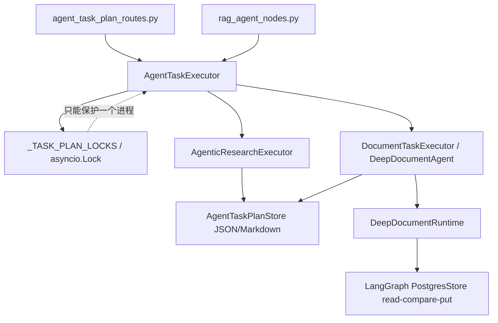

# 问题十二：Agent TaskPlan 多 Worker / 多实例一致性完整解决方案（审查修订版）

> 文档性质：实施设计与代码清单。PostgreSQL 事实表、租约、CAS、fencing 与完整 TaskPlan 生命周期已经写入当前业务模块；正式 10–15 人混合压力测试曾执行但尚未通过，状态模型修复后仍需重跑。当前工程事实以真实代码、迁移和实际测试输出为准。

> 本副本是在 GPT 生成的原始方案（`问题十二-Agent TaskPlan多Worker一致性完整解决方案.md`）基础上，对照当前真实代码逐条审查后直接修改的修订版。原方案的总体方向正确——PostgreSQL 事实表 + 数据库租约 + fencing token + 原子 CAS + 幂等命令表是解决"问题十二"的正确架构，能够修复原问题分析确认的四类缺陷（跨进程重复执行、`record_version` 伪 CAS、JSON 最后写入覆盖、cancel 终态覆盖）。但原方案存在 **5 个必须修复的代码/设计缺陷**与若干健壮性、残余风险问题，不修复会导致"上线即失败"。本副本已全部修复，修改点均以 `【修订】` 标注。

问题现状、复现证据与当前单 Worker 部署边界见：[问题十二现状分析](./【重要问题】多Worker实例时的多线程问题.md)。本文只负责给出从该现状迁移到多 Worker 安全实现的完整落地方案。

## 审查结论与修订清单

审查对照的是当前真实代码：`src/fast_app/services/agent_tasks/agent_task_executor.py`、`agent_task_plan_store.py`、`deep_document_runtime.py`、`deep_document_agent.py`、`document_task_executor.py`、`agent_task_planner.py`、`src/fast_app/services/research/agentic_research_executor.py`、`research_worker_agent.py`、`research_tool_loop.py`、`src/fast_app/api/agent_task_plan_routes.py`、`src/fast_app/dependencies/rag_dependencies.py`、`src/fast_app/main.py`、`src/fast_app/core/config.py`、`src/fast_app/core/exception_handlers.py`、`src/fast_app/db/`、`alembic/env.py`、`alembic/versions/…20260731_0012`、`requirements.txt`（fastapi==0.136.1、langgraph==1.2.2）以及 `scripts/tests/document_security/test_deep_document_checkpoint_runtime.py`。原文引用的模块名、方法名、状态枚举、迁移链、异常码与真实代码一致。

### 必须修复（原方案会直接导致功能失败）

| # | 缺陷 | 位置 | 后果 | 本副本修复 |
|---|---|---|---|---|
| 1 | 原修订版仍把确认前准备和确认后执行混在 `running`，并允许 `waiting_confirmation` 直接进入终态 | §3.3、§7 | UI 无法区分“正在生成确认预览”和“已确认并执行副作用”；数据库也不能以状态证明真实写操作已经人工确认 | 已拆为 `preparing_confirmation` 与 `executing_confirmed`，终态只接受 `executing_confirmed` |
| 2 | `DeepDocumentRuntime.release()` 引用未定义变量 `lease` | §12 | NameError；被 `release_checkpoint()` 的 `except Exception` 吞掉后表现为 checkpoint 永远无法删除 | §12 已改 |
| 3 | 取消收敛竞态：`cancel_atomic` 生效后，运行中执行者保存 CANCELLED 快照、以及 `_run_with_database_lease` 的 `finish_success` 都会因 fence 失效报 409/LEASE_LOST | §13.2、§14.5 | 用户点取消后，正在运行的任务把"已经成功取消"误报为执行失败，SSE/API 返回错误码 | §13.2、§14.5 已改 |
| 4 | 幂等命令终态化导致同键永久卡死：`rejected`/`failed` 命令不允许同键重试，而 execute 的幂等键是服务端确定值、cleanup 键包含 record_version | §9、§13.3、附录 B | 容量 429、瞬时失败后，按 §16.3 语义复用同一 key 重试永远得到 409 `AGENT_TASK_PLAN_IDEMPOTENCY_CONFLICT`；cleanup 失败一次后该任务永远无法清理，且维护脚本未捕获该异常会整体崩溃 | §9 已改（rejected/failed/孤儿 running 可复活重试） |
| 5 | 进程崩溃遗留的 `running` 命令记录没有过期收敛，且 `delete_commands_before()` 只删除终态命令 | §9.2、附录 B | 同键请求永远 `AGENT_TASK_PLAN_BUSY`；命令表无限增长 | §9.2 新增 `expire_stale_running_commands()`，附录 B 已调用 |

### 健壮性修改

6. cleanup 幂等键改为 `cleanup:{task_plan_id}`（不再含 record_version），并捕获 `AgentTaskPlanIdempotencyConflictError` 跳过（附录 B）。
7. `cancel()` 明确不再调用 `release_agentic_checkpoint()`（§13.6 已加注释）；删除 `_ACTIVE_RESEARCH_TASK_PLAN_IDS` 时必须连同 `_run_research_controlled()` 中的 add/discard 行一起删除，否则运行期 NameError。
8. `DeepDocumentRuntime.start(settings, repository)` 签名变化会破坏现有 `test_deep_document_checkpoint_runtime.py` 等测试夹具，§19 已加注必须同步修改。
9. 执行器构造函数与依赖装配的参数列表已与真实 `rag_dependencies.py:345-458` 逐项核对一致；`agent_task_plan_routes.py` 的 GET/SSE 轮询改造点与真实代码逐行对应。

### 二次实现审查修订

首次落地后又通过真实 PostgreSQL 并发回归发现并修复以下实现缺陷：

10. 同一 `failed/rejected` command 被多个 Worker 同键复活时，必须对 command 行执行 `SELECT ... FOR UPDATE`；否则失败调用者可能把唯一执行者的 command 覆盖成 `rejected`。
11. `expire_stale_running_commands()` 只能处理没有匹配有效父租约和 fencing token 的命令，不能仅按 `created_at` 误杀仍在执行的长任务。
12. `_run_with_database_lease()` 无论是在最终 `finish_success`，还是在此前由 heartbeat/安全边界先发现租约丢失，只要数据库中 cancel 已经胜出，都必须返回数据库重读的 `cancelled` 快照，不能返回 runner 的旧结果、继续写 `failed` 或误报租约错误；租约管理器看到 `closing` 后也不能在退出阶段再次用预期的 lost 标记覆盖该结果。
13. `AgentTaskPlanStore` 改为异步接口后，`_resume_locked()` 与 Deep Document 进度事件中的 `load/save` 必须完整 `await`。
14. 不测试数据库语义的历史 Research/Document 回归使用测试目录内的异步内存 Store 与测试租约；生产 Store 不增加文件或内存回退。

### 残余风险（无法在数据库层完全消除，部署侧必须知悉）

- **PostgresSaver checkpoint 写入不受 fencing token 约束**：租约过期、新 Worker 接管后，暂停恢复的旧 Worker 在下一个边界检查前仍可能短暂写入同一 LangGraph thread。§14.2/§14.4 的模型/工具边界 DB 重读能把窗口收敛到心跳间隔以内，但不能降为 0。上线后应监控同一 `thread_id` 的并发写与 `AGENT_TASK_PLAN_LEASE_LOST` 计数。
- **cancel 的检测延迟上限 ≈ 心跳间隔（默认 20s）**：期间旧执行者可能多产生一次模型/只读工具调用成本；真实写副作用仍被 fencing token 与下游业务幂等键挡住。
- **事件循环长停顿（GC pause、DB 慢查询）超过租约时长会自我失败**：这是 fail-fast 的正确方向，但会让长任务被误杀；生产应监控心跳失败次数与 `lease_until` 剩余量。

（以下为修订后的完整方案正文，所有修改点均以 `【修订】` 标注。）

## 一、目标、读者与最终验收结论

本文面向第一次接手本工程的新 Agent。完成实施后，新 Agent 必须能够解释并验证下面这条链路：

```text
HTTP execute / retry / confirm
→ 当前进程 fail-fast 锁
→ PostgreSQL 原子领取 TaskPlan 租约
→ PostgreSQL 全局容量槽
→ 带 fencing token 的执行上下文
→ 模型、工具和进度保存
→ TaskPlan snapshot 原子 CAS
→ DeepDocumentRuntime record 原子 CAS
→ 条件终态保存并释放租约
```

最终必须同时满足六个不变量：

1. 同一 `task_plan_id` 在任意时刻最多只有一个有效执行者。
2. 租约过期或被取消的旧执行者不能续租、保存进度或覆盖终态；新的高风险副作用必须同时经过租约检查和下游幂等屏障。
3. `record_version` 必须由 PostgreSQL 条件更新，旧版本写入返回稳定冲突，不能最后写入覆盖。
4. `cancelled` 是受保护终态，旧执行者不能把它改回任何活动态或终态。
5. confirm/retry/cancel 使用 `Idempotency-Key`；相同请求重放已有结果，不产生第二次副作用。
6. JSON/Markdown 只是可重新生成的审查导出物，PostgreSQL 才是唯一业务事实源。

容量验收与一致性验收必须分开：一致性测试证明“不会重复执行和丢失更新”；10–15 人压测证明指定机器、外部服务配额和配置下的吞吐、延迟与错误率。不能用其中一个替代另一个。

## 二、当前真实代码与需要改变的边界

当前入口和缺口如下：



必须保留的工程边界：

- `AgentTaskExecutor` 继续作为 API/Graph 的统一 Facade。
- Research 与 Document 专用执行器继续存在，不合并业务流程。
- `PostgresSaver` 继续保存 LangGraph checkpoint，不改成自研 checkpoint。
- `POST /rag/chat/stream/events` 与 `pipeline.stream_events()` 仍是结构化主线。
- `/rag/chat/stream` 与 `pipeline.stream()` 仍是 deprecated token-only 链路，本方案不修改它们。
- 不修改 `src/app` 或 `app` 临时学习代码。
- 不使用 `create_agent()` 替换显式 LangGraph RAG Agent 主线。

## 三、目标架构：数据库事实、租约、CAS 与 fencing token

### 3.1 为什么租约之外还必须有 fencing token

只有 `lease_until` 仍不够。旧 Worker 可能在暂停后恢复：

```text
Worker A 取得 lease_owner=A，随后暂停
→ 租约过期
→ Worker B 重新领取
→ Worker A 恢复，并使用旧内存继续写入
```

因此每次领取都要让 `lease_fence_token = lease_fence_token + 1`。A 持有 token 7，B 持有 token 8；所有写 SQL 都要求 token 匹配。即使 A 恢复，它也不能通过 `WHERE lease_fence_token = 7`。

### 3.2 三张事实表与一张容量表

| 表 | 作用 | 关键约束 |
|---|---|---|
| `agent_task_plans` | TaskPlan 唯一事实快照与执行租约 | `record_version` CAS、`lease_fence_token`、单调状态 |
| `agent_task_plan_runtime_records` | Deep Document RuntimeRecord | 独立 `record_version` CAS，同时校验父 TaskPlan 租约 |
| `agent_task_plan_commands` | confirm/retry/cancel 幂等记录 | `(task_plan_id, operation, idempotency_key)` 唯一 |
| `agent_task_capacity_slots` | 多实例共享的复杂任务容量槽 | `(workload_type, slot_no)` 唯一，槽位也使用租约和 token |

### 3.3 状态转换

允许的状态转换必须由服务端常量和 SQL 条件共同限制：

```text
created → preparing_confirmation | failed | cancelled
preparing_confirmation → preparing_confirmation | waiting_confirmation | failed | cancelled
waiting_confirmation → executing_confirmed | cancelled
executing_confirmed → executing_confirmed | completed | completed_with_warnings | failed | cancelled
failed → preparing_confirmation | executing_confirmed | cancelled
completed_with_warnings → executing_confirmed
completed → 不允许离开
cancelled → 不允许离开
```

> 【二次修订】不再兼容 TaskPlan 级 `running`。首次执行先持久化 `preparing_confirmation`，只有生成完整预览后才能进入 `waiting_confirmation`；confirm 在租约内先原子保存 `executing_confirmed`，然后 Document 执行器才允许进入真实写副作用。`completed`、`completed_with_warnings` 只接受 `executing_confirmed`，因此数据库状态本身就是“已经人工确认”的可审计证明。

`preparing_confirmation → preparing_confirmation` 和 `executing_confirmed → executing_confirmed` 用于各自阶段的进度快照；每次仍必须增加 `record_version`。失败重试由强类型 `failure_phase` 决定回到确认前准备还是确认后执行，不能从自然语言错误消息推断。

### 3.4 租约不等于网络调用“恰好一次”

数据库能原子判断谁是当前所有者，却不能撤回已经发到模型、MCP 或 GitLab 的网络请求。下面的微小时序在任何租约系统里都存在：

```text
Worker A 校验 token=7 有效
→ A 发出网络请求
→ token=7 到期，Worker B 取得 token=8
→ A 的网络响应晚到
```

因此本方案提供的是两层保证：

1. TaskPlan、RuntimeRecord、终态和容量槽由 fencing token 保证，旧 Worker 的数据库写入一定失败。
2. 有真实写副作用的外部操作必须另有稳定业务幂等键。当前 GitLab 文档变更链路继续使用 `(task_plan_id, source_id)` 唯一约束、稳定分支/MR 重放；任何未来新增的非幂等写 Tool，都必须先增加同等级的唯一操作记录或使用供应商原生 idempotency key，不能只加一次 `assert_active()`。

模型、检索和只读 Tool 在极端失租时可能产生一次多余调用成本，但其晚到结果不能写回事实库。cancel 也只保证在下一个安全边界收敛，不能声称能强制中断已经在外部执行的请求。

## 四、实施顺序与文件清单

必须按下面顺序实施，任何阶段失败都不要继续向后叠加：

1. 先增加 PostgreSQL 集成测试，复现 stale CAS、双重领取、cancel 竞争。
2. 新增 ORM 表与 Alembic `0013` 迁移。
3. 新增领域租约对象、状态转换常量和异常。
4. 新增 `AgentTaskPlanRepository`，只在这里写并发 SQL。
5. 将 `AgentTaskPlanStore` 改为异步 PostgreSQL Store；拆出只读导出器。
6. 将 `DeepDocumentRuntimeRecord` 迁到业务表并执行原子 CAS。
7. 新增租约心跳与容量槽管理器。
8. 改造 `AgentTaskExecutor` 的 execute/resume/confirm/cancel。
9. 把所有 TaskPlan `save/load/load_markdown` 调用改为 `await`。
10. 修改 FastAPI dependency、SSE 轮询、幂等请求头和响应模型。
11. 维护窗口内导入旧 JSON，切换为数据库唯一读路径。
12. 运行单进程、多进程、多 Worker API 回归和 10–15 人混合压测。

需要新增或修改的真实主线文件：

```text
alembic/versions/20260813_0013_add_agent_task_plan_runtime.py       新增
src/fast_app/db/agent_task_plan_tables.py                          新增
src/fast_app/db/__init__.py                                        修改
alembic/env.py                                                     修改
src/fast_app/domain/agent_task_execution.py                        新增
src/fast_app/services/agent_tasks/agent_task_plan_repository.py    新增
src/fast_app/services/agent_tasks/agent_task_plan_store.py         重构
src/fast_app/services/agent_tasks/agent_task_lease_manager.py      新增
src/fast_app/services/agent_tasks/deep_document_runtime.py         修改
src/fast_app/services/agent_tasks/agent_task_executor.py           修改
src/fast_app/services/research/agentic_research_executor.py        await 调用
src/fast_app/services/research/research_worker_agent.py            失租边界
src/fast_app/services/research/research_tool_loop.py                失租边界
src/fast_app/services/agent_tasks/document_task_executor.py        await 调用
src/fast_app/services/agent_tasks/deep_document_agent.py           await 调用
src/fast_app/graph/rag_agent/rag_agent_nodes.py                    await 调用
src/fast_app/api/agent_task_plan_routes.py                         修改
src/fast_app/dependencies/rag_dependencies.py                      修改
src/fast_app/core/config.py                                        修改
src/fast_app/services/exceptions.py                                修改
src/fast_app/main.py                                               修改
scripts/migrations/import_agent_task_plan_snapshots.py             新增
scripts/tests/document_security/test_agent_task_plan_postgres.py   新增
scripts/tests/document_security/test_agent_task_plan_multiprocess.py 新增
scripts/tests/document_security/accept_agent_task_plan_load.py     新增
scripts/tests/agent_research/test_schema_field_descriptions.py     修改
```

## 五、ORM 表：完整代码

新增 `src/fast_app/db/agent_task_plan_tables.py`：

```python
from __future__ import annotations

from datetime import datetime
from typing import Any

from sqlalchemy import (
    BigInteger,
    CheckConstraint,
    DateTime,
    ForeignKey,
    Index,
    Integer,
    String,
    Text,
    UniqueConstraint,
    func,
    text,
)
from sqlalchemy.dialects.postgresql import JSONB
from sqlalchemy.orm import Mapped, mapped_column

from fast_app.db.base import Base


TASK_PLAN_STATUSES = (
    "created",
    "running",
    "waiting_confirmation",
    "completed",
    "completed_with_warnings",
    "failed",
    "cancelled",
)


class AgentTaskPlanTable(Base):
    __tablename__ = "agent_task_plans"

    task_plan_id: Mapped[str] = mapped_column(String(128), primary_key=True)
    schema_version: Mapped[int] = mapped_column(
        Integer, nullable=False, server_default=text("1")
    )
    task_kind: Mapped[str] = mapped_column(String(64), nullable=False)
    status: Mapped[str] = mapped_column(String(32), nullable=False)
    owner_user_id: Mapped[str] = mapped_column(String(128), nullable=False)
    record_version: Mapped[int] = mapped_column(
        BigInteger, nullable=False, server_default=text("1")
    )
    lease_owner: Mapped[str | None] = mapped_column(String(160), nullable=True)
    lease_until: Mapped[datetime | None] = mapped_column(
        DateTime(timezone=True), nullable=True
    )
    lease_fence_token: Mapped[int] = mapped_column(
        BigInteger, nullable=False, server_default=text("0")
    )
    active_operation: Mapped[str | None] = mapped_column(String(32), nullable=True)
    capacity_workload_type: Mapped[str | None] = mapped_column(
        String(32), nullable=True
    )
    capacity_slot_no: Mapped[int | None] = mapped_column(Integer, nullable=True)
    snapshot_json: Mapped[dict[str, Any]] = mapped_column(JSONB, nullable=False)
    created_at: Mapped[datetime] = mapped_column(
        DateTime(timezone=True), nullable=False, server_default=func.now()
    )
    updated_at: Mapped[datetime] = mapped_column(
        DateTime(timezone=True), nullable=False, server_default=func.now()
    )
    started_at: Mapped[datetime | None] = mapped_column(
        DateTime(timezone=True), nullable=True
    )
    finished_at: Mapped[datetime | None] = mapped_column(
        DateTime(timezone=True), nullable=True
    )

    __table_args__ = (
        CheckConstraint(
            "status IN ("
            "'created','preparing_confirmation','waiting_confirmation',"
            "'executing_confirmed','completed',"
            "'completed_with_warnings','failed','cancelled')",
            name="ck_agent_task_plans_status",
        ),
        CheckConstraint(
            "record_version >= 1", name="ck_agent_task_plans_record_version"
        ),
        CheckConstraint(
            "lease_fence_token >= 0",
            name="ck_agent_task_plans_lease_fence_token",
        ),
        CheckConstraint(
            "(capacity_workload_type IS NULL) = (capacity_slot_no IS NULL)",
            name="ck_agent_task_plans_capacity_pair",
        ),
        Index("idx_agent_task_plans_owner_created", "owner_user_id", "created_at"),
        Index("idx_agent_task_plans_status_updated", "status", "updated_at"),
        Index("idx_agent_task_plans_lease_until", "lease_until"),
    )


class AgentTaskPlanRuntimeRecordTable(Base):
    __tablename__ = "agent_task_plan_runtime_records"

    task_plan_id: Mapped[str] = mapped_column(
        String(128),
        ForeignKey("agent_task_plans.task_plan_id", ondelete="CASCADE"),
        primary_key=True,
    )
    schema_version: Mapped[int] = mapped_column(Integer, nullable=False)
    record_version: Mapped[int] = mapped_column(
        BigInteger, nullable=False, server_default=text("1")
    )
    snapshot_json: Mapped[dict[str, Any]] = mapped_column(JSONB, nullable=False)
    expires_at: Mapped[datetime] = mapped_column(
        DateTime(timezone=True), nullable=False
    )
    updated_at: Mapped[datetime] = mapped_column(
        DateTime(timezone=True), nullable=False, server_default=func.now()
    )

    __table_args__ = (
        CheckConstraint(
            "record_version >= 1",
            name="ck_agent_task_plan_runtime_record_version",
        ),
        Index("idx_agent_task_plan_runtime_expires", "expires_at"),
    )


class AgentTaskPlanCommandTable(Base):
    __tablename__ = "agent_task_plan_commands"

    command_id: Mapped[str] = mapped_column(String(64), primary_key=True)
    task_plan_id: Mapped[str] = mapped_column(
        String(128),
        ForeignKey("agent_task_plans.task_plan_id", ondelete="CASCADE"),
        nullable=False,
    )
    operation: Mapped[str] = mapped_column(String(32), nullable=False)
    idempotency_key: Mapped[str] = mapped_column(String(128), nullable=False)
    request_hash: Mapped[str] = mapped_column(String(64), nullable=False)
    status: Mapped[str] = mapped_column(String(32), nullable=False)
    lease_fence_token: Mapped[int | None] = mapped_column(BigInteger, nullable=True)
    response_json: Mapped[dict[str, Any] | None] = mapped_column(JSONB, nullable=True)
    error_code: Mapped[str | None] = mapped_column(String(128), nullable=True)
    error_message: Mapped[str | None] = mapped_column(Text, nullable=True)
    created_at: Mapped[datetime] = mapped_column(
        DateTime(timezone=True), nullable=False, server_default=func.now()
    )
    updated_at: Mapped[datetime] = mapped_column(
        DateTime(timezone=True), nullable=False, server_default=func.now()
    )
    completed_at: Mapped[datetime | None] = mapped_column(
        DateTime(timezone=True), nullable=True
    )

    __table_args__ = (
        UniqueConstraint(
            "task_plan_id",
            "operation",
            "idempotency_key",
            name="uq_agent_task_plan_command_idempotency",
        ),
        CheckConstraint(
            "status IN ('running','succeeded','failed','rejected','cancelled')",
            name="ck_agent_task_plan_commands_status",
        ),
        Index("idx_agent_task_plan_commands_task_created", "task_plan_id", "created_at"),
    )


class AgentTaskCapacitySlotTable(Base):
    __tablename__ = "agent_task_capacity_slots"

    workload_type: Mapped[str] = mapped_column(String(32), primary_key=True)
    slot_no: Mapped[int] = mapped_column(Integer, primary_key=True)
    lease_owner: Mapped[str | None] = mapped_column(String(160), nullable=True)
    lease_until: Mapped[datetime | None] = mapped_column(
        DateTime(timezone=True), nullable=True
    )
    lease_fence_token: Mapped[int] = mapped_column(
        BigInteger, nullable=False, server_default=text("0")
    )
    task_plan_id: Mapped[str | None] = mapped_column(String(128), nullable=True)
    updated_at: Mapped[datetime] = mapped_column(
        DateTime(timezone=True), nullable=False, server_default=func.now()
    )

    __table_args__ = (
        CheckConstraint("slot_no >= 1", name="ck_agent_task_capacity_slot_no"),
        CheckConstraint(
            "workload_type IN ('research','document')",
            name="ck_agent_task_capacity_workload_type",
        ),
        CheckConstraint(
            "lease_fence_token >= 0",
            name="ck_agent_task_capacity_fence_token",
        ),
        Index("idx_agent_task_capacity_lease", "workload_type", "lease_until"),
    )
```

同步修改 `src/fast_app/db/__init__.py`：导入四个新 ORM 类并加入 `__all__`。同步修改 `alembic/env.py`：

```python
from fast_app.db import agent_task_plan_tables  # noqa: F401,E402
```

这一步不能遗漏，否则 Alembic autogenerate 和元数据检查看不到新表。

## 六、Alembic 0013：完整迁移

新增 `alembic/versions/20260813_0013_add_agent_task_plan_runtime.py`。迁移必须只创建结构，不读取 `runtime/agent-task-plans`；旧文件导入属于维护脚本，不属于数据库 Schema 事务。

```python
"""add PostgreSQL Agent TaskPlan facts, leases and idempotency

Revision ID: 20260813_0013
Revises: 20260731_0012
"""

from alembic import op
import sqlalchemy as sa
from sqlalchemy.dialects import postgresql


revision = "20260813_0013"
down_revision = "20260731_0012"
branch_labels = None
depends_on = None


def upgrade() -> None:
    op.create_table(
        "agent_task_plans",
        sa.Column("task_plan_id", sa.String(128), primary_key=True),
        sa.Column("schema_version", sa.Integer(), server_default=sa.text("1"), nullable=False),
        sa.Column("task_kind", sa.String(64), nullable=False),
        sa.Column("status", sa.String(32), nullable=False),
        sa.Column("owner_user_id", sa.String(128), nullable=False),
        sa.Column("record_version", sa.BigInteger(), server_default=sa.text("1"), nullable=False),
        sa.Column("lease_owner", sa.String(160), nullable=True),
        sa.Column("lease_until", sa.DateTime(timezone=True), nullable=True),
        sa.Column("lease_fence_token", sa.BigInteger(), server_default=sa.text("0"), nullable=False),
        sa.Column("active_operation", sa.String(32), nullable=True),
        sa.Column("capacity_workload_type", sa.String(32), nullable=True),
        sa.Column("capacity_slot_no", sa.Integer(), nullable=True),
        sa.Column("snapshot_json", postgresql.JSONB(), nullable=False),
        sa.Column("created_at", sa.DateTime(timezone=True), server_default=sa.func.now(), nullable=False),
        sa.Column("updated_at", sa.DateTime(timezone=True), server_default=sa.func.now(), nullable=False),
        sa.Column("started_at", sa.DateTime(timezone=True), nullable=True),
        sa.Column("finished_at", sa.DateTime(timezone=True), nullable=True),
        sa.CheckConstraint(
            "status IN ('created','preparing_confirmation','waiting_confirmation',"
            "'executing_confirmed','completed',"
            "'completed_with_warnings','failed','cancelled')",
            name="ck_agent_task_plans_status",
        ),
        sa.CheckConstraint("record_version >= 1", name="ck_agent_task_plans_record_version"),
        sa.CheckConstraint("lease_fence_token >= 0", name="ck_agent_task_plans_lease_fence_token"),
        sa.CheckConstraint(
            "(capacity_workload_type IS NULL) = (capacity_slot_no IS NULL)",
            name="ck_agent_task_plans_capacity_pair",
        ),
    )
    op.create_index("idx_agent_task_plans_owner_created", "agent_task_plans", ["owner_user_id", "created_at"])
    op.create_index("idx_agent_task_plans_status_updated", "agent_task_plans", ["status", "updated_at"])
    op.create_index("idx_agent_task_plans_lease_until", "agent_task_plans", ["lease_until"])

    op.create_table(
        "agent_task_plan_runtime_records",
        sa.Column(
            "task_plan_id",
            sa.String(128),
            sa.ForeignKey("agent_task_plans.task_plan_id", ondelete="CASCADE"),
            primary_key=True,
        ),
        sa.Column("schema_version", sa.Integer(), nullable=False),
        sa.Column("record_version", sa.BigInteger(), server_default=sa.text("1"), nullable=False),
        sa.Column("snapshot_json", postgresql.JSONB(), nullable=False),
        sa.Column("expires_at", sa.DateTime(timezone=True), nullable=False),
        sa.Column("updated_at", sa.DateTime(timezone=True), server_default=sa.func.now(), nullable=False),
        sa.CheckConstraint("record_version >= 1", name="ck_agent_task_plan_runtime_record_version"),
    )
    op.create_index(
        "idx_agent_task_plan_runtime_expires",
        "agent_task_plan_runtime_records",
        ["expires_at"],
    )

    op.create_table(
        "agent_task_plan_commands",
        sa.Column("command_id", sa.String(64), primary_key=True),
        sa.Column(
            "task_plan_id",
            sa.String(128),
            sa.ForeignKey("agent_task_plans.task_plan_id", ondelete="CASCADE"),
            nullable=False,
        ),
        sa.Column("operation", sa.String(32), nullable=False),
        sa.Column("idempotency_key", sa.String(128), nullable=False),
        sa.Column("request_hash", sa.String(64), nullable=False),
        sa.Column("status", sa.String(32), nullable=False),
        sa.Column("lease_fence_token", sa.BigInteger(), nullable=True),
        sa.Column("response_json", postgresql.JSONB(), nullable=True),
        sa.Column("error_code", sa.String(128), nullable=True),
        sa.Column("error_message", sa.Text(), nullable=True),
        sa.Column("created_at", sa.DateTime(timezone=True), server_default=sa.func.now(), nullable=False),
        sa.Column("updated_at", sa.DateTime(timezone=True), server_default=sa.func.now(), nullable=False),
        sa.Column("completed_at", sa.DateTime(timezone=True), nullable=True),
        sa.UniqueConstraint(
            "task_plan_id",
            "operation",
            "idempotency_key",
            name="uq_agent_task_plan_command_idempotency",
        ),
        sa.CheckConstraint(
            "status IN ('running','succeeded','failed','rejected','cancelled')",
            name="ck_agent_task_plan_commands_status",
        ),
    )
    op.create_index(
        "idx_agent_task_plan_commands_task_created",
        "agent_task_plan_commands",
        ["task_plan_id", "created_at"],
    )

    op.create_table(
        "agent_task_capacity_slots",
        sa.Column("workload_type", sa.String(32), primary_key=True),
        sa.Column("slot_no", sa.Integer(), primary_key=True),
        sa.Column("lease_owner", sa.String(160), nullable=True),
        sa.Column("lease_until", sa.DateTime(timezone=True), nullable=True),
        sa.Column("lease_fence_token", sa.BigInteger(), server_default=sa.text("0"), nullable=False),
        sa.Column("task_plan_id", sa.String(128), nullable=True),
        sa.Column("updated_at", sa.DateTime(timezone=True), server_default=sa.func.now(), nullable=False),
        sa.CheckConstraint("slot_no >= 1", name="ck_agent_task_capacity_slot_no"),
        sa.CheckConstraint(
            "workload_type IN ('research','document')",
            name="ck_agent_task_capacity_workload_type",
        ),
        sa.CheckConstraint("lease_fence_token >= 0", name="ck_agent_task_capacity_fence_token"),
    )
    op.create_index(
        "idx_agent_task_capacity_lease",
        "agent_task_capacity_slots",
        ["workload_type", "lease_until"],
    )


def downgrade() -> None:
    op.drop_index("idx_agent_task_capacity_lease", table_name="agent_task_capacity_slots")
    op.drop_table("agent_task_capacity_slots")
    op.drop_index("idx_agent_task_plan_commands_task_created", table_name="agent_task_plan_commands")
    op.drop_table("agent_task_plan_commands")
    op.drop_index("idx_agent_task_plan_runtime_expires", table_name="agent_task_plan_runtime_records")
    op.drop_table("agent_task_plan_runtime_records")
    op.drop_index("idx_agent_task_plans_lease_until", table_name="agent_task_plans")
    op.drop_index("idx_agent_task_plans_status_updated", table_name="agent_task_plans")
    op.drop_index("idx_agent_task_plans_owner_created", table_name="agent_task_plans")
    op.drop_table("agent_task_plans")
```

迁移验证命令：

```powershell
$env:PYTHONPATH = "src"
alembic upgrade head
alembic current
alembic downgrade 20260731_0012
alembic upgrade head
```

只允许在空测试数据库验证 downgrade。已有 TaskPlan 数据的环境禁止直接 downgrade，因为它会删除事实表。

## 七、领域执行上下文与状态机：完整代码

新增 `src/fast_app/domain/agent_task_execution.py`。这里的 `ContextVar` 只传播当前协程已从数据库获得的租约句柄；数据库行仍是事实源，它不是用内存替代分布式锁。

```python
from __future__ import annotations

import asyncio
from contextlib import contextmanager
from contextvars import ContextVar
from dataclasses import dataclass, field
from typing import Iterator, Literal

from fast_app.domain.agent_task_plan import AgentTaskPlanStatus
from fast_app.services.exceptions import AgentTaskPlanLeaseLostError


TaskPlanOperation = Literal["execute", "confirm", "retry", "cleanup"]
TaskPlanWorkloadType = Literal["research", "document"]


@dataclass(slots=True)
class TaskPlanLease:
    task_plan_id: str
    operation: TaskPlanOperation
    owner: str
    fence_token: int
    record_version: int
    command_id: str
    idempotency_key: str
    workload_type: TaskPlanWorkloadType
    capacity_slot_no: int
    capacity_fence_token: int
    lost: asyncio.Event = field(default_factory=asyncio.Event)
    closing: asyncio.Event = field(default_factory=asyncio.Event)

    def assert_active(self) -> None:
        if self.lost.is_set():
            raise AgentTaskPlanLeaseLostError(
                "Agent TaskPlan 租约已经丢失，旧执行者必须停止"
            )


@dataclass(frozen=True, slots=True)
class TaskPlanCommandReplay:
    task_plan_id: str
    operation: str
    idempotency_key: str
    response_json: dict[str, object]


_CURRENT_TASK_PLAN_LEASE: ContextVar[TaskPlanLease | None] = ContextVar(
    "current_agent_task_plan_lease",
    default=None,
)


@contextmanager
def bind_task_plan_lease(lease: TaskPlanLease) -> Iterator[None]:
    token = _CURRENT_TASK_PLAN_LEASE.set(lease)
    try:
        yield
    finally:
        _CURRENT_TASK_PLAN_LEASE.reset(token)


def require_task_plan_lease(task_plan_id: str) -> TaskPlanLease:
    lease = _CURRENT_TASK_PLAN_LEASE.get()
    if lease is None or lease.task_plan_id != task_plan_id:
        raise AgentTaskPlanLeaseLostError(
            "当前执行路径没有有效的 TaskPlan 数据库租约"
        )
    lease.assert_active()
    return lease


ALLOWED_SOURCE_STATUSES_BY_TARGET: dict[AgentTaskPlanStatus, set[AgentTaskPlanStatus]] = {
    AgentTaskPlanStatus.CREATED: set(),
    AgentTaskPlanStatus.PREPARING_CONFIRMATION: {
        AgentTaskPlanStatus.CREATED,
        AgentTaskPlanStatus.PREPARING_CONFIRMATION,
        AgentTaskPlanStatus.FAILED,
    },
    AgentTaskPlanStatus.WAITING_CONFIRMATION: {
        AgentTaskPlanStatus.PREPARING_CONFIRMATION,
    },
    AgentTaskPlanStatus.EXECUTING_CONFIRMED: {
        AgentTaskPlanStatus.WAITING_CONFIRMATION,
        AgentTaskPlanStatus.EXECUTING_CONFIRMED,
        AgentTaskPlanStatus.FAILED,
        AgentTaskPlanStatus.COMPLETED_WITH_WARNINGS,
    },
    AgentTaskPlanStatus.COMPLETED: {
        AgentTaskPlanStatus.EXECUTING_CONFIRMED,
    },
    AgentTaskPlanStatus.COMPLETED_WITH_WARNINGS: {
        AgentTaskPlanStatus.EXECUTING_CONFIRMED,
    },
    AgentTaskPlanStatus.FAILED: {
        AgentTaskPlanStatus.CREATED,
        AgentTaskPlanStatus.PREPARING_CONFIRMATION,
        AgentTaskPlanStatus.EXECUTING_CONFIRMED,
    },
    AgentTaskPlanStatus.CANCELLED: {
        AgentTaskPlanStatus.CREATED,
        AgentTaskPlanStatus.PREPARING_CONFIRMATION,
        AgentTaskPlanStatus.WAITING_CONFIRMATION,
        AgentTaskPlanStatus.EXECUTING_CONFIRMED,
        AgentTaskPlanStatus.FAILED,
    },
}


def allowed_source_status_values(target: AgentTaskPlanStatus) -> list[str]:
    return [item.value for item in ALLOWED_SOURCE_STATUSES_BY_TARGET[target]]
```

这里故意不允许任何目标状态从 `completed` 或 `cancelled` 转出。`completed_with_warnings` 只可重新进入 `executing_confirmed`；确认前与确认后的失败重试由 `failure_phase` 明确路由。

## 八、异常、配置和 API 可观察性

### 8.1 新增稳定异常

在 `src/fast_app/services/exceptions.py` 的 `AgentTaskPlanBusyError` 后增加：

```python
class AgentTaskPlanLeaseLostError(AppServiceError):
    """当前协程持有的 TaskPlan fencing token 已失效。"""

    error_code = "AGENT_TASK_PLAN_LEASE_LOST"
    error_category = "system_error"
    status_code = 409


class AgentTaskPlanVersionConflictError(AppServiceError):
    """TaskPlan 或 RuntimeRecord 的数据库原子 CAS 未命中。"""

    error_code = "AGENT_TASK_PLAN_VERSION_CONFLICT"
    status_code = 409


class AgentTaskPlanIdempotencyConflictError(AppServiceError):
    """同一 Idempotency-Key 被用于不同请求或失败命令。"""

    error_code = "AGENT_TASK_PLAN_IDEMPOTENCY_CONFLICT"
    status_code = 409


class AgentTaskCapacityExceededError(AppServiceError):
    """全服务复杂 Agent 容量槽已经用尽。"""

    error_code = "AGENT_CAPACITY_EXCEEDED"
    status_code = 429

    def __init__(self, message: str, *, retry_after_seconds: int) -> None:
        super().__init__(message)
        self.retry_after_seconds = retry_after_seconds
```

修改 `src/fast_app/core/exception_handlers.py` 的 `handle_app_service_error()` 返回值，让 429 带标准响应头：

```python
        headers = None
        retry_after = getattr(exc, "retry_after_seconds", None)
        if isinstance(retry_after, int) and retry_after > 0:
            headers = {"Retry-After": str(retry_after)}
        return JSONResponse(
            status_code=exc.status_code,
            headers=headers,
            content=build_app_error_response_content(
                exc,
                request_id=request_id,
                trace_id=trace_id,
            ),
        )
```

### 8.2 新增配置

在 `src/fast_app/core/config.py` 的 Agent 配置区增加：

```python
    agent_task_lease_seconds: int = Field(
        default=90,
        ge=30,
        le=600,
        alias="AGENT_TASK_LEASE_SECONDS",
        description="TaskPlan 和容量槽一次数据库租约的有效秒数；心跳必须在到期前续租。",
    )
    agent_task_heartbeat_seconds: int = Field(
        default=20,
        ge=5,
        le=120,
        alias="AGENT_TASK_HEARTBEAT_SECONDS",
        description="运行中 TaskPlan 的数据库续租间隔，必须小于租约时长的三分之一。",
    )
    agent_research_global_concurrency: int = Field(
        default=2,
        ge=1,
        le=64,
        alias="AGENT_RESEARCH_GLOBAL_CONCURRENCY",
        description="所有 FastAPI Worker/实例共享的 Research TaskPlan 最大运行数；默认值只是保守熔断值，不是容量承诺。",
    )
    agent_document_global_concurrency: int = Field(
        default=1,
        ge=1,
        le=32,
        alias="AGENT_DOCUMENT_GLOBAL_CONCURRENCY",
        description="所有 FastAPI Worker/实例共享的 Deep Document TaskPlan 最大运行数；最终值必须由压测确定。",
    )
    agent_task_idempotency_retention_days: int = Field(
        default=7,
        ge=1,
        le=90,
        alias="AGENT_TASK_IDEMPOTENCY_RETENTION_DAYS",
        description="已完成控制命令幂等结果的保留天数。",
    )
```

在现有 `Settings` 的 `model_validator(mode="after")` 中增加约束：

```python
        if self.agent_task_heartbeat_seconds * 3 >= self.agent_task_lease_seconds:
            raise ValueError(
                "AGENT_TASK_HEARTBEAT_SECONDS 必须小于 AGENT_TASK_LEASE_SECONDS 的三分之一"
            )
```

部署环境增加：

```text
AGENT_TASK_LEASE_SECONDS=90
AGENT_TASK_HEARTBEAT_SECONDS=20
AGENT_RESEARCH_GLOBAL_CONCURRENCY=2
AGENT_DOCUMENT_GLOBAL_CONCURRENCY=1
AGENT_TASK_IDEMPOTENCY_RETENTION_DAYS=7
```

这里的 `2/1` 只是上线前的保守保护值。10–15 人压测通过后，必须根据实测结果修改；不能把默认值写成系统容量。

## 九、PostgreSQL Repository：完整核心实现

新增 `src/fast_app/services/agent_tasks/agent_task_plan_repository.py`。Repository 持有 `async_sessionmaker`，每个方法自己打开短 Session。不能把同一个请求级 `AsyncSession` 同时交给心跳任务和主执行协程，因为 SQLAlchemy `AsyncSession` 不支持并发使用。

```python
from __future__ import annotations

from collections.abc import Callable, Collection
from datetime import UTC, datetime
from typing import Any
from uuid import uuid4

from sqlalchemy import delete, exists, func, or_, select, text, update
from sqlalchemy.dialects.postgresql import insert as pg_insert
from sqlalchemy.ext.asyncio import AsyncSession, async_sessionmaker

from fast_app.db.agent_task_plan_tables import (
    AgentTaskCapacitySlotTable,
    AgentTaskPlanCommandTable,
    AgentTaskPlanRuntimeRecordTable,
    AgentTaskPlanTable,
)
from fast_app.domain.agent_task_execution import (
    TaskPlanCommandReplay,
    TaskPlanLease,
    TaskPlanOperation,
    TaskPlanWorkloadType,
    allowed_source_status_values,
)
from fast_app.domain.agent_task_plan import AgentTaskPlanStatus
from fast_app.services.exceptions import (
    AgentTaskCapacityExceededError,
    AgentTaskPlanBusyError,
    AgentTaskPlanIdempotencyConflictError,
    AgentTaskPlanLeaseLostError,
    AgentTaskPlanVersionConflictError,
    AppServiceError,
    DocumentAgentCheckpointConflictError,
    DocumentAgentCheckpointUnavailableError,
    ToolPermissionDeniedError,
)


SnapshotMutator = Callable[[dict[str, Any]], dict[str, Any]]


def _deadline(seconds: int):
    # seconds 来自带上下界的 Settings，不接受请求文本，因此可安全形成固定 interval。
    return func.now() + text(f"INTERVAL '{int(seconds)} seconds'")


def _as_datetime(value: Any) -> datetime:
    """把 model_dump(mode="json") 产生的 ISO 字符串还原为带时区时间。"""
    if isinstance(value, datetime):
        return value
    parsed = datetime.fromisoformat(str(value).replace("Z", "+00:00"))
    if parsed.tzinfo is None:
        raise AppServiceError("持久化时间必须包含时区")
    return parsed


class AgentTaskPlanRepository:
    def __init__(self, session_factory: async_sessionmaker[AsyncSession]) -> None:
        self._session_factory = session_factory

    async def ensure_capacity_slots(self, *, workload_type: str, count: int) -> None:
        values = [
            {"workload_type": workload_type, "slot_no": slot_no}
            for slot_no in range(1, count + 1)
        ]
        async with self._session_factory() as session, session.begin():
            await session.execute(
                pg_insert(AgentTaskCapacitySlotTable)
                .values(values)
                .on_conflict_do_nothing(
                    index_elements=["workload_type", "slot_no"]
                )
            )

    async def create_plan(self, snapshot: dict[str, Any]) -> int:
        task_plan_id = str(snapshot["task_plan_id"])
        owner_user_id = snapshot.get("user_id")
        if not isinstance(owner_user_id, str) or not owner_user_id:
            raise AppServiceError("TaskPlan 缺少有效 owner user_id")
        schema_version = int(snapshot.get("schema_version", 1))
        stmt = (
            pg_insert(AgentTaskPlanTable)
            .values(
                task_plan_id=task_plan_id,
                schema_version=schema_version,
                task_kind=str(snapshot["task_kind"]),
                status=str(snapshot["status"]),
                owner_user_id=owner_user_id,
                record_version=1,
                snapshot_json=snapshot,
                created_at=_as_datetime(snapshot["created_at"]),
                updated_at=func.now(),
            )
            .on_conflict_do_nothing(index_elements=["task_plan_id"])
            .returning(AgentTaskPlanTable.record_version)
        )
        async with self._session_factory() as session, session.begin():
            version = (await session.execute(stmt)).scalar_one_or_none()
        if version is None:
            raise AgentTaskPlanVersionConflictError(
                "相同 task_plan_id 已存在，拒绝覆盖创建"
            )
        return int(version)

    async def load_snapshot(self, task_plan_id: str) -> tuple[dict[str, Any], int]:
        async with self._session_factory() as session:
            row = await session.get(AgentTaskPlanTable, task_plan_id)
            if row is None:
                raise AppServiceError("Agent task plan 不存在")
            return dict(row.snapshot_json), int(row.record_version)

    async def begin_operation(
        self,
        *,
        task_plan_id: str,
        operation: TaskPlanOperation,
        idempotency_key: str,
        request_hash: str,
        worker_id: str,
        allowed_statuses: Collection[AgentTaskPlanStatus],
        workload_type: TaskPlanWorkloadType,
        capacity_limit: int,
        lease_seconds: int,
    ) -> TaskPlanLease | TaskPlanCommandReplay:
        command_id = f"agent_cmd_{uuid4().hex}"
        capacity_missing = False
        lease: TaskPlanLease | None = None

        async with self._session_factory() as session, session.begin():
            inserted = (
                await session.execute(
                    pg_insert(AgentTaskPlanCommandTable)
                    .values(
                        command_id=command_id,
                        task_plan_id=task_plan_id,
                        operation=operation,
                        idempotency_key=idempotency_key,
                        request_hash=request_hash,
                        status="running",
                        updated_at=func.now(),
                    )
                    .on_conflict_do_nothing(
                        constraint="uq_agent_task_plan_command_idempotency"
                    )
                    .returning(AgentTaskPlanCommandTable.command_id)
                )
            ).scalar_one_or_none()

            if inserted is None:
                existing = await session.scalar(
                    select(AgentTaskPlanCommandTable)
                    .where(
                        AgentTaskPlanCommandTable.task_plan_id == task_plan_id,
                        AgentTaskPlanCommandTable.operation == operation,
                        AgentTaskPlanCommandTable.idempotency_key == idempotency_key,
                    )
                    .with_for_update()
                )
                if existing is None:
                    raise AgentTaskPlanIdempotencyConflictError(
                        "幂等记录并发读取失败"
                    )
                if existing.request_hash != request_hash:
                    raise AgentTaskPlanIdempotencyConflictError(
                        "相同 Idempotency-Key 被用于不同请求"
                    )
                if existing.status == "succeeded" and existing.response_json is not None:
                    return TaskPlanCommandReplay(
                        task_plan_id=task_plan_id,
                        operation=operation,
                        idempotency_key=idempotency_key,
                        response_json=dict(existing.response_json),
                    )
                if existing.status == "running":
                    # 【修订】进程崩溃可能留下 running 命令而其租约已经过期。同键重试
                    # 必须复活这种孤儿命令，而不是永远返回 busy。判断依据是任务行
                    # 当前是否仍有属于该命令的有效租约。
                    task_state = (
                        await session.execute(
                            select(
                                AgentTaskPlanTable.lease_owner,
                                AgentTaskPlanTable.lease_until,
                                AgentTaskPlanTable.lease_fence_token,
                            ).where(
                                AgentTaskPlanTable.task_plan_id == task_plan_id
                            )
                        )
                    ).one_or_none()
                    still_owned = (
                        task_state is not None
                        and task_state.lease_owner is not None
                        and task_state.lease_until is not None
                        and task_state.lease_until > datetime.now(UTC)
                        and existing.lease_fence_token
                        == task_state.lease_fence_token
                    )
                    if still_owned:
                        raise AgentTaskPlanBusyError("同一幂等控制请求仍在执行")
                    command_id = existing.command_id
                else:
                    # 【修订】rejected（租约/容量临时拒绝）与 failed（上一次执行失败）
                    # 都允许同键复活重试：这是前端在 429、超时后复用同一 key 的正常
                    # 动作。真实写副作用仍由下游业务幂等键（GitLab MR、(task_plan_id,
                    # source_id) 唯一约束）保证，见 §3.4。
                    command_id = existing.command_id
                existing.status = "running"
                existing.lease_fence_token = None
                existing.response_json = None
                existing.error_code = None
                existing.error_message = None
                existing.completed_at = None
                existing.updated_at = datetime.now(UTC)

            task_row = (
                await session.execute(
                    update(AgentTaskPlanTable)
                    .where(
                        AgentTaskPlanTable.task_plan_id == task_plan_id,
                        AgentTaskPlanTable.status.in_(
                            [item.value for item in allowed_statuses]
                        ),
                        or_(
                            AgentTaskPlanTable.lease_until.is_(None),
                            AgentTaskPlanTable.lease_until <= func.now(),
                        ),
                    )
                    .values(
                        lease_owner=worker_id,
                        lease_until=_deadline(lease_seconds),
                        lease_fence_token=AgentTaskPlanTable.lease_fence_token + 1,
                        active_operation=operation,
                        started_at=func.coalesce(
                            AgentTaskPlanTable.started_at, func.now()
                        ),
                        updated_at=func.now(),
                    )
                    .returning(
                        AgentTaskPlanTable.lease_fence_token,
                        AgentTaskPlanTable.record_version,
                    )
                )
            ).one_or_none()
            if task_row is None:
                command = await session.get(AgentTaskPlanCommandTable, command_id)
                if command is not None:
                    command.status = "rejected"
                    command.error_code = "AGENT_TASK_PLAN_BUSY"
                    command.error_message = "TaskPlan 状态不允许执行或租约仍被占用"
                    command.completed_at = datetime.now(UTC)
                capacity_missing = False
            else:
                slot = await session.scalar(
                    select(AgentTaskCapacitySlotTable)
                    .where(
                        AgentTaskCapacitySlotTable.workload_type == workload_type,
                        AgentTaskCapacitySlotTable.slot_no <= capacity_limit,
                        or_(
                            AgentTaskCapacitySlotTable.lease_until.is_(None),
                            AgentTaskCapacitySlotTable.lease_until <= func.now(),
                        ),
                    )
                    .order_by(AgentTaskCapacitySlotTable.slot_no)
                    .with_for_update(skip_locked=True)
                    .limit(1)
                )
                if slot is None:
                    await session.execute(
                        update(AgentTaskPlanTable)
                        .where(
                            AgentTaskPlanTable.task_plan_id == task_plan_id,
                            AgentTaskPlanTable.lease_owner == worker_id,
                            AgentTaskPlanTable.lease_fence_token
                            == int(task_row.lease_fence_token),
                        )
                        .values(
                            lease_owner=None,
                            lease_until=None,
                            active_operation=None,
                        )
                    )
                    command = await session.get(AgentTaskPlanCommandTable, command_id)
                    if command is not None:
                        command.status = "rejected"
                        command.error_code = "AGENT_CAPACITY_EXCEEDED"
                        command.error_message = "复杂 Agent 全局容量槽已用尽"
                        command.completed_at = datetime.now(UTC)
                    capacity_missing = True
                else:
                    slot_row = (
                        await session.execute(
                            update(AgentTaskCapacitySlotTable)
                            .where(
                                AgentTaskCapacitySlotTable.workload_type == workload_type,
                                AgentTaskCapacitySlotTable.slot_no == slot.slot_no,
                            )
                            .values(
                                lease_owner=worker_id,
                                lease_until=_deadline(lease_seconds),
                                lease_fence_token=(
                                    AgentTaskCapacitySlotTable.lease_fence_token + 1
                                ),
                                task_plan_id=task_plan_id,
                                updated_at=func.now(),
                            )
                            .returning(
                                AgentTaskCapacitySlotTable.lease_fence_token
                            )
                        )
                    ).one()
                    await session.execute(
                        update(AgentTaskPlanTable)
                        .where(
                            AgentTaskPlanTable.task_plan_id == task_plan_id,
                            AgentTaskPlanTable.lease_owner == worker_id,
                            AgentTaskPlanTable.lease_fence_token
                            == int(task_row.lease_fence_token),
                        )
                        .values(
                            capacity_workload_type=workload_type,
                            capacity_slot_no=slot.slot_no,
                        )
                    )
                    command = await session.get(AgentTaskPlanCommandTable, command_id)
                    if command is not None:
                        command.lease_fence_token = int(task_row.lease_fence_token)
                    lease = TaskPlanLease(
                        task_plan_id=task_plan_id,
                        operation=operation,
                        owner=worker_id,
                        fence_token=int(task_row.lease_fence_token),
                        record_version=int(task_row.record_version),
                        command_id=command_id,
                        idempotency_key=idempotency_key,
                        workload_type=workload_type,
                        capacity_slot_no=int(slot.slot_no),
                        capacity_fence_token=int(slot_row.lease_fence_token),
                    )

        if lease is not None:
            return lease
        if capacity_missing:
            raise AgentTaskCapacityExceededError(
                "复杂 Agent 当前已达到全局并发上限",
                retry_after_seconds=lease_seconds,
            )
        raise AgentTaskPlanBusyError(
            "Agent TaskPlan 状态不允许执行或数据库租约仍被占用"
        )

    async def renew_lease(self, lease: TaskPlanLease, *, lease_seconds: int) -> None:
        lease.assert_active()
        async with self._session_factory() as session, session.begin():
            task_result = await session.execute(
                update(AgentTaskPlanTable)
                .where(
                    AgentTaskPlanTable.task_plan_id == lease.task_plan_id,
                    AgentTaskPlanTable.lease_owner == lease.owner,
                    AgentTaskPlanTable.lease_fence_token == lease.fence_token,
                    AgentTaskPlanTable.lease_until > func.now(),
                    AgentTaskPlanTable.status != AgentTaskPlanStatus.CANCELLED.value,
                )
                .values(lease_until=_deadline(lease_seconds), updated_at=func.now())
            )
            slot_result = await session.execute(
                update(AgentTaskCapacitySlotTable)
                .where(
                    AgentTaskCapacitySlotTable.workload_type == lease.workload_type,
                    AgentTaskCapacitySlotTable.slot_no == lease.capacity_slot_no,
                    AgentTaskCapacitySlotTable.lease_owner == lease.owner,
                    AgentTaskCapacitySlotTable.lease_fence_token
                    == lease.capacity_fence_token,
                    AgentTaskCapacitySlotTable.lease_until > func.now(),
                    AgentTaskCapacitySlotTable.task_plan_id == lease.task_plan_id,
                )
                .values(lease_until=_deadline(lease_seconds), updated_at=func.now())
            )
            if task_result.rowcount != 1 or slot_result.rowcount != 1:
                raise AgentTaskPlanLeaseLostError("TaskPlan 或容量槽续租失败")

    async def save_snapshot(
        self,
        *,
        snapshot: dict[str, Any],
        lease: TaskPlanLease,
    ) -> int:
        lease.assert_active()
        target_status = AgentTaskPlanStatus(str(snapshot["status"]))
        stmt = (
            update(AgentTaskPlanTable)
            .where(
                AgentTaskPlanTable.task_plan_id == lease.task_plan_id,
                AgentTaskPlanTable.record_version == lease.record_version,
                AgentTaskPlanTable.lease_owner == lease.owner,
                AgentTaskPlanTable.lease_fence_token == lease.fence_token,
                AgentTaskPlanTable.lease_until > func.now(),
                AgentTaskPlanTable.status.in_(
                    allowed_source_status_values(target_status)
                ),
            )
            .values(
                status=target_status.value,
                snapshot_json=snapshot,
                record_version=AgentTaskPlanTable.record_version + 1,
                updated_at=func.now(),
                finished_at=(
                    func.now()
                    if target_status
                    in {
                        AgentTaskPlanStatus.COMPLETED,
                        AgentTaskPlanStatus.COMPLETED_WITH_WARNINGS,
                        AgentTaskPlanStatus.FAILED,
                    }
                    else AgentTaskPlanTable.finished_at
                ),
            )
            .returning(AgentTaskPlanTable.record_version)
        )
        async with self._session_factory() as session, session.begin():
            version = (await session.execute(stmt)).scalar_one_or_none()
        if version is None:
            raise AgentTaskPlanVersionConflictError(
                "TaskPlan 版本、租约或状态转换发生冲突"
            )
        lease.record_version = int(version)
        return lease.record_version

    async def finish_success(
        self,
        *,
        lease: TaskPlanLease,
        response_json: dict[str, Any],
    ) -> None:
        lease.assert_active()
        task_conditions = [
            AgentTaskPlanTable.task_plan_id == lease.task_plan_id,
            AgentTaskPlanTable.lease_owner == lease.owner,
            AgentTaskPlanTable.lease_fence_token == lease.fence_token,
            AgentTaskPlanTable.lease_until > func.now(),
        ]
        expected_status = response_json.get("status")
        if isinstance(expected_status, str):
            # execute/confirm/retry 的返回快照必须与数据库当前状态一致。
            # cleanup 响应没有 status，因此只验证租约。
            task_conditions.append(AgentTaskPlanTable.status == expected_status)
        async with self._session_factory() as session, session.begin():
            task_result = await session.execute(
                update(AgentTaskPlanTable)
                .where(*task_conditions)
                .values(
                    lease_owner=None,
                    lease_until=None,
                    active_operation=None,
                    capacity_workload_type=None,
                    capacity_slot_no=None,
                    updated_at=func.now(),
                )
            )
            slot_result = await session.execute(
                update(AgentTaskCapacitySlotTable)
                .where(
                    AgentTaskCapacitySlotTable.workload_type == lease.workload_type,
                    AgentTaskCapacitySlotTable.slot_no == lease.capacity_slot_no,
                    AgentTaskCapacitySlotTable.lease_owner == lease.owner,
                    AgentTaskCapacitySlotTable.lease_fence_token
                    == lease.capacity_fence_token,
                    AgentTaskCapacitySlotTable.task_plan_id == lease.task_plan_id,
                )
                .values(
                    lease_owner=None,
                    lease_until=None,
                    task_plan_id=None,
                    updated_at=func.now(),
                )
            )
            command_result = await session.execute(
                update(AgentTaskPlanCommandTable)
                .where(
                    AgentTaskPlanCommandTable.command_id == lease.command_id,
                    AgentTaskPlanCommandTable.status == "running",
                )
                .values(
                    status="succeeded",
                    response_json=response_json,
                    completed_at=func.now(),
                    updated_at=func.now(),
                )
            )
            if (
                task_result.rowcount != 1
                or slot_result.rowcount != 1
                or command_result.rowcount != 1
            ):
                raise AgentTaskPlanLeaseLostError(
                    "完成 TaskPlan 时租约、容量槽或命令状态已经失效"
                )

    async def finish_failure(
        self,
        *,
        lease: TaskPlanLease,
        error_code: str,
        error_message: str,
    ) -> None:
        async with self._session_factory() as session, session.begin():
            await session.execute(
                update(AgentTaskPlanTable)
                .where(
                    AgentTaskPlanTable.task_plan_id == lease.task_plan_id,
                    AgentTaskPlanTable.lease_owner == lease.owner,
                    AgentTaskPlanTable.lease_fence_token == lease.fence_token,
                )
                .values(
                    lease_owner=None,
                    lease_until=None,
                    active_operation=None,
                    capacity_workload_type=None,
                    capacity_slot_no=None,
                    updated_at=func.now(),
                )
            )
            await session.execute(
                update(AgentTaskCapacitySlotTable)
                .where(
                    AgentTaskCapacitySlotTable.workload_type == lease.workload_type,
                    AgentTaskCapacitySlotTable.slot_no == lease.capacity_slot_no,
                    AgentTaskCapacitySlotTable.lease_owner == lease.owner,
                    AgentTaskCapacitySlotTable.lease_fence_token
                    == lease.capacity_fence_token,
                    AgentTaskCapacitySlotTable.task_plan_id == lease.task_plan_id,
                )
                .values(
                    lease_owner=None,
                    lease_until=None,
                    task_plan_id=None,
                    updated_at=func.now(),
                )
            )
            await session.execute(
                update(AgentTaskPlanCommandTable)
                .where(
                    AgentTaskPlanCommandTable.command_id == lease.command_id,
                    AgentTaskPlanCommandTable.status == "running",
                )
                .values(
                    status="failed",
                    error_code=error_code,
                    error_message=error_message[:2000],
                    completed_at=func.now(),
                    updated_at=func.now(),
                )
            )

    async def cancel_atomic(
        self,
        *,
        task_plan_id: str,
        actor_user_id: str,
        can_manage_all: bool,
        idempotency_key: str,
        request_hash: str,
        mutate_snapshot: SnapshotMutator,
    ) -> dict[str, Any]:
        command_id = f"agent_cmd_{uuid4().hex}"
        async with self._session_factory() as session, session.begin():
            inserted = (
                await session.execute(
                    pg_insert(AgentTaskPlanCommandTable)
                    .values(
                        command_id=command_id,
                        task_plan_id=task_plan_id,
                        operation="cancel",
                        idempotency_key=idempotency_key,
                        request_hash=request_hash,
                        status="running",
                    )
                    .on_conflict_do_nothing(
                        constraint="uq_agent_task_plan_command_idempotency"
                    )
                    .returning(AgentTaskPlanCommandTable.command_id)
                )
            ).scalar_one_or_none()
            if inserted is None:
                existing = await session.scalar(
                    select(AgentTaskPlanCommandTable).where(
                        AgentTaskPlanCommandTable.task_plan_id == task_plan_id,
                        AgentTaskPlanCommandTable.operation == "cancel",
                        AgentTaskPlanCommandTable.idempotency_key == idempotency_key,
                    )
                )
                if existing is None or existing.request_hash != request_hash:
                    raise AgentTaskPlanIdempotencyConflictError(
                        "cancel 的 Idempotency-Key 与已有请求冲突"
                    )
                if existing.status == "succeeded" and existing.response_json is not None:
                    return dict(existing.response_json)
                raise AgentTaskPlanBusyError("相同 cancel 请求仍在执行或已经失败")

            row = await session.scalar(
                select(AgentTaskPlanTable)
                .where(AgentTaskPlanTable.task_plan_id == task_plan_id)
                .with_for_update()
            )
            if row is None:
                raise AppServiceError("Agent task plan 不存在")
            if row.owner_user_id != actor_user_id and not can_manage_all:
                raise ToolPermissionDeniedError("只能取消自己创建的 Agent task plan")
            if row.status in {
                AgentTaskPlanStatus.COMPLETED.value,
                AgentTaskPlanStatus.COMPLETED_WITH_WARNINGS.value,
            }:
                raise AppServiceError("已完成的 Agent TaskPlan 不能取消")

            if row.status == AgentTaskPlanStatus.CANCELLED.value:
                cancelled = dict(row.snapshot_json)
            else:
                old_lease_owner = row.lease_owner
                old_workload = row.capacity_workload_type
                old_slot = row.capacity_slot_no
                cancelled = mutate_snapshot(dict(row.snapshot_json))
                row.status = AgentTaskPlanStatus.CANCELLED.value
                row.snapshot_json = cancelled
                row.record_version += 1
                row.lease_fence_token += 1
                row.lease_owner = None
                row.lease_until = None
                row.active_operation = None
                row.capacity_workload_type = None
                row.capacity_slot_no = None
                row.finished_at = datetime.now(UTC)
                row.updated_at = datetime.now(UTC)
                if old_workload is not None and old_slot is not None:
                    await session.execute(
                        update(AgentTaskCapacitySlotTable)
                        .where(
                            AgentTaskCapacitySlotTable.workload_type == old_workload,
                            AgentTaskCapacitySlotTable.slot_no == old_slot,
                            AgentTaskCapacitySlotTable.lease_owner == old_lease_owner,
                            AgentTaskCapacitySlotTable.task_plan_id == task_plan_id,
                        )
                        .values(
                            lease_owner=None,
                            lease_until=None,
                            task_plan_id=None,
                            updated_at=func.now(),
                        )
                    )
                await session.execute(
                    update(AgentTaskPlanCommandTable)
                    .where(
                        AgentTaskPlanCommandTable.task_plan_id == task_plan_id,
                        AgentTaskPlanCommandTable.command_id != command_id,
                        AgentTaskPlanCommandTable.status == "running",
                    )
                    .values(
                        status="cancelled",
                        error_code="AGENT_TASK_PLAN_CANCELLED",
                        completed_at=func.now(),
                        updated_at=func.now(),
                    )
                )

            command = await session.get(AgentTaskPlanCommandTable, command_id)
            if command is None:
                raise AgentTaskPlanIdempotencyConflictError("cancel 命令记录丢失")
            command.status = "succeeded"
            command.response_json = cancelled
            command.completed_at = datetime.now(UTC)
            command.updated_at = datetime.now(UTC)
            return cancelled

    async def create_runtime_record(
        self,
        *,
        snapshot: dict[str, Any],
        lease: TaskPlanLease,
    ) -> None:
        lease.assert_active()
        async with self._session_factory() as session, session.begin():
            parent = await session.scalar(
                select(AgentTaskPlanTable)
                .where(
                    AgentTaskPlanTable.task_plan_id == lease.task_plan_id,
                    AgentTaskPlanTable.lease_owner == lease.owner,
                    AgentTaskPlanTable.lease_fence_token == lease.fence_token,
                    AgentTaskPlanTable.lease_until > func.now(),
                )
                .with_for_update()
            )
            if parent is None:
                raise AgentTaskPlanLeaseLostError(
                    "创建 RuntimeRecord 前 TaskPlan 租约已丢失"
                )
            inserted = (
                await session.execute(
                    pg_insert(AgentTaskPlanRuntimeRecordTable)
                    .values(
                        task_plan_id=lease.task_plan_id,
                        schema_version=int(snapshot["schema_version"]),
                        record_version=int(snapshot["record_version"]),
                        snapshot_json=snapshot,
                        expires_at=_as_datetime(snapshot["expires_at"]),
                        updated_at=func.now(),
                    )
                    .on_conflict_do_nothing(index_elements=["task_plan_id"])
                    .returning(AgentTaskPlanRuntimeRecordTable.task_plan_id)
                )
            ).scalar_one_or_none()
            if inserted is None:
                raise DocumentAgentCheckpointConflictError(
                    "Deep Agent RuntimeRecord 已存在"
                )

    async def load_runtime_record(self, task_plan_id: str) -> dict[str, Any] | None:
        async with self._session_factory() as session:
            row = await session.get(AgentTaskPlanRuntimeRecordTable, task_plan_id)
            return None if row is None else dict(row.snapshot_json)

    async def update_runtime_record(
        self,
        *,
        task_plan_id: str,
        expected_version: int,
        snapshot: dict[str, Any],
        lease: TaskPlanLease,
    ) -> int:
        lease.assert_active()
        owned = exists(
            select(1).where(
                AgentTaskPlanTable.task_plan_id == task_plan_id,
                AgentTaskPlanTable.lease_owner == lease.owner,
                AgentTaskPlanTable.lease_fence_token == lease.fence_token,
                AgentTaskPlanTable.lease_until > func.now(),
                AgentTaskPlanTable.status != AgentTaskPlanStatus.CANCELLED.value,
            )
        )
        stmt = (
            update(AgentTaskPlanRuntimeRecordTable)
            .where(
                AgentTaskPlanRuntimeRecordTable.task_plan_id == task_plan_id,
                AgentTaskPlanRuntimeRecordTable.record_version == expected_version,
                owned,
            )
            .values(
                record_version=AgentTaskPlanRuntimeRecordTable.record_version + 1,
                snapshot_json=snapshot,
                expires_at=_as_datetime(snapshot["expires_at"]),
                updated_at=func.now(),
            )
            .returning(AgentTaskPlanRuntimeRecordTable.record_version)
        )
        async with self._session_factory() as session, session.begin():
            version = (await session.execute(stmt)).scalar_one_or_none()
        if version is None:
            raise DocumentAgentCheckpointConflictError(
                "RuntimeRecord 版本冲突或 TaskPlan 租约已失效"
            )
        return int(version)

    async def delete_runtime_record(
        self,
        task_plan_id: str,
        *,
        lease: TaskPlanLease,
    ) -> None:
        lease.assert_active()
        owned = exists(
            select(1).where(
                AgentTaskPlanTable.task_plan_id == task_plan_id,
                AgentTaskPlanTable.lease_owner == lease.owner,
                AgentTaskPlanTable.lease_fence_token == lease.fence_token,
                AgentTaskPlanTable.lease_until > func.now(),
            )
        )
        async with self._session_factory() as session, session.begin():
            result = await session.execute(
                delete(AgentTaskPlanRuntimeRecordTable).where(
                    AgentTaskPlanRuntimeRecordTable.task_plan_id == task_plan_id,
                    owned,
                )
            )
            if result.rowcount != 1:
                # 【修订·实施补充】记录已不存在时按幂等成功处理（旧 PostgresStore 的
                # delete 对缺失 key 是空操作，`release_checkpoint` 的清理路径依赖该
                # 语义）；记录仍存在但未删除成功，说明父租约已经失效，必须报错。
                remaining = await session.scalar(
                    select(AgentTaskPlanRuntimeRecordTable.task_plan_id).where(
                        AgentTaskPlanRuntimeRecordTable.task_plan_id == task_plan_id
                    )
                )
                if remaining is not None:
                    raise AgentTaskPlanLeaseLostError(
                        "删除 RuntimeRecord 时租约失效或记录不存在"
                    )
```

### 9.1 Repository 代码审查要点

- `begin_operation()` 的 TaskPlan 领取必须是单条 `UPDATE ... WHERE lease expired ... RETURNING`，不能先 `SELECT` 再普通写入。
- 【修订】同键命令的 `rejected`/`failed`/孤儿 `running` 三种状态都要复活重试，只有 `succeeded` 重放、仍持有有效租约的 `running` 才返回 busy；否则 execute 的确定性幂等键和 cleanup 键会永久卡死（见文首修订清单 #4/#5）。
- `save_snapshot()` 同时匹配 `record_version + lease_owner + fence_token + lease_until + allowed source status`。
- `renew_lease()` 明确要求旧租约仍未过期，禁止已过期 Worker 自行复活。
- `cancel_atomic()` 使用 `SELECT FOR UPDATE` 把“读取、生成 cancelled 快照、增加版本、失效 token、释放容量槽”放在同一事务。
- RuntimeRecord 的 CAS 使用 `UPDATE ... WHERE record_version=:expected AND EXISTS(valid parent lease)`。
- `finish_failure()` 是 best-effort 收尾，不能覆盖已被 cancel 或新 Worker 接管的状态。

### 9.2 必须补充的 Repository 维护方法

实现时还要在同一个 Repository 中增加三个小方法（【修订】原方案是两个，本副本新增 `expire_stale_running_commands` 用于收敛崩溃孤儿命令），不允许回到 `PostgresStore`：

```python
    async def list_expired_runtime_task_ids(self, *, limit: int = 100) -> list[str]:
        async with self._session_factory() as session:
            rows = await session.scalars(
                select(AgentTaskPlanRuntimeRecordTable.task_plan_id)
                .where(AgentTaskPlanRuntimeRecordTable.expires_at < func.now())
                .order_by(AgentTaskPlanRuntimeRecordTable.expires_at)
                .limit(limit)
            )
            return list(rows.all())

    async def delete_commands_before(self, cutoff: datetime) -> int:
        async with self._session_factory() as session, session.begin():
            result = await session.execute(
                delete(AgentTaskPlanCommandTable).where(
                    AgentTaskPlanCommandTable.status.in_(
                        ["succeeded", "failed", "rejected", "cancelled"]
                    ),
                    AgentTaskPlanCommandTable.completed_at < cutoff,
                )
            )
            return int(result.rowcount or 0)

    # 【修订】新增：把超过保留期仍未结束的 running 命令按崩溃孤儿收敛为 failed，
    # 否则同键重试永远 AGENT_TASK_PLAN_BUSY，且 delete_commands_before 只删终态命令，
    # 命令表会无限增长。由维护脚本在 delete_commands_before 之前调用。
    async def expire_stale_running_commands(self, cutoff: datetime) -> int:
        active_parent_lease = exists(
            select(1).where(
                AgentTaskPlanTable.task_plan_id
                == AgentTaskPlanCommandTable.task_plan_id,
                AgentTaskPlanTable.lease_owner.is_not(None),
                AgentTaskPlanTable.lease_until > func.now(),
                AgentTaskPlanTable.lease_fence_token
                == AgentTaskPlanCommandTable.lease_fence_token,
            )
        )
        async with self._session_factory() as session, session.begin():
            result = await session.execute(
                update(AgentTaskPlanCommandTable)
                .where(
                    AgentTaskPlanCommandTable.status == "running",
                    AgentTaskPlanCommandTable.created_at < cutoff,
                    ~active_parent_lease,
                )
                .values(
                    status="failed",
                    error_code="AGENT_TASK_PLAN_COMMAND_ORPHANED",
                    error_message="命令超出保留期仍未结束，按崩溃孤儿收敛",
                    completed_at=func.now(),
                    updated_at=func.now(),
                )
            )
            return int(result.rowcount or 0)
```

过期 Runtime 清理不能在每个 Uvicorn Worker 启动时无协调并发执行。最小完整做法是单独的维护命令逐条处理：先尝试为 TaskPlan 领取 `cleanup` 租约，领取成功才删 LangGraph thread 和 runtime row；领取失败跳过，下一轮再处理。

## 十、将 AgentTaskPlanStore 改成异步数据库事实库

保留 `agent_task_plan_store.py` 现有 `_render_task_plan_markdown()` 及其下方渲染函数。把文件顶部和原 `AgentTaskPlanStore` 类替换为下面代码。旧文件写入被降级为 `AgentTaskPlanExportStore`，任何导出失败都不能回滚已提交的数据库事实。

```python
from __future__ import annotations

import asyncio
import json
import os
import tempfile
from datetime import UTC, datetime
from pathlib import Path
from typing import Any

from fast_app.core.config import Settings
from fast_app.core.logging import get_logger
from fast_app.domain.agent_task_execution import (
    TaskPlanCommandReplay,
    TaskPlanLease,
    TaskPlanOperation,
    TaskPlanWorkloadType,
    require_task_plan_lease,
)
from fast_app.domain.agent_task_plan import (
    AgentTaskPlan,
    AgentTaskPlanStatus,
    AgentToolStepStatus,
)
from fast_app.domain.agent_tool_permissions import RoleCode
from fast_app.domain.research_task_plan import ResearchTaskPlan
from fast_app.domain.user_context import CurrentUserContext
from fast_app.services.agent_tasks.agent_task_plan_repository import (
    AgentTaskPlanRepository,
)
from fast_app.services.exceptions import (
    AgentTaskPlanSchemaUnsupportedError,
    AppServiceError,
)


StoredAgentTaskPlan = AgentTaskPlan | ResearchTaskPlan
logger = get_logger(__name__)


def _deserialize_plan(payload: dict[str, Any]) -> StoredAgentTaskPlan:
    if payload.get("task_kind") == "question_decomposition":
        if payload.get("schema_version") != 2:
            raise AgentTaskPlanSchemaUnsupportedError(
                "Research TaskPlan schema_version 不受支持"
            )
        return ResearchTaskPlan.model_validate(payload)
    return AgentTaskPlan.model_validate(payload)


def _cancelled_snapshot(payload: dict[str, Any]) -> dict[str, Any]:
    plan = _deserialize_plan(payload)
    now = datetime.now(UTC)
    plan.status = AgentTaskPlanStatus.CANCELLED
    plan.updated_at = now
    if isinstance(plan, ResearchTaskPlan):
        plan.error_code = None
        plan.error_message = None
        for worker in plan.progress.workers.values():
            if worker.status in {"pending", "running"}:
                worker.status = "skipped"
    else:
        plan.error = None
        for step in plan.steps:
            if step.status in {
                AgentToolStepStatus.PENDING,
                AgentToolStepStatus.RUNNING,
                AgentToolStepStatus.WAITING_CONFIRMATION,
            }:
                step.status = AgentToolStepStatus.SKIPPED
                step.requires_confirmation = False
                step.error = "TaskPlan 已由用户取消"
        plan.final_output.update(
            {
                "status": AgentTaskPlanStatus.CANCELLED.value,
                "cancelled_at": now.isoformat(),
            }
        )
    return plan.model_dump(mode="json")


class AgentTaskPlanExportStore:
    """只生成可重建的 JSON/Markdown 审查导出物，不参与业务读取。"""

    def __init__(self, settings: Settings) -> None:
        self._task_plan_dir = Path(settings.agent_task_plan_dir)

    def save(self, plan: StoredAgentTaskPlan) -> None:
        self._task_plan_dir.mkdir(parents=True, exist_ok=True)
        path = self._path_for(plan)
        self._atomic_write_text(path, plan.model_dump_json(indent=2))
        self._atomic_write_text(
            path.with_suffix(".md"),
            _render_task_plan_markdown(plan),
        )

    def _path_for(self, plan: StoredAgentTaskPlan) -> Path:
        existing = sorted(
            self._task_plan_dir.glob(f"*_{plan.task_plan_id}.json")
        )
        if existing:
            return existing[-1]
        created = plan.created_at.strftime("%Y%m%d_%H%M%S")
        return self._task_plan_dir / f"{created}_{plan.task_plan_id}.json"

    @staticmethod
    def _atomic_write_text(path: Path, content: str) -> None:
        temp_path: Path | None = None
        try:
            with tempfile.NamedTemporaryFile(
                mode="w",
                encoding="utf-8",
                dir=path.parent,
                prefix=f".{path.name}.",
                suffix=".tmp",
                delete=False,
            ) as handle:
                handle.write(content)
                handle.flush()
                os.fsync(handle.fileno())
                temp_path = Path(handle.name)
            os.replace(temp_path, path)
        finally:
            if temp_path is not None and temp_path.exists():
                temp_path.unlink(missing_ok=True)


class AgentTaskPlanStore:
    """PostgreSQL TaskPlan 事实库；JSON/Markdown 仅做 best-effort 导出。"""

    def __init__(
        self,
        *,
        repository: AgentTaskPlanRepository,
        export_store: AgentTaskPlanExportStore,
    ) -> None:
        self.repository = repository
        self._export_store = export_store

    async def create(self, plan: StoredAgentTaskPlan) -> StoredAgentTaskPlan:
        plan.updated_at = datetime.now(UTC)
        await self.repository.create_plan(plan.model_dump(mode="json"))
        await self._export(plan)
        return plan

    async def load(self, task_plan_id: str) -> StoredAgentTaskPlan:
        if not task_plan_id.startswith("task_plan_"):
            raise AppServiceError("非法 task_plan_id")
        payload, _version = await self.repository.load_snapshot(task_plan_id)
        return _deserialize_plan(payload)

    async def load_with_version(
        self, task_plan_id: str
    ) -> tuple[StoredAgentTaskPlan, int]:
        payload, version = await self.repository.load_snapshot(task_plan_id)
        return _deserialize_plan(payload), version

    async def load_markdown(self, task_plan_id: str) -> str:
        plan = await self.load(task_plan_id)
        return _render_task_plan_markdown(plan)

    async def save(self, plan: StoredAgentTaskPlan) -> StoredAgentTaskPlan:
        lease = require_task_plan_lease(plan.task_plan_id)
        plan.updated_at = datetime.now(UTC)
        await self.repository.save_snapshot(
            snapshot=plan.model_dump(mode="json"),
            lease=lease,
        )
        await self._export(plan)
        return plan

    async def begin_operation(
        self,
        *,
        task_plan_id: str,
        operation: TaskPlanOperation,
        idempotency_key: str,
        request_hash: str,
        worker_id: str,
        allowed_statuses: set[AgentTaskPlanStatus],
        workload_type: TaskPlanWorkloadType,
        capacity_limit: int,
        lease_seconds: int,
    ) -> TaskPlanLease | TaskPlanCommandReplay:
        return await self.repository.begin_operation(
            task_plan_id=task_plan_id,
            operation=operation,
            idempotency_key=idempotency_key,
            request_hash=request_hash,
            worker_id=worker_id,
            allowed_statuses=allowed_statuses,
            workload_type=workload_type,
            capacity_limit=capacity_limit,
            lease_seconds=lease_seconds,
        )

    async def cancel(
        self,
        *,
        task_plan_id: str,
        user: CurrentUserContext,
        idempotency_key: str,
        request_hash: str,
    ) -> StoredAgentTaskPlan:
        payload = await self.repository.cancel_atomic(
            task_plan_id=task_plan_id,
            actor_user_id=user.user_id,
            can_manage_all=user.has_global_role(RoleCode.SYSTEM_ADMIN.value),
            idempotency_key=idempotency_key,
            request_hash=request_hash,
            mutate_snapshot=_cancelled_snapshot,
        )
        plan = _deserialize_plan(payload)
        await self._export(plan)
        return plan

    async def _export(self, plan: StoredAgentTaskPlan) -> None:
        try:
            await asyncio.to_thread(self._export_store.save, plan.model_copy(deep=True))
        except OSError as exc:
            logger.warning(
                "TaskPlan 审查导出失败，不回滚数据库事实: %s",
                type(exc).__name__,
            )
```

旧 `load()` 的文件 fallback 必须删除。否则某个实例读不到数据库记录时可能退回旧 JSON，重新引入双事实源。

## 十一、租约心跳管理器：完整代码

新增 `src/fast_app/services/agent_tasks/agent_task_lease_manager.py`：

```python
from __future__ import annotations

import asyncio
import hashlib
import json
import os
import socket
from contextlib import asynccontextmanager
from typing import AsyncIterator, Any
from uuid import uuid4

from fast_app.core.config import Settings
from fast_app.domain.agent_task_execution import (
    TaskPlanCommandReplay,
    TaskPlanLease,
    TaskPlanOperation,
    TaskPlanWorkloadType,
    bind_task_plan_lease,
)
from fast_app.domain.agent_task_plan import AgentTaskPlanStatus
from fast_app.services.agent_tasks.agent_task_plan_store import AgentTaskPlanStore


def build_request_hash(
    *, task_plan_id: str, operation: str, payload: dict[str, Any]
) -> str:
    canonical = json.dumps(
        {
            "task_plan_id": task_plan_id,
            "operation": operation,
            "payload": payload,
        },
        ensure_ascii=False,
        sort_keys=True,
        separators=(",", ":"),
    )
    return hashlib.sha256(canonical.encode("utf-8")).hexdigest()


class AgentTaskLeaseManager:
    def __init__(self, *, settings: Settings, store: AgentTaskPlanStore) -> None:
        self._settings = settings
        self._store = store
        self.worker_id = (
            f"{socket.gethostname()}:{os.getpid()}:{uuid4().hex[:12]}"
        )

    @asynccontextmanager
    async def hold(
        self,
        *,
        task_plan_id: str,
        operation: TaskPlanOperation,
        idempotency_key: str,
        request_payload: dict[str, Any],
        allowed_statuses: set[AgentTaskPlanStatus],
        workload_type: TaskPlanWorkloadType,
    ) -> AsyncIterator[TaskPlanLease | TaskPlanCommandReplay]:
        capacity_limit = (
            self._settings.agent_research_global_concurrency
            if workload_type == "research"
            else self._settings.agent_document_global_concurrency
        )
        acquired = await self._store.begin_operation(
            task_plan_id=task_plan_id,
            operation=operation,
            idempotency_key=idempotency_key,
            request_hash=build_request_hash(
                task_plan_id=task_plan_id,
                operation=operation,
                payload=request_payload,
            ),
            worker_id=self.worker_id,
            allowed_statuses=allowed_statuses,
            workload_type=workload_type,
            capacity_limit=capacity_limit,
            lease_seconds=self._settings.agent_task_lease_seconds,
        )
        if isinstance(acquired, TaskPlanCommandReplay):
            yield acquired
            return

        stop = asyncio.Event()
        heartbeat = asyncio.create_task(self._heartbeat(acquired, stop))
        with bind_task_plan_lease(acquired):
            try:
                yield acquired
                if not acquired.closing.is_set():
                    acquired.assert_active()
            finally:
                stop.set()
                heartbeat.cancel()
                try:
                    await heartbeat
                except asyncio.CancelledError:
                    pass
                except BaseException:
                    # 心跳异常已经通过 lease.lost 传给主执行路径；清理阶段不再
                    # 用它覆盖主异常或成功返回前的 acquired.assert_active()。
                    pass

    async def _heartbeat(self, lease: TaskPlanLease, stop: asyncio.Event) -> None:
        try:
            while True:
                stop_task = asyncio.create_task(stop.wait())
                closing_task = asyncio.create_task(lease.closing.wait())
                done, pending = await asyncio.wait(
                    {stop_task, closing_task},
                    timeout=self._settings.agent_task_heartbeat_seconds,
                    return_when=asyncio.FIRST_COMPLETED,
                )
                for task in pending:
                    task.cancel()
                if pending:
                    await asyncio.gather(*pending, return_exceptions=True)
                if done:
                    return
                await self._store.repository.renew_lease(
                    lease,
                    lease_seconds=self._settings.agent_task_lease_seconds,
                )
        except asyncio.CancelledError:
            raise
        except BaseException:
            if lease.closing.is_set():
                return
            lease.lost.set()
            raise
```

心跳任务失败后设置 `lease.lost`。主执行协程必须在每个模型调用、工具调用和真实副作用之前调用 `require_task_plan_lease(task_plan_id).assert_active()`。只在最终保存时检查太晚，因为旧 Worker 可能已经产生第二次外部副作用。

## 十二、DeepDocumentRuntime：把伪 CAS 改成数据库原子 CAS

`PostgresSaver` 继续负责加密 checkpoint；删除 `PostgresStore` 作为 RuntimeRecord 事实库。修改 `deep_document_runtime.py`：

1. 删除 `from langgraph.store.postgres import PostgresStore`。
2. 导入 `require_task_plan_lease` 和 `AgentTaskPlanRepository`。
3. `DeepDocumentRuntime.__init__()` 接收 `repository`，不再接收 `store`。
4. `start()` 接收同一个 repository，不再创建/`setup()` PostgresStore，也不在每个 Worker 启动时运行无协调清理。
5. 用下面方法替换 RuntimeRecord 的 create/load/update/release。

> 【修订】`start()` 新增了必传 `repository` 参数：`main.py` 与附录 B 维护脚本已同步传参，但现有测试夹具（`scripts/tests/document_security/test_deep_document_checkpoint_runtime.py` 等）直接调用 `DeepDocumentRuntime.start(settings)` 的用例必须同步改为传入 Repository，否则测试启动即失败。§19 已列入回归清单。

```python
    def __init__(
        self,
        *,
        settings: Settings,
        pool: ConnectionPool,
        checkpointer: _AsyncPostgresSaverAdapter,
        repository: AgentTaskPlanRepository,
    ) -> None:
        self.settings = settings
        self.pool = pool
        self.checkpointer = checkpointer
        self.repository = repository

    @classmethod
    async def start(
        cls,
        settings: Settings,
        repository: AgentTaskPlanRepository,
    ) -> "DeepDocumentRuntime":
        raw_key = decode_langgraph_aes_key(settings.langgraph_aes_key_base64)
        serializer = EncryptedSerializer.from_pycryptodome_aes(
            serde=JsonPlusSerializer(
                pickle_fallback=False,
                allowed_msgpack_modules=None,
            ),
            key=raw_key,
        )
        pool = ConnectionPool(
            _psycopg_connection_string(settings.database_url),
            min_size=1,
            max_size=max(
                1,
                settings.database_pool_size + settings.database_max_overflow,
            ),
            kwargs={
                "autocommit": True,
                "prepare_threshold": 0,
                "row_factory": dict_row,
            },
            open=False,
        )
        try:
            await asyncio.to_thread(pool.open, wait=True)
            saver = PostgresSaver(pool, serde=serializer)
            await asyncio.to_thread(saver.setup)
            return cls(
                settings=settings,
                pool=pool,
                checkpointer=_AsyncPostgresSaverAdapter(saver),
                repository=repository,
            )
        except BaseException:
            await asyncio.to_thread(pool.close)
            raise

    async def create_record(
        self,
        *,
        task_plan_id: str,
        acl_fingerprint: str,
    ) -> DeepDocumentRuntimeRecord:
        lease = require_task_plan_lease(task_plan_id)
        now = datetime.now(UTC)
        record = DeepDocumentRuntimeRecord(
            task_plan_id=task_plan_id,
            thread_id=self.thread_id(task_plan_id),
            acl_fingerprint=acl_fingerprint,
            status="running",
            expires_at=self.retention_deadline(),
            updated_at=now,
        )
        await self.repository.create_runtime_record(
            snapshot=record.model_dump(mode="json"),
            lease=lease,
        )
        return record

    async def load_record(
        self, task_plan_id: str
    ) -> DeepDocumentRuntimeRecord | None:
        payload = await self.repository.load_runtime_record(task_plan_id)
        if payload is None:
            return None
        try:
            record = DeepDocumentRuntimeRecord.model_validate(payload)
        except Exception as exc:
            raise DocumentAgentCheckpointUnavailableError(
                "Deep Agent 运行记录损坏或版本不兼容"
            ) from exc
        if record.schema_version != _RUNTIME_SCHEMA_VERSION:
            raise DocumentAgentCheckpointUnavailableError(
                "Deep Agent 运行记录版本不受支持"
            )
        return record

    async def update_record(
        self,
        task_plan_id: str,
        *,
        expected_version: int,
        updates: dict[str, Any],
    ) -> DeepDocumentRuntimeRecord:
        lease = require_task_plan_lease(task_plan_id)
        current = await self.load_record(task_plan_id)
        if current is None:
            raise DocumentAgentCheckpointUnavailableError(
                "Deep Agent 运行记录不存在"
            )
        if current.record_version != expected_version:
            raise DocumentAgentCheckpointConflictError(
                "Deep Agent 运行记录版本已变化"
            )
        record = DeepDocumentRuntimeRecord.model_validate(
            {
                **current.model_dump(mode="python"),
                **updates,
                "record_version": current.record_version + 1,
                "updated_at": datetime.now(UTC),
                "expires_at": self.retention_deadline(),
            }
        )
        version = await self.repository.update_runtime_record(
            task_plan_id=task_plan_id,
            expected_version=expected_version,
            snapshot=record.model_dump(mode="json"),
            lease=lease,
        )
        if version != record.record_version:
            raise DocumentAgentCheckpointConflictError(
                "RuntimeRecord 数据库版本与返回模型不一致"
            )
        return record

    async def release(self, task_plan_id: str) -> None:
        # 【修订】原方案此处引用未定义的 lease 变量（运行时 NameError），
        # 且会被 release_checkpoint 的 except Exception 吞掉，表现为 checkpoint
        # 永远无法删除。必须先取出 ContextVar 中的租约句柄。
        lease = require_task_plan_lease(task_plan_id)
        lease.assert_active()
        await self.checkpointer.adelete_thread(self.thread_id(task_plan_id))
        await self.repository.delete_runtime_record(task_plan_id, lease=lease)
```

取消接口不再直接调用 `release_agentic_checkpoint()`。cancel 会先失效 fencing token；旧执行者在安全边界停止。Checkpoint 和 RuntimeRecord 由持有有效租约的正常终态路径释放，或由独立 cleanup 命令在保留期后清理。这样不会出现 cancel 与仍在写 checkpoint 的 Graph 同时删除同一 thread。

> 【修订·实施补充】迁移后旧版 LangGraph PostgresStore 表（官方 `store` 表）中的历史 RuntimeRecord 行不会自动迁移，也不再被新版启动清理覆盖。它们只用于旧任务的恢复登记，新流程读不到即按"无记录"重建；如需回收，可在维护窗口按官方 Store 的保留策略人工清理。旧 `runtime/agent-task-plans` JSON 则由 §17 的导入脚本迁入 PostgreSQL。

## 十三、AgentTaskExecutor：完整控制协议

### 13.1 构造函数和保存入口

给 `AgentTaskExecutor.__init__()` 增加 `lease_manager: AgentTaskLeaseManager`，保存为 `self._lease_manager`。将 `save_plan()` 改为：

```python
    async def save_plan(
        self, plan: AgentTaskPlan | ResearchTaskPlan
    ) -> None:
        await self._task_plan_store.create(plan)
```

将 `_load_owned_plan()` 改为 `async def`，内部使用：

```python
        plan = await self._task_plan_store.load(task_plan_id)
```

所有调用点同步改成 `await self._load_owned_plan(...)`。

### 13.2 通用数据库租约执行器

在 `AgentTaskExecutor` 内新增以下方法。它负责重放、心跳、数据库事实重读、成功释放和异常收尾，Research/Document 业务仍留在原专用执行器。

```python
    async def _run_with_database_lease(
        self,
        *,
        task_plan_id: str,
        operation: TaskPlanOperation,
        idempotency_key: str,
        request_payload: dict[str, Any],
        allowed_statuses: set[AgentTaskPlanStatus],
        workload_type: TaskPlanWorkloadType,
        runner: Callable[
            [AgentTaskPlan | ResearchTaskPlan],
            Awaitable[AgentTaskPlan | ResearchTaskPlan],
        ],
    ) -> AgentTaskPlan | ResearchTaskPlan:
        async with self._lease_manager.hold(
            task_plan_id=task_plan_id,
            operation=operation,
            idempotency_key=idempotency_key,
            request_payload=request_payload,
            allowed_statuses=allowed_statuses,
            workload_type=workload_type,
        ) as acquired:
            if isinstance(acquired, TaskPlanCommandReplay):
                return self._task_plan_store.from_snapshot(
                    dict(acquired.response_json)
                )
            lease = acquired
            try:
                current = await self._task_plan_store.load(task_plan_id)
                result = await runner(current)
                lease.assert_active()
                # 先通知心跳停止续租，再释放数据库租约，避免成功释放与
                # heartbeat UPDATE 竞态产生假的 lease-lost。
                lease.closing.set()
                try:
                    await self._task_plan_store.repository.finish_success(
                        lease=lease,
                        response_json=result.model_dump(mode="json"),
                    )
                except AgentTaskPlanLeaseLostError:
                    # 【修订】用户取消可能恰好在 runner 返回后发生：cancel_atomic
                    # 已经递增 fence token 并清空租约，finish_success 必然不命中。
                    # 此时数据库状态已经是 cancelled，取消已经收敛，不应把成功的
                    # 取消误报为执行失败。
                    latest = await self._task_plan_store.load(task_plan_id)
                    if latest.status != AgentTaskPlanStatus.CANCELLED:
                        raise
                    return latest
                return result
            except BaseException as exc:
                lease.closing.set()
                if isinstance(exc, AgentTaskPlanLeaseLostError):
                    # 【二次修订】heartbeat/安全边界可能先于 finish_success
                    # 发现 cancel_atomic 已撤销当前租约；以数据库终态为准，
                    # 不再把已经成功持久化的取消收尾成 failed。
                    latest = await self._task_plan_store.load(task_plan_id)
                    if latest.status == AgentTaskPlanStatus.CANCELLED:
                        return latest
                await self._task_plan_store.repository.finish_failure(
                    lease=lease,
                    error_code=getattr(exc, "error_code", type(exc).__name__),
                    error_message=str(exc),
                )
                raise
```

同时给 Store 增加公开方法，避免 Executor 引用私有反序列化函数：

```python
    @staticmethod
    def from_snapshot(payload: dict[str, Any]) -> StoredAgentTaskPlan:
        return _deserialize_plan(payload)
```

`finish_failure()` 不得覆盖 TaskPlan 快照，只释放仍属于自己的租约并记录命令失败；现有专用执行器仍负责把可恢复失败状态写入 plan。若租约已被 cancel 失效，条件更新不会覆盖新状态。

### 13.3 首次 Document execute

用下面实现替换 `execute()`。内部 `execute` 的幂等键由服务端稳定 TaskPlan ID 生成，因为 TaskPlan ID 本身就是一次规划结果的唯一身份。

```python
    async def execute(
        self,
        plan: AgentTaskPlan,
        user: CurrentUserContext,
        mode: str,
        top_k: int,
        candidate_k: int | None,
        min_score: float,
        filters: RetrievalFilters,
        langchain_config_factory: LangChainConfigFactory | None = None,
    ) -> AgentTaskPlan:
        try:
            await self._task_plan_store.create(plan)
        except AgentTaskPlanVersionConflictError:
            # 同一 TaskPlan 的请求重放交给 execute 命令幂等记录处理。
            pass

        async with _TASK_PLAN_LOCKS.hold(plan.task_plan_id):
            result = await self._run_with_database_lease(
                task_plan_id=plan.task_plan_id,
                operation="execute",
                idempotency_key=f"execute:{plan.task_plan_id}",
                request_payload={},
                allowed_statuses={AgentTaskPlanStatus.CREATED},
                workload_type="document",
                runner=lambda current: self._document_executor.execute(
                    plan=current,
                    user=user,
                    mode=mode,
                    top_k=top_k,
                    candidate_k=candidate_k,
                    min_score=min_score,
                    filters=filters,
                    langchain_config_factory=langchain_config_factory,
                ),
            )
        if not isinstance(result, AgentTaskPlan):
            raise AppServiceError("Document execute 返回了错误的 TaskPlan 类型")
        return result
```

> 【修订】execute 的幂等键 `execute:{task_plan_id}` 是服务端确定值。若首次执行失败，命令记录进入 `failed`；配合 §9 的复活重试语义，同一 TaskPlan 再次 execute 会重新领取租约而不是返回 `AGENT_TASK_PLAN_IDEMPOTENCY_CONFLICT`。注意 execute 请求参数不参与 request_hash（`request_payload={}`），同一 TaskPlan 的再次 execute 即使检索参数不同也会命中同一条幂等命令。

### 13.4 confirm

`confirm()` 新增必传 `idempotency_key: str`，保留进程内 fail-fast 锁，再进入数据库租约：

```python
    async def confirm(
        self,
        task_plan_id: str,
        user: CurrentUserContext,
        idempotency_key: str,
        langchain_config_factory: LangChainConfigFactory | None = None,
    ) -> AgentTaskPlan | ResearchTaskPlan:
        async with _TASK_PLAN_LOCKS.hold(task_plan_id):
            hint = await self._load_owned_plan(task_plan_id, user)
            workload_type: TaskPlanWorkloadType = (
                "research"
                if hint.task_kind == "question_decomposition"
                else "document"
            )

            async def run(current):
                # 租约内再次执行归属、身份、状态和当前 ACL 校验。
                current = await self._load_owned_plan(task_plan_id, user)
                if current.status != AgentTaskPlanStatus.WAITING_CONFIRMATION:
                    raise AppServiceError(
                        "Agent task plan 状态不是 waiting_confirmation，拒绝执行"
                    )
                if not user.is_authenticated:
                    raise ToolPermissionDeniedError(
                        "当前用户身份已失效，拒绝执行计划"
                    )
                if isinstance(current, ResearchTaskPlan):
                    return await self._run_research_controlled(
                        current,
                        user,
                        langchain_config_factory=langchain_config_factory,
                        resume=False,
                    )
                return await self._document_executor.confirm(
                    plan=current,
                    user=user,
                )

            return await self._run_with_database_lease(
                task_plan_id=task_plan_id,
                operation="confirm",
                idempotency_key=idempotency_key,
                request_payload={"confirmed": True},
                allowed_statuses={AgentTaskPlanStatus.WAITING_CONFIRMATION},
                workload_type=workload_type,
                runner=run,
            )
```

### 13.5 retry/resume

`resume()` 同样新增 `idempotency_key`。先只把数据库中的当前任务类型作为领取参数，领取后再重新鉴权和检查状态：

```python
    async def resume(
        self,
        task_plan_id: str,
        user: CurrentUserContext,
        idempotency_key: str,
        langchain_config_factory: LangChainConfigFactory | None = None,
    ) -> AgentTaskPlan | ResearchTaskPlan:
        async with _TASK_PLAN_LOCKS.hold(task_plan_id):
            hint = await self._load_owned_plan(task_plan_id, user)
            is_research = isinstance(hint, ResearchTaskPlan)
            allowed = (
                {
                    AgentTaskPlanStatus.EXECUTING_CONFIRMED,
                    AgentTaskPlanStatus.FAILED,
                    AgentTaskPlanStatus.COMPLETED_WITH_WARNINGS,
                }
                if is_research
                else {
                    AgentTaskPlanStatus.PREPARING_CONFIRMATION,
                    AgentTaskPlanStatus.EXECUTING_CONFIRMED,
                    AgentTaskPlanStatus.FAILED,
                }
            )

            async def run(_current):
                return await self._resume_locked(
                    task_plan_id,
                    user,
                    langchain_config_factory=langchain_config_factory,
                )

            return await self._run_with_database_lease(
                task_plan_id=task_plan_id,
                operation="retry",
                idempotency_key=idempotency_key,
                request_payload={},
                allowed_statuses=allowed,
                workload_type="research" if is_research else "document",
                runner=run,
            )
```

### 13.6 cancel

用数据库原子 cancel 替换当前“load → Python 修改 → save”。cancel 不等待任务锁，也不立即删除正在使用的 checkpoint：

```python
    async def cancel(
        self,
        task_plan_id: str,
        user: CurrentUserContext,
        idempotency_key: str,
    ) -> AgentTaskPlan | ResearchTaskPlan:
        return await self._task_plan_store.cancel(
            task_plan_id=task_plan_id,
            user=user,
            idempotency_key=idempotency_key,
            request_hash=build_request_hash(
                task_plan_id=task_plan_id,
                operation="cancel",
                payload={},
            ),
        )
```

删除 `_ACTIVE_RESEARCH_TASK_PLAN_IDS`。数据库租约已经覆盖单进程和多进程，继续维护第二份内存活动集合会形成不一致的双重判断。进程内 `_TASK_PLAN_LOCKS` 可以保留，作用只是让同进程重复请求更快返回 409；数据库租约始终是最终权限事实。

> 【修订】删除 `_ACTIVE_RESEARCH_TASK_PLAN_IDS` 时必须同时删除 `_run_research_controlled()` 中的 `if task_plan_id in _ACTIVE_RESEARCH_TASK_PLAN_IDS: raise ...` 分支和 `finally` 中的 `discard(...)` 行，否则运行期 NameError；进程内同任务互斥仍由 `_TASK_PLAN_LOCKS` 提供（confirm/resume 均在锁内）。另：上面的 `cancel()` 已按 §12 的约定不再调用 `release_agentic_checkpoint()`——取消后 checkpoint 由持有有效租约的正常终态路径释放，或由附录 B 的维护命令在保留期后清理，避免与仍在写 checkpoint 的执行者竞争。

### 13.7 Executor 必需导入

`agent_task_executor.py` 增加：

```python
from collections.abc import Awaitable, Callable
from typing import Any

from fast_app.domain.agent_task_execution import (
    TaskPlanCommandReplay,
    TaskPlanOperation,
    TaskPlanWorkloadType,
)
from fast_app.services.agent_tasks.agent_task_lease_manager import (
    AgentTaskLeaseManager,
    build_request_hash,
)
from fast_app.services.exceptions import (
    AgentTaskPlanLeaseLostError,
    AgentTaskPlanVersionConflictError,
)
```

保留原 `Callable` 时要合并导入，不要制造重复 import。

## 十四、所有执行器改为异步 Store，并增加失租安全边界

### 14.1 机械改造清单

下面四类调用全部改成异步：

```python
# 旧
self._task_plan_store.save(plan)
latest = self._task_plan_store.load(task_plan_id)
plan = task_plan_store.load(task_plan_id)
return task_plan_store.load_markdown(task_plan_id)

# 新
await self._task_plan_store.save(plan)
latest = await self._task_plan_store.load(task_plan_id)
plan = await task_plan_store.load(task_plan_id)
return await task_plan_store.load_markdown(task_plan_id)
```

必须覆盖：

- `agent_task_executor.py`
- `agentic_research_executor.py`
- `document_task_executor.py`
- `deep_document_agent.py`
- `rag_agent_nodes.py`
- `agent_task_plan_routes.py`

改完后执行：

```powershell
rg -n "task_plan_store\.(save|load|load_markdown)\(" src/fast_app
```

逐条确认每个命中前都有 `await`；构造函数和类型注解不是调用，可忽略。不能用盲目正则批量替换后不做语法检查。

### 14.2 Deep Agent 模型与工具边界

把 `_TaskPlanCancellationMiddleware._ensure_active()` 改成异步，并同时验证数据库租约与取消状态：

```python
    async def _ensure_active(self) -> None:
        require_task_plan_lease(self._task_plan_id).assert_active()
        latest = await self._store.load(self._task_plan_id)
        if latest.status == AgentTaskPlanStatus.CANCELLED:
            raise asyncio.CancelledError("文档 TaskPlan 已取消")

    async def awrap_model_call(self, request, handler):
        await self._ensure_active()
        return await handler(request)
```

把 `DeepDocumentAgent._ensure_not_cancelled()` 改为：

```python
    async def _ensure_not_cancelled(self, task_plan_id: str) -> None:
        require_task_plan_lease(task_plan_id).assert_active()
        latest = await self._task_plan_store.load(task_plan_id)
        if latest.status == AgentTaskPlanStatus.CANCELLED:
            raise asyncio.CancelledError("文档 TaskPlan 已取消")
```

其所有调用点改为 `await self._ensure_not_cancelled(...)`。尤其是 MCP wrapper、文档读取、Web、NL2SQL 和 Writer/Reviewer 调度前。

### 14.3 Document confirm 的真实副作用边界

在 `document_task_executor.py` 调用 `execute_confirmed_actions()` 的紧前方增加：

```python
            require_task_plan_lease(plan.task_plan_id).assert_active()
            latest = await self._task_plan_store.load(plan.task_plan_id)
            if latest.status == AgentTaskPlanStatus.CANCELLED:
                raise asyncio.CancelledError("文档 TaskPlan 已取消")
            results = await self._document_management_service.execute_confirmed_actions(
                actions=actions,
                user=user,
                task_plan_id=plan.task_plan_id,
                confirmed_previews=confirmed_previews,
            )
```

GitLab 变更链路现有 `(task_plan_id, source_id)` 唯一约束、稳定分支名和已有 MR 重放逻辑必须保留。这是网络请求结果不确定时的下游幂等屏障；租约不能替代它。

### 14.4 Research 模型和工具边界

在 `research_worker_agent.py` 的 `run()`、`_run_attempt()` 和 `_evaluate_evidence()` 开头增加：

```python
        require_task_plan_lease(request.plan.task_plan_id).assert_active()
```

当前真实 `ResearchWorkerRequest` 已包含服务端 `plan: ResearchTaskPlan`，所以不新增重复字段，也不从会话文本推断 TaskPlan ID。

在 `research_tool_loop.py` 以下位置紧前方再次检查：

- `_select_tool_with_bound_tools()` 的 `model.ainvoke()`。
- `_select_tool_with_json()` 的 `model.ainvoke()`。
- `_run_task_tool_for_sub_question()` 中每个内置工具分支。
- MCP `tool.ainvoke()`。
- `_answer_without_tool()` 和 `_answer_from_tool_calls()` 的模型生成。

`run_attempt()` 已接收 `plan`，所以使用：

```python
        require_task_plan_lease(plan.task_plan_id).assert_active()
```

如果下层方法当前没有 `plan`，显式增加 `task_plan_id: str` 参数并沿调用链传递；不要新增模块级全局变量。

### 14.5 取消同步方法

`AgenticResearchExecutor._sync_cancelled_state()` 与 `DocumentTaskExecutor._sync_cancelled_state()` 都要使用 `await store.load()`。取消检查仍保留，因为它负责把取消收敛为现有业务异常/进度状态；租约检查负责阻止旧 Worker 继续拥有执行权，两者职责不同。

> 【修订】`cancel_atomic` 会先一步把数据库行改为 `cancelled` 并递增 `record_version`/`lease_fence_token`。运行中执行者在收敛边界保存 CANCELLED 快照时，`save_snapshot` 必然 CAS 失败并抛 `AgentTaskPlanVersionConflictError`——原方案会把"已经成功取消"误报为执行失败。两个执行器都要增加"取消收敛保存"，冲突且数据库已是 cancelled 时静默返回：

```python
# AgenticResearchExecutor 内新增，替换两个取消收敛保存点
# （现代码 `if self._sync_cancelled_state(plan): self._save(plan); return plan`
# 与 `except ResearchExecutionCancelled:` 分支）：
    async def _save_cancelled_convergence(self, plan: ResearchTaskPlan) -> None:
        """取消收敛保存；数据库行已被 cancel_atomic 改为 cancelled 时容忍 CAS 冲突。"""
        try:
            await self._task_plan_store.save(plan)
        except AgentTaskPlanVersionConflictError:
            latest = await self._task_plan_store.load(plan.task_plan_id)
            if latest.status != AgentTaskPlanStatus.CANCELLED:
                raise
```

```python
# DocumentTaskExecutor._execute_document_tool_loop 的取消收敛分支：
        except _TaskPlanCancelledError:
            plan.status = AgentTaskPlanStatus.CANCELLED
            plan.error = None
            plan.final_output["status"] = plan.status.value
            try:
                await self._task_plan_store.save(plan)
            except AgentTaskPlanVersionConflictError:
                # cancel_atomic 已经先一步把数据库行改为 cancelled；本执行者的
                # 收敛保存必然 CAS 失败，此时取消已经达成，直接返回。
                latest = await self._task_plan_store.load(plan.task_plan_id)
                if latest.status != AgentTaskPlanStatus.CANCELLED:
                    raise
            return plan
```

`AgentTaskExecutor._run_with_database_lease()` 中 `finish_success` 的取消收敛守卫见 §13.2。

## 十五、FastAPI 依赖和 lifespan 装配

### 15.1 main.py

在创建 `db_session_factory` 后创建一个无状态 Repository，并初始化容量槽：

```python
from fast_app.services.agent_tasks.agent_task_plan_repository import (
    AgentTaskPlanRepository,
)

# lifespan 内
    app.state.db_engine = create_database_engine(settings)
    app.state.db_session_factory = create_session_factory(app.state.db_engine)
    app.state.agent_task_plan_repository = AgentTaskPlanRepository(
        app.state.db_session_factory
    )
    await app.state.agent_task_plan_repository.ensure_capacity_slots(
        workload_type="research",
        count=settings.agent_research_global_concurrency,
    )
    await app.state.agent_task_plan_repository.ensure_capacity_slots(
        workload_type="document",
        count=settings.agent_document_global_concurrency,
    )
```

Deep Runtime 启动改为：

```python
        app.state.deep_document_runtime = await DeepDocumentRuntime.start(
            settings,
            app.state.agent_task_plan_repository,
        )
```

### 15.2 rag_dependencies.py

替换 Store dependency：

```python
def get_agent_task_plan_store(
    request: Request,
    settings: Settings = Depends(get_settings),
) -> AgentTaskPlanStore:
    repository = getattr(
        request.app.state,
        "agent_task_plan_repository",
        None,
    )
    if not isinstance(repository, AgentTaskPlanRepository):
        raise AppServiceError("Agent TaskPlan PostgreSQL Repository 未初始化")
    return AgentTaskPlanStore(
        repository=repository,
        export_store=AgentTaskPlanExportStore(settings),
    )
```

在 `get_agent_task_executor()` 中创建并注入租约管理器：

```python
    lease_manager = AgentTaskLeaseManager(
        settings=settings,
        store=task_plan_store,
    )
    return AgentTaskExecutor(
        # 保留现有全部参数
        settings=settings,
        vector_retriever=vector_retriever,
        keyword_retriever=keyword_retriever,
        llm_client=llm_client,
        document_management_service=document_management_service,
        tool_permission_service=tool_permission_service,
        tool_audit_service=tool_audit_service,
        task_plan_store=task_plan_store,
        research_executor=research_executor,
        document_executor=document_executor,
        capability_service=capability_service,
        prompt_guard=prompt_guard,
        lease_manager=lease_manager,
    )
```

需要新增导入：

```python
from fast_app.services.agent_tasks.agent_task_lease_manager import AgentTaskLeaseManager
from fast_app.services.agent_tasks.agent_task_plan_repository import AgentTaskPlanRepository
from fast_app.services.agent_tasks.agent_task_plan_store import (
    AgentTaskPlanExportStore,
    AgentTaskPlanStore,
)
```

不要再从 `agent_task_executor.py` 间接导入 `AgentTaskPlanStore`。Store 应从它自己的模块导入，Executor 的 `__all__` 也只保留 `AgentTaskExecutor`。

## 十六、控制 API 与 SSE：幂等和异步数据库读取

### 16.1 必需的 Idempotency-Key

在 `agent_task_plan_routes.py` 增加：

```python
from typing import Annotated
from fastapi import Header


IdempotencyKey = Annotated[
    str,
    Header(
        alias="Idempotency-Key",
        min_length=16,
        max_length=128,
        description="confirm/retry/cancel 的客户端幂等键；同一次用户动作重试必须复用。",
    ),
]
```

给四个控制入口增加 `idempotency_key: IdempotencyKey`：

```python
plan = await task_executor.cancel(
    task_plan_id,
    user=user,
    idempotency_key=idempotency_key,
)

plan = await task_executor.resume(
    task_plan_id,
    user=user,
    idempotency_key=idempotency_key,
)

plan = await task_executor.confirm(
    task_plan_id=task_plan_id,
    user=user,
    idempotency_key=idempotency_key,
    langchain_config_factory=build_confirm_config,
)
```

`confirm/stream` 必须把 key 传入 `_confirm_task_plan_sse_generator()`，后台 `task_executor.confirm()` 也传相同 key。

### 16.2 GET 和 SSE 轮询

GET 改为：

```python
    plan = await task_plan_store.load(task_plan_id)
```

Markdown 改为：

```python
    return await task_plan_store.load_markdown(task_plan_id)
```

SSE 轮询改为：

```python
                    plan = await task_plan_store.load(task_plan_id)
```

不要继续吞掉所有异常。只允许把暂时没有快照的 `AppServiceError` 记为一次轮询 warning；`AgentTaskPlanLeaseLostError`、数据库连接失败和 Schema 损坏必须转换为稳定 `error` SSE 后停止。异常事件至少包含：

```python
yield _format_sse_event(
    "error",
    {
        "task_plan_id": task_plan_id,
        "error_code": getattr(exc, "error_code", "AGENT_TASK_PLAN_STREAM_FAILED"),
        "message": getattr(exc, "public_message", "TaskPlan 执行失败"),
        "retryable": False,
    },
)
```

### 16.3 React 重试语义

- 用户点击一次 confirm，前端生成一个 UUID 作为 `Idempotency-Key`。
- 网络超时重试同一次动作时复用原 key。
- 用户明确再次发起 retry 时生成新 key。
- `AGENT_TASK_PLAN_BUSY`：展示“任务正在执行”，不自动换 key 重试。
- `AGENT_CAPACITY_EXCEEDED`：读取 `Retry-After`，允许用户稍后主动重试。
- `AGENT_TASK_PLAN_LEASE_LOST`：刷新 TaskPlan 状态，不假设旧请求成功或失败。
- 【修订】`AGENT_TASK_PLAN_IDEMPOTENCY_CONFLICT`：实现 §9 的复活重试语义后，该错误只在相同 key 被用于不同请求体（request_hash 不一致）时出现。容量拒绝、瞬时失败和崩溃孤儿命令均可用同一 key 重试，不再出现“已失败必须换 key”的永久卡死。

PowerShell 示例：

```powershell
$idempotencyKey = [guid]::NewGuid().ToString()
$body = @{ confirmed = $true } | ConvertTo-Json -Compress
Invoke-RestMethod `
  -Method Post `
  -Uri "http://127.0.0.1:8000/agent/task-plans/$taskPlanId/confirm" `
  -Headers @{
    Authorization = "Bearer $token"
    "Idempotency-Key" = $idempotencyKey
  } `
  -ContentType "application/json; charset=utf-8" `
  -Body $body
```

同一个 `$idempotencyKey` 再发一次，必须返回第一次成功结果或稳定 busy，不能再次执行工具。

### 16.4 Schema 描述回归

如果给 `AgentTaskPlanConfirmResponse` 或 `AgentTaskPlanControlResponse` 增加 `record_version`、`idempotency_key`、`replayed` 字段，每个字段必须有 `Field(description="...")`，并继续保留在：

```text
scripts/tests/agent_research/test_schema_field_descriptions.py
```

本方案不强制增加这三个响应字段；数据库命令表已经实现幂等。若前端需要显式显示重放状态，再作为同一功能的一部分完整增加，不能只改后端返回而不改 OpenAPI 回归。

### 16.5 Classic、LangGraph、stream 与 React 影响

- `Classic RagPipeline` 和 `LangGraphRagPipeline` 的检索/生成算法不改；普通 `POST /rag/chat` 只在压测中作为容量基线。
- 显式 `RagAgentPipeline` 中创建 Research/Document TaskPlan 的节点要把首次保存改为异步 PostgreSQL `create()`；不使用 `create_agent()` 替换主线。
- `POST /rag/chat/stream/events → pipeline.stream_events()` 的事件协议不新增字段，本方案只改变其下游 TaskPlan 持久化安全性。
- deprecated 的 `POST /rag/chat/stream` 和 `pipeline.stream()` 保持 token-only，不增加 TaskPlan、Prompt Guard、sources 或 ToolCall 能力。
- `confirm/retry/cancel` 增加必填 `Idempotency-Key` 是有意的控制 API 契约升级：React 必须与后端同一版本发布；旧客户端缺少 header 会得到 FastAPI 422，不能由服务端偷偷生成随机 key，否则网络重试无法复用。
- `confirm/stream` 继续输出结构化 TaskPlan 进度，但轮询来源从文件改为 PostgreSQL，并新增稳定的 busy/capacity/lease-lost error event。

## 十七、旧 JSON 迁移：完整维护脚本

新增 `scripts/migrations/import_agent_task_plan_snapshots.py`。默认只 dry-run；只有显式 `--apply` 才写数据库。导入前必须停止旧版本应用，防止维护窗口中 JSON 继续变化。

```python
from __future__ import annotations

import argparse
import asyncio
import json
import sys
from pathlib import Path

ROOT = Path(__file__).resolve().parents[2]
SRC = ROOT / "src"
if str(SRC) not in sys.path:
    sys.path.insert(0, str(SRC))

from fast_app.core.config import get_settings
from fast_app.db.session import create_database_engine, create_session_factory
from fast_app.domain.agent_task_plan import AgentTaskPlan
from fast_app.domain.research_task_plan import ResearchTaskPlan
from fast_app.services.agent_tasks.agent_task_plan_repository import (
    AgentTaskPlanRepository,
)
from fast_app.services.exceptions import AgentTaskPlanVersionConflictError


def parse_plan(path: Path) -> AgentTaskPlan | ResearchTaskPlan:
    payload = json.loads(path.read_text(encoding="utf-8"))
    if payload.get("task_kind") == "question_decomposition":
        if payload.get("schema_version") != 2:
            raise ValueError(f"{path}: Research schema_version 不受支持")
        return ResearchTaskPlan.model_validate(payload)
    return AgentTaskPlan.model_validate(payload)


async def run(*, apply: bool) -> None:
    settings = get_settings()
    directory = Path(settings.agent_task_plan_dir)
    paths = sorted(directory.glob("*_task_plan_*.json"))
    plans = [parse_plan(path) for path in paths]
    ids = [plan.task_plan_id for plan in plans]
    if len(ids) != len(set(ids)):
        raise RuntimeError("发现重复 task_plan_id，必须先人工选择唯一最新快照")

    print(f"snapshot_count={len(plans)}")
    if not apply:
        print("dry_run=passed; use --apply inside maintenance window")
        return

    engine = create_database_engine(settings)
    repository = AgentTaskPlanRepository(create_session_factory(engine))
    imported = 0
    skipped = 0
    try:
        for plan in plans:
            try:
                await repository.create_plan(plan.model_dump(mode="json"))
                imported += 1
            except AgentTaskPlanVersionConflictError:
                existing, _version = await repository.load_snapshot(plan.task_plan_id)
                if existing != plan.model_dump(mode="json"):
                    raise RuntimeError(
                        f"数据库已有不同快照: {plan.task_plan_id}"
                    )
                skipped += 1
    finally:
        await engine.dispose()

    print(f"imported={imported}")
    print(f"identical_skipped={skipped}")
    print("import_agent_task_plan_snapshots=passed")


def main() -> None:
    parser = argparse.ArgumentParser()
    parser.add_argument("--apply", action="store_true")
    args = parser.parse_args()
    asyncio.run(run(apply=args.apply))


if __name__ == "__main__":
    main()
```

## 十八、一个请求的具体状态轨迹

下面的 ID 和时间是**示意值**，不是本次已执行证据。它们用于让实施者在数据库里逐列核对状态：

| 时刻 | 事件 | `status` | `record_version` | `lease_owner` | `fence_token` | command |
|---|---|---:|---:|---|---:|---|
| T0 | 计划预览写库 | `waiting_confirmation` | 1 | `NULL` | 0 | 无 |
| T1 | Worker A confirm | `waiting_confirmation` | 1 | `host:101:a1` | 1 | `running` |
| T2 | 保存执行中进度 | `running` | 2 | `host:101:a1` | 1 | `running` |
| T3 | 心跳续租 | `running` | 2 | `host:101:a1` | 1 | `running` |
| T4 | 用户 cancel | `cancelled` | 3 | `NULL` | 2 | confirm=`cancelled`，cancel=`succeeded` |
| T5 | Worker A 旧保存 | SQL affected rows = 0 | 3 | `NULL` | 2 | 抛 `AGENT_TASK_PLAN_VERSION_CONFLICT/LEASE_LOST` |

关键因果是 T4 同一事务同时改变状态、版本和 fence token。T5 不能只靠“再次读到 cancelled”停止，因为它可能已经持有旧内存；它必须在 SQL 的 `WHERE lease_fence_token=1` 上确定失败。这也是为什么 `cancelled` 不会再被旧 Worker 覆盖。

## 十九、测试顺序、观察点和首个诊断位置

实施 Agent 必须按顺序执行，上一层不绿就不要用下一层压测掩盖它：

| 层级 | 命令/动作 | 必须观察 | 证明什么 | 首个诊断位置 |
|---|---|---|---|---|
| Schema | `alembic upgrade head` | 四张表、约束和索引存在 | 部署结构完整 | `alembic_version`、0013 日志 |
| 确定性 PG | `test_agent_task_plan_postgres.py` | `...consistency=passed` | CAS、cancel、幂等、Runtime 原子更新 | Repository SQL 与 affected rows |
| 独立进程 | `test_agent_task_plan_multiprocess.py` | 一 acquired、一 busy | 跨 Python 进程互斥 | TaskPlan lease 行 |
| 单进程兼容 | 现有 `test_same_task_fail_fast_lock()` | `single_process_same_task_lock=passed` | 原 fail-fast 行为未退化 | `_TASK_PLAN_LOCKS` 外层 |
| 四 Worker API | `accept_agent_task_plan_http_contention.py` | 1 个 2xx、其余 409、一个终态 | API/鉴权/异常映射/DB 租约全链路 | command 表、应用日志 |
| 15 人低并发 | 场景 A | 全部 15 用户出现、无 5xx、SLO 达标 | 指定环境的内部试用容量 | 分操作 P95 和外部依赖 |
| 15 人峰值 | 场景 B | 15 活跃并发下 SLO 达标 | 普通 RAG 峰值容量 | DB/模型连接池 |
| 容量保护 | 场景 C | 精确 429、无超发槽位 | 多实例全局背压 | capacity slot 表 |

还必须执行：

```powershell
$env:PYTHONPATH = "src;scripts\tests\document_security"
python -B -c "from test_deep_document_checkpoint_runtime import test_same_task_fail_fast_lock; test_same_task_fail_fast_lock(); print('single_process_same_task_lock=passed')"
python -B scripts\tests\agent_research\test_schema_field_descriptions.py
alembic current
alembic heads
git diff --check
```

`alembic current` 和 `heads` 都必须指向唯一的 `20260815_0014`。该迁移删除 TaskPlan 级 `running`，并加入 `preparing_confirmation`、`executing_confirmed`；命令表自己的 `running` 不受影响。

> 【修订】`DeepDocumentRuntime.start(settings, repository)` 的签名变化会破坏现有测试夹具：`scripts/tests/document_security/test_deep_document_checkpoint_runtime.py` 等直接以 `DeepDocumentRuntime.start(settings)` 构造 Runtime 的用例必须改为传入 `AgentTaskPlanRepository`（可先用 `ensure_capacity_slots` 建槽）。同步补充三条修订回归：
>
> 1. 同键 rejected/failed/孤儿 running 命令复活重试（§9）：容量拒绝后同 key 重试必须能重新领取，而不是 `AGENT_TASK_PLAN_IDEMPOTENCY_CONFLICT`。
> 2. cancel 收敛不误报：任务运行中 cancel 后，运行协程的收敛保存与 `finish_success` 必须静默收敛，SSE/API 不出现 `AGENT_TASK_PLAN_VERSION_CONFLICT`/`AGENT_TASK_PLAN_LEASE_LOST` 错误事件。
> 3. confirm 状态屏障：confirm 必须先把 `waiting_confirmation` 原子保存为 `executing_confirmed`，Document 执行器在每个真实写副作用前重新确认该数据库状态；终态只能从 `executing_confirmed` 保存。

## 二十、上线、切换与回滚

### 20.1 维护窗口切换

这是从文件事实源切换到数据库事实源，不能让旧版本与新版本同时写同一 TaskPlan。按下面顺序：

1. 停止新建、confirm、retry、cancel；等待运行中 TaskPlan 结束或明确取消。
2. 备份 PostgreSQL，并复制 `runtime/agent-task-plans` 到只读备份目录。
3. 执行 `alembic upgrade head`。
4. 运行旧 JSON 导入脚本；重复导入必须得到 `skipped`，不能覆盖数据库行。
5. 用单 Worker 新版本启动，核对随机抽样的 JSON 与数据库 `snapshot_json`。
6. 跑 PostgreSQL 一致性测试、单进程锁测试和一个真实 confirm 冒烟。
7. 再扩到四 Worker，运行 HTTP contention。
8. 最后运行 15 人场景 A/B/C。达标后才能声明多 Worker 可用。

切换后至少保留旧 JSON 备份一个约定保留周期，但应用禁止读取它。导出目录可以继续更新，因为它不再参与控制决策。

### 20.2 回滚边界

- 0013 迁移的 `downgrade()` 会删除新事实表，只能在已经备份并确认不需要新版本期间产生的数据后执行。
- 应用代码回滚到旧文件 Store 前必须先恢复维护窗口，停止所有 Worker；不能让旧版文件写入与新版数据库写入并存。
- 如果只是新版本应用故障而数据库数据完好，优先修复/前滚，不要立即 downgrade。
- 压测未达 SLO 但一致性测试通过时，可临时恢复单 Worker 和保守容量配置；不要删除数据库事实表。

## 二十一、完成定义（Definition of Done）

只有以下项目全部满足，问题十二才能从 ⚠️ 改为 ✅：

- [ ] 四张 PostgreSQL 表和唯一 Alembic head 已部署。
- [ ] TaskPlan 所有业务读取只来自 PostgreSQL；JSON/Markdown 只做导出。
- [ ] TaskPlan snapshot 与 RuntimeRecord 均使用真实 SQL CAS。
- [ ] execute、confirm、retry、cleanup 都持有任务租约、容量槽和 fencing token。
- [ ] cancel 在一个事务中写 `cancelled`、递增版本/token、释放槽位、失效旧命令。
- [ ] 每次模型、工具、GitLab/MR/发布等真实副作用前都有租约检查；副作用自身继续使用业务幂等键。
- [ ] `_ACTIVE_RESEARCH_TASK_PLAN_IDS` 已删除，`_TASK_PLAN_LOCKS` 只作为单进程快速失败优化。
- [ ] 所有同步 Store 调用已改为 `await`，SSE 轮询不再读文件。
- [ ] confirm/retry/cancel 的 `Idempotency-Key`、409、429、lease lost、CAS conflict 已进入 OpenAPI 和 React 处理协议。
- [ ] 旧 JSON 导入、过期 Runtime 清理和 command 保留策略已实际演练。
- [ ] 【修订】同键 rejected/failed/孤儿 running 命令的复活重试已有 PostgreSQL 回归覆盖。
- [ ] 【修订】cancel 收敛路径不产生 409/LEASE_LOST 误报，confirm 终态可从 `waiting_confirmation` 直接落库。
- [ ] 【修订】现有 `test_deep_document_checkpoint_runtime.py` 等夹具已适配 `DeepDocumentRuntime.start(settings, repository)`。
- [ ] PostgreSQL、独立进程、现有单进程、四 Worker HTTP 测试全部通过。
- [ ] 场景 A、B、C 报告和同时间窗口系统指标已归档，且门槛在运行前确定。
- [ ] 没有用历史失败 TaskPlan 冒充新流程成功验收。

本文当前只提供**源代码依据下的实施方案和待写代码**，并未声称这些代码已经进入业务模块。实施完成后的测试输出属于“Observed”；在那之前，本文中的目标 SQL 行为、示意 ID 和预期压测结果都不能写成已经验证通过。

## 附录 A：四 Worker HTTP 层争抢同一 TaskPlan

Repository 多进程测试证明数据库原语正确，但它没有经过 FastAPI 依赖、鉴权、异常映射和 Uvicorn Worker。新增 `scripts/tests/document_security/accept_agent_task_plan_http_contention.py`，用一个处于 `waiting_confirmation` 的全新 TaskPlan 同时发出 20 个不同幂等键的 confirm：

```python
from __future__ import annotations

import argparse
import asyncio
import json
import os
from collections import Counter
from uuid import uuid4

import httpx


def read_error_code(response: httpx.Response) -> str | None:
    try:
        body = response.json()
    except ValueError:
        return None
    return body.get("code") if isinstance(body, dict) else None


async def main_async(args) -> None:
    token = os.environ.get(args.token_env, "").strip()
    if not token:
        raise RuntimeError(f"missing token env: {args.token_env}")
    start = asyncio.Event()
    headers = {"Authorization": f"Bearer {token}"}
    url = (
        f"{args.base_url.rstrip('/')}/agent/task-plans/"
        f"{args.task_plan_id}/confirm"
    )

    async with httpx.AsyncClient(
        timeout=httpx.Timeout(args.timeout_seconds),
        limits=httpx.Limits(max_connections=args.attempts),
    ) as client:
        async def attempt(number: int) -> tuple[int, str | None]:
            await start.wait()
            response = await client.post(
                url,
                headers={
                    **headers,
                    "Idempotency-Key": f"contention-{number:03d}-{uuid4().hex}",
                },
                json={"confirmed": True},
            )
            return response.status_code, read_error_code(response)

        tasks = [asyncio.create_task(attempt(i)) for i in range(args.attempts)]
        start.set()
        results = await asyncio.gather(*tasks)

        state_response = await client.get(
            f"{args.base_url.rstrip('/')}/agent/task-plans/{args.task_plan_id}",
            headers=headers,
        )
        state_response.raise_for_status()
        final_state = state_response.json()

    status_counts = Counter(status for status, _code in results)
    code_counts = Counter(code for _status, code in results if code)
    winners = sum(1 for status, _code in results if 200 <= status < 300)
    busy = code_counts["AGENT_TASK_PLAN_BUSY"]
    assert winners == 1, results
    assert busy == args.attempts - 1, results
    assert final_state.get("status") in {
        "completed",
        "completed_with_warnings",
    }, final_state
    print(
        json.dumps(
            {
                "status_counts": dict(status_counts),
                "error_code_counts": dict(code_counts),
                "final_status": final_state.get("status"),
            },
            ensure_ascii=False,
            indent=2,
        )
    )
    print("http_multiworker_single_owner=passed")


def main() -> None:
    parser = argparse.ArgumentParser()
    parser.add_argument("--task-plan-id", required=True)
    parser.add_argument("--token-env", required=True)
    parser.add_argument("--base-url", default="http://127.0.0.1:8000")
    parser.add_argument("--attempts", type=int, default=20)
    parser.add_argument("--timeout-seconds", type=float, default=900.0)
    args = parser.parse_args()
    asyncio.run(main_async(args))


if __name__ == "__main__":
    main()
```

先以四 Worker 启动真实应用：

```powershell
$env:PYTHONPATH = "src"
alembic upgrade head
uvicorn fast_app.main:app --host 127.0.0.1 --port 8000 --workers 4
```

在另一个 PowerShell 窗口运行：

```powershell
$env:LOAD_USER_01_TOKEN = "替换为该 TaskPlan 所有者的真实 JWT"
python -B scripts\tests\document_security\accept_agent_task_plan_http_contention.py `
  --task-plan-id "task_plan_替换为全新待确认任务" `
  --token-env LOAD_USER_01_TOKEN
```

这一测试只接受 `1 个 2xx + 19 个 AGENT_TASK_PLAN_BUSY`。它还要回读最终 TaskPlan，防止“只有一个请求返回成功，但任务事实仍卡在活动态”。日志中若出现两个真实 ToolCall、两个 MR 或两个发布版本，即使 HTTP 断言通过也必须判失败并检查副作用幂等键。

## 附录 B：过期 Runtime 与 checkpoint 完整清理命令

启动时清理会在每个 Uvicorn Worker 各跑一次，因此必须删除 `DeepDocumentRuntime.start()` 内原有的 `cleanup_expired()` 调用。新增 `scripts/maintenance/cleanup_agent_task_plan_runtime.py`，由单独的定时任务调用；即使误启动两个维护进程，数据库 TaskPlan 租约也只能让一个进程删除同一 thread：

```python
from __future__ import annotations

import argparse
import asyncio
import sys
from datetime import UTC, datetime, timedelta
from pathlib import Path

ROOT = Path(__file__).resolve().parents[2]
SRC = ROOT / "src"
if str(SRC) not in sys.path:
    sys.path.insert(0, str(SRC))

from fast_app.core.config import get_settings
from fast_app.db.session import create_database_engine, create_session_factory
from fast_app.domain.agent_task_execution import TaskPlanCommandReplay, TaskPlanLease
from fast_app.domain.agent_task_plan import AgentTaskPlanStatus
from fast_app.services.agent_tasks.agent_task_lease_manager import (
    AgentTaskLeaseManager,
)
from fast_app.services.agent_tasks.agent_task_plan_repository import (
    AgentTaskPlanRepository,
)
from fast_app.services.agent_tasks.agent_task_plan_store import (
    AgentTaskPlanExportStore,
    AgentTaskPlanStore,
)
from fast_app.services.agent_tasks.deep_document_runtime import DeepDocumentRuntime
from fast_app.services.exceptions import (
    AgentTaskCapacityExceededError,
    AgentTaskPlanBusyError,
    AgentTaskPlanIdempotencyConflictError,
)


ALL_STATUSES = set(AgentTaskPlanStatus)


async def run(limit: int) -> tuple[int, int, int, int]:
    settings = get_settings()
    engine = create_database_engine(settings)
    repository = AgentTaskPlanRepository(create_session_factory(engine))
    store = AgentTaskPlanStore(
        repository=repository,
        export_store=AgentTaskPlanExportStore(settings),
    )
    lease_manager = AgentTaskLeaseManager(settings=settings, store=store)
    runtime = await DeepDocumentRuntime.start(settings, repository)
    cleaned = 0
    skipped = 0
    try:
        task_ids = await repository.list_expired_runtime_task_ids(limit=limit)
        for task_plan_id in task_ids:
            record = await repository.load_runtime_record(task_plan_id)
            if record is None:
                continue
            # 【修订】幂等键不再包含 record_version：清理失败后必须能用同一键重试，
            # 否则失败一次的命令记录会让该任务永远无法被清理。
            idempotency_key = f"cleanup:{task_plan_id}"
            try:
                async with lease_manager.hold(
                    task_plan_id=task_plan_id,
                    operation="cleanup",
                    idempotency_key=idempotency_key,
                    request_payload={"runtime_record_version": record["record_version"]},
                    allowed_statuses=ALL_STATUSES,
                    workload_type="document",
                ) as acquired:
                    if isinstance(acquired, TaskPlanCommandReplay):
                        continue
                    assert isinstance(acquired, TaskPlanLease)
                    await runtime.release(task_plan_id)
                    acquired.closing.set()
                    await repository.finish_success(
                        lease=acquired,
                        response_json={
                            "task_plan_id": task_plan_id,
                            "cleaned": True,
                        },
                    )
                    cleaned += 1
            except (
                AgentTaskPlanBusyError,
                AgentTaskCapacityExceededError,
                # 【修订】记录版本变化导致 request_hash 不一致时跳过，下一轮重试；
                # 不能让它中断整个维护脚本。
                AgentTaskPlanIdempotencyConflictError,
            ):
                skipped += 1
        # 【修订】先把超期仍处于 running 的崩溃孤儿命令收敛为 failed，
        # 再按保留期删除终态命令，防止孤儿命令永久阻塞同键重试。
        orphaned = await repository.expire_stale_running_commands(
            datetime.now(UTC)
            - timedelta(days=settings.agent_task_idempotency_retention_days)
        )
        commands_deleted = await repository.delete_commands_before(
            datetime.now(UTC)
            - timedelta(days=settings.agent_task_idempotency_retention_days)
        )
        return cleaned, skipped, orphaned, commands_deleted
    finally:
        await runtime.close()
        await engine.dispose()


def main() -> None:
    parser = argparse.ArgumentParser()
    parser.add_argument("--limit", type=int, default=100)
    args = parser.parse_args()
    cleaned, skipped, orphaned, commands_deleted = asyncio.run(run(args.limit))
    print(
        f"cleaned={cleaned} skipped={skipped} "
        f"orphaned_commands={orphaned} commands_deleted={commands_deleted}"
    )


if __name__ == "__main__":
    main()
```

运行前必须已经执行 `alembic upgrade head`，并保证密钥配置与应用一致：

```powershell
$env:PYTHONPATH = "src"
python -B scripts\maintenance\cleanup_agent_task_plan_runtime.py --limit 100
```

`skipped` 不是删除失败：它表示任务正在执行、容量槽暂时不可用或另一个清理进程已领取。下一轮重试即可。真正的失败会以非零退出码暴露，不能吞掉 checkpoint 删除异常。

## 附录 C：10–15 人验收场景与命令

“15 人使用”不是“只创建 15 个 token”。压测脚本会为每个身份启动一个虚拟用户协程，再用 `Semaphore` 限制同时活跃的普通 RAG 请求；报告中的 `participating_rag_users` 必须包含全部身份。

### C.1 场景 A：15 人低并发内部试用

前置条件：四 Worker 应用、PostgreSQL、Redis、Elasticsearch、Milvus 和真实模型服务均按生产候选配置运行；配置文件包含 15 个不同用户 JWT，以及两个全新可 confirm 的 TaskPlan。执行：

```powershell
python -B scripts\tests\document_security\accept_agent_task_plan_load.py `
  --config .tmp\agent-load-users.json `
  --duration-seconds 1800 `
  --concurrency 5 `
  --min-success-rate 0.99 `
  --max-p95-ms 30000 `
  --report reports\agent-task-plan-load-15users-low.json
```

这证明“15 个注册用户、最多 5 个同时活跃请求、持续 30 分钟”的候选场景。`30 秒` 只是本次验收 SLO，不是框架自带保证；如果业务要求不同，先书面确定 SLO 再改参数，不能跑完后移动门槛。

### C.2 场景 B：15 人同时发起普通 RAG

把 `controls` 临时设为空，避免外部复杂 Agent 时长干扰普通 RAG 峰值：

```powershell
python -B scripts\tests\document_security\accept_agent_task_plan_load.py `
  --config .tmp\agent-load-users.json `
  --duration-seconds 600 `
  --concurrency 15 `
  --min-success-rate 0.99 `
  --max-p95-ms 30000 `
  --report reports\agent-task-plan-load-15users-burst.json
```

这证明的是普通 RAG 峰值，不代表 15 个复杂 Agent 同时运行。

### C.3 场景 C：复杂 Agent 容量保护

假设候选配置为 Research 槽位 `2`、Document 槽位 `2`，在 `controls` 中加入 3 个全新 Research confirm 和 3 个全新 Document confirm，并让它们同时启动。预期 4 个被受理、2 个返回 `429 AGENT_CAPACITY_EXCEEDED`，且无 5xx：

```powershell
python -B scripts\tests\document_security\accept_agent_task_plan_load.py `
  --config .tmp\agent-load-capacity.json `
  --duration-seconds 600 `
  --concurrency 5 `
  --min-success-rate 0.90 `
  --max-p95-ms 600000 `
  --allow-capacity-rejections `
  --min-capacity-rejections 2 `
  --max-capacity-rejections 2 `
  --report reports\agent-task-plan-load-capacity.json
```

如果某个任务在其他请求领取前已经完成，容量槽会合法复用，固定期待 2 个 429 就不再成立。为了让容量测试确定性，使用测试模型适配器/受控工具屏障让四个已受理任务保持运行至少 10 秒；真实模型测试只用于补充性能数据，不替代这个确定性容量回归。

### C.4 报告必须同时保存的系统证据

每次报告旁边保存以下同一时间窗口数据，才能定位瓶颈：

- Uvicorn Worker 数、应用 commit、配置摘要和测试机 CPU/内存规格。
- PostgreSQL 活跃连接、等待事件、事务时长、锁等待和连接池超时。
- Redis、Elasticsearch、Milvus 的错误率与延迟。
- 模型供应商 429/5xx、首 token 延迟和总调用时长。
- `AGENT_TASK_PLAN_BUSY`、`AGENT_CAPACITY_EXCEEDED`、`AGENT_TASK_PLAN_LEASE_LOST`、CAS 冲突计数。
- 每个 TaskPlan 的 command 行数、fence token、最终状态以及 GitLab MR/发布副作用 ID。

缺少这些证据时，只能说“HTTP 样本通过”，不能声称系统已经支持该容量。

维护窗口命令：

```powershell
$env:PYTHONPATH = "src"
python -B scripts\migrations\import_agent_task_plan_snapshots.py
alembic upgrade head
python -B scripts\migrations\import_agent_task_plan_snapshots.py --apply
```

正确顺序应是：先停止旧应用，升级 Schema，再 `--apply` 导入，然后启动新版本。上面 dry-run 可以在升级前执行；真正 `--apply` 必须在表已创建后执行。

新版本启动后，GET、confirm、retry、cancel 都只读 PostgreSQL。确认数据库与导出一致后再归档旧 JSON；不要在同一次发布中删除它们，至少保留一个回滚观察周期。

## 附录 D：PostgreSQL 原子一致性回归

新增 `scripts/tests/document_security/test_agent_task_plan_postgres.py`。该脚本使用真实 PostgreSQL，不使用内存 Store 伪装 CAS。

```python
from __future__ import annotations

import asyncio
import sys
from datetime import UTC, datetime, timedelta
from pathlib import Path
from uuid import uuid4

from sqlalchemy import delete

ROOT = Path(__file__).resolve().parents[3]
SRC = ROOT / "src"
if str(SRC) not in sys.path:
    sys.path.insert(0, str(SRC))

from fast_app.core.config import get_settings
from fast_app.db.agent_task_plan_tables import (
    AgentTaskCapacitySlotTable,
    AgentTaskPlanCommandTable,
    AgentTaskPlanRuntimeRecordTable,
    AgentTaskPlanTable,
)
from fast_app.db.session import create_database_engine, create_session_factory
from fast_app.domain.agent_task_execution import TaskPlanCommandReplay, TaskPlanLease
from fast_app.domain.agent_task_plan import AgentTaskPlan, AgentTaskPlanStatus
from fast_app.services.agent_tasks.agent_task_plan_repository import (
    AgentTaskPlanRepository,
)
from fast_app.services.exceptions import (
    AgentTaskPlanBusyError,
    AgentTaskPlanVersionConflictError,
    DocumentAgentCheckpointConflictError,
)


def build_plan(task_plan_id: str, *, status: AgentTaskPlanStatus) -> AgentTaskPlan:
    now = datetime.now(UTC)
    return AgentTaskPlan(
        task_plan_id=task_plan_id,
        task_kind="knowledge_document_management",
        user_id="agent_consistency_test_user",
        original_query="一致性测试",
        objective="验证数据库租约和 CAS",
        task_type="analysis",
        goal="验证数据库租约和 CAS",
        sub_questions=[],
        research_policy=None,
        final_synthesis_instruction="不调用真实模型",
        source_query="一致性测试",
        target_path=None,
        report_title="一致性测试",
        status=status,
        steps=[],
        final_output={},
        created_at=now,
        updated_at=now,
        error=None,
    )


async def acquire(
    repository: AgentTaskPlanRepository,
    task_plan_id: str,
    *,
    worker: str,
    key: str,
    allowed: set[AgentTaskPlanStatus],
) -> TaskPlanLease:
    result = await repository.begin_operation(
        task_plan_id=task_plan_id,
        operation="execute",
        idempotency_key=key,
        request_hash=key.ljust(64, "0")[:64],
        worker_id=worker,
        allowed_statuses=allowed,
        workload_type="document",
        capacity_limit=8,
        lease_seconds=60,
    )
    assert isinstance(result, TaskPlanLease)
    return result


async def cleanup(factory, task_ids: list[str]) -> None:
    async with factory() as session, session.begin():
        await session.execute(
            delete(AgentTaskPlanCommandTable).where(
                AgentTaskPlanCommandTable.task_plan_id.in_(task_ids)
            )
        )
        await session.execute(
            delete(AgentTaskPlanRuntimeRecordTable).where(
                AgentTaskPlanRuntimeRecordTable.task_plan_id.in_(task_ids)
            )
        )
        await session.execute(
            delete(AgentTaskPlanTable).where(
                AgentTaskPlanTable.task_plan_id.in_(task_ids)
            )
        )
        await session.execute(
            delete(AgentTaskCapacitySlotTable).where(
                AgentTaskCapacitySlotTable.task_plan_id.in_(task_ids)
            )
        )


async def main() -> None:
    settings = get_settings()
    engine = create_database_engine(settings)
    factory = create_session_factory(engine)
    repository = AgentTaskPlanRepository(factory)
    await repository.ensure_capacity_slots(workload_type="document", count=8)
    ids = [f"task_plan_pg_{uuid4().hex}" for _ in range(4)]
    try:
        # 1. 同一任务只能有一个数据库租约。
        plan = build_plan(ids[0], status=AgentTaskPlanStatus.CREATED)
        await repository.create_plan(plan.model_dump(mode="json"))
        first = await acquire(
            repository,
            ids[0],
            worker="worker-a",
            key="lease-a-0000000000000001",
            allowed={AgentTaskPlanStatus.CREATED},
        )
        try:
            await acquire(
                repository,
                ids[0],
                worker="worker-b",
                key="lease-b-0000000000000002",
                allowed={AgentTaskPlanStatus.CREATED},
            )
            raise AssertionError("第二个 Worker 不应取得同一任务")
        except AgentTaskPlanBusyError:
            pass
        await repository.finish_success(
            lease=first,
            response_json=plan.model_dump(mode="json"),
        )
        replay = await repository.begin_operation(
            task_plan_id=ids[0],
            operation="execute",
            idempotency_key="lease-a-0000000000000001",
            request_hash="lease-a-0000000000000001".ljust(64, "0")[:64],
            worker_id="worker-replay",
            allowed_statuses={AgentTaskPlanStatus.CREATED},
            workload_type="document",
            capacity_limit=8,
            lease_seconds=60,
        )
        assert isinstance(replay, TaskPlanCommandReplay)

        # 2. stale TaskPlan record_version 必须 CAS 失败。
        plan = build_plan(ids[1], status=AgentTaskPlanStatus.CREATED)
        await repository.create_plan(plan.model_dump(mode="json"))
        lease = await acquire(
            repository,
            ids[1],
            worker="worker-c",
            key="cas-c-000000000000000003",
            allowed={AgentTaskPlanStatus.CREATED},
        )
        stale_version = lease.record_version
        plan.status = AgentTaskPlanStatus.PREPARING_CONFIRMATION
        await repository.save_snapshot(
            snapshot=plan.model_dump(mode="json"), lease=lease
        )
        stale = TaskPlanLease(
            task_plan_id=lease.task_plan_id,
            operation=lease.operation,
            owner=lease.owner,
            fence_token=lease.fence_token,
            record_version=stale_version,
            command_id=lease.command_id,
            idempotency_key=lease.idempotency_key,
            workload_type=lease.workload_type,
            capacity_slot_no=lease.capacity_slot_no,
            capacity_fence_token=lease.capacity_fence_token,
        )
        try:
            await repository.save_snapshot(
                snapshot=plan.model_dump(mode="json"), lease=stale
            )
            raise AssertionError("旧 record_version 不应写入成功")
        except AgentTaskPlanVersionConflictError:
            pass
        await repository.finish_failure(
            lease=lease,
            error_code="TEST_RELEASE",
            error_message="release",
        )

        # 3. cancel 必须使旧 token 失效，旧 runner 不能覆盖 cancelled。
        plan = build_plan(ids[2], status=AgentTaskPlanStatus.CREATED)
        await repository.create_plan(plan.model_dump(mode="json"))
        lease = await acquire(
            repository,
            ids[2],
            worker="worker-d",
            key="cancel-d-0000000000000004",
            allowed={AgentTaskPlanStatus.CREATED},
        )
        cancelled = await repository.cancel_atomic(
            task_plan_id=ids[2],
            actor_user_id=plan.user_id or "",
            can_manage_all=False,
            idempotency_key="cancel-api-00000000000005",
            request_hash="c" * 64,
            mutate_snapshot=lambda payload: {
                **payload,
                "status": "cancelled",
                "updated_at": datetime.now(UTC).isoformat(),
            },
        )
        assert cancelled["status"] == "cancelled"
        plan.status = AgentTaskPlanStatus.COMPLETED
        try:
            await repository.save_snapshot(
                snapshot=plan.model_dump(mode="json"), lease=lease
            )
            raise AssertionError("旧 runner 不应覆盖 cancelled")
        except AgentTaskPlanVersionConflictError:
            pass
        final, _version = await repository.load_snapshot(ids[2])
        assert final["status"] == "cancelled"

        # 4. RuntimeRecord 两个旧 writer 只能成功一个。
        plan = build_plan(ids[3], status=AgentTaskPlanStatus.CREATED)
        await repository.create_plan(plan.model_dump(mode="json"))
        lease = await acquire(
            repository,
            ids[3],
            worker="worker-e",
            key="runtime-e-000000000000006",
            allowed={AgentTaskPlanStatus.CREATED},
        )
        now = datetime.now(UTC)
        runtime = {
            "schema_version": 1,
            "record_version": 1,
            "task_plan_id": ids[3],
            "thread_id": f"document:{ids[3]}",
            "acl_fingerprint": "test",
            "candidates": {},
            "read_snapshots": {},
            "used_tools": [],
            "resume_count": 0,
            "status": "running",
            "expires_at": (now + timedelta(days=1)).isoformat(),
            "updated_at": now.isoformat(),
        }
        await repository.create_runtime_record(snapshot=runtime, lease=lease)
        runtime["record_version"] = 2
        first_version = await repository.update_runtime_record(
            task_plan_id=ids[3],
            expected_version=1,
            snapshot=runtime,
            lease=lease,
        )
        assert first_version == 2
        try:
            await repository.update_runtime_record(
                task_plan_id=ids[3],
                expected_version=1,
                snapshot=runtime,
                lease=lease,
            )
            raise AssertionError("第二个 stale Runtime writer 不应成功")
        except DocumentAgentCheckpointConflictError:
            pass
        await repository.finish_failure(
            lease=lease,
            error_code="TEST_RELEASE",
            error_message="release",
        )

        print("task_plan_postgres_consistency=passed")
    finally:
        await cleanup(factory, ids)
        await engine.dispose()


if __name__ == "__main__":
    asyncio.run(main())
```

该测试不能只用 SQLite：JSONB、`SKIP LOCKED`、事务行锁和 PostgreSQL `RETURNING` 都是验收对象。

## 附录 E：Windows 独立进程争抢同一 TaskPlan

新增 `scripts/tests/document_security/test_agent_task_plan_multiprocess.py`：

```python
from __future__ import annotations

import asyncio
import multiprocessing as mp
import sys
from datetime import UTC, datetime
from pathlib import Path
from queue import Empty
from uuid import uuid4

from sqlalchemy import delete

ROOT = Path(__file__).resolve().parents[3]
SRC = ROOT / "src"
if str(SRC) not in sys.path:
    sys.path.insert(0, str(SRC))

from fast_app.core.config import get_settings
from fast_app.db.agent_task_plan_tables import (
    AgentTaskPlanCommandTable,
    AgentTaskPlanTable,
)
from fast_app.db.session import create_database_engine, create_session_factory
from fast_app.domain.agent_task_execution import TaskPlanLease
from fast_app.domain.agent_task_plan import AgentTaskPlan, AgentTaskPlanStatus
from fast_app.services.agent_tasks.agent_task_plan_repository import (
    AgentTaskPlanRepository,
)


def build_plan(task_plan_id: str) -> AgentTaskPlan:
    now = datetime.now(UTC)
    return AgentTaskPlan(
        task_plan_id=task_plan_id,
        task_kind="knowledge_document_management",
        user_id="multiprocess_test_user",
        original_query="multiprocess consistency",
        objective="only one process acquires",
        task_type="analysis",
        goal="only one process acquires",
        sub_questions=[],
        research_policy=None,
        final_synthesis_instruction="none",
        source_query="multiprocess consistency",
        target_path=None,
        report_title="multiprocess",
        status=AgentTaskPlanStatus.CREATED,
        steps=[],
        final_output={},
        created_at=now,
        updated_at=now,
        error=None,
    )


async def child_async(
    task_plan_id: str,
    worker_id: str,
    barrier,
    queue,
) -> None:
    settings = get_settings()
    engine = create_database_engine(settings)
    repository = AgentTaskPlanRepository(create_session_factory(engine))
    try:
        await asyncio.to_thread(barrier.wait)
        try:
            result = await repository.begin_operation(
                task_plan_id=task_plan_id,
                operation="execute",
                idempotency_key=f"{worker_id}-0000000000000000",
                request_hash=(worker_id * 64)[:64],
                worker_id=worker_id,
                allowed_statuses={AgentTaskPlanStatus.CREATED},
                workload_type="document",
                capacity_limit=4,
                lease_seconds=60,
            )
            if not isinstance(result, TaskPlanLease):
                queue.put((worker_id, "replay", None))
                return
            queue.put((worker_id, "acquired", result.fence_token))
            await asyncio.sleep(3)
            await repository.finish_failure(
                lease=result,
                error_code="TEST_RELEASE",
                error_message="release",
            )
        except Exception as exc:
            queue.put(
                (
                    worker_id,
                    getattr(exc, "error_code", type(exc).__name__),
                    None,
                )
            )
    finally:
        await engine.dispose()


def child(task_plan_id: str, worker_id: str, barrier, queue) -> None:
    asyncio.run(child_async(task_plan_id, worker_id, barrier, queue))


async def setup_task(task_plan_id: str):
    settings = get_settings()
    engine = create_database_engine(settings)
    factory = create_session_factory(engine)
    repository = AgentTaskPlanRepository(factory)
    await repository.ensure_capacity_slots(workload_type="document", count=4)
    await repository.create_plan(build_plan(task_plan_id).model_dump(mode="json"))
    await engine.dispose()


async def cleanup_task(task_plan_id: str) -> None:
    settings = get_settings()
    engine = create_database_engine(settings)
    factory = create_session_factory(engine)
    try:
        async with factory() as session, session.begin():
            await session.execute(
                delete(AgentTaskPlanCommandTable).where(
                    AgentTaskPlanCommandTable.task_plan_id == task_plan_id
                )
            )
            await session.execute(
                delete(AgentTaskPlanTable).where(
                    AgentTaskPlanTable.task_plan_id == task_plan_id
                )
            )
    finally:
        await engine.dispose()


def main() -> None:
    mp.freeze_support()
    context = mp.get_context("spawn")
    task_plan_id = f"task_plan_mp_{uuid4().hex}"
    asyncio.run(setup_task(task_plan_id))
    barrier = context.Barrier(2)
    queue = context.Queue()
    processes = [
        context.Process(
            target=child,
            args=(task_plan_id, f"worker-{index}", barrier, queue),
        )
        for index in range(2)
    ]
    try:
        for process in processes:
            process.start()
        for process in processes:
            process.join(timeout=30)
            if process.is_alive():
                process.terminate()
                raise RuntimeError("child process timeout")
            if process.exitcode != 0:
                raise RuntimeError(f"child process exit={process.exitcode}")

        results = []
        for _ in processes:
            try:
                results.append(queue.get(timeout=5))
            except Empty as exc:
                raise RuntimeError("child result missing") from exc
        acquired = [item for item in results if item[1] == "acquired"]
        busy = [item for item in results if item[1] == "AGENT_TASK_PLAN_BUSY"]
        assert len(acquired) == 1, results
        assert len(busy) == 1, results
        print(f"results={results}")
        print("multiprocess_single_owner=passed")
    finally:
        asyncio.run(cleanup_task(task_plan_id))


if __name__ == "__main__":
    main()
```

运行：

```powershell
$env:PYTHONPATH = "src"
python -B scripts\tests\document_security\test_agent_task_plan_multiprocess.py
```

GREEN 标准只能是 `acquired=1 + AGENT_TASK_PLAN_BUSY=1`。两个 acquired 或两个 busy 都不算通过。

## 附录 F：10–15 人 HTTP 混合压力测试脚本

### F.1 测试输入文件

创建本地、不提交 Git 的 `.tmp/agent-load-users.json`：

```json
{
  "users": [
    {"name": "user01", "token_env": "LOAD_USER_01_TOKEN"},
    {"name": "user02", "token_env": "LOAD_USER_02_TOKEN"},
    {"name": "user03", "token_env": "LOAD_USER_03_TOKEN"},
    {"name": "user04", "token_env": "LOAD_USER_04_TOKEN"},
    {"name": "user05", "token_env": "LOAD_USER_05_TOKEN"},
    {"name": "user06", "token_env": "LOAD_USER_06_TOKEN"},
    {"name": "user07", "token_env": "LOAD_USER_07_TOKEN"},
    {"name": "user08", "token_env": "LOAD_USER_08_TOKEN"},
    {"name": "user09", "token_env": "LOAD_USER_09_TOKEN"},
    {"name": "user10", "token_env": "LOAD_USER_10_TOKEN"},
    {"name": "user11", "token_env": "LOAD_USER_11_TOKEN"},
    {"name": "user12", "token_env": "LOAD_USER_12_TOKEN"},
    {"name": "user13", "token_env": "LOAD_USER_13_TOKEN"},
    {"name": "user14", "token_env": "LOAD_USER_14_TOKEN"},
    {"name": "user15", "token_env": "LOAD_USER_15_TOKEN"}
  ],
  "controls": []
}
```

真实混合场景在 `controls` 中放入由对应用户提前创建、状态可执行的新 TaskPlan：

```json
{
  "user": "user14",
  "task_plan_id": "task_plan_replace_with_fresh_research_id",
  "operation": "confirm"
}
```

```json
{
  "user": "user15",
  "task_plan_id": "task_plan_replace_with_fresh_document_id",
  "operation": "confirm"
}
```

不要使用历史失败 TaskPlan 做成功容量验收。每次压测的 Research/Document control 都必须使用新 TaskPlan。

### F.2 完整压测脚本

新增 `scripts/tests/document_security/accept_agent_task_plan_load.py`：

```python
from __future__ import annotations

import argparse
import asyncio
import json
import math
import os
import random
import statistics
import time
from collections import Counter
from dataclasses import asdict, dataclass
from pathlib import Path
from typing import Any
from uuid import uuid4

import httpx


@dataclass(frozen=True)
class User:
    name: str
    token: str


@dataclass(frozen=True)
class Sample:
    operation: str
    user: str
    status_code: int
    elapsed_ms: float
    error_code: str | None
    task_plan_id: str | None
    task_status: str | None


def percentile(values: list[float], quantile: float) -> float:
    if not values:
        return 0.0
    ordered = sorted(values)
    index = max(0, math.ceil(quantile * len(ordered)) - 1)
    return ordered[index]


def load_config(path: Path) -> tuple[list[User], list[dict[str, str]]]:
    payload = json.loads(path.read_text(encoding="utf-8"))
    users = []
    for item in payload.get("users", []):
        token_env = str(item["token_env"])
        token = os.environ.get(token_env, "").strip()
        if not token:
            raise RuntimeError(f"missing token env: {token_env}")
        users.append(User(name=str(item["name"]), token=token))
    if not 10 <= len(users) <= 15:
        raise RuntimeError("10–15 人验收必须提供 10 到 15 个真实认证身份")
    names = {user.name for user in users}
    controls = [dict(item) for item in payload.get("controls", [])]
    for item in controls:
        if item.get("user") not in names:
            raise RuntimeError(f"control user 不存在: {item}")
        if item.get("operation") not in {"confirm", "retry", "cancel"}:
            raise RuntimeError(f"control operation 非法: {item}")
    return users, controls


def error_code(response: httpx.Response) -> str | None:
    try:
        body = response.json()
    except ValueError:
        return None
    value = body.get("code") if isinstance(body, dict) else None
    return value if isinstance(value, str) else None


async def request_json(
    client: httpx.AsyncClient,
    *,
    operation: str,
    user: User,
    method: str,
    url: str,
    json_body: dict[str, Any] | None,
    idempotency_key: str | None = None,
    task_plan_id: str | None = None,
) -> Sample:
    headers = {"Authorization": f"Bearer {user.token}"}
    if idempotency_key is not None:
        headers["Idempotency-Key"] = idempotency_key
    started = time.perf_counter()
    try:
        response = await client.request(
            method,
            url,
            headers=headers,
            json=json_body,
        )
        elapsed = (time.perf_counter() - started) * 1000
        try:
            response_body = response.json()
        except ValueError:
            response_body = None
        task_status = (
            response_body.get("status")
            if isinstance(response_body, dict)
            and isinstance(response_body.get("status"), str)
            else None
        )
        return Sample(
            operation=operation,
            user=user.name,
            status_code=response.status_code,
            elapsed_ms=elapsed,
            error_code=error_code(response),
            task_plan_id=task_plan_id,
            task_status=task_status,
        )
    except (httpx.TimeoutException, httpx.NetworkError) as exc:
        elapsed = (time.perf_counter() - started) * 1000
        return Sample(
            operation=operation,
            user=user.name,
            status_code=0,
            elapsed_ms=elapsed,
            error_code=type(exc).__name__,
            task_plan_id=task_plan_id,
            task_status=None,
        )


async def rag_worker(
    client: httpx.AsyncClient,
    *,
    base_url: str,
    user: User,
    worker_no: int,
    deadline: float,
    query: str,
    samples: list[Sample],
    think_min: float,
    think_max: float,
    semaphore: asyncio.Semaphore,
) -> None:
    session_id = f"load-{user.name}-{worker_no}-{uuid4().hex[:8]}"
    while time.monotonic() < deadline:
        async with semaphore:
            samples.append(
                await request_json(
                    client,
                    operation="rag_chat",
                    user=user,
                    method="POST",
                    url=f"{base_url}/rag/chat",
                    json_body={
                        "session_id": session_id,
                        "query": query,
                        "mode": "hybrid",
                        "top_k": 5,
                        "min_score": 0.0,
                        "allow_web_fallback": False,
                        "allow_direct_web": False,
                    },
                )
            )
        await asyncio.sleep(random.uniform(think_min, think_max))


async def run_control(
    client: httpx.AsyncClient,
    *,
    base_url: str,
    users: dict[str, User],
    item: dict[str, str],
    samples: list[Sample],
) -> None:
    operation = item["operation"]
    task_plan_id = item["task_plan_id"]
    body = {"confirmed": True} if operation == "confirm" else None
    key = str(uuid4())
    sample = await request_json(
        client,
        operation=f"task_{operation}",
        user=users[item["user"]],
        method="POST",
        url=f"{base_url}/agent/task-plans/{task_plan_id}/{operation}",
        json_body=body,
        idempotency_key=key,
        task_plan_id=task_plan_id,
    )
    samples.append(sample)

    # 同 key 重放一次。它可以返回首次结果或稳定 busy，但不能执行第二次副作用。
    replay = await request_json(
        client,
        operation=f"task_{operation}_replay",
        user=users[item["user"]],
        method="POST",
        url=f"{base_url}/agent/task-plans/{task_plan_id}/{operation}",
        json_body=body,
        idempotency_key=key,
        task_plan_id=task_plan_id,
    )
    samples.append(replay)

    state = await request_json(
        client,
        operation=f"task_{operation}_state",
        user=users[item["user"]],
        method="GET",
        url=f"{base_url}/agent/task-plans/{task_plan_id}",
        json_body=None,
        task_plan_id=task_plan_id,
    )
    samples.append(state)


def summarize(samples: list[Sample], duration_seconds: float) -> dict[str, Any]:
    elapsed = [sample.elapsed_ms for sample in samples]
    status_counts = Counter(str(sample.status_code) for sample in samples)
    error_counts = Counter(
        sample.error_code for sample in samples if sample.error_code is not None
    )
    successes = sum(1 for sample in samples if 200 <= sample.status_code < 300)
    by_operation = {}
    for operation in sorted({sample.operation for sample in samples}):
        operation_samples = [
            sample for sample in samples if sample.operation == operation
        ]
        operation_elapsed = [sample.elapsed_ms for sample in operation_samples]
        operation_successes = sum(
            1 for sample in operation_samples if 200 <= sample.status_code < 300
        )
        by_operation[operation] = {
            "count": len(operation_samples),
            "success_rate": operation_successes / len(operation_samples),
            "p95_ms": percentile(operation_elapsed, 0.95),
            "max_ms": max(operation_elapsed, default=0.0),
        }
    return {
        "request_count": len(samples),
        "success_count": successes,
        "success_rate": successes / len(samples) if samples else 0.0,
        "requests_per_second": len(samples) / duration_seconds,
        "latency_ms": {
            "mean": statistics.fmean(elapsed) if elapsed else 0.0,
            "p50": percentile(elapsed, 0.50),
            "p95": percentile(elapsed, 0.95),
            "p99": percentile(elapsed, 0.99),
            "max": max(elapsed, default=0.0),
        },
        "status_counts": dict(status_counts),
        "error_code_counts": dict(error_counts),
        "by_operation": by_operation,
        "samples": [asdict(sample) for sample in samples],
    }


async def run(args) -> dict[str, Any]:
    users, controls = load_config(Path(args.config))
    users_by_name = {user.name: user for user in users}
    samples: list[Sample] = []
    limits = httpx.Limits(
        max_connections=max(20, args.concurrency + len(controls) + 5),
        max_keepalive_connections=max(10, args.concurrency),
    )
    timeout = httpx.Timeout(args.timeout_seconds)
    started = time.monotonic()
    deadline = started + args.duration_seconds
    semaphore = asyncio.Semaphore(args.concurrency)
    async with httpx.AsyncClient(timeout=timeout, limits=limits) as client:
        tasks = [
            asyncio.create_task(
                rag_worker(
                    client,
                    base_url=args.base_url.rstrip("/"),
                    user=user,
                    worker_no=index,
                    deadline=deadline,
                    query=args.query,
                    samples=samples,
                    think_min=args.think_min_seconds,
                    think_max=args.think_max_seconds,
                    semaphore=semaphore,
                )
            )
            for index, user in enumerate(users)
        ]
        tasks.extend(
            asyncio.create_task(
                run_control(
                    client,
                    base_url=args.base_url.rstrip("/"),
                    users=users_by_name,
                    item=item,
                    samples=samples,
                )
            )
            for item in controls
        )
        await asyncio.gather(*tasks)

    actual_duration = max(time.monotonic() - started, 0.001)
    report = summarize(samples, actual_duration)
    report["virtual_user_count"] = len(users)
    report["rag_concurrency"] = args.concurrency
    report["duration_seconds"] = actual_duration
    report["control_count"] = len(controls)
    report["participating_rag_users"] = sorted(
        {sample.user for sample in samples if sample.operation == "rag_chat"}
    )

    unexpected_5xx = sum(
        count
        for status, count in report["status_counts"].items()
        if status.isdigit() and int(status) >= 500
    )
    capacity_rejections = report["error_code_counts"].get(
        "AGENT_CAPACITY_EXCEEDED", 0
    )
    assert unexpected_5xx == 0, report
    assert len(report["participating_rag_users"]) == len(users), report
    assert report["success_rate"] >= args.min_success_rate, report
    assert report["latency_ms"]["p95"] <= args.max_p95_ms, report
    if not args.allow_capacity_rejections:
        assert capacity_rejections == 0, report
    assert capacity_rejections >= args.min_capacity_rejections, report
    assert capacity_rejections <= args.max_capacity_rejections, report
    accepted_control_ids = {
        sample.task_plan_id
        for sample in samples
        if sample.operation in {"task_confirm", "task_retry", "task_cancel"}
        and 200 <= sample.status_code < 300
    }
    for sample in samples:
        if (
            not sample.operation.endswith("_state")
            or sample.task_plan_id not in accepted_control_ids
        ):
            continue
        if sample.operation == "task_cancel_state":
            assert sample.task_status == "cancelled", asdict(sample)
        else:
            assert sample.task_status in {
                "completed",
                "completed_with_warnings",
            }, asdict(sample)
    return report


def main() -> None:
    parser = argparse.ArgumentParser()
    parser.add_argument("--config", required=True)
    parser.add_argument("--base-url", default="http://127.0.0.1:8000")
    parser.add_argument("--duration-seconds", type=int, default=1800)
    parser.add_argument("--concurrency", type=int, default=5)
    parser.add_argument("--query", default="请说明当前知识库的主要内容，并给出来源。")
    parser.add_argument("--think-min-seconds", type=float, default=1.0)
    parser.add_argument("--think-max-seconds", type=float, default=3.0)
    parser.add_argument("--timeout-seconds", type=float, default=600.0)
    parser.add_argument("--min-success-rate", type=float, default=0.99)
    parser.add_argument("--max-p95-ms", type=float, default=30000.0)
    parser.add_argument("--allow-capacity-rejections", action="store_true")
    parser.add_argument("--min-capacity-rejections", type=int, default=0)
    parser.add_argument("--max-capacity-rejections", type=int, default=0)
    parser.add_argument(
        "--report",
        default="reports/agent-task-plan-load-report.json",
    )
    args = parser.parse_args()
    if args.concurrency < 1:
        parser.error("--concurrency 必须至少为 1")
    if args.duration_seconds < 1:
        parser.error("--duration-seconds 必须至少为 1")
    if not 0 <= args.min_capacity_rejections <= args.max_capacity_rejections:
        parser.error("capacity rejection 下界必须小于等于上界")
    if not args.allow_capacity_rejections and args.max_capacity_rejections != 0:
        parser.error("允许 429 时必须显式增加 --allow-capacity-rejections")
    report = asyncio.run(run(args))
    target = Path(args.report)
    target.parent.mkdir(parents=True, exist_ok=True)
    target.write_text(
        json.dumps(report, ensure_ascii=False, indent=2),
        encoding="utf-8",
    )
    print(json.dumps({k: v for k, v in report.items() if k != "samples"}, ensure_ascii=False, indent=2))
    print(f"report={target.resolve()}")
    print("agent_task_plan_load_acceptance=passed")


if __name__ == "__main__":
    main()
```
