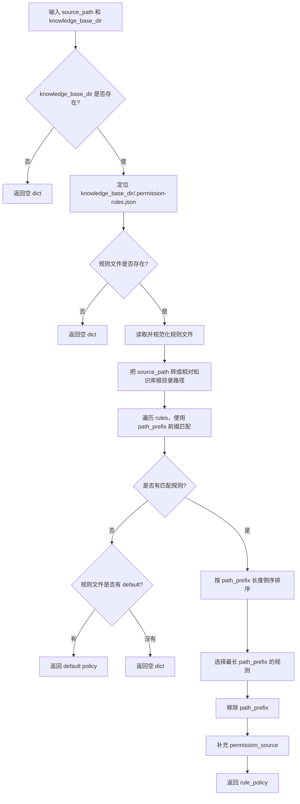

# 阶段 15-3 部门级知识库权限测试说明

这份 README 只说明阶段 15-3 的权限模块入口、学习顺序和测试脚本用法。

阶段 15-3 的核心目标不是在请求体里传一个 `department` filter，而是让服务端根据认证用户生成权限范围，并把权限过滤下推到 Elasticsearch 和 Milvus 查询阶段。

## 1. 权限模块入口在哪里

### 1.1 HTTP 入口

文件：

```text
src/fast_app/api/rag_chat_routes.py
```

关键函数：

```python
prepare_authorized_rag_request(req, user)
```

它做两件事：

1. 调用 `scope_rag_chat_request()` 生成用户隔离后的会话 ID。
2. 调用 `KnowledgePermissionPolicy.build_scope(user)` 生成服务端知识库权限 scope，并写入 `req._retrieval_permission_scope`。

三个 RAG 入口都会走这个函数：

```text
POST /rag/chat
POST /rag/chat/stream
POST /rag/chat/stream/events
```

所以 Classic / LangGraph / RAG Agent 只要从同一个 `RagChatRequest` 继续执行，就能拿到同一份权限 scope。

### 1.2 权限策略入口

文件：

```text
src/fast_app/services/knowledge/knowledge_permission_policy.py
```

关键内容：

```python
# 执行顺序：
KnowledgePermissionPolicy.build_scope(user)
merge_permission_scope_into_filter_dict(...)
build_retrieval_filters_from_mapping(...)
```

职责：

```python
CurrentUserContext
-> RetrievalPermissionScope #先转换为scope内部权限对象
-> RetrievalFilters # 再转换为检索用的filter过滤业务对象
```

判断规则：

```text
admin / "*" / knowledge:read:all
    -> can_read_all=True

普通认证用户
    -> allow_public=True
    -> department_codes=用户所属部门
    -> user_id=当前用户 ID
```

注意：权限字段不能从客户端请求体读取，只能由服务端用户上下文生成。

### 1.3 用户部门入口

文件：

```text
src/fast_app/domain/auth_models.py
src/fast_app/domain/user_context.py
src/fast_app/db/auth_tables.py
src/fast_app/services/auth/user_repository.py
src/fast_app/services/auth/auth_service.py
```

关键内容：

```text
DepartmentCode
Department
UserDepartment
CurrentUserContext.department_codes
CurrentUserContext.primary_department_code
departments
user_departments
UserRepository.get_user_department_codes()
AuthService.build_current_user_context()
```

数据库迁移：

```text
alembic/versions/20260628_0004_create_department_acl_tables.py
```

该迁移会创建：

```text
departments
user_departments
```

并预置三个部门：

```text
art
product_planning
development
```

### 1.4 检索过滤入口

ES 文件：

```text
src/fast_app/components/retrievers/elasticsearch_keyword_retriever.py
```

关键函数：

```python
build_es_filters(filters)
build_es_permission_filter(filters)
```

普通开发用户最终会生成类似逻辑：

```text
metadata.visibility == public
OR metadata.allowed_departments contains development
OR metadata.allowed_users contains current_user_id
```

Milvus 文件：

```text
src/fast_app/components/retrievers/milvus_vector_retriever.py
```

关键函数：

```python
build_milvus_filter_expr(filters)
build_milvus_permission_filter_expr(filters)
```

普通开发用户最终会生成类似表达式：

```text
metadata["visibility"] == "public"
or array_contains(metadata["allowed_departments"], "development")
or array_contains(metadata["allowed_users"], "user_dev_001")
```

### 1.5 Ingestion metadata 入口

文件：

```text
src/fast_app/ingestion/processing/metadata_models.py
src/fast_app/ingestion/stores/rag_store_schema.py
src/fast_app/ingestion/stores/rag_store_writer.py
```

关键函数：

```python
build_permission_metadata(source_path, knowledge_base_dir)
infer_permission_metadata_from_path(source_path, knowledge_base_dir)
match_permission_rule_from_file(source_path, knowledge_base_dir)
load_permission_rules_file(rules_file)
load_sidecar_permission_metadata(source_path)
normalize_permission_metadata(metadata)
```

权限来源优先级：

```text
1. 知识库根目录 .permission-rules.json 根据 path_prefix 生成默认权限
2. 文档旁边的 xxx.md.meta.json 覆盖默认权限
3. 没有命中规则时使用 default_policy
```

根目录权限规则文件：

```text
docs/knowledge-base-acl-test/.permission-rules.json
```

示例：

```json
{
  "rules": [
    {
      "path_prefix": "public/",
      "visibility": "public",
      "allowed_departments": [],
      "allowed_users": []
    },
    {
      "path_prefix": "art/",
      "visibility": "department",
      "allowed_departments": ["art"],
      "allowed_users": []
    },
    {
      "path_prefix": "product_planning/",
      "visibility": "department",
      "allowed_departments": ["product_planning"],
      "allowed_users": []
    },
    {
      "path_prefix": "development/",
      "visibility": "department",
      "allowed_departments": ["development"],
      "allowed_users": []
    }
  ],
  "default": {
    "visibility": "public",
    "allowed_departments": [],
    "allowed_users": [],
    "permission_source": "default_policy"
  }
}
```

规则含义：

```text
public/**             -> visibility=public
art/**                -> visibility=department, allowed_departments=["art"]
product_planning/**   -> visibility=department, allowed_departments=["product_planning"]
development/**        -> visibility=department, allowed_departments=["development"]
```

这里不再把 `art / product_planning / development` 写死在
`infer_permission_metadata_from_path()` 中。后续新增部门目录时，优先改
`.permission-rules.json`，不需要改 Python 代码。

sidecar 覆盖规则：

```text
xxx.md.meta.json
```

示例：

```json
{
  "visibility": "department",
  "allowed_departments": ["product_planning", "development"],
  "allowed_users": []
}
```

## 2. 建议学习顺序

### 第一步：先看请求入口

先看：

```text
src/fast_app/api/rag_chat_routes.py
```

重点理解：

```text
HTTP Header / JWT / API Key
-> get_current_user_context
-> CurrentUserContext
-> prepare_authorized_rag_request
-> _retrieval_permission_scope
-> pipeline.run / stream / stream_events
```

这一步回答：

```text
权限是在哪里进入 RAG 主链路的？
为什么不是 Graph 节点自己解析 token？
为什么不让客户端传 allowed_departments？
```

### 第二步：看权限策略

再看：

```text
src/fast_app/services/knowledge/knowledge_permission_policy.py
```

重点理解：

```text
admin 如何跳过权限过滤
普通用户如何携带部门范围
匿名或旧静态凭证为什么只能走 public 范围
```

### 第三步：看三条 RAG 链路如何透传 filters

Classic：

```text
src/fast_app/services/rag/rag_pipeline_service.py
```

LangGraph：

```text
src/fast_app/graph/rag/rag_graph_state.py
src/fast_app/graph/rag/rag_graph_nodes.py
```

RAG Agent：

```text
src/fast_app/graph/rag_agent/rag_agent_state.py
src/fast_app/graph/rag_agent/rag_agent_nodes.py
```

重点理解：

```text
req._retrieval_permission_scope
-> filters dict
-> RetrievalFilters
-> retrieve_knowledge_docs / retriever.retrieve
```

### 第四步：看 ES / Milvus 下推

再看：

```text
src/fast_app/components/retrievers/elasticsearch_keyword_retriever.py
src/fast_app/components/retrievers/milvus_vector_retriever.py
```

重点理解：

```text
权限 filter 是在召回前进入 ES / Milvus 查询的
不是先召回 top_k 再在 Python 里删除无权限文档
```

### 第五步：看 ingestion metadata

最后看：

```text
src/fast_app/ingestion/processing/metadata_models.py
src/fast_app/ingestion/stores/rag_store_schema.py
src/fast_app/ingestion/stores/rag_store_writer.py
```

重点理解：

```text
为什么权限字段必须在入库时写进每个 chunk metadata
为什么旧 ES / Milvus 数据必须重建
为什么 rag_store_writer 要校验 visibility / allowed_departments / allowed_users
```

## 3. 当前测试脚本

### 3.1 合同测试脚本

文件：

```text
scripts/phase_15/test_department_rag_acl_contract.py
```

功能：

```text
只测试 Python 内部权限合同。
不连接 PostgreSQL。
不请求 FastAPI。
不访问 ES / Milvus。
```

覆盖点：

```text
普通 development 用户不能 can_read_all
普通 development 用户会生成 department_codes=["development"]
ES filter 中包含 allowed_departments
Milvus filter 中包含 development 和 public 条件
admin 用户不附加 ES / Milvus 权限 filter
```

运行：

```powershell
$env:PYTHONPATH="src"
.\.venv\Scripts\python.exe scripts\phase_15\test_department_rag_acl_contract.py
```

预期输出：

```text
department_acl_policy_and_filter_contract=passed
```

适合使用场景：

```text
你刚修改 KnowledgePermissionPolicy / RetrievalFilters / ES filter / Milvus filter 后，先跑这个脚本。
它是最快的本地回归检查。
```

### 3.2 综合验收脚本

文件：

```text
scripts/phase_15/test_department_rag_acl_acceptance.py
```

功能：

```text
默认执行权限合同检查 + PostgreSQL 部门种子检查。
传入 --base-url 后，会额外执行真实 HTTP 验收。
```

默认运行：

```powershell
$env:PYTHONPATH="src"
.\.venv\Scripts\python.exe scripts\phase_15\test_department_rag_acl_acceptance.py
```

预期输出：

```text
policy_and_filter_contract=passed
database_department_seed=passed art:美术部门;development:开发部门;product_planning:产品策划部门
http_acl_checks=skipped reason=base_url_empty
```

参数说明：

```text
--skip-db
    跳过 PostgreSQL 检查，只跑权限合同。

--base-url
    FastAPI 服务地址。传入后启用 HTTP 验收。

--dev-token
    development 用户 JWT。传入 token 时不会调用 /auth/login。

--dev-username
--dev-password
    development 用户登录凭据。没有 dev-token 时用它们调用 /auth/login。

--dev-query
    development 用户用于 /rag/chat 的测试问题。
    默认：RAG 后端部署步骤是什么？

--art-token
--art-username
--art-password
--art-query
    美术部门用户的 token / 登录凭据 / 测试问题。

--product-token
--product-username
--product-password
--product-query
    产品策划部门用户的 token / 登录凭据 / 测试问题。
```

HTTP 验收示例：

```powershell
$env:PYTHONPATH="src"
.\.venv\Scripts\python.exe scripts\phase_15\test_department_rag_acl_acceptance.py `
  --base-url "http://127.0.0.1:8000" `
  --dev-username "dev_user" `
  --dev-password "Dev123456!" `
  --art-username "art_user" `
  --art-password "Art123456!" `
  --product-username "product_user" `
  --product-password "Product123456!"
```

HTTP 验收会检查：

```text
/auth/login 可以登录
/auth/me 返回正确 department_codes
/rag/chat 返回 sources
每个 source.metadata 都符合当前用户权限
```

它不是通过“回答文本”验收权限，而是检查 `sources.metadata`：

```text
visibility == public
或 allowed_users 包含当前 user_id
或 allowed_departments 和当前用户部门有交集
```

## 4. 完整验收流程

### 4.1 准备测试文档

推荐目录：

```text
docs/knowledge-base-acl-test/
  .permission-rules.json
  art/character-art-style.md
  product_planning/combat-design.md
  development/rag-backend-deployment.md
```

可选公开文档：

```text
docs/knowledge-base-acl-test/public/project-overview.md
```

### 4.2 dry-run 检查 metadata

```powershell
$env:PYTHONPATH="src"
.\.venv\Scripts\python.exe -m fast_app.ingestion.cli dry-run `
  --knowledge-base-dir ".\docs\knowledge-base-acl-test" `
  --sample-size 10
```

重点看 `sample_chunks[].metadata` 是否包含：

```json
{
  "visibility": "department",
  "allowed_departments": ["development"],
  "allowed_users": [],
  "permission_source": "permission_rules_file"
}
```

### 4.3 重建 ES / Milvus

旧数据没有 ACL metadata，所以必须重建。

```powershell
$env:PYTHONPATH="src"
.\.venv\Scripts\python.exe -m fast_app.ingestion.cli ingest `
  --knowledge-base-dir ".\docs\knowledge-base-acl-test" `
  --write-mode recreate `
  --yes `
  --no-es-auth
```

如果你的 ES 开启了认证，不要传 `--no-es-auth`，改为使用 `.env` 中的：

```text
ELASTICSEARCH_USERNAME
ELASTICSEARCH_PASSWORD
```

### 4.4 创建部门用户

```powershell
$env:PYTHONPATH="src"

.\.venv\Scripts\python.exe scripts\create_auth_user.py `
  --username dev_user `
  --password "Dev123456!" `
  --department development `
  --permission rag:chat

.\.venv\Scripts\python.exe scripts\create_auth_user.py `
  --username art_user `
  --password "Art123456!" `
  --department art `
  --permission rag:chat

.\.venv\Scripts\python.exe scripts\create_auth_user.py `
  --username product_user `
  --password "Product123456!" `
  --department product_planning `
  --permission rag:chat
```

如果重复创建用户名会失败，可以换用户名，或先清理数据库中的测试用户。

### 4.5 启动 FastAPI

建议 `.env` 至少确认：

```text
AUTH_ENABLED=true
VECTOR_RETRIEVER_PROVIDER=milvus
KEYWORD_RETRIEVER_PROVIDER=elasticsearch
EMBEDDING_PROVIDER=qwen
RAG_PIPELINE_PROVIDER=rag_agent
LLM_PROVIDER=mock
```

启动：

```powershell
$env:PYTHONPATH="src"
uvicorn fast_app.main:app --reload
```

### 4.6 跑 HTTP 验收

```powershell
$env:PYTHONPATH="src"
.\.venv\Scripts\python.exe scripts\phase_15\test_department_rag_acl_acceptance.py `
  --base-url "http://127.0.0.1:8000" `
  --dev-username "dev_user" `
  --dev-password "Dev123456!" `
  --art-username "art_user" `
  --art-password "Art123456!" `
  --product-username "product_user" `
  --product-password "Product123456!"
```

预期：

```text
policy_and_filter_contract=passed
database_department_seed=passed ...
http_acl_development=passed ...
http_acl_art=passed ...
http_acl_product_planning=passed ...
```

## 5. 常见失败原因

### 5.1 sources 为空

可能原因：

```text
测试文档内容和默认 query 不匹配
ES / Milvus 还没重建
embedding 配置不可用
当前 RAG provider / retriever provider 仍然是 mock
```

处理方式：

```text
1. 先 dry-run 看 chunk 是否生成。
2. 再 ingest recreate。
3. 再把脚本 query 改成明确命中文档的关键词。
```

示例：

```powershell
--dev-query "rag-backend-deployment 文档讲了什么？"
```

### 5.2 /auth/me 部门为空

可能原因：

```text
创建用户时没有传 --department
用户是旧用户，没有写 user_departments
使用的是静态 AUTH_API_KEYS / AUTH_BEARER_TOKENS，而不是数据库 JWT 用户
```

处理方式：

```text
使用 scripts\create_auth_user.py 重新创建带 --department 的用户。
```

### 5.3 dry-run 里没有 visibility 字段

可能原因：

```text
运行的不是当前代码
PYTHONPATH 没有设置为 src
知识库根目录缺少 .permission-rules.json
传入的 --knowledge-base-dir 不是 .permission-rules.json 所在目录
文档路径没有命中 .permission-rules.json 中的 path_prefix
```

处理方式：

```powershell
$env:PYTHONPATH="src"
.\.venv\Scripts\python.exe -m fast_app.ingestion.cli dry-run `
  --knowledge-base-dir ".\docs\knowledge-base-acl-test" `
  --sample-size 10
```

### 5.4 art 用户能看到 development source

这是本阶段最重要的失败信号。

优先检查：

```text
1. source.metadata.allowed_departments 是否真的写成 development
2. source.metadata.permission_source 是否为 permission_rules_file 或 sidecar_metadata
3. 当前用户 /auth/me 是否真的只有 department_codes=["art"]
4. ES / Milvus filter 日志是否包含权限 filter
5. 是否仍在使用 mock retriever
```

## 6. 本阶段验收标准

本阶段验收通过需要同时满足：

```text
1. dry-run 生成的 chunk metadata 含 visibility / allowed_departments / allowed_users / permission_source。
2. ES / Milvus 已通过 ingest recreate 写入新 ACL metadata。
3. /auth/me 能返回 department_codes。
4. department 用户只能看到 public 或本部门文档。
5. admin / knowledge:read:all 用户可以跳过权限 filter。
6. /rag/chat/stream 仍保持 token-only，不改变 stream 协议。
7. /rag/chat/stream/events 的 sources 只包含授权文档。
```

## 7.测试结果：

~~~cpp
python.exe scripts\phase_15\test_department_rag_acl_acceptance.py `
>>   --base-url "http://127.0.0.1:8000" `
>>   --dev-username "dev_user" `
>>   --dev-password "Dev123456!" `
>>   --art-username "art_user" `
>>   --art-password "Art123456!" `
>>   --product-username "product_user" `
>>   --product-password "Product123456!"
~~~

测试结果输出：

~~~cpp
policy_and_filter_contract=passed
database_department_seed=passed art:美术部门;development:开发部门;product_planning:产品策划部门
http_acl_development=passed user_id=user_cqU93MrGaqbkKsrKNUq43tyt departments=development source_count=5
http_acl_art=passed user_id=user_5_cdYxl_M0S1QdqjObxYpLon departments=art source_count=5
http_acl_product_planning=passed user_id=user_QK2i35LMjyKx17VGg8tPohK2 departments=product_planning source_count=5
~~~

### 输出含义

你的这次 HTTP 验收是通过的。每一行代表一层检查。

```
policy_and_filter_contract=passed
```

说明本地权限策略构造通过了。脚本确认：

```
普通部门用户不会获得 can_read_all
development 用户会生成 department_codes=["development"]
ES filter 会包含 allowed_departments
Milvus filter 会包含 public / development 权限条件
admin 用户不会附加权限 filter
database_department_seed=passed art:美术部门;development:开发部门;product_planning:产品策划部门
```

说明 PostgreSQL 里的部门基础数据存在，至少有这三个部门：

```
art
development
product_planning
```

也就是说阶段 15-3 的部门表迁移和种子数据是正常的。

```
http_acl_development=passed user_id=... departments=development source_count=5
```

说明脚本用 development 用户登录后，请求 `/rag/chat` 成功，并且返回的 5 个 sources 都满足 development 用户权限。

```
http_acl_art=passed user_id=... departments=art source_count=5
```

说明 art 用户请求 `/rag/chat` 成功，并且返回的 5 个 sources 都是 art 用户有权看的文档。

```
http_acl_product_planning=passed user_id=... departments=product_planning source_count=5
```

说明 product_planning 用户请求 `/rag/chat` 成功，并且返回的 5 个 sources 都是产品策划用户有权看的文档。

### 这次结果证明了什么

这次测试证明：

```
1. 权限策略能正确生成服务端 RetrievalFilters。
2. PostgreSQL 部门数据正常。
3. /auth/login 和 /auth/me 正常。
4. /rag/chat 会按当前用户部门限制 sources。
5. ES / Milvus 返回的 sources 没有越权泄露。
```

`source_count=5` 表示每个部门用户这次都拿到了 5 条来源，并且脚本检查这些来源都符合权限规则。

### 还不能证明什么

它不等于证明回答质量好，也不等于证明 stream 接口通过。它主要证明的是：

```
部门级知识库权限没有越权
```

如果你接下来要完整验收，还可以单独测：

```
/rag/chat/stream
/rag/chat/stream/events
不同部门问同一个敏感问题时 sources 是否不同
admin 是否能看到所有部门文档
```


# 完整功能测试：

## 推荐测试流程

你要测“完整登录验证 + 检索对话”，建议按这条链路跑：

```
PostgreSQL 用户存在
-> /auth/login 登录拿 access_token
-> /auth/me 验证当前用户身份和部门
-> /rag/chat 用 Bearer token 发起检索对话
-> 检查 sources.metadata 是否符合部门权限
```

## 1. 确认服务配置

完整真实检索需要这些配置方向：

```
AUTH_ENABLED=true
RAG_PIPELINE_PROVIDER=rag_agent
VECTOR_RETRIEVER_PROVIDER=milvus
KEYWORD_RETRIEVER_PROVIDER=elasticsearch
EMBEDDING_PROVIDER=qwen
LLM_PROVIDER=mock
```

如果 Milvus 当前还不稳定，就先不要测真实检索，临时用：

```
VECTOR_RETRIEVER_PROVIDER=mock
KEYWORD_RETRIEVER_PROVIDER=mock
```

但注意：mock retriever 不能完整证明 ES / Milvus 权限下推，只能测登录和接口链路。

## 2. 创建测试用户

```
$env:PYTHONPATH="src"

.\.venv\Scripts\python.exe scripts\create_auth_user.py `
  --username dev_user `
  --password "Dev123456!" `
  --department development `
  --permission rag:chat

.\.venv\Scripts\python.exe scripts\create_auth_user.py `
  --username art_user `
  --password "Art123456!" `
  --department art `
  --permission rag:chat
```

如果用户已存在，换用户名即可，例如 `dev_user_2`。

## 3. 启动 FastAPI

```
$env:PYTHONPATH="src"
uvicorn fast_app.main:app --reload
```

## 4. 登录拿 token

先设置 PowerShell UTF-8，避免乱码：

~~~
chcp 65001
[Console]::OutputEncoding = [System.Text.Encoding]::UTF8
$OutputEncoding = [System.Text.Encoding]::UTF8
~~~

```
$loginBody = @{
  username_or_email = "dev_user"
  password = "Dev123456!"
} | ConvertTo-Json -Compress

$loginResp = Invoke-RestMethod `
  -Method POST `
  -Uri "http://127.0.0.1:8000/auth/login" `
  -ContentType "application/json; charset=utf-8" `
  -Body $loginBody

$loginResp
```


~~~
access_token                                                                                                                                                                    
------------                                                                                                                                                                   
eyJhbGciOiJIUzI1NiIsInR5cCI6IkpXVCJ9.eyJzdWIiOiJ1c2VyX2NxVTkzTXJHYXFia0tzcktOVXE0M3R5dCIsInJvbGUiOiJ1c2VyIiwicGVybWlzc2lvbnMiOlsicmFnOmNoYXQiXSwiaXNzIjoicHl0aG9uLWFnZW50LXN...

~~~

保存 token：

```
$token = $loginResp.access_token
```


## 5. 验证当前登录身份

```
Invoke-RestMethod `
  -Method GET `
  -Uri "http://127.0.0.1:8000/auth/me" `
  -Headers @{ Authorization = "Bearer $token" }
```

你应该看到类似：

```
{
  "user_id": "...",
  "is_authenticated": true,
  "auth_source": "jwt",
  "role": "user",
  "permissions": ["rag:chat"],
  "department_codes": ["development"],
  "primary_department_code": "development"
}
```

这一步证明登录验证成功，并且部门权限上下文已经进入服务端。

## 6. 发起检索对话

普通 JSON 接口优先使用 `Invoke-RestMethod`，避免 PowerShell 调用原生命令时吞掉 JSON 双引号。

```powershell
$chatBody = @{
  session_id = "manual-dev-acl-test-001"
  query = "RAG 后端部署步骤是什么？"
  mode = "hybrid"
  top_k = 5
  candidate_k = 10
} | ConvertTo-Json -Compress

$chatResp = Invoke-RestMethod `
  -Method POST `
  -Uri "http://127.0.0.1:8000/rag/chat" `
  -ContentType "application/json; charset=utf-8" `
  -Headers @{ Authorization = "Bearer $token" } `
  -Body $chatBody

$chatResp
$chatResp.sources | Select-Object id, source, title, metadata
```

重点看响应里的：

```
sources[].metadata.visibility
sources[].metadata.allowed_departments
sources[].metadata.permission_source
```

development 用户应该只能看到：

```
visibility=public
或 allowed_departments 包含 development
或 allowed_users 包含当前 user_id
```

## 7. 可选：测试流式接口

SSE / streaming 接口继续使用 `curl.exe -N`。在 Windows PowerShell 中，不要把
`ConvertTo-Json` 的原始结果直接传给 `curl.exe --data-raw`，需要先转义 JSON
内部双引号。

```powershell
$streamBody = @{
  session_id = "manual-stream-acl-test-001"
  query = "RAG 后端部署步骤是什么？"
  mode = "hybrid"
  top_k = 5
  candidate_k = 10
} | ConvertTo-Json -Compress

$curlBody = $streamBody.Replace('"', '\"')
```

测试 token-only stream：

```powershell
curl.exe -N `
  -X POST "http://127.0.0.1:8000/rag/chat/stream" `
  -H "Content-Type: application/json; charset=utf-8" `
  -H ("Authorization: Bearer {0}" -f $token) `
  --data-raw "$curlBody"
```

测试 structured stream events：

```powershell
curl.exe -N `
  -X POST "http://127.0.0.1:8000/rag/chat/stream/events" `
  -H "Content-Type: application/json; charset=utf-8" `
  -H ("Authorization: Bearer {0}" -f $token) `
  --data-raw "$curlBody"
```

如果你仍遇到本地 shell 参数解析问题，可以改用文件方式：

```powershell
New-Item -ItemType Directory -Force ".\tmp" | Out-Null
[System.IO.File]::WriteAllText(
  (Resolve-Path ".\tmp").Path + "\rag-stream-body.json",
  $streamBody,
  [System.Text.UTF8Encoding]::new($false)
)

curl.exe -N `
  -X POST "http://127.0.0.1:8000/rag/chat/stream/events" `
  -H "Content-Type: application/json; charset=utf-8" `
  -H ("Authorization: Bearer {0}" -f $token) `
  --data-binary "@.\tmp\rag-stream-body.json"
```

## 8. 用脚本做完整自动验收

你已经跑过这个，后续完整验收建议继续用：

```powershell
$env:PYTHONPATH="src"

.\.venv\Scripts\python.exe scripts\phase_15\test_department_rag_acl_acceptance.py `
  --base-url "http://127.0.0.1:8000" `
  --dev-username "dev_user" `
  --dev-password "Dev123456!" `
  --art-username "art_user" `
  --art-password "Art123456!" `
  --product-username "product_user" `
  --product-password "Product123456!"
```

这比手动 curl 更适合回归测试，因为它会自动检查 sources 是否越权。

## 9. 最小验收标准

完整登录 + 检索对话测试通过，应满足：

```
1. /auth/login 返回 access_token。
2. /auth/me 返回 auth_source=jwt。
3. /auth/me 返回正确 department_codes。
4. /rag/chat 返回 answer 和 sources。
5. sources.metadata 不包含当前用户无权访问的部门文档。
```

如果你要测试真实权限下推，必须使用：

```
VECTOR_RETRIEVER_PROVIDER=milvus
KEYWORD_RETRIEVER_PROVIDER=elasticsearch
```

并确保 ES / Milvus 已经用带 `.permission-rules.json` 的测试文档重新 ingest。


# 关键函数讲解：match_permission_rule_from_file

src\fast_app\ingestion\processing\metadata_models.py

~~~py
def match_permission_rule_from_file(
    source_path: str,
    knowledge_base_dir: str | None,
) -> dict[str, Any]:
    """用知识库根目录权限规则匹配当前文档。

    输入的 source_path 可能是绝对路径，也可能是相对路径；规则文件只关心相对
    知识库根目录的路径，例如 `development/a.md`。所以这里会先定位规则文件，
    再把 source_path 转成相对路径，最后用 path_prefix 做前缀匹配。

    多条规则同时命中时，优先选择 path_prefix 更长的规则。例如同时存在
    `development/` 和 `development/private/` 时，后者应该覆盖前者。
    """

    # 没有知识库根目录，就无法定位 .permission-rules.json。
    # 这里返回空 dict，让上层继续走 public 目录兜底或 default_policy。
    if not knowledge_base_dir:
        return {}

    # 规则文件固定放在知识库根目录下，而不是跟着每个文档单独放。
    # 这样同一批知识库文档的权限规则可以集中维护和版本化。
    rules_file = Path(knowledge_base_dir) / PERMISSION_RULES_FILE_NAME
    if not rules_file.exists():
        return {}

    # load_permission_rules_file 会同时完成 JSON 读取、基本结构校验和字段规范化。
    # 这里拿到的 path_prefix 已经统一成类似 `development/` 的小写 POSIX 前缀。
    rules_config = load_permission_rules_file(rules_file)

    # 权限规则不能直接匹配完整本地路径，否则 Windows 盘符、项目根目录变化都会影响结果。
    # 因此先把文档路径转换为相对知识库根目录的路径，例如：
    # docs/knowledge-base-acl-test/development/a.md -> development/a.md
    relative_path = build_relative_permission_path(
        source_path=source_path,
        knowledge_base_dir=knowledge_base_dir,
    )

    # 收集所有命中的规则。使用 startswith 是为了让一个目录规则覆盖该目录下所有文档。
    # 例如 path_prefix=development/ 可以命中 development/rag-backend-deployment.md。
    matched_rules = [
        rule
        for rule in rules_config.get("rules", [])
        if relative_path.startswith(str(rule.get("path_prefix") or ""))
    ]

    # 没有命中任何 path_prefix 时，使用规则文件里的 default。
    # 如果规则文件没有 default，则返回空 dict，让上层继续走默认 public 策略。
    if not matched_rules:
        default_policy = rules_config.get("default")
        return default_policy if isinstance(default_policy, dict) else {}

    # 选择最长 path_prefix，是为了支持更细粒度的子目录覆盖。
    # 例：development/private/ 的长度大于 development/，因此 private 规则优先。
    matched_rules.sort(
        key=lambda rule: len(str(rule.get("path_prefix") or "")),
        reverse=True,
    )

    # path_prefix 只是规则匹配条件，不应该写入 ES / Milvus 的 chunk metadata。
    # 这里把它剔除，只保留 visibility / allowed_departments / allowed_users 等权限字段。
    rule_policy = {
        key: value
        for key, value in matched_rules[0].items()
        if key != "path_prefix"
    }

    # 如果规则项没有显式写 permission_source，就标记为 permission_rules_file。
    # 后续排查 metadata 时，可以知道这份权限来自根目录规则文件，而不是 sidecar。
    rule_policy.setdefault("permission_source", "permission_rules_file")
    return rule_policy


~~~

## `match_permission_rule_from_file` 是什么

`match_permission_rule_from_file` 的作用是：

> 从知识库根目录下的 `.permission-rules.json` 权限规则文件中，找出当前文档应该使用哪一条权限规则。

它不是直接根据 `art/`、`development/` 这些目录写死判断，而是读取一个外部 JSON 规则文件，让权限规则可以配置化。函数定义来自你上传的 `metadata_models.py`。

------

## 它在整个调用链中的位置

你现在的权限 metadata 构建链路大概是：

```text
build_document_metadata
    ↓
build_permission_metadata
    ↓
infer_permission_metadata_from_path
    ↓
match_permission_rule_from_file
```

也就是说：

```python
rule_policy = match_permission_rule_from_file(
    source_path=source_path,
    knowledge_base_dir=knowledge_base_dir,
)
```

`infer_permission_metadata_from_path` 会先尝试用规则文件匹配权限。

如果 `match_permission_rule_from_file` 成功返回权限规则，就直接使用这份规则。

如果它返回 `{}`，上层才继续走：

```python
public 目录兜底
default_policy 兜底
```

所以这个函数的职责很明确：

> 只负责“从规则文件中匹配权限”，不负责最终兜底策略。

------

## 函数签名解释

```python
def match_permission_rule_from_file(
    source_path: str,
    knowledge_base_dir: str | None,
) -> dict[str, Any]:
```

### `source_path`

当前正在入库的文档路径。

可能是绝对路径：

```text
D:/project/knowledge-base-acl-test/development/rag-backend-deployment.md
```

也可能是相对路径：

```text
knowledge-base-acl-test/development/rag-backend-deployment.md
```

### `knowledge_base_dir`

知识库根目录。

例如：

```text
D:/project/knowledge-base-acl-test
```

这个参数很重要，因为 `.permission-rules.json` 是放在知识库根目录下的。

------

## 第一步：没有知识库根目录就直接返回空字典

```python
if not knowledge_base_dir:
    return {}
```

这表示：

如果调用方没有传入 `knowledge_base_dir`，函数就不知道去哪里找：

```text
.permission-rules.json
```

所以它直接返回：

```python
{}
```

注意，这不是报错。

因为这个函数被设计成“能匹配就匹配，不能匹配就让上层兜底”。

------

## 第二步：定位 `.permission-rules.json`

```python
rules_file = Path(knowledge_base_dir) / PERMISSION_RULES_FILE_NAME
if not rules_file.exists():
    return {}
```

前面定义过：

```python
PERMISSION_RULES_FILE_NAME = ".permission-rules.json"
```

所以这里实际是在找：

```text
知识库根目录/.permission-rules.json
```

例如：

```text
knowledge-base-acl-test/.permission-rules.json
```

如果这个文件不存在，也返回：

```python
{}
```

含义是：

> 当前知识库没有配置集中权限规则，那就让上层继续使用 public 目录兜底或默认策略。

------

## 第三步：读取并规范化规则文件

```python
rules_config = load_permission_rules_file(rules_file)
```

这一行会调用另一个函数：

```python
load_permission_rules_file
```

它主要做三件事：

1. 读取 `.permission-rules.json`
2. 校验 JSON 结构是否正确
3. 规范化权限字段

假设规则文件是：

```json
{
  "rules": [
    {
      "path_prefix": "development",
      "visibility": "department",
      "allowed_departments": ["development"]
    },
    {
      "path_prefix": "development/private",
      "visibility": "restricted",
      "allowed_users": ["alice"]
    }
  ],
  "default": {
    "visibility": "public"
  }
}
```

读取后，`path_prefix` 会被统一规范化成小写、POSIX 风格、并且带 `/` 结尾：

```python
"development/"
"development/private/"
```

这样可以避免 Windows 路径分隔符 `\` 和 Linux/macOS 路径分隔符 `/` 不一致的问题。

------

## 第四步：把文档路径转成相对知识库根目录的路径

```python
relative_path = build_relative_permission_path(
    source_path=source_path,
    knowledge_base_dir=knowledge_base_dir,
)
```

这是这个函数里非常关键的一步。

权限规则文件不应该匹配完整本地路径。

因为完整路径可能是：

```text
D:/project/knowledge-base-acl-test/development/rag-backend-deployment.md
```

也可能是：

```text
/home/user/project/knowledge-base-acl-test/development/rag-backend-deployment.md
```

如果直接匹配完整路径，换一台机器、换一个项目目录，规则就可能失效。

所以它会把路径变成相对知识库根目录的路径：

```text
development/rag-backend-deployment.md
```

这样规则只关心知识库内部结构，而不关心本地项目放在哪里。

------

## 第五步：用 `path_prefix` 做前缀匹配

```python
matched_rules = [
    rule
    for rule in rules_config.get("rules", [])
    if relative_path.startswith(str(rule.get("path_prefix") or ""))
]
```

这段代码的意思是：

> 遍历所有权限规则，只保留那些 `path_prefix` 能匹配当前文档相对路径的规则。

例如当前文档是：

```text
development/rag-backend-deployment.md
```

规则是：

```python
"path_prefix": "development/"
```

因为：

```python
"development/rag-backend-deployment.md".startswith("development/")
```

结果是：

```python
True
```

所以这条规则命中。

------

## 为什么用 `startswith`

因为一条目录规则应该覆盖这个目录下的所有文件。

例如：

```json
{
  "path_prefix": "development",
  "visibility": "department",
  "allowed_departments": ["development"]
}
```

应该能够匹配：

```text
development/rag-backend-deployment.md
development/api-design.md
development/private/internal-note.md
```

所以这里不能用完全相等，而是用：

```python
startswith
```

------

## 第六步：没有命中规则时，使用规则文件里的 default

```python
if not matched_rules:
    default_policy = rules_config.get("default")
    return default_policy if isinstance(default_policy, dict) else {}
```

如果没有任何 `path_prefix` 命中当前文档，它会尝试读取规则文件里的：

```json
"default": {
  "visibility": "public"
}
```

如果 `default` 存在，并且是字典，就返回它。

如果 `default` 不存在，就返回：

```python
{}
```

这里要注意：

`.permission-rules.json` 里的 `default` 和上层 `infer_permission_metadata_from_path` 里的 `default_policy` 不是同一个东西。

这里的 `default` 是规则文件自己的默认策略。

上层的 `default_policy` 是代码里的最终兜底策略。

------

## 第七步：多条规则命中时，选择最长的 `path_prefix`

```python
matched_rules.sort(
    key=lambda rule: len(str(rule.get("path_prefix") or "")),
    reverse=True,
)
```

这是整个函数中最重要的设计点之一。

假设规则文件里有两条规则：

```json
{
  "rules": [
    {
      "path_prefix": "development",
      "visibility": "department",
      "allowed_departments": ["development"]
    },
    {
      "path_prefix": "development/private",
      "visibility": "restricted",
      "allowed_users": ["alice"]
    }
  ]
}
```

当前文档是：

```text
development/private/security-plan.md
```

那么它会同时命中：

```text
development/
development/private/
```

因为：

```python
"development/private/security-plan.md".startswith("development/")
```

是 `True`。

同时：

```python
"development/private/security-plan.md".startswith("development/private/")
```

也是 `True`。

这时候应该使用哪条规则？

答案是：

> 使用更具体的规则。

也就是：

```text
development/private/
```

所以代码会按照 `path_prefix` 长度从长到短排序。

更长的路径前缀代表更具体的子目录规则。

------

## 第八步：去掉 `path_prefix`

```python
rule_policy = {
    key: value
    for key, value in matched_rules[0].items()
    if key != "path_prefix"
}
```

这一步是在构造最终返回的权限 metadata。

`path_prefix` 只是规则匹配条件，不应该写入 ES / Milvus 的 chunk metadata。

比如规则原本是：

```python
{
    "path_prefix": "development/",
    "visibility": "department",
    "allowed_departments": ["development"],
    "allowed_users": [],
    "permission_source": "permission_rules_file"
}
```

最终返回时会去掉：

```python
"path_prefix": "development/"
```

只保留：

```python
{
    "visibility": "department",
    "allowed_departments": ["development"],
    "allowed_users": [],
    "permission_source": "permission_rules_file"
}
```

原因是：

`path_prefix` 是“规则匹配字段”，不是“权限判断字段”。

真正用于后续权限过滤的是：

```python
visibility
allowed_departments
allowed_users
permission_source
```

------

## 第九步：补充 `permission_source`

```python
rule_policy.setdefault("permission_source", "permission_rules_file")
```

`setdefault` 的意思是：

> 如果 `permission_source` 已经存在，就保留原值；如果不存在，就设置默认值。

例如：

```python
rule_policy = {
    "visibility": "department",
    "allowed_departments": ["development"]
}
```

执行后变成：

```python
{
    "visibility": "department",
    "allowed_departments": ["development"],
    "permission_source": "permission_rules_file"
}
```

这个字段的作用是方便后续排查 metadata 来源。

你看到某个 chunk 的 metadata 时，可以知道它的权限来自：

```text
permission_rules_file
```

而不是：

```text
folder_rule
sidecar_metadata
default_policy
```

------

## 用一个完整例子串起来

假设知识库目录是：

```text
knowledge-base-acl-test/
  .permission-rules.json
  development/
    rag-backend-deployment.md
    private/
      internal-plan.md
```

`.permission-rules.json` 内容是：

```json
{
  "rules": [
    {
      "path_prefix": "development",
      "visibility": "department",
      "allowed_departments": ["development"]
    },
    {
      "path_prefix": "development/private",
      "visibility": "restricted",
      "allowed_users": ["alice"]
    }
  ],
  "default": {
    "visibility": "public"
  }
}
```

当前处理文档：

```text
knowledge-base-acl-test/development/private/internal-plan.md
```

函数会先转成相对路径：

```text
development/private/internal-plan.md
```

然后匹配规则：

```text
development/          命中
development/private/  命中
```

两条都命中。

然后选择更长的：

```text
development/private/
```

最后返回：

```python
{
    "visibility": "restricted",
    "allowed_departments": [],
    "allowed_users": ["alice"],
    "permission_source": "permission_rules_file"
}
```

------

## 这个函数的流程图



------

## 这个函数的核心价值

这个函数解决的是：

> 权限规则不应该写死在 Python 代码里，而应该放在知识库根目录的配置文件里。

这样你以后新增目录时，不需要修改代码。

例如你新增：

```text
qa/
operation/
marketing/
```

只需要改：

```json
{
  "rules": [
    {
      "path_prefix": "qa",
      "visibility": "department",
      "allowed_departments": ["qa"]
    },
    {
      "path_prefix": "operation",
      "visibility": "department",
      "allowed_departments": ["operation"]
    }
  ]
}
```

不用再改 Python 函数。

------

## 一句话总结

`match_permission_rule_from_file` 的作用是：

> 根据当前文档相对知识库根目录的路径，去 `.permission-rules.json` 中查找匹配的权限规则；如果多条规则命中，就选择路径前缀最长、最具体的那条规则；最后返回可以写入文档 metadata 的权限字段。
