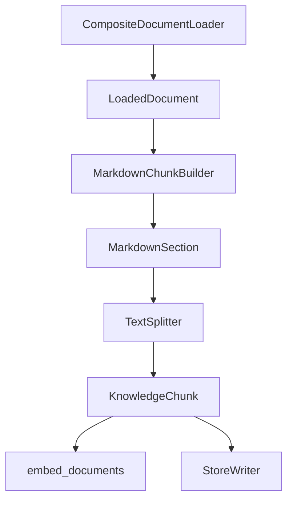

# Ingestion 模块

这个模块负责把本地知识库文档写入 RAG 检索后端。

当前阶段支持：

- 读取 Markdown 和 Text 文件
- 构造 KnowledgeChunk
- 批量生成 embedding
- 重建 ElasticSearch index
- 重建 Milvus collection
- 写入同一批 chunk 到 ES 和 Milvus

## 模块职责

`markdown_chunker.py`

保留 Markdown 标题解析、稳定 chunk id 生成，以及 build_markdown_chunks 兼容入口。

`document_loaders.py`

负责从本地知识库目录读取原始文档，并输出 LoadedDocument。

当前包含：

- MarkdownDocumentLoader
- TextDocumentLoader
- CompositeDocumentLoader

`chunk_builders.py`

负责把 LoadedDocument 转成 KnowledgeChunk。

当前包含：

- ChunkBuildOptions
- MarkdownSection
- SimpleTokenCounter
- TextSplitter
- MarkdownChunkBuilder

`metadata_models.py`

负责生成 ingestion 阶段的标准 metadata。

当前包含：

- normalize_source_path
- build_doc_id
- build_chunk_id
- build_document_metadata
- build_chunk_metadata

`rag_store_schema.py`

负责生成 ElasticSearch mapping、Milvus collection schema 和 Milvus index params。

`rag_store_writer.py`

负责把 KnowledgeChunk 写入 ElasticSearch 和 Milvus。

`markdown_ingestion_service.py`

负责编排读取、切分、embedding、向量校验、ES 写入和 Milvus 写入。

## 当前数据流

## Metadata 规范

当前 KnowledgeChunk.metadata 至少包含：

- doc_id
- chunk_id
- title
- source_path
- section_path
- document_type
- file_name
- file_extension
- heading_level
- section_index
- chunk_index

写入规则：

- KnowledgeChunk.id 与 metadata.chunk_id 保持一致
- KnowledgeChunk.title 与 metadata.title 保持一致
- doc_id 表示文档级稳定 ID
- chunk_id 表示 chunk 级稳定 ID
- source_path 表示本地知识库中的来源路径
- section_path 表示 Markdown 标题路径
- ES 和 Milvus 写入同一份 metadata

## 当前写入策略

当前阶段使用 recreate 策略：

1. 删除并重建当前配置中的 ElasticSearch index
2. 删除并重建当前配置中的 Milvus collection
3. 写入同一批 KnowledgeChunk

这个策略适合学习阶段和小型本地知识库。

## 后续演进方向

阶段 10 后续会继续拆分：

- DocumentLoader 抽象
- ChunkBuilder 工程化
- metadata 标准化
- Milvus collection 初始化
- ES mapping 初始化
- 双写流程
- 幂等写入
- 删除与重建安全脚本
- Ingestion CLI
- 回归测试和真实文档集验证
