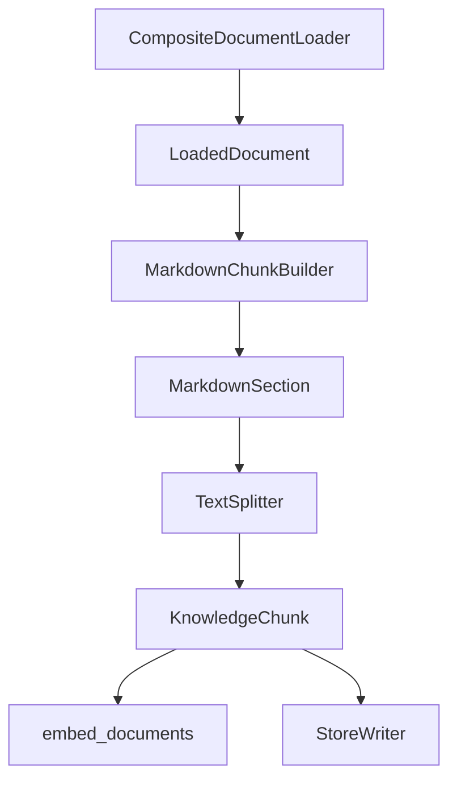

# Ingestion 模块

这个模块负责把本地知识库文档写入 RAG 检索后端。

当前阶段支持：

- 读取 Markdown 和 Text 文件
- 构造 KnowledgeChunk
- 批量生成 embedding
- 重建 ElasticSearch index
- 重建 Milvus collection
- 写入同一批 chunk 到 ES 和 Milvus


## 模块职责

`processing/markdown_chunker.py`

保留 Markdown 标题解析、稳定 chunk id 生成，以及 build_markdown_chunks 兼容入口。

`processing/document_loaders.py`

负责从本地知识库目录读取原始文档，并输出 LoadedDocument。

当前包含：

- MarkdownDocumentLoader
- TextDocumentLoader
- CompositeDocumentLoader

`processing/chunk_builders.py`

负责把 LoadedDocument 转成 KnowledgeChunk。

当前包含：

- ChunkBuildOptions
- MarkdownSection
- TextSplitter
- MarkdownChunkBuilder

`processing/token_counters.py`

负责全工程统一的 token 计数口径（cl100k_base），Markdown 父子分块、
Office 切块与 RAG 上下文拼装共用同一把尺子，保证 token_count 处处可比。

当前包含：

- TiktokenCounter

`processing/metadata_models.py`

负责生成 ingestion 阶段的标准 metadata。

当前包含：

- normalize_source_path
- build_doc_id
- build_chunk_id
- build_document_metadata
- build_chunk_metadata

`stores/rag_store_schema.py`

负责生成 ElasticSearch mapping、Milvus collection schema 和 Milvus index params。

`stores/rag_store_admin.py`

负责 ES index 和 Milvus collection 的结构级管理，包括受控删除、重建空结构和返回重建结果。

`stores/rag_store_writer.py`

负责把 KnowledgeChunk 写入 ElasticSearch 和 Milvus。recreate 模式需要删除和重建结构时，也通过 stores/rag_store_admin.py 完成。

`markdown_ingestion_service.py`

负责编排读取、切分、embedding、向量校验、ES 写入和 Milvus 写入。

`validation/ingestion_validation.py`

负责验证本地文档读取、chunk 构造和 metadata 规范，并输出结构化验证报告。


## 当前数据流




## Metadata 规范

当前 KnowledgeChunk.metadata 至少包含：

- doc_id
- chunk_id
- title
- source_path
- section_path
- document_type
- file_name
- file_extension
- heading_level
- section_index
- chunk_index

写入规则：

- KnowledgeChunk.id 与 metadata.chunk_id 保持一致
- KnowledgeChunk.title 与 metadata.title 保持一致
- doc_id 表示文档级稳定 ID
- chunk_id 表示 chunk 级稳定 ID
- source_path 表示本地知识库中的来源路径
- section_path 表示 Markdown 标题路径
- ES 和 Milvus 写入同一份 metadata


## Milvus Collection 字段

当前 Milvus collection 顶层字段包括：

- id
- embedding
- content
- source
- title
- doc_id
- source_path
- document_type
- chunk_index
- metadata

其中：

- id 是 chunk 主键，与 KnowledgeChunk.id 一致
- embedding 是向量字段
- content 是 chunk 正文
- doc_id / source_path / document_type / chunk_index 是常用过滤和调试字段
- metadata 保留完整标准 metadata

默认 output_fields 由 stores/rag_store_schema.py 中的 build_milvus_output_fields 统一生成。


## ElasticSearch Index 字段

当前 ElasticSearch index 主要字段包括：

- id
- content
- title
- source
- metadata
- created_at

其中：

- content 使用 ik_max_word 建索引，使用 ik_smart 搜索
- title 使用 ik_max_word / ik_smart，并保留 keyword 子字段
- metadata.doc_id / metadata.chunk_id / metadata.source_path / metadata.section_path 使用 keyword
- metadata.title 使用和 title 相同的中文分词规则
- created_at 用于记录写入时间

重建 index 前会验证 ik_max_word 和 ik_smart 是否可用。


## 双写流程

当前 ingestion 写入阶段由 stores/rag_store_writer.py 统一编排。

核心入口：

- write_rag_stores

写入流程：

1. 校验 chunks / vectors 数量
2. 校验 chunk.id 唯一性
3. 校验标准 metadata 字段
4. 根据 INGESTION_WRITE_MODE 选择 recreate、upsert 或 replace_docs
5. 写入 ElasticSearch index
6. 写入 Milvus collection
7. 返回 DualStoreWriteResult


## 写入模式

当前支持三种写入模式：

- recreate
- upsert
- replace_docs

`recreate` 会删除并重建 ES index 和 Milvus collection，适合 schema 变化或本地全量重建。

`upsert` 会保留已有 ES index 和 Milvus collection，并按 chunk_id 覆盖或新增数据。

`replace_docs` 会先根据本次 chunks 中的 `metadata.doc_id` 删除这些文档在 ES / Milvus 中的旧 chunks，再写入本次新 chunks，适合文档内容变化、chunk 数量变化、chunk_index 后移等文档更新场景。

写入模式由 INGESTION_WRITE_MODE 控制，默认值是 recreate。

`upsert` 不会自动删除本次未出现的旧 chunks。如果文档切分策略变化，或者某个文档的新 chunk 数量少于旧 chunk 数量，应使用 `replace_docs`。

`replace_docs` 的核心流程：

1. 从本次 chunks 中收集 `metadata.doc_id`
2. 在 ES 中按 `metadata.doc_id` 执行 `delete_by_query`
3. 在 Milvus 中按 `doc_id` filter 执行 `delete`
4. 把本次 chunks / vectors 重新 upsert 到 ES / Milvus


## 删除与重建安全边界

ES index 和 Milvus collection 的删除操作统一放在 `stores/rag_store_admin.py`。

当前核心入口：

- `reset_es_index`
- `reset_milvus_collection`
- `reset_rag_stores`

删除类函数必须显式传入 `confirm=True` 才会执行。

`stores/rag_store_writer.py` 只负责写入 chunks / vectors。当 recreate 模式需要重建 ES index 或 Milvus collection 时，也通过 admin 模块完成。

后续 CLI 只能调用 `reset_rag_stores()`，不应该在 CLI 中直接写 `indices.delete()` 或 `drop_collection()`。


## Ingestion CLI

正式 CLI 入口：

```powershell
$env:PYTHONPATH="src"
python -m fast_app.ingestion.cli dry-run
```

常用命令：

```powershell
python -m fast_app.ingestion.cli dry-run `
  --knowledge-base-dir learning-docs\phase-9 `
  --sample-size 2

python -m fast_app.ingestion.cli validate `
  --knowledge-base-dir learning-docs\phase-9 `
  --max-chars 1000

python -m fast_app.ingestion.cli ingest `
  --knowledge-base-dir learning-docs\phase-9 `
  --write-mode replace_docs `
  --mock-embeddings `
  --no-es-auth `
  --yes

python -m fast_app.ingestion.cli reset-stores `
  --target both `
  --no-es-auth `
  --yes
```

命令职责：

- `dry-run` 只读取文档和构造 chunks，不调用 embedding，不写入 ES / Milvus。
- `validate` 会验证文档读取、chunk 构造和 metadata 规范，不调用 embedding，不写入 ES / Milvus。
- `ingest` 会执行真实 ingestion，生成 embedding，并写入 ES / Milvus。
- `reset-stores` 会删除或重建 ES index / Milvus collection 结构。
- `ingest` 和 `reset-stores` 都必须显式传入 `--yes`。
- 如果本地 ES 没有开启认证，但 `.env` 中存在 ES 用户名或密码占位符，执行 `ingest` / `reset-stores` 时添加 `--no-es-auth`。
- 使用真实 Qwen embedding 时，`QwenEmbeddingClient` 会按每批最多 10 条文本分批调用 embedding 接口，避免 DashScope `input.contents` batch size 超限。


## Ingestion 回归验证

正式验证命令：

```powershell
$env:PYTHONPATH="src"
python -m fast_app.ingestion.cli validate `
  --knowledge-base-dir learning-docs\phase-9 `
  --max-chars 1000
```

`validate` 不调用 embedding，不连接 ES / Milvus。

它会验证：

- 是否读取到文档
- 是否生成 chunks
- chunk.id 是否唯一
- metadata 是否包含必需字段
- metadata.chunk_id 是否等于 chunk.id
- metadata.title 是否等于 chunk.title
- metadata.section_path 是否为非空列表
- metadata.source_path 是否能对应到已读取文档

阶段 10 的本地回归样例可以先使用：

- `learning-docs/phase-9`
- `learning-docs/phase-10`


## 当前写入策略

当前默认使用 recreate 策略：

1. 删除并重建当前配置中的 ElasticSearch index
2. 删除并重建当前配置中的 Milvus collection
3. 写入同一批 KnowledgeChunk

这个策略适合 schema 仍在变化的学习阶段和小型本地知识库。


## 后续演进方向

阶段 10 后续会继续拆分：

- DocumentLoader 抽象
- ChunkBuilder 工程化
- metadata 标准化
- Milvus collection 初始化
- ES mapping 初始化
- 双写流程
- 幂等写入
- 删除与重建安全脚本
- Ingestion CLI
- 回归测试和真实文档集验证
