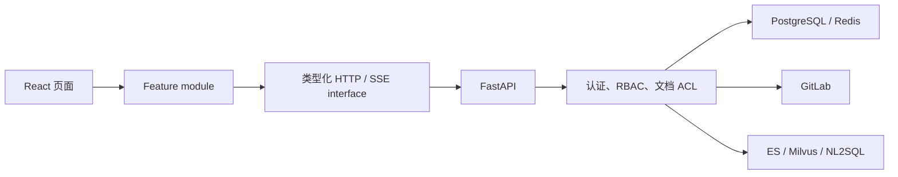
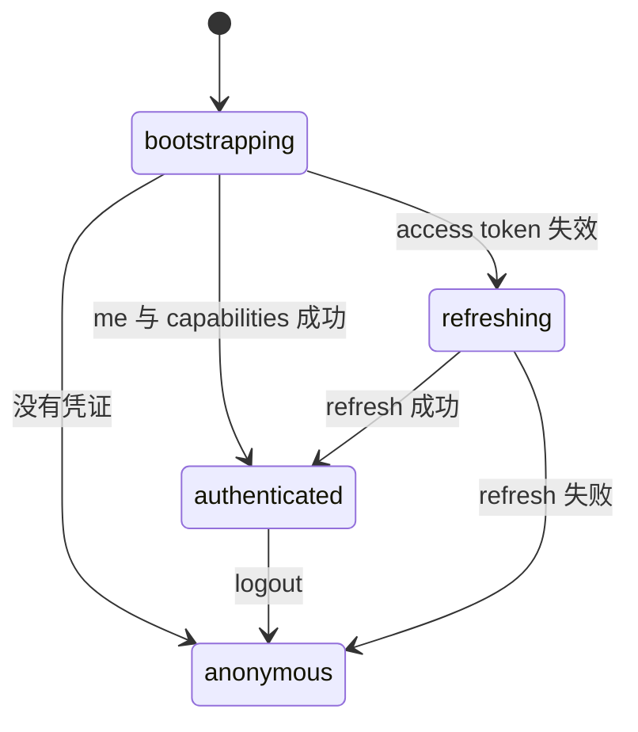
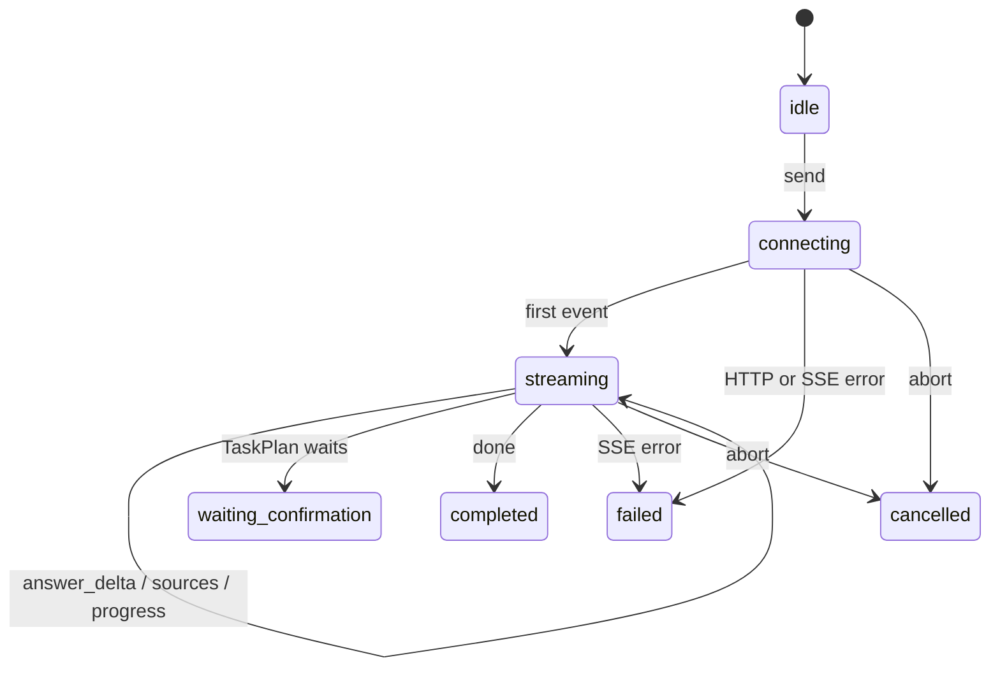
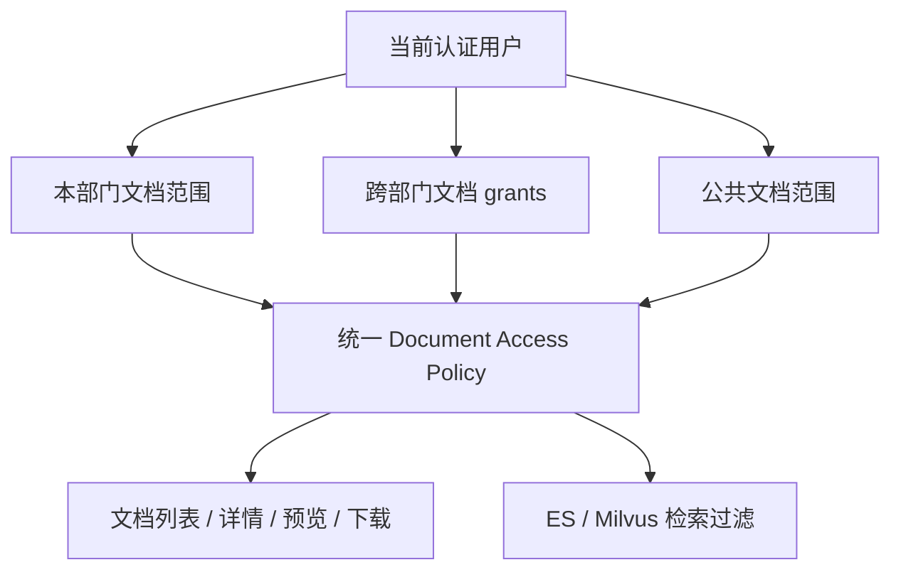

# React RAG 工作台架构

> **状态：待重新生成。** 当前架构基于待实现的后端 interface 草案，不能用于
> 创建 React 工程。后端 P0 完成后必须重新读取真实代码和契约再生成。

## 1. 架构目标

本工程采用按业务功能组织的 React 架构。页面不直接理解 JWT 轮换、SSE 分帧、RBAC code、GitLab Token、文档 ACL 或 TaskPlan 幂等规则；这些行为分别隐藏在类型化网络 module、业务 module 和后端 interface 后面。

当前文档只定义实现规范，不代表 React 工程已经创建。

## 2. 系统关系



FastAPI 是 React 无法绕过的服务端 seam。React 只提交业务输入；用户身份、部门范围、跨部门 grant、Dataset scope 和 Tool 权限都由服务端生成。

## 3. 前端唯一对话 interface

React 的 RAG / Agent 对话只使用：

```text
POST /rag/chat/stream/events
```

网络 implementation 使用 `fetch + ReadableStream + AbortController`，因为请求需要 JSON body 和 Bearer Token，不能使用浏览器原生 `EventSource`。

`POST /rag/chat`、`POST /rag/chat/stream`、`POST /rag/search`、`POST /rag/search/stream` 和 `POST /nl2sql/query` 不属于 React 对话 interface。

## 4. 规划目录

```text
src/
  app/
    router/                 路由和路由保护
    providers/              身份与全局能力快照
    shell/                  页面壳、侧边栏和顶栏
  features/
    authentication/
    conversations/
    rag-agent-chat/
    task-plans/
    knowledge-documents/
    user-access-management/
    document-access-grants/
    nl2sql/
    web-search/
  lib/
    api/                    JSON 请求、refresh、错误解析
    sse/                    POST SSE parser 与事件 envelope
    ids/                    Idempotency-Key 等客户端 ID
  styles/                   设计 token 和全局样式
```

每个 feature module 对页面暴露少量 interface，例如 `useConversationList()`、`startChatStream()`、`loadDocument()`，内部隐藏缓存、网络和状态合并细节。不会为每个后端 URL 再创建一个只透传参数的浅 module。

## 5. 功能文档目录

| 功能 | 规范 |
| --- | --- |
| 身份认证 | `features/authentication/feature.md` |
| 应用工作台 | `features/application-shell/feature.md` |
| 会话管理 | `features/conversations/feature.md` |
| RAG / Agent 对话 | `features/rag-agent-chat/feature.md` |
| TaskPlan | `features/task-plans/feature.md` |
| 知识文档 | `features/knowledge-documents/feature.md` |
| 用户与功能权限 | `features/user-access-management/feature.md` |
| 跨部门文档授权 | `features/document-access-grants/feature.md` |
| NL2SQL | `features/nl2sql/feature.md` |
| 联网搜索 | `features/web-search/feature.md` |

## 6. 身份状态



- 首期 token 存储策略在编码前单独确认；无论存储在哪里，都不能写入 URL、日志或错误详情。
- refresh 必须做单飞控制：并发 401 只能触发一次 refresh，其余请求等待结果。
- capability 只控制页面可见性，不能代替后端授权。

## 7. 对话流状态



SSE parser 只负责协议分帧，业务 reducer 负责事件语义。parser 必须支持跨网络 chunk、CRLF/LF、`event:`、多行 `data:` 和末尾未带空行的 frame。

未知事件进入通用时间线，不修改已知业务状态。`done` 与 `error` 是终态，终态后收到的业务事件忽略并记录开发告警。

## 8. 文档 ACL 架构



跨部门 grant 是独立授权事实：只有目标文档所属部门主管或管理员可创建和撤销。它不改变被授权用户的部门，也不授予该部门其他文档权限。

文档读取和 RAG 检索必须复用同一 Document Access Policy。任何一条链路自行拼接 ACL 都会造成“页面能看但 RAG 搜不到”或相反的安全缺陷。

## 9. 错误和可观测性

JSON 与 SSE 最终都归一为：

```text
code
message
error_category
request_id
trace_id
```

前端错误 module 负责展示用户可理解的信息并保留 request ID。它不能展示后端堆栈、模型 Prompt、GitLab Token、JWT 或完整敏感请求体。

## 10. 测试 seam

- HTTP adapter 使用 Mock Service Worker 或等价本地 adapter 验证 refresh、403、409、429、5xx。
- SSE parser 通过纯字符串 chunk 测试，不依赖浏览器或真实模型。
- Feature 测试通过公开 interface 验证可观察状态，不断言内部 reducer 的私有结构。
- 后端测试必须覆盖管理员、同部门主管、其他部门主管、普通员工和越权请求。

## 11. 实施门禁

开始 React 编码前必须满足：

1. 后端工程 `python-agent-study/docs/BACKEND_INTERFACE_TODO.md` 中 P0 项全部为 ✅。
2. OpenAPI 与 feature 文档中的字段、错误和分页契约一致。
3. 结构化 SSE 事件样例已经固定并通过 parser contract test。
4. 文档列表、下载和 RAG 检索的 ACL 测试使用同一组用户/文档案例。
