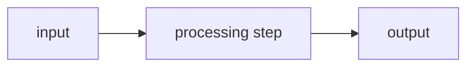
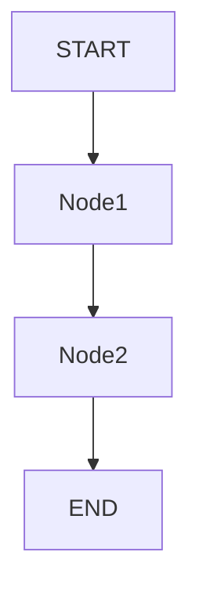
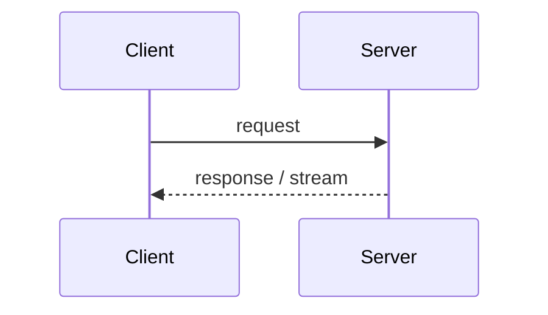

## Purpose

Explain code by data flow rather than by merely paraphrasing syntax.

## Required explanation structure

For every non-trivial function, module, or code block, explain:

1. 输入是什么
2. 当前做了什么
3. 输出是什么
4. 为什么这样设计
5. 它在整体流程中的位置
6. 常见错误 / 调试入口

## User assumptions

- The user has Java and C++ background.
- The user is newer to Nest, React, browser APIs, and some TypeScript idioms.
- Do not skip unfamiliar syntax such as destructuring, generics, union types, index signatures, async iterables, streams, reducers, decorators, or callback/event APIs.

## Explanation rules

- If code uses framework magic, explain the framework's role.
- If code uses decorators, explain who reads the decorator and when.
- If code uses event listeners, explain when the event fires and why it exists.
- If code uses streams/SSE/WebSocket/MediaSource, draw a data-flow diagram.
- If code uses LangGraph, explain State changes and which node writes which field.
- If code uses RAG retrieval, show what enters and leaves each retrieval stage.
- If code uses Cypher/Neo4j, translate the query into a graph path.

## Recommended Mermaid patterns

For pipeline code:

For LangGraph:

For request/response or streaming:

## Debugging rule

When a user provides an error, identify:

1. 报错发生在哪一层
2. 哪段代码最可能触发
3. 是否是依赖版本、配置、运行环境、网络、数据结构、类型不匹配
4. 最小验证命令
5. 最小修复方案
